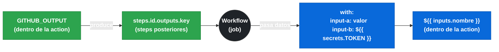
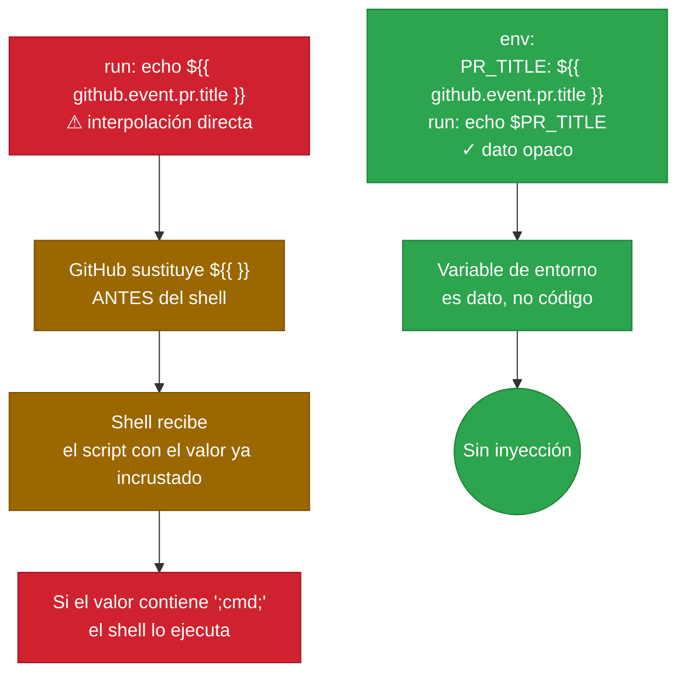

# 3.3 Inputs y outputs de una action

← [3.2 El fichero action.yml: estructura y metadatos](gha-action-yml.md) | [Índice](README.md) | [3.4 Workflow commands dentro de actions](gha-action-workflow-commands.md) →

---

Los inputs y outputs son la interfaz contractual entre una action y el workflow que la invoca. Sin inputs, la action no puede recibir datos del contexto del workflow; sin outputs, no puede devolver resultados a los steps siguientes. Este fichero cubre el USO desde el workflow llamante; la DECLARACIÓN en `action.yml` se documenta en [3.2](gha-action-yml.md).

> [PREREQUISITO] Este fichero debe leerse antes de [3.4 Workflow commands](gha-action-workflow-commands.md): `GITHUB_OUTPUT` solo tiene sentido una vez comprendido que los outputs se declaran en `action.yml` y se producen desde el step de la action.

## Flujo de datos entre workflow y action

El siguiente diagrama muestra cómo fluyen los datos en ambas direcciones:


*Los inputs fluyen del workflow hacia la action; los outputs fluyen de la action hacia steps posteriores del workflow.*

## Sintaxis `uses` para referenciar una action

El campo `uses:` en un step identifica qué action invocar. Acepta tres formatos: action pública (`owner/repo@ref`), action local (`./path/to/action`) y action en subdirectorio (`owner/repo/subdir@ref`). El campo `uses:` y el campo `run:` son mutuamente excluyentes en el mismo step.

```yaml
- uses: actions/setup-node@v4          # action pública
- uses: ./.github/actions/mi-action    # action local
```

## Pasar inputs a una action via `with`

Los inputs se pasan al invocar la action usando el bloque `with:`. Cada clave bajo `with:` corresponde a un input declarado en `action.yml` de la action. Los valores son cadenas de texto; se pueden usar expresiones `${{ }}` para valores dinámicos.

```yaml
- uses: actions/setup-node@v4
  with:
    node-version: "20"
    cache: "npm"
```

## Acceder a outputs en steps posteriores

Los outputs producidos por una action están disponibles en steps posteriores del mismo job mediante la expresión `steps.<id>.outputs.<nombre>`. Para acceder a ellos, el step que invoca la action debe tener un `id:` definido.

```yaml
- name: Obtener versión
  id: get-version
  uses: ./.github/actions/read-version

- name: Usar el output
  run: echo "Versión: ${{ steps.get-version.outputs.version }}"
```

> [EXAMEN] Si el step no tiene `id:`, no es posible acceder a sus outputs en steps posteriores. El `id:` es el mecanismo de referencia; sin él, el output existe pero es inaccesible.

## Cómo una action accede a sus inputs

Dentro de la action, los inputs declarados en `action.yml` se acceden via la expresión `${{ inputs.nombre }}`. En composite actions esta expresión está disponible directamente en los steps. En JavaScript actions se accede via `core.getInput('nombre')` del toolkit, aunque ese detalle está fuera del alcance del examen GH-200.

## Variables de entorno vs. inputs

Los inputs se pasan explícitamente con `with:` y son tipados en `action.yml`. Las variables de entorno se pasan con `env:` y están disponibles en el ambiente del proceso. La diferencia práctica: los inputs son parte de la interfaz pública de la action y aparecen documentados en su `action.yml`; las variables de entorno son un mecanismo de bajo nivel sin contrato explícito.

## Secrets como inputs

Los secrets no se pueden pasar directamente a variables de entorno en `action.yml`, pero sí como inputs usando `with:`. El valor se referencia con la expresión `${{ secrets.NOMBRE }}` en el workflow llamante.

```yaml
- uses: ./.github/actions/deploy
  with:
    token: ${{ secrets.DEPLOY_TOKEN }}
```

> [ADVERTENCIA] Los secrets pasados como inputs llegan a la action como cadenas de texto normales. La action es responsable de no exponerlos en logs. Para enmascararlos, debe usar `::add-mask::` (documentado en [3.4](gha-action-workflow-commands.md)).

## Script injection: el riesgo de `${{ }}` en `run:`

Cuando un step `run:` usa directamente una expresión `${{ github.event.xxx }}`, el valor del contexto se interpola en el script de shell antes de ejecutarlo. Si ese valor contiene caracteres especiales de shell o comandos, se ejecutan como parte del script. Esto es script injection: un atacante puede controlar el título de un PR o el nombre de una rama para inyectar comandos arbitrarios.

```yaml
# INSEGURO — el título del PR se interpola directamente en el script
- run: echo "PR: ${{ github.event.pull_request.title }}"
```

> [CONCEPTO] La interpolación `${{ }}` ocurre ANTES de que el shell reciba el script. Si `github.event.pull_request.title` contiene `"; malicious-command;"`, ese comando se ejecuta. No es una vulnerabilidad de GitHub Actions en sí — es una consecuencia de cómo funciona la interpolación de plantillas.


*La mitigación es siempre la misma: colocar el valor externo en `env:` y acceder con `$VAR` en el script.*

## Mitigación: variable de entorno intermedia

La mitigación correcta es asignar el valor del contexto a una variable de entorno y acceder a ella con la sintaxis `$VARIABLE` del shell. Las variables de entorno NO se interpretan como comandos por el shell; son datos opacos.

```yaml
# SEGURO — el valor llega como dato opaco, no se interpola en el script
- name: Log del título del PR
  env:
    PR_TITLE: ${{ github.event.pull_request.title }}
  run: echo "PR: $PR_TITLE"
```

> [EXAMEN] La regla: `${{ github.event.xxx }}` en `run:` = vulnerable a script injection. `env: VAR: ${{ github.event.xxx }}` + `$VAR` en el script = seguro. Esta distinción aparece frecuentemente en preguntas del examen GH-200.

## Ejemplo central

El siguiente workflow invoca una action local pasando inputs de diferentes tipos, lee su output, y demuestra el patrón seguro vs. inseguro para valores externos:

```yaml
# .github/workflows/demo-inputs-outputs.yml
name: Demo inputs y outputs

on:
  pull_request:
    types: [opened, synchronize]

jobs:
  demo:
    runs-on: ubuntu-latest

    steps:
      - uses: actions/checkout@v4

      # Invocar action pasando inputs: string literal, expresión y secret
      - name: Construir proyecto
        id: build
        uses: ./.github/actions/build
        with:
          node-version: "20"
          environment: ${{ github.ref_name }}
          token: ${{ secrets.GITHUB_TOKEN }}

      # Leer output del step anterior
      - name: Mostrar artefacto generado
        run: echo "Artefacto: ${{ steps.build.outputs.artifact-path }}"

      # INSEGURO: valor externo interpolado directamente en run:
      # - run: echo "Branch: ${{ github.head_ref }}"

      # SEGURO: valor externo via variable de entorno intermedia
      - name: Log seguro del branch
        env:
          BRANCH_NAME: ${{ github.head_ref }}
        run: echo "Branch: $BRANCH_NAME"
```

## Tabla de elementos clave

| Concepto | Sintaxis | Dónde |
|----------|----------|-------|
| Pasar input a action | `with: nombre: valor` | Workflow |
| Referenciar output | `steps.<id>.outputs.<key>` | Workflow |
| Acceder a input en action | `${{ inputs.nombre }}` | action.yml (composite) |
| Pasar secret como input | `with: token: ${{ secrets.TOKEN }}` | Workflow |
| Mitigar script injection | `env: VAR: ${{ ctx }}` + `$VAR` en run | Workflow |

## Buenas y malas prácticas

**Hacer:**
- **Siempre asignar `id:` a los steps cuyo output se necesita** — razón: sin `id:`, la expresión `steps.<id>.outputs.<key>` no tiene referencia válida y el valor es inaccesible.
- **Usar variables de entorno intermedias para valores de `github.event.*`** — razón: evita script injection cuando el valor puede contener caracteres especiales de shell controlados por actores externos.
- **Documentar en el README los inputs requeridos y sus formatos esperados** — razón: el campo `description` de `action.yml` es breve; el README permite explicar ejemplos y restricciones.

**Evitar:**
- **Interpolar `${{ github.event.pull_request.title }}` directamente en `run:`** — razón: script injection permite a cualquier contributor abrir un PR con título malicioso para ejecutar comandos en el runner.
- **Pasar secrets como variables de entorno de job cuando una action los necesita** — razón: las variables de entorno son visibles en los logs si se imprime el entorno completo; los inputs via `with:` están más aislados.
- **Omitir `id:` en el step que invoca la action cuando el siguiente step usa sus outputs** — razón: el workflow falla silenciosamente devolviendo cadena vacía en lugar de error claro.

## Verificación y práctica

### Preguntas de examen

**Pregunta 1.** Un step invoca una action con `uses: ./.github/actions/build` pero no tiene `id:`. El step siguiente intenta leer `steps.build.outputs.artifact`. ¿Qué ocurre?

- A) GitHub usa el nombre del step como ID automáticamente
- **B) La expresión `steps.build.outputs.artifact` devuelve cadena vacía porque no hay step con id `build`** ✅
- C) El workflow falla con error de output no encontrado
- D) El output se hereda del step anterior con ID definido

*A es incorrecta*: GitHub no genera IDs automáticos desde el nombre. *C es incorrecta*: no hay error explícito, el valor simplemente es vacío. *D no existe* como comportamiento.

---

**Pregunta 2.** ¿Cuál de estos steps es vulnerable a script injection?

- **A) `run: echo "Title: ${{ github.event.pull_request.title }}"`** ✅
- B) `env: TITLE: ${{ github.event.pull_request.title }}` + `run: echo "Title: $TITLE"`
- C) `run: echo "Ref: ${{ github.ref }}"` (github.ref no es controlable por usuarios externos)
- D) `with: title: ${{ github.event.pull_request.title }}`

*B es correcta y segura*: la variable de entorno no se interpola como comando. *C tiene riesgo menor* porque `github.ref` no es directamente controlado por un atacante externo. *D es seguro*: pasar como input no interpola en shell.

---

**Ejercicio práctico.** Reescribe el siguiente fragmento para eliminar la vulnerabilidad de script injection:

```yaml
# Original inseguro
- name: Comentar PR
  run: |
    echo "Procesando: ${{ github.event.pull_request.title }}"
    echo "Autor: ${{ github.event.pull_request.user.login }}"
```

```yaml
# Versión segura
- name: Comentar PR
  env:
    PR_TITLE: ${{ github.event.pull_request.title }}
    PR_AUTHOR: ${{ github.event.pull_request.user.login }}
  run: |
    echo "Procesando: $PR_TITLE"
    echo "Autor: $PR_AUTHOR"
```

---

← [3.2 El fichero action.yml: estructura y metadatos](gha-action-yml.md) | [Índice](README.md) | [3.4 Workflow commands dentro de actions](gha-action-workflow-commands.md) →
