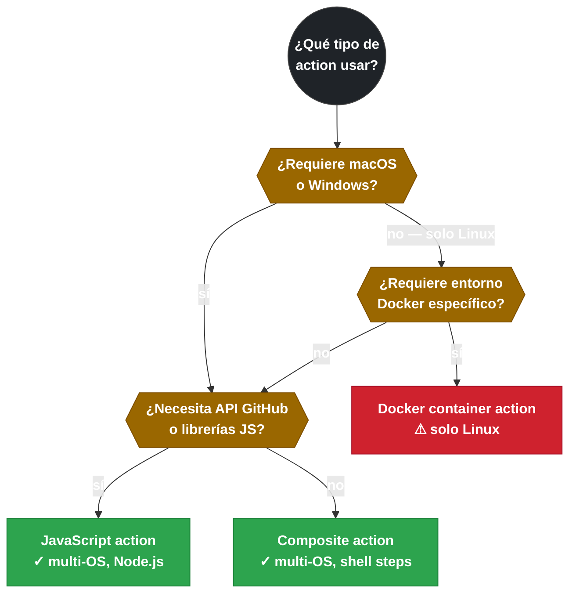

# 3.1 Tipos de GitHub Actions (JavaScript, Docker, Composite)

← [2.12 Testing / Verificación de D2](gha-d2-testing.md) | [Índice](README.md) | [3.2 El fichero action.yml: estructura y metadatos](gha-action-yml.md) →

---

GitHub Actions ofrece tres tipos de action con arquitecturas de ejecución distintas. Elegir el tipo incorrecto puede romper la compatibilidad con el SO del runner o hacer que la action no pueda distribuirse. El examen GH-200 evalúa explícitamente estas diferencias, especialmente en escenarios donde el SO o el entorno de ejecución es el criterio de selección.

## Los tres tipos en comparación

La diferencia fundamental entre los tipos es dónde y cómo se ejecuta el código:

| Tipo | Entorno | SO soportados | Archivo principal | Velocidad |
|------|---------|:-------------:|-------------------|:---------:|
| JavaScript | Directamente en el runner (Node.js) | Linux, macOS, Windows | `dist/index.js` | Rápida |
| Docker container | Contenedor Docker | **Solo Linux** | `Dockerfile` o imagen pública | Más lenta |
| Composite | Steps del runner (sin contenedor) | Linux, macOS, Windows | `action.yml` | Rápida |

> [EXAMEN] La restricción de SO más evaluada en el examen: Docker container actions **solo funcionan en runners Linux**. En cualquier escenario que requiera macOS o Windows, la respuesta no puede ser una Docker action.

## JavaScript action

Una JavaScript action se ejecuta directamente en el runner usando Node.js, sin contenedor intermediario. El runner descarga el repositorio de la action y ejecuta el archivo especificado en `runs.main` con el runtime de Node declarado en `runs.using` (por ejemplo `node20`). La ausencia de contenedor hace que el arranque sea rápido y que la action funcione en cualquier SO que GitHub soporte para sus hosted runners.

El código se escribe en JavaScript o TypeScript y puede usar las librerías del GitHub Actions Toolkit (`@actions/core`, `@actions/github`). Sin embargo, el runner no ejecuta `npm install` al invocar la action: el repositorio debe incluir las dependencias ya compiladas (normalmente en `dist/` mediante `@vercel/ncc`). Este requisito de distribución es un detalle de implementación fuera del alcance del examen GH-200.

> [CONCEPTO] Una JS action versiona `dist/index.js` (con dependencias incluidas), no `index.js` aislado. Sin `dist/`, la action falla porque no hay `node_modules` en el runner al momento de ejecución.

## Docker container action

Una Docker container action define un `Dockerfile` o referencia a una imagen pública que el runner construye y arranca como contenedor. La action se ejecuta dentro de ese contenedor, lo que proporciona un entorno completamente aislado con cualquier herramienta o runtime que el `Dockerfile` incluya. Esto la convierte en la opción cuando se necesita garantizar reproducibilidad del entorno de ejecución.

La contrapartida es la restricción de SO: Docker container actions solo se pueden usar en runners Linux. Además, el tiempo de arranque es mayor que en JS actions o composite actions porque el runner debe construir o descargar la imagen antes de ejecutar.

> [ADVERTENCIA] Docker container actions no funcionan con `runs-on: windows-latest` ni `runs-on: macos-latest`. En el examen, si un escenario requiere compatibilidad multi-OS, la respuesta correcta nunca será una Docker action.

## Composite action

Una composite action encadena una secuencia de `steps` directamente en el `action.yml`, igual que los steps de un job normal, pero empaquetados como unidad reutilizable. Cada step puede usar `run:` (comandos shell) o `uses:` (invocar otra action), lo que permite componer lógica compleja sin necesidad de Node.js ni de un contenedor Docker.

Al ejecutarse en el mismo runner que el job que la invoca, una composite action hereda el entorno del runner y es compatible con todos los SO. Por esta razón es el tipo preferido para encapsular secuencias de comandos shell reutilizables que deben funcionar en múltiples plataformas.

> [CONCEPTO] La diferencia crítica entre composite action y reusable workflow: una composite action se invoca con `uses:` en un **step** de un job y comparte el runner con ese job. Un reusable workflow se invoca con `uses:` en un **job** y lanza sus propios jobs con sus propios runners independientes.

## Pre/post hooks en JavaScript actions

Las JavaScript actions pueden declarar tres puntos de ejecución: `pre:` (se ejecuta antes del primer step del job), `main:` (el cuerpo principal de la action) y `post:` (se ejecuta después del último step del job, incluso si el job falló). Los hooks `pre` y `post` son opcionales y permiten, por ejemplo, configurar el entorno antes de que comience el trabajo real y limpiar recursos al final independientemente del resultado.

> [CONCEPTO] Los pre/post hooks solo existen en JavaScript actions. Se definen en `action.yml` bajo `runs.pre` y `runs.post`. Docker y composite actions no tienen este mecanismo.


*`post` se ejecuta siempre, incluso si el job falla — útil para limpieza de recursos.*

## Restricciones de composite actions

Además de la incompatibilidad con `services:`, las composite actions tienen otras restricciones respecto a los jobs normales: los steps internos no soportan la directiva `if:` dentro del bloque `runs.steps`, y no pueden usar `timeout-minutes` en sus steps internos. Estas limitaciones son relevantes para los escenarios del examen donde se evalúa cuándo una composite action no es la solución correcta.

## Cuándo elegir cada tipo

La selección del tipo depende de tres criterios: SO objetivo, entorno requerido y complejidad de la lógica. Para lógica multi-OS que usa comandos shell, la composite action es la elección natural. Para lógica que requiere acceso a la API de GitHub o librerías JavaScript, la JS action es la adecuada. Para lógica que requiere un entorno específico no disponible en los runners estándar y el workflow corre solo en Linux, la Docker action es la única opción.


*Docker container actions quedan excluidas en cuanto el SO objetivo incluye macOS o Windows.*

## Ejemplo central

El siguiente workflow ilustra el uso de las tres variantes en un mismo job para demostrar la diferencia desde el punto de vista del consumidor. Requiere que el repositorio tenga el directorio `.github/actions/mi-composite/` con su `action.yml`.

```yaml
# .github/workflows/demo-tipos-action.yml
name: Demo tipos de action

on: [push]

jobs:
  demo:
    runs-on: ubuntu-latest   # Docker action requiere runner Linux

    steps:
      # JavaScript action pública (multi-OS)
      - name: Checkout con JS action
        uses: actions/checkout@v4

      # Docker container action — solo Linux
      - name: Listar con contenedor Alpine
        uses: docker://alpine:3.18
        with:
          entrypoint: /bin/sh
          args: -c "echo 'Ejecutando en contenedor Docker Alpine'"

      # Composite action local definida en este repo
      - name: Saludar con composite action
        uses: ./.github/actions/mi-composite
        with:
          mensaje: "Hola desde composite action"
```

```yaml
# .github/actions/mi-composite/action.yml
name: Mi Composite Action
description: Composite action de ejemplo con step run y step uses

inputs:
  mensaje:
    description: Texto a mostrar en el log
    required: true

runs:
  using: composite
  steps:
    - name: Mostrar mensaje
      shell: bash
      run: echo "${{ inputs.mensaje }}"

    - name: Verificar Node disponible
      uses: actions/setup-node@v4
      with:
        node-version: "20"
```

## Tabla de elementos clave

| Campo en `action.yml` | JavaScript | Docker | Composite |
|-----------------------|:----------:|:------:|:---------:|
| `runs.using` | `'node20'` / `'node16'` | `'docker'` | `'composite'` |
| `runs.main` | Ruta a JS | — | — |
| `runs.pre` / `runs.post` | Opcional | — | — |
| `runs.image` | — | Dockerfile o imagen | — |
| `runs.steps` | — | — | Lista de steps |
| Multi-OS | ✅ | ❌ (solo Linux) | ✅ |
| Pre/post hooks | ✅ | ❌ | ❌ |
| Soporte `services:` | — | — | ❌ |

## Buenas y malas prácticas

**Hacer:**
- **Elegir composite action para secuencias de shell reutilizables multi-OS** — razón: no requiere Node.js ni Docker y funciona en los tres SO soportados por GitHub-hosted runners.
- **Usar JS action cuando se necesita acceso a la API de GitHub o lógica compleja en JavaScript** — razón: el toolkit `@actions/github` proporciona un cliente Octokit autenticado que simplifica las llamadas a la API sin configuración adicional.
- **Documentar el requisito de Linux en el README de una Docker action** — razón: evita que los consumidores intenten usarla en runners no-Linux y reciban errores de compatibilidad difíciles de diagnosticar.

**Evitar:**
- **Usar Docker action en workflows que deben correr en macOS o Windows** — razón: el runner no puede arrancar el contenedor Docker en estos SO y el job falla con error de plataforma.
- **Intentar declarar `services:` dentro de una composite action** — razón: los services no están soportados en composite actions; el workflow falla en el paso de parsing del YAML de la action.
- **Confundir composite action con reusable workflow al responder preguntas del examen** — razón: son niveles distintos (step vs. job); la confusión lleva a respuestas incorrectas en escenarios donde se pregunta por aislamiento de entorno o acceso a secrets.

## Comparación detallada

Los tres tipos tienen implicaciones distintas en escenarios reales:

| Criterio | JavaScript | Docker | Composite |
|----------|:----------:|:------:|:---------:|
| Requiere Node.js en runner | Sí (nativo en GitHub runners) | No | No |
| Entorno reproducible garantizado | No (depende del runner) | Sí (contenedor) | No (depende del runner) |
| Puede usar `services:` | — | — | No |
| Tiempo de arranque | ~1 s | 10–30 s (pull/build) | ~0.5 s |
| Pre/post lifecycle hooks | Sí | No | No |
| `if:` en steps internos | N/A | N/A | No |

## Verificación y práctica

### Preguntas de examen

**Pregunta 1.** Un equipo necesita una action que corra un script de Python con una librería no disponible en el runner estándar. El workflow debe ejecutarse en Linux únicamente. ¿Qué tipo de action es más adecuado?

- A) Composite action con un step `run: pip install` previo
- B) JavaScript action usando `@actions/exec` para instalar la librería
- **C) Docker container action con un Dockerfile que incluya la librería** ✅
- D) Cualquiera de los tres tipos es equivalente

*A es incorrecta*: la instalación en runtime no garantiza reproducibilidad y puede tardar. *B es incorrecta*: instalar desde JS action es lento y frágil en cada ejecución. *D es incorrecta*: los tipos no son equivalentes en términos de entorno aislado.

---

**Pregunta 2.** ¿Cuál de estas afirmaciones sobre composite actions es correcta?

- A) Pueden declarar `services:` igual que un job estándar
- **B) Los steps internos del bloque `runs.steps` no soportan la directiva `if:`** ✅
- C) Solo funcionan en runners Linux
- D) Requieren `runs.using: 'node20'` para ejecutarse

*A es incorrecta*: `services:` no está soportado en composite actions. *C es incorrecta*: composite actions son multi-OS. *D es incorrecta*: composite actions usan `runs.using: 'composite'`, no node20.

---

**Ejercicio práctico.** Escribe el `action.yml` de una composite action `setup-and-test` que: (1) configure Node.js con una versión pasada como input (default `"20"`), (2) ejecute `npm ci` y (3) ejecute `npm test`.

```yaml
# .github/actions/setup-and-test/action.yml
name: Setup and Test
description: Instala dependencias Node.js y ejecuta los tests

inputs:
  node-version:
    description: Versión de Node.js a configurar
    required: false
    default: "20"

runs:
  using: composite
  steps:
    - name: Configurar Node.js
      uses: actions/setup-node@v4
      with:
        node-version: ${{ inputs.node-version }}

    - name: Instalar dependencias
      shell: bash
      run: npm ci

    - name: Ejecutar tests
      shell: bash
      run: npm test
```

---

← [2.12 Testing / Verificación de D2](gha-d2-testing.md) | [Índice](README.md) | [3.2 El fichero action.yml: estructura y metadatos](gha-action-yml.md) →
