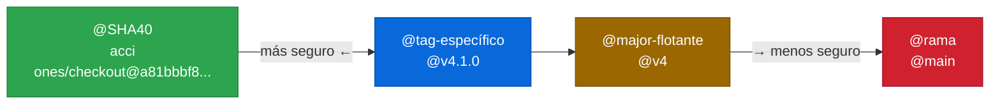

# 3.5 Version pinning e immutable actions

← [3.4 Workflow commands dentro de actions](gha-action-workflow-commands.md) | [Índice](README.md) | [3.6 Distribución de actions (pública, privada, interna)](gha-action-distribucion.md) →

---

Cuando un workflow referencia una action con `uses: actions/checkout@v4`, está confiando en que el mantenedor de esa action no reescriba el tag `v4` para apuntar a código malicioso. Esta confianza es la raíz del problema de supply chain que el version pinning resuelve: fijar exactamente qué commit se ejecuta, de forma que ningún cambio externo pueda modificar el comportamiento del workflow sin una acción explícita del equipo.

> [PREREQUISITO] Este fichero es prerequisito pedagógico de [3.7 Publicación en el Marketplace y release strategies](gha-action-publicacion-marketplace.md): la sección de floating tag vs. immutable asume que el lector comprende las implicaciones de seguridad del pinning.

## Métodos de referencia disponibles

GitHub permite tres formas distintas de referenciar una action en `uses:`. Cada una ofrece un equilibrio diferente entre seguridad y comodidad:

| Método | Ejemplo | Seguridad | Reproducibilidad | Cuándo usar |
|--------|---------|:---------:|:----------------:|-------------|
| SHA completo (40 chars) | `actions/checkout@a81bbbf8...` | Máxima | Máxima | Entornos de producción, críticos |
| Tag semántico | `actions/checkout@v4.1.0` | Media | Alta | Workflows estándar |
| Major tag flotante | `actions/checkout@v4` | Baja | Baja | Prototipado, desarrollo |
| Rama | `actions/checkout@main` | Mínima | Mínima | Nunca en producción |


*SHA40 es el único método verdaderamente inmutable — los tags pueden ser forzados; las ramas cambian en cada commit.*

## Referencia por SHA completo

Referenciar una action por su SHA completo de 40 caracteres es el método de máxima seguridad. Un SHA identifica un commit específico e inmutable en Git: ningún actor externo puede modificar lo que ese commit contiene sin cambiar el SHA. Si el repositorio de la action es comprometido y el mantenedor reescribe un tag, el workflow con SHA sigue apuntando exactamente al mismo código que fue auditado.

```yaml
- uses: actions/checkout@a81bbbf8298c0fa03ea29cdc473d45769f953675  # v4.1.7
```

El comentario con el tag equivalente es una práctica recomendada para que los revisores del código puedan identificar la versión sin necesidad de buscar el SHA en el historial de Git.

> [EXAMEN] El SHA debe ser el SHA completo del commit (40 caracteres hexadecimales), no un SHA abreviado. GitHub no acepta SHAs parciales en el campo `uses:`.

## Referencia por tag semántico

Referenciar por tag semántico (`v4`, `v4.1.0`) es el método más utilizado en la práctica por su legibilidad. La diferencia entre `v4` y `v4.1.0` es importante: `v4` es un *floating major tag* que el mantenedor puede mover en cualquier momento para apuntar al último patch de la rama major 4, mientras que `v4.1.0` referencia un tag específico que idealmente nunca se mueve.

Incluso los tags específicos como `v4.1.0` no son inmutables por naturaleza en Git: un tag puede ser borrado y recreado apuntando a un commit diferente. La diferencia con el SHA es que el tag puede cambiar de destino; el SHA no puede.

> [CONCEPTO] `v4` (major tag) y `v4.1.0` (tag específico) no son equivalentes en términos de seguridad. `v4` se mueve con cada nuevo patch release; `v4.1.0` debería ser estático, aunque no hay garantía técnica de que no sea forzado.

## Referencia por rama

Referenciar una action por una rama (`@main`, `@develop`) significa que cada ejecución del workflow puede obtener código diferente, el que esté en la rama en ese momento. Esta forma de referencia no es reproducible ni segura y no debería usarse en ningún workflow de producción.

> [ADVERTENCIA] Referenciar por rama es el método menos seguro: cualquier commit en esa rama cambia el comportamiento del workflow en la siguiente ejecución. El examen considera esto siempre como un antipatrón.

## Concepto de immutable action

Una *immutable action* es aquella que se distribuye con tags que nunca se mueven una vez creados: cada release produce un tag nuevo (ej. `v1.0.0`, `v1.0.1`, `v1.1.0`) y los tags anteriores nunca se reescriben. Esto garantiza que `uses: org/action@v1.0.0` siempre ejecuta exactamente el mismo código.

El contraste con el floating major tag es intencional: el floating tag (`v1`) prioriza la comodidad del consumidor (siempre recibe la última versión sin cambiar el workflow) a costa de la reproducibilidad y la seguridad.

## Floating major tag

El floating major tag es una estrategia de mantenimiento donde el mantenedor de la action mantiene un tag `v1` (o `v2`, etc.) que siempre apunta al último patch de esa major version. Cuando se publica `v1.2.3`, el mantenedor mueve el tag `v1` para que apunte al mismo commit.

Esta estrategia es conveniente para los consumidores (reciben bugfixes automáticamente), pero introduce el riesgo de que una actualización rompa el workflow sin ningún cambio en el código del consumidor.

## actions/checkout@v4 vs. actions/checkout@SHA

En el contexto del examen, `uses: actions/checkout@v4` y `uses: actions/checkout@a81bbbf8298c0fa03ea29cdc473d45769f953675` referencian la misma action pero con niveles de seguridad distintos. Para la certificación GH-200, la regla es: SHA pinning = máxima seguridad; tag = comodidad con riesgo controlable; rama = nunca en producción.

> [EXAMEN] Cuando el examen pregunta qué método garantiza que el workflow ejecute exactamente el mismo código en cada ejecución, la respuesta es SHA completo. Tags y ramas no dan esta garantía.

## Ejemplo central

El siguiente workflow muestra las tres formas de referenciar la misma action (`actions/checkout`) para ilustrar la diferencia de seguridad. En producción solo se usaría una de las tres:

```yaml
# .github/workflows/version-pinning-demo.yml
name: Demo de version pinning

on: [push]

jobs:
  comparacion:
    runs-on: ubuntu-latest

    steps:
      # Opción 1: SHA completo — máxima seguridad (recomendado en producción)
      - name: Checkout con SHA completo
        uses: actions/checkout@a81bbbf8298c0fa03ea29cdc473d45769f953675  # v4.1.7

      # Opción 2: tag semántico específico — seguridad media
      - name: Checkout con tag específico
        uses: actions/checkout@v4.1.7

      # Opción 3: major tag flotante — conveniente pero con riesgo
      - name: Checkout con major tag flotante
        uses: actions/checkout@v4

      # NUNCA en producción: referencia por rama
      # - name: Checkout por rama (EVITAR)
      #   uses: actions/checkout@main
```

## Tabla de elementos clave

| Método | Seguridad | El código puede cambiar sin modificar el workflow | Caso de uso |
|--------|:---------:|:-------------------------------------------------:|-------------|
| SHA (40 chars) | ⭐⭐⭐ | No | Producción, entornos críticos |
| Tag específico (v4.1.0) | ⭐⭐ | Sí (si el tag es reescrito) | Workflows estándar |
| Major tag flotante (v4) | ⭐ | Sí (en cada nuevo patch) | Prototipado |
| Rama | ❌ | Sí (en cada commit) | Nunca en producción |

## Buenas y malas prácticas

**Hacer:**
- **Pinear a SHA completo en workflows de producción** — razón: es el único método que garantiza que el código ejecutado no cambia sin una acción explícita del equipo; protege contra ataques de supply chain.
- **Añadir un comentario con el tag equivalente junto al SHA** — razón: `# v4.1.7` hace el SHA legible para los revisores sin sacrificar seguridad.
- **Usar Dependabot para actualizar SHAs automáticamente** — razón: mantiene las actions pineadas al último SHA sin trabajo manual; el enforcement mediante Dependabot se configura en D5.

**Evitar:**
- **Referenciar actions por rama** — razón: cualquier commit en esa rama cambia el comportamiento del workflow silenciosamente; no es reproducible ni auditable.
- **Usar solo el major tag (`@v4`) en workflows críticos** — razón: una actualización del mantenedor puede introducir un cambio que rompa el workflow o, en el peor caso, ejecute código malicioso.
- **Copiar SHAs abreviados de la UI de GitHub** — razón: `uses:` requiere el SHA completo de 40 caracteres; los SHAs cortos no son válidos y el workflow fallará con error de referencia.

## Verificación y práctica

### Preguntas de examen

**Pregunta 1.** ¿Qué método de referencia garantiza que un workflow ejecute exactamente el mismo código de la action en cada ejecución, incluso si el repositorio de la action es comprometido y sus tags son reescritos?

- A) `uses: actions/checkout@v4`
- B) `uses: actions/checkout@v4.1.7`
- **C) `uses: actions/checkout@a81bbbf8298c0fa03ea29cdc473d45769f953675`** ✅
- D) `uses: actions/checkout@main`

*A es incorrecta*: `v4` es un floating tag que se puede mover. *B es incorrecta*: un tag específico puede ser borrado y recreado apuntando a otro commit. *D es incorrecta*: una rama cambia con cada commit.

---

**Pregunta 2.** Un mantenedor publica `v1.2.0` de su action y quiere que todos los usuarios de `@v1` reciban la actualización automáticamente. ¿Qué comando debe ejecutar?

- A) `git tag v1.2.0 && git push origin v1.2.0`
- **B) `git tag -fa v1 && git push origin v1 --force`** ✅
- C) `git tag -d v1 && git tag v1 && git push origin v1`
- D) No es posible mover un tag en Git una vez creado

*A es incorrecta*: solo crea el tag `v1.2.0` pero no mueve `v1`. *C es incorrecta*: la secuencia es equivalente pero usar `-fa` (force annotated) es la forma canónica. *D es incorrecta*: los tags pueden moverse con `--force`.

---

**Ejercicio práctico.** Dado el siguiente workflow con referencias inseguras, reescríbelo pineando todas las actions a SHA completo y añadiendo el comentario de versión:

```yaml
# Original (inseguro)
steps:
  - uses: actions/checkout@main
  - uses: actions/setup-node@v4
  - uses: actions/upload-artifact@v4
```

Solución (usando SHAs reales de las versiones actuales):

```yaml
steps:
  - uses: actions/checkout@a81bbbf8298c0fa03ea29cdc473d45769f953675      # v4.1.7
  - uses: actions/setup-node@1a4442cacd436585916779262731d1f68a3d8d6      # v3.8.0
  - uses: actions/upload-artifact@c7d193f32edcb7bfad88892161225aeda64e9a2  # v4.0.0
```

---

← [3.4 Workflow commands dentro de actions](gha-action-workflow-commands.md) | [Índice](README.md) | [3.6 Distribución de actions (pública, privada, interna)](gha-action-distribucion.md) →
