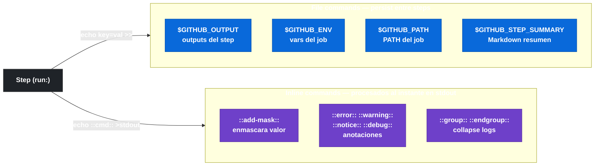

# 3.4 Workflow commands dentro de actions

← [3.3 Inputs y outputs de una action](gha-action-inputs-outputs.md) | [Índice](README.md) | [3.5 Version pinning e immutable actions](gha-action-version-pinning.md) →

---

Los workflow commands son mensajes que un step envía al runner escribiendo en stdout con un formato especial. El runner los intercepta antes de mostrarlos en los logs y ejecuta la acción correspondiente: exportar una variable, producir un output, enmascarar un valor o crear una anotación. Sin este mecanismo, una action no podría comunicar datos al workflow que la invoca ni al siguiente job.

> [PREREQUISITO] Este fichero asume que el lector conoce la declaración de outputs en `action.yml` ([3.2](gha-action-yml.md)) y cómo leerlos desde el workflow ([3.3](gha-action-inputs-outputs.md)).

## Tabla de workflow commands disponibles

Antes de describir cada comando, conviene ver el conjunto completo:

| Comando / Variable | Propósito | Sintaxis |
|-------------------|-----------|----------|
| `$GITHUB_OUTPUT` | Producir un output de step/action | `echo "key=value" >> $GITHUB_OUTPUT` |
| `$GITHUB_ENV` | Exportar variable de entorno al job | `echo "VAR=value" >> $GITHUB_ENV` |
| `$GITHUB_PATH` | Añadir directorio al PATH | `echo "/ruta/bin" >> $GITHUB_PATH` |
| `$GITHUB_STEP_SUMMARY` | Escribir resumen Markdown | `echo "## Resumen" >> $GITHUB_STEP_SUMMARY` |
| `::add-mask::` | Enmascarar valor en logs | `echo "::add-mask::$SECRET"` |
| `::debug::` | Anotación de debug (visible con ACTIONS_STEP_DEBUG) | `echo "::debug::mensaje"` |
| `::notice::` | Anotación informativa | `echo "::notice::mensaje"` |
| `::warning::` | Anotación de aviso | `echo "::warning::mensaje"` |
| `::error::` | Anotación de error | `echo "::error::mensaje"` |
| `::group::` / `::endgroup::` | Colapsar sección de log | `echo "::group::Título"` |
| `::stop-commands::` / `::resume-commands::` | Pausar procesado de commands | `echo "::stop-commands::token"` |

## Concepto de workflow command

Un workflow command es una línea escrita en stdout con el formato `::nombre-comando::parámetros`. El runner de GitHub Actions monitoriza stdout de cada step y cuando detecta este patrón, intercepta la línea y ejecuta la acción correspondiente en lugar de mostrarla como log normal. Este mecanismo permite a cualquier step —no solo a las actions— comunicarse con el runner usando únicamente la salida estándar.

> [CONCEPTO] Los workflow commands funcionan en cualquier step con `run:`, no solo dentro de actions. La diferencia es que `$GITHUB_OUTPUT`, `$GITHUB_ENV` y similares son file commands (escriben en ficheros especiales del runner) mientras que `::error::`, `::group::` etc. son inline commands (se escriben directamente en stdout).


*File commands persisten en ficheros del runner y son legibles por steps siguientes; inline commands son interceptados por el runner al leer stdout.*

## GITHUB_OUTPUT

`GITHUB_OUTPUT` reemplaza al comando `::set-output::` deprecado. Para producir un output desde un step, se escribe `clave=valor` en el fichero apuntado por la variable de entorno `$GITHUB_OUTPUT`. El runner lee ese fichero al finalizar el step y expone el valor como `steps.<id>.outputs.clave`.

```bash
echo "version=1.2.3" >> $GITHUB_OUTPUT
echo "artifact-path=dist/app.zip" >> $GITHUB_OUTPUT
```

## ::set-output:: deprecado

[LEGACY] `::set-output name=version::1.2.3` fue el mecanismo original para producir outputs. Fue deprecado porque permitía inyección: si el valor contenía `\n::set-output name=other::injected`, se podía sobreescribir otro output. El fichero `$GITHUB_OUTPUT` elimina este riesgo porque los saltos de línea en el valor no son interpretados como nuevos comandos.

> [EXAMEN] En el examen, cualquier uso de `::set-output::` es incorrecto. La respuesta correcta siempre es `echo "key=value" >> $GITHUB_OUTPUT`.

## GITHUB_ENV

`GITHUB_ENV` permite exportar variables de entorno que estarán disponibles en todos los steps siguientes del mismo job. Se escribe `NOMBRE=valor` en el fichero apuntado por `$GITHUB_ENV`. La variable NO está disponible en el step que la define, solo en los siguientes.

```bash
echo "NODE_ENV=production" >> $GITHUB_ENV
echo "BUILD_VERSION=2.0.0" >> $GITHUB_ENV
```

> [ADVERTENCIA] Una variable exportada via `$GITHUB_ENV` no está disponible en el mismo step que la escribe. Solo los steps posteriores del job la ven en su entorno.

## GITHUB_STEP_SUMMARY

`GITHUB_STEP_SUMMARY` permite escribir contenido Markdown que aparece en la pestaña "Summary" de la ejecución del workflow en la UI de GitHub. Es útil para mostrar resultados de tests, métricas de build o cualquier resumen que el equipo quiera ver sin entrar en los logs detallados.

```bash
echo "## Resultados de tests" >> $GITHUB_STEP_SUMMARY
echo "- ✅ 42 passed" >> $GITHUB_STEP_SUMMARY
echo "- ❌ 2 failed" >> $GITHUB_STEP_SUMMARY
```

## ::add-mask::

`::add-mask::valor` instruye al runner para que reemplace todas las ocurrencias de `valor` en los logs del job con `***`. Debe usarse inmediatamente después de obtener el valor a enmascarar, antes de que aparezca en ningún log.

```bash
SECRET=$(generate-token)
echo "::add-mask::$SECRET"
```

## ::debug::, ::notice::, ::warning::, ::error::

Estos cuatro comandos crean anotaciones en los logs de la UI con distintos niveles de severidad. `::warning::` y `::error::` también aparecen como anotaciones en el diff de pull requests si se especifica el fichero y línea. `::debug::` solo es visible cuando `ACTIONS_STEP_DEBUG=true` está configurado.

```bash
echo "::debug::Valor de la variable: $VAR"
echo "::notice file=src/app.js,line=10::Función obsoleta"
echo "::warning::La versión de Node es antigua"
echo "::error file=src/app.js,line=42::Variable no definida"
```

## ::group:: y ::endgroup::

Estos comandos agrupan las líneas de log entre ellos en una sección colapsable en la UI. El texto del `::group::` es el título del grupo. Son especialmente útiles para separar visualmente fases de un step largo.

```bash
echo "::group::Instalando dependencias"
npm ci
echo "::endgroup::"
```

## ::stop-commands:: y ::resume-commands::

`::stop-commands::token` detiene el procesado de workflow commands hasta que se emite `::resume-commands::token` con el mismo token. Es útil cuando un step necesita imprimir texto que podría ser interpretado accidentalmente como un workflow command.

```bash
echo "::stop-commands::pause-token"
echo "::esto NO se interpreta como command::"
echo "::resume-commands::pause-token"
```

## GITHUB_PATH

`GITHUB_PATH` permite añadir directorios al `PATH` del runner para todos los steps siguientes del job. Es el equivalente de `export PATH=$PATH:/ruta` pero persistente entre steps.

```bash
echo "$HOME/.local/bin" >> $GITHUB_PATH
```

## Diferencia entre file commands e inline commands

Los file commands (`$GITHUB_OUTPUT`, `$GITHUB_ENV`, `$GITHUB_PATH`, `$GITHUB_STEP_SUMMARY`) escriben en ficheros del sistema de ficheros del runner; el runner los lee al finalizar el step. Los inline commands (`::error::`, `::group::`, etc.) se emiten en stdout y el runner los intercepta en tiempo real durante la ejecución del step.

## Ejemplo central

El siguiente workflow usa un composite action que demuestra los once conceptos en un mismo step:

```yaml
# .github/workflows/demo-workflow-commands.yml
name: Demo workflow commands

on: [push]

jobs:
  demo:
    runs-on: ubuntu-latest
    steps:
      - uses: actions/checkout@v4

      - name: Demostración de commands
        id: demo
        shell: bash
        run: |
          # GITHUB_OUTPUT — producir output
          echo "build-version=1.0.0" >> $GITHUB_OUTPUT

          # GITHUB_ENV — exportar variable al job
          echo "APP_ENV=production" >> $GITHUB_ENV

          # GITHUB_PATH — añadir al PATH
          echo "$HOME/.local/bin" >> $GITHUB_PATH

          # GITHUB_STEP_SUMMARY — resumen en la UI
          echo "## Build completado" >> $GITHUB_STEP_SUMMARY
          echo "Versión: 1.0.0" >> $GITHUB_STEP_SUMMARY

          # ::add-mask:: — enmascarar valor sensible
          TOKEN=$(echo "s3cr3t")
          echo "::add-mask::$TOKEN"

          # ::debug:: — visible solo con ACTIONS_STEP_DEBUG=true
          echo "::debug::Variables de entorno cargadas"

          # ::notice::, ::warning::, ::error:: — anotaciones
          echo "::notice::Build iniciado correctamente"
          echo "::warning::Usando versión de Node desactualizada"

          # ::group:: / ::endgroup:: — sección colapsable
          echo "::group::Detalle de dependencias"
          npm list --depth=0 2>/dev/null || echo "(sin package.json)"
          echo "::endgroup::"

          # ::stop-commands:: / ::resume-commands::
          echo "::stop-commands::mi-token"
          echo "::este texto no es un command::"
          echo "::resume-commands::mi-token"

      - name: Leer output del step anterior
        run: echo "Versión producida: ${{ steps.demo.outputs.build-version }}"

      - name: Leer variable de entorno exportada
        run: echo "Entorno: $APP_ENV"
```

## Buenas y malas prácticas

**Hacer:**
- **Usar `$GITHUB_OUTPUT` en lugar de `::set-output::`** — razón: `::set-output::` está deprecado y es vulnerable a inyección via valores con saltos de línea.
- **Aplicar `::add-mask::` inmediatamente al obtener un valor sensible** — razón: cualquier log emitido antes del `::add-mask::` ya expuso el valor; el orden importa.
- **Usar `::group::` para organizar logs de steps largos** — razón: mejora la legibilidad en la UI y reduce el tiempo de diagnóstico al colapsar secciones no relevantes.

**Evitar:**
- **Usar `::set-output::` en código nuevo** — razón: está deprecado desde 2022 y puede ser eliminado; produce warnings en los logs.
- **Exportar secrets via `$GITHUB_ENV`** — razón: las variables de entorno son accesibles por todos los steps siguientes del job, ampliando la superficie de exposición innecesariamente.
- **Emitir `::error::` sin mensaje descriptivo** — razón: GitHub crea la anotación vacía; no aparece útilmente en la vista de anotaciones del PR.

## Comparación: file commands vs. inline commands

| Tipo | Ejemplos | Cuándo se procesa | Persistencia |
|------|----------|:-----------------:|:------------:|
| File command | `$GITHUB_OUTPUT`, `$GITHUB_ENV`, `$GITHUB_PATH`, `$GITHUB_STEP_SUMMARY` | Al finalizar el step | Disponible en steps siguientes |
| Inline command | `::error::`, `::group::`, `::add-mask::`, `::debug::` | En tiempo real (stdout) | Solo durante el step actual |

## Verificación y práctica

### Preguntas de examen

**Pregunta 1.** Un step necesita que una variable de entorno `BUILD_ID=abc123` esté disponible en todos los steps siguientes del job. ¿Qué comando es correcto?

- A) `export BUILD_ID=abc123`
- B) `echo "::set-env name=BUILD_ID::abc123"`
- **C) `echo "BUILD_ID=abc123" >> $GITHUB_ENV`** ✅
- D) `BUILD_ID=abc123 >> $GITHUB_ENV`

*A es incorrecta*: `export` solo afecta al proceso actual del step, no a los steps siguientes. *B es incorrecta*: `::set-env::` fue deprecado junto con `::set-output::`. *D es incorrecta*: sintaxis inválida.

---

**Pregunta 2.** ¿Cuál es la diferencia principal entre `::set-output::` y `$GITHUB_OUTPUT`?

- A) `$GITHUB_OUTPUT` solo funciona en composite actions
- **B) `$GITHUB_OUTPUT` escribe en un fichero del runner, eliminando la vulnerabilidad de inyección via saltos de línea en el valor** ✅
- C) `::set-output::` es el método actual recomendado; `$GITHUB_OUTPUT` es el deprecado
- D) No hay diferencia funcional, solo de sintaxis

*A es incorrecta*: `$GITHUB_OUTPUT` funciona en cualquier step. *C es incorrecta*: es al revés; `::set-output::` está deprecado. *D es incorrecta*: la diferencia de seguridad es real y es la razón del cambio.

---

**Ejercicio práctico.** Escribe un step que: (1) produzca el output `status=success`, (2) exporte la variable de entorno `DEPLOY_ENV=production`, (3) escriba `## Deploy completado` en el summary, y (4) enmascare el valor de la variable `$API_KEY`.

```yaml
- name: Configurar deploy
  id: config
  env:
    API_KEY: ${{ secrets.API_KEY }}
  shell: bash
  run: |
    echo "status=success" >> $GITHUB_OUTPUT
    echo "DEPLOY_ENV=production" >> $GITHUB_ENV
    echo "## Deploy completado" >> $GITHUB_STEP_SUMMARY
    echo "::add-mask::$API_KEY"
```

---

← [3.3 Inputs y outputs de una action](gha-action-inputs-outputs.md) | [Índice](README.md) | [3.5 Version pinning e immutable actions](gha-action-version-pinning.md) →