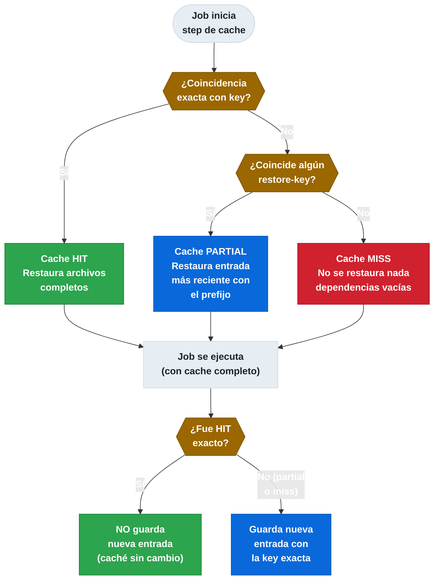
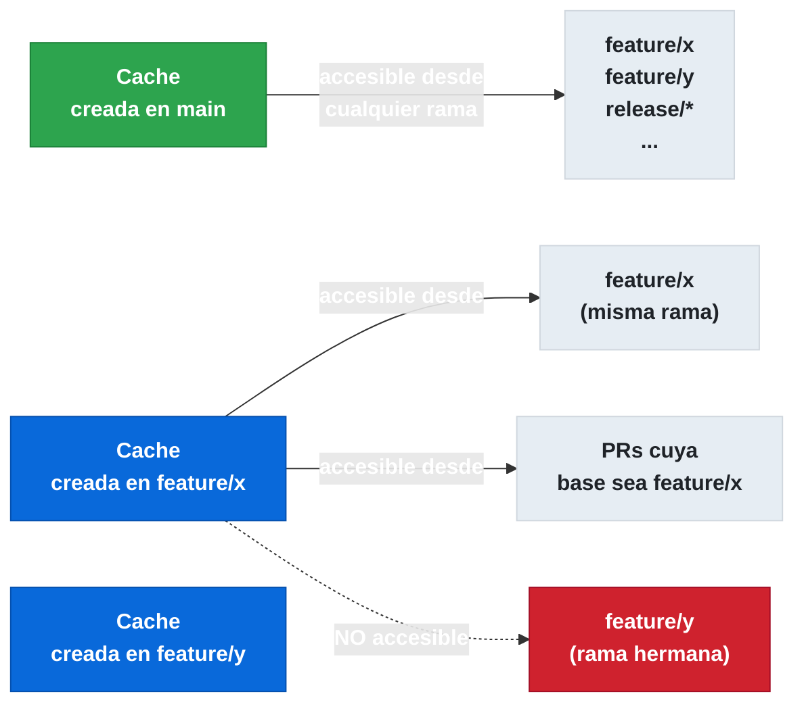

# 5.8.1 Cache Strategies e Invalidación

← [5.7.2 Artifact Attestations](gha-artifact-attestations-uso.md) | [Índice](README.md) | [5.8.2 Retention Policies, Costes y Seguridad](gha-retention-costes-seguridad.md) →

---

La caché en GitHub Actions permite reutilizar archivos entre ejecuciones del mismo repositorio para reducir el tiempo de instalación de dependencias. Entender cómo construir claves eficaces y cómo funciona el ámbito (scope) de la caché es fundamental para maximizar el hit rate y evitar builds lentos o con dependencias obsoletas.

## Cache key y restore-keys

La estrategia de cacheo se basa en dos componentes: la `key` (clave exacta) y los `restore-keys` (lista de prefijos de fallback). Cuando GitHub Actions intenta restaurar caché, primero busca una coincidencia exacta con `key`. Si no encuentra ninguna, prueba cada elemento de `restore-keys` por orden, buscando la entrada más reciente cuya clave empiece por ese prefijo.

Un **cache hit** completo ocurre cuando la clave exacta coincide: el step de restore restaura los archivos y, al final del job, el step de guardado **no se ejecuta** (la caché no cambia). Un **cache miss con restore parcial** ocurre cuando solo coincide un `restore-key`: los archivos se restauran parcialmente y, al final del job, la nueva caché **sí se guarda** con la clave exacta, reemplazando la entrada más antigua si se supera el límite.



*Árbol de decisión del cache: solo el hit exacto evita guardar una nueva entrada al final del job.*

> [CONCEPTO] La diferencia entre hit y restore determina si se guarda o no una nueva entrada al final del job. Un hit exacto nunca genera una nueva entrada; un restore parcial siempre genera una nueva.

La función `hashFiles()` es la herramienta principal para construir claves basadas en el contenido de lockfiles. Cambia automáticamente cuando cambia el archivo de dependencias, invalidando la caché cuando las dependencias realmente cambian.

```yaml
- uses: actions/cache@v4
  with:
    path: ~/.npm
    key: npm-${{ runner.os }}-${{ hashFiles('**/package-lock.json') }}
    restore-keys: |
      npm-${{ runner.os }}-
      npm-
```

## Cache scope: qué ramas pueden leer qué caché

El scope de la caché es una de las restricciones más importantes y menos intuitivas. Una caché creada en una rama solo puede ser leída por:

- La misma rama donde se creó.
- La rama base (target branch) de un pull request hacia esa rama.
- La rama default del repositorio (`main` o `master`).

Las ramas hijo **nunca** pueden leer la caché de las ramas hijo de otras ramas. Un workflow en `feature/login` puede leer la caché de `main`, pero no puede leer la caché de `feature/payments`. Esta restricción existe por seguridad: evita que ramas no relacionadas compartan estado potencialmente contaminado.



*Scope de caché: la caché de `main` es universal; la de ramas feature solo es visible por la propia rama y PRs que apunten a ella.*

> [EXAMEN] Una caché creada en `main` es accesible desde cualquier rama del repositorio. Una caché creada en `feature/x` solo es accesible desde `feature/x` y desde PRs que apunten a `feature/x`.

## cache-dependency-path para claves basadas en lockfiles

El parámetro `cache-dependency-path` está disponible en acciones como `actions/setup-node`, `actions/setup-python` y similares. Permite que la acción derive automáticamente la clave de caché a partir del lockfile indicado, sin necesidad de usar `actions/cache` directamente.

Este parámetro acepta un único path o un patrón glob. Es especialmente útil en monorepos donde cada subpaquete tiene su propio `package-lock.json`.

```yaml
- uses: actions/setup-node@v4
  with:
    node-version: '20'
    cache: 'npm'
    cache-dependency-path: |
      frontend/package-lock.json
      backend/package-lock.json
```

> [CONCEPTO] `cache-dependency-path` en `setup-node` equivale a usar `hashFiles()` sobre esos archivos en la `key` de `actions/cache`. La diferencia es que la acción de setup gestiona automáticamente el path de caché correcto para el gestor de paquetes.

## Optimización en matrix builds

En workflows con `strategy.matrix`, cada job de la matrix se ejecuta en un runner independiente. Sin una estrategia adecuada de claves, cada job construye su propia caché, multiplicando el tiempo de instalación. La solución es incluir partes del contexto `matrix` en la clave para reutilizar caché entre jobs con configuraciones similares.

Para compartir caché entre jobs de matrix que solo difieren en la versión del sistema operativo, se incluye `runner.os` en la clave. Para compartir entre jobs que difieren en la versión del lenguaje, se incluye la variable de matrix correspondiente.

## Ejemplo central

El siguiente workflow ilustra una estrategia completa de caché para un proyecto Node.js con matrix de versiones. Cada versión de Node tiene su propia caché (para evitar conflictos), pero todos los jobs de la misma versión comparten la misma caché de módulos entre ejecuciones.

```yaml
name: CI con caché optimizada

on:
  push:
    branches: [main]
  pull_request:

jobs:
  build:
    runs-on: ubuntu-latest
    strategy:
      matrix:
        node-version: [18, 20, 22]

    steps:
      - uses: actions/checkout@v4

      - name: Restaurar caché de npm
        uses: actions/cache@v4
        id: cache-npm
        with:
          path: ~/.npm
          # Clave exacta: incluye OS, versión de Node y hash del lockfile
          key: npm-${{ runner.os }}-node${{ matrix.node-version }}-${{ hashFiles('**/package-lock.json') }}
          # Fallbacks en orden de especificidad decreciente
          restore-keys: |
            npm-${{ runner.os }}-node${{ matrix.node-version }}-
            npm-${{ runner.os }}-
            npm-

      - name: Configurar Node.js
        uses: actions/setup-node@v4
        with:
          node-version: ${{ matrix.node-version }}

      - name: Instalar dependencias
        # Si hay hit exacto, npm ci es más rápido porque ~/.npm ya tiene los paquetes
        run: npm ci

      - name: Mostrar estado de caché en log
        run: |
          if [ "${{ steps.cache-npm.outputs.cache-hit }}" == "true" ]; then
            echo "Cache HIT — no se guardará nueva entrada al final del job"
          else
            echo "Cache MISS o restore parcial — se guardará nueva entrada al final del job"
          fi

      - name: Build
        run: npm run build

      - name: Tests
        run: npm test
```

## Tabla de elementos clave

Los parámetros de `actions/cache@v4` determinan tanto el comportamiento de restauración como el de guardado. Conocer cada uno es necesario para construir estrategias eficaces.

| Parámetro | Tipo | Obligatorio | Default | Descripción |
|---|---|---|---|---|
| `path` | string/lista | Sí | — | Directorios o archivos a cachear. Acepta glob y múltiples líneas. |
| `key` | string | Sí | — | Clave exacta para hit completo. Si coincide, no se guarda nueva entrada. |
| `restore-keys` | string multilínea | No | — | Prefijos de fallback. Se prueban en orden; el primero con coincidencia restaura. |
| `cache-hit` (output) | boolean | — | — | `true` si la `key` exacta coincidió. Útil en condiciones `if:`. |
| `enableCrossOsArchive` | boolean | No | `false` | Permite usar caché entre diferentes sistemas operativos. |
| `fail-on-cache-miss` | boolean | No | `false` | Falla el step si no se encuentra ninguna caché (ni exacta ni parcial). |
| `lookup-only` | boolean | No | `false` | Solo comprueba si existe caché sin restaurarla (para decisiones condicionales). |

La función `hashFiles()` acepta uno o más patrones glob separados por comas. El hash cambia si cambia cualquier archivo que coincida con los patrones.

## Invalidación automática y límites

La invalidación de la caché en GitHub Actions es automática bajo dos condiciones que no requieren intervención manual. Comprender estas condiciones evita confusiones cuando una caché desaparece inesperadamente.

GitHub elimina automáticamente entradas de caché que no se han accedido en los últimos **7 días**, independientemente del tamaño. Además, existe un límite de **10 GB por repositorio** para la caché total. Cuando se supera este límite, las entradas más antiguas (por último acceso) se eliminan hasta que el tamaño vuelve a estar dentro del límite.

> [ADVERTENCIA] El límite de 10 GB es por repositorio, no por rama ni por workflow. Un repositorio con muchas ramas activas puede consumir rápidamente el límite si cada rama tiene su propia caché grande. Incluir `runner.os` y el hash del lockfile en la clave evita entradas duplicadas innecesarias.

Para invalidar manualmente una caché (por ejemplo, cuando se sospecha que está corrupta), se puede cambiar el prefijo de la clave añadiendo un número de versión, o eliminar la entrada directamente desde la UI en Actions > Caches.

## Visualización de cache hits en los logs

Cuando se ejecuta el step de `actions/cache`, el log muestra información detallada sobre el resultado de la búsqueda. Esta información es visible en la pestaña de Actions del repositorio.

Si hay cache hit exacto, el log muestra algo como:
```
Cache restored from key: npm-Linux-node20-a1b2c3d4e5f6...
Cache hit occurred on the primary key, not saving cache.
```

Si hay restore parcial (cache miss en la clave exacta pero hit en un restore-key), el log muestra:
```
Cache restored from key: npm-Linux-node20-
Post-action: Saving cache with key: npm-Linux-node20-a1b2c3d4e5f6...
```

Si no hay ninguna coincidencia, los archivos no se restauran y al final del job se guarda la nueva caché con la clave exacta.

## Buenas y malas prácticas

**Hacer:**
- Incluir `runner.os` en la clave — razón: evita conflictos entre caché de Linux y macOS/Windows en repos multiplataforma.
- Usar `hashFiles()` sobre el lockfile como parte de la clave — razón: la caché se invalida automáticamente cuando cambian las dependencias, nunca se sirven dependencias obsoletas.
- Definir `restore-keys` de más específico a menos específico — razón: restaurar una caché parcial más similar a la actual es más eficiente que restaurar una genérica.
- Usar `id:` en el step de cache y consultar `outputs.cache-hit` — razón: permite omitir steps de instalación costosos cuando hay hit exacto.

**Evitar:**
- Usar solo `key: ${{ github.sha }}` sin restore-keys — razón: cada commit tiene un SHA diferente, nunca habrá hit y la caché no sirve para nada.
- Cachear `node_modules` directamente en lugar de `~/.npm` — razón: `node_modules` contiene binarios compilados que dependen de la versión exacta del OS y Node; `~/.npm` es solo el cache de descarga y es seguro compartir.
- Poner secrets o tokens en el contenido de los directorios cacheados — razón: la caché es accesible para cualquier workflow del repo que use la misma clave; los secrets nunca deben estar en archivos cacheados.
- Ignorar el scope de caché entre ramas — razón: un workflow en `feature/x` no puede leer la caché de `feature/y`; si se diseña asumiendo esa lectura cruzada, los builds serán más lentos de lo esperado.

## Verificación y práctica

**P1: Un workflow usa `key: npm-${{ runner.os }}-${{ hashFiles('package-lock.json') }}` y `restore-keys: npm-${{ runner.os }}-`. Se añade una dependencia nueva al proyecto. ¿Qué ocurre en la siguiente ejecución?**

a) Hit exacto: se restaura la caché antigua con la nueva dependencia ya instalada.
b) Cache miss total: no se restaura nada y se guarda nueva caché al final.
c) Restore parcial: se restaura la caché antigua de `npm-Linux-`, se ejecuta `npm ci` (instala la nueva dep), y al final se guarda nueva caché.
d) Error: `hashFiles()` no acepta rutas relativas.

**Respuesta: c** — Añadir una dependencia cambia `package-lock.json`, por lo que el hash cambia y la clave exacta no coincide. Sin embargo, el restore-key `npm-Linux-` sí coincide con la entrada anterior, por lo que se restaura la caché parcial. `npm ci` completa la instalación y al final del job se guarda la nueva entrada con la clave exacta actualizada.

---

**P2: ¿Desde qué ramas puede leerse la caché creada en la rama `feature/auth`?**

a) Desde cualquier rama del repositorio.
b) Solo desde `feature/auth` y desde la rama `main`.
c) Desde `feature/auth` y desde PRs cuya rama base sea `feature/auth`, además de la rama default.
d) Solo desde `feature/auth`.

**Respuesta: c** — El scope de caché permite leer desde la misma rama, desde PRs que apunten a esa rama como base, y desde la rama default del repo. No es accesible desde ramas arbitrarias ni desde ramas "hermanas" como `feature/payments`.

---

**P3: Se quiere compartir caché de dependencias Python entre los jobs de una matrix `python-version: [3.10, 3.11, 3.12]`. ¿Qué clave es más adecuada?**

a) `key: pip-${{ hashFiles('requirements.txt') }}`
b) `key: pip-${{ runner.os }}-${{ matrix.python-version }}-${{ hashFiles('requirements.txt') }}`
c) `key: pip-${{ github.sha }}`
d) `key: pip-${{ runner.os }}`

**Respuesta: b** — Incluir `runner.os` evita conflictos entre plataformas (algunos paquetes Python tienen binarios específicos). Incluir `matrix.python-version` evita conflictos entre versiones de Python. Incluir `hashFiles('requirements.txt')` invalida la caché cuando cambian las dependencias. La opción (a) compartiría caché entre versiones de Python, lo que puede producir binarios incompatibles. La opción (c) nunca produce hits. La opción (d) nunca se invalida.

---

**Ejercicio práctico: Caché para un proyecto Python con múltiples entornos**

Implementa un workflow que ejecute tests en Python 3.11 y 3.12, usando caché de pip optimizada con restore-keys. El workflow debe mostrar en el log si hubo hit o miss.

```yaml
name: Python CI con caché

on: [push, pull_request]

jobs:
  test:
    runs-on: ubuntu-latest
    strategy:
      matrix:
        python-version: ['3.11', '3.12']

    steps:
      - uses: actions/checkout@v4

      - name: Configurar Python
        uses: actions/setup-python@v5
        with:
          python-version: ${{ matrix.python-version }}

      - name: Restaurar caché de pip
        uses: actions/cache@v4
        id: cache-pip
        with:
          path: ~/.cache/pip
          key: pip-${{ runner.os }}-py${{ matrix.python-version }}-${{ hashFiles('requirements*.txt') }}
          restore-keys: |
            pip-${{ runner.os }}-py${{ matrix.python-version }}-
            pip-${{ runner.os }}-

      - name: Instalar dependencias
        run: pip install -r requirements.txt

      - name: Estado de la caché
        run: |
          echo "Cache hit: ${{ steps.cache-pip.outputs.cache-hit }}"

      - name: Ejecutar tests
        run: pytest
```

---

← [5.7.2 Artifact Attestations](gha-artifact-attestations-uso.md) | [Índice](README.md) | [5.8.2 Retention Policies, Costes y Seguridad](gha-retention-costes-seguridad.md) →

