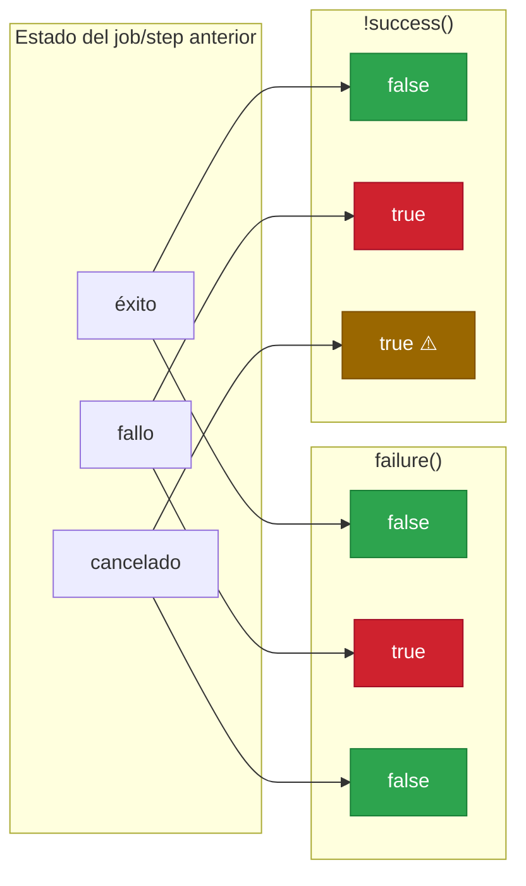
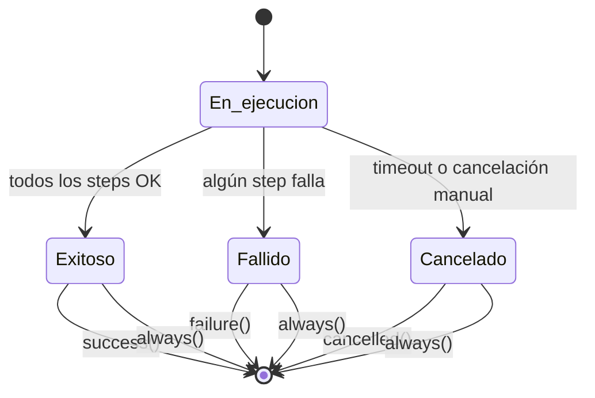

# 1.7 Condicionales y funciones de estado

[← 1.6 Configuración de steps](gha-d1-steps-configuracion.md) | [1.8 Dependencias entre jobs →](gha-d1-dependencias-jobs.md)

---

## El sistema de guardas de ejecución en GitHub Actions

Por defecto, cada step y cada job solo se ejecutan si todos los anteriores han tenido éxito. GitHub Actions implementa un sistema de guardas de ejecución mediante la clave `if:`, que acepta expresiones evaluadas en tiempo de ejecución. Estas expresiones pueden combinar funciones de estado (`success()`, `failure()`, `cancelled()`, `always()`), valores de contexto (`github.*`, `needs.*`, `steps.*`) y operadores lógicos. El resultado determina si el step o job se ejecuta o se omite (estado `skipped`). Comprender este mecanismo es fundamental para construir pipelines robustos con manejo de errores, notificaciones y limpieza garantizada.

---

## Funciones de estado

### Tabla de referencia

| Función | Retorna `true` cuando... | Retorna `false` cuando... |
|---|---|---|
| `success()` | Todos los steps/jobs anteriores completaron sin error | Alguno falló o fue cancelado |
| `failure()` | Al menos un step/job anterior falló | Todo completó con éxito o fue cancelado |
| `cancelled()` | El workflow fue cancelado por el usuario o timeout | Completó (con éxito o fallo) sin cancelación |
| `always()` | Siempre — independientemente del estado | Nunca retorna `false` |

---

### `success()`: el comportamiento implícito

La función `success()` representa el comportamiento por defecto de cualquier step o job que no tenga un `if:` explícito. Si un step no tiene condición, GitHub Actions evalúa implícitamente `if: success()` antes de ejecutarlo. Retorna `true` cuando todos los steps anteriores del job (o todos los jobs de los que depende, en el caso de un job) completaron sin error. Es útil declararlo explícitamente cuando se combina con otras condiciones: `if: success() && github.ref == 'refs/heads/main'` restringe la ejecución a ramas específicas solo si no hubo fallos previos. No hay diferencia funcional entre no poner condición y poner `if: success()`.

### `failure()`: detectar fallos anteriores

La función `failure()` retorna `true` cuando al menos un step anterior en el job falló, o cuando al menos un job del que depende (`needs`) falló. Se usa para ejecutar pasos de limpieza, enviar alertas o registrar diagnósticos solo cuando algo salió mal. Es importante distinguirla de `!success()`: mientras que `failure()` retorna `false` si el workflow fue cancelado, `!success()` retornaría `true` en ese escenario (porque `success()` sería `false`). Usar `failure()` es más preciso cuando solo se quiere reaccionar a errores reales, no a cancelaciones.



```yaml
- name: Notificar fallo en Slack
  if: failure()
  run: |
    curl -X POST $SLACK_WEBHOOK \
      -d '{"text": "El pipeline falló en ${{ github.ref }}"}'
  env:
    SLACK_WEBHOOK: ${{ secrets.SLACK_WEBHOOK }}
```

### `cancelled()`: reaccionar a cancelaciones

La función `cancelled()` retorna `true` exclusivamente cuando el workflow fue cancelado, ya sea por acción manual del usuario en la interfaz de GitHub, por el comando `gh run cancel`, o por un timeout definido en `timeout-minutes`. No se activa por fallos normales. Su caso de uso más común es enviar notificaciones cuando un despliegue en curso fue interrumpido, o liberar recursos reservados (locks, entornos de staging) que quedarían bloqueados si el workflow termina abruptamente sin limpiar.

```yaml
- name: Liberar lock de despliegue
  if: cancelled()
  run: ./scripts/release-deploy-lock.sh
```

### `always()`: ejecución garantizada

La función `always()` garantiza que el step o job se ejecute sin importar el estado de los anteriores: éxito, fallo o cancelación. Es el mecanismo más fuerte del sistema de guardas. Se usa típicamente para pasos de reporte final, publicación de artefactos de diagnóstico, o limpieza de infraestructura que debe ocurrir en cualquier circunstancia. Tiene una advertencia importante: si el runner mismo falla (problema de infraestructura), `always()` no puede garantizar la ejecución porque el proceso del runner ya no está activo.

```yaml
- name: Publicar reporte de cobertura
  if: always()
  uses: actions/upload-artifact@v4
  with:
    name: test-results
    path: coverage/
```

---

## Operadores de comparación

Las expresiones `if:` admiten los operadores `==`, `!=`, `<`, `>`, `<=`, `>=` para comparar valores de contexto con literales o entre sí. Las comparaciones de strings son insensibles a mayúsculas. Los valores `null`, `false`, `0` y la cadena vacía se evalúan como falsy en contextos booleanos. Ejemplos comunes: `github.event_name == 'push'` para restringir a eventos push, `github.ref != 'refs/heads/main'` para excluir la rama principal, o `steps.tests.outputs.coverage < 80` para fallar si la cobertura baja de un umbral.

```yaml
- name: Solo en push a main
  if: github.event_name == 'push' && github.ref == 'refs/heads/main'
  run: ./deploy.sh
```

---

## Operadores lógicos

Los operadores `&&` (AND), `||` (OR) y `!` (NOT) permiten construir condiciones compuestas. `&&` requiere que ambas subexpresiones sean verdaderas; `||` requiere al menos una; `!` invierte el resultado. Se evalúan con cortocircuito: en `A && B`, si `A` es `false`, `B` no se evalúa. La precedencia sigue el orden estándar: `!` primero, luego `&&`, luego `||`. Para claridad, se recomienda usar paréntesis explícitos en expresiones complejas: `if: (success() || failure()) && !cancelled()`.

```yaml
- name: Deploy a producción
  if: success() && (github.ref == 'refs/heads/main' || startsWith(github.ref, 'refs/tags/'))
  run: ./deploy-prod.sh
```

---

## Combinación de condicionales con `needs`

Cuando un job depende de otros mediante `needs:`, las funciones de estado evalúan el resultado de esos jobs dependientes. `needs.JOBID.result` expone el resultado (`success`, `failure`, `cancelled`, `skipped`) de cada job. Esto permite construir jobs que se ejecuten cuando un job anterior falló: `if: needs.build.result == 'failure'`. La combinación más completa para un job de notificación que debe ejecutarse siempre es `if: always()` con verificación de `needs.*.result`. Sin `always()`, si `build` falla, el job de notificación también sería omitido por el comportamiento por defecto.

```yaml
notify-on-failure:
  needs: [build, test, deploy]
  runs-on: ubuntu-latest
  if: always() && (needs.build.result == 'failure' || needs.test.result == 'failure' || needs.deploy.result == 'failure')
  steps:
    - name: Enviar alerta
      run: echo "Pipeline falló"
```

---

## Ejemplo central: pipeline con manejo completo de estados

```yaml
name: CI/CD con manejo de estados

on:
  push:
    branches: [main]
  pull_request:

jobs:
  build:
    runs-on: ubuntu-latest
    outputs:
      version: ${{ steps.version.outputs.value }}
    steps:
      - uses: actions/checkout@v4

      - name: Establecer versión
        id: version
        run: echo "value=$(date +%Y%m%d%H%M%S)" >> $GITHUB_OUTPUT

      - name: Compilar
        run: npm ci && npm run build

      - name: Log solo en éxito
        if: success()
        run: echo "Build completado, versión ${{ steps.version.outputs.value }}"

  test:
    needs: build
    runs-on: ubuntu-latest
    steps:
      - uses: actions/checkout@v4

      - name: Ejecutar tests
        id: run-tests
        run: npm test -- --coverage

      - name: Subir cobertura
        if: success()
        uses: actions/upload-artifact@v4
        with:
          name: coverage-report
          path: coverage/

      - name: Guardar log de fallo
        if: failure()
        run: |
          echo "Tests fallaron en commit ${{ github.sha }}" >> failure.log
          cat failure.log

      - name: Siempre subir logs
        if: always()
        uses: actions/upload-artifact@v4
        with:
          name: test-logs
          path: "*.log"
          if-no-files-found: ignore

  deploy:
    needs: [build, test]
    runs-on: ubuntu-latest
    if: success() && github.ref == 'refs/heads/main'
    environment: production
    steps:
      - uses: actions/checkout@v4

      - name: Desplegar
        id: deploy-step
        run: ./scripts/deploy.sh ${{ needs.build.outputs.version }}

      - name: Verificar despliegue
        if: success()
        run: ./scripts/health-check.sh

      - name: Rollback en fallo
        if: failure() && steps.deploy-step.outcome == 'success'
        run: ./scripts/rollback.sh

  cleanup:
    needs: [build, test, deploy]
    runs-on: ubuntu-latest
    if: always()
    steps:
      - name: Limpiar recursos temporales
        run: echo "Limpiando recursos"

      - name: Notificar éxito
        if: needs.deploy.result == 'success'
        run: echo "Despliegue exitoso de versión ${{ needs.build.outputs.version }}"

      - name: Notificar fallo
        if: |
          needs.build.result == 'failure' ||
          needs.test.result == 'failure' ||
          needs.deploy.result == 'failure'
        run: |
          echo "Pipeline falló:"
          echo "  build: ${{ needs.build.result }}"
          echo "  test:  ${{ needs.test.result }}"
          echo "  deploy: ${{ needs.deploy.result }}"

      - name: Notificar cancelación
        if: cancelled()
        run: echo "Pipeline cancelado, liberando locks"
```

---

## Tabla de referencia: funciones y operadores

| Elemento | Sintaxis | Comportamiento por defecto |
|---|---|---|
| `success()` | `if: success()` | Implícito en todos los steps/jobs sin `if:` |
| `failure()` | `if: failure()` | No implícito; debe declararse explícitamente |
| `cancelled()` | `if: cancelled()` | No implícito; debe declararse explícitamente |
| `always()` | `if: always()` | Ejecuta incluso si anterior falló o fue cancelado |
| AND | `&&` | Ambas condiciones deben ser verdaderas |
| OR | `\|\|` | Al menos una condición debe ser verdadera |
| NOT | `!` | Invierte el resultado booleano |
| Igual | `==` | Comparación insensible a mayúsculas para strings |
| Distinto | `!=` | Niega la igualdad |



---

## Buenas y malas practicas

**Usar `always()` para limpieza critica — NO depender del comportamiento por defecto**

Buena practica: el job de limpieza usa `if: always()` para garantizar que siempre se ejecute aunque el pipeline falle a mitad:
```yaml
cleanup:
  needs: [build, test, deploy]
  if: always()
  runs-on: ubuntu-latest
  steps:
    - run: ./cleanup.sh
```
Mala practica: omitir el `if:` en un job de limpieza que depende de otros jobs con `needs:`. Si alguno de esos jobs falla, el job de limpieza sera omitido silenciosamente y los recursos quedan sin liberar.

---

**Usar `failure()` en lugar de `!success()` para notificaciones de error**

Buena practica: `if: failure()` solo se activa cuando hay un error real, evitando falsos positivos cuando el workflow es cancelado:
```yaml
- name: Alertar fallo
  if: failure()
  run: curl -d "Error en CI" $WEBHOOK
```
Mala practica: `if: '!success()'` tambien se activa cuando el workflow es cancelado, lo que genera alertas de error cuando en realidad el usuario solo detuvo el pipeline manualmente.

---

**Combinar `always()` con verificacion de `needs.*.result` — NO usar solo `always()`**

Buena practica: en jobs de notificacion, combinar `always()` con la verificacion del resultado especifico evita enviar notificaciones de exito cuando el pipeline fallo:
```yaml
notify:
  needs: [deploy]
  if: always() && needs.deploy.result == 'success'
  # solo notifica exito real
```
Mala practica: un job con solo `if: always()` y un mensaje de exito siempre enviara ese mensaje, incluso cuando los jobs anteriores fallaron, porque `always()` no verifica el resultado de los jobs dependientes.

---

**Usar `steps.ID.outcome` para condicionales dentro de un job**

Buena practica: referenciar `steps.STEP_ID.outcome` permite reaccionar al resultado de un step especifico sin afectar el estado global del job:
```yaml
- name: Rollback
  if: steps.deploy.outcome == 'failure'
  run: ./rollback.sh
```
Mala practica: usar `if: failure()` para el mismo proposito puede activarse por fallos en steps no relacionados anteriores en el mismo job, ejecutando el rollback en situaciones incorrectas.

---

## Verificacion GH-200

**Pregunta 1.** Un step sin clausula `if:` se ejecutara si:
- A) El workflow fue iniciado manualmente
- B) Todos los steps anteriores completaron sin error (comportamiento implicito de `success()`)
- C) El step esta dentro de un job con `continue-on-error: true`
- D) El evento es `push`

Respuesta correcta: **B**

---

**Pregunta 2.** Cual es la diferencia clave entre `failure()` y `!success()` en una expresion `if:`?

- A) No hay diferencia; son equivalentes
- B) `failure()` retorna `false` cuando el workflow es cancelado; `!success()` retorna `true` en ese caso
- C) `failure()` solo funciona en jobs, no en steps
- D) `!success()` requiere que el step anterior tenga `id:` definido

Respuesta correcta: **B**

---

**Pregunta 3.** Tienes este job:
```yaml
notify:
  needs: [build, test]
  runs-on: ubuntu-latest
  if: always()
  steps:
    - run: echo "resultado build: ${{ needs.build.result }}"
```
El job `build` falla. El job `test` es omitido (`skipped`). Que ocurre con `notify`?

- A) `notify` es omitido porque `build` fallo
- B) `notify` se ejecuta porque tiene `if: always()`
- C) `notify` falla porque `needs.build.result` no esta disponible
- D) `notify` espera indefinidamente a que `test` complete

Respuesta correcta: **B**

---

**Ejercicio practico**

Dado el siguiente pipeline incompleto, agrega las condiciones `if:` correctas para que:
1. `deploy` solo se ejecute si `test` tuvo exito Y el evento es `push` a `main`
2. `notify-failure` se ejecute siempre que `test` o `deploy` fallen, pero NO cuando sean cancelados
3. `cleanup` se ejecute siempre, sin excepcion

```yaml
jobs:
  test:
    runs-on: ubuntu-latest
    steps:
      - run: npm test

  deploy:
    needs: test
    runs-on: ubuntu-latest
    # if: ???
    steps:
      - run: ./deploy.sh

  notify-failure:
    needs: [test, deploy]
    runs-on: ubuntu-latest
    # if: ???
    steps:
      - run: curl -d "fallo" $WEBHOOK

  cleanup:
    needs: [test, deploy, notify-failure]
    runs-on: ubuntu-latest
    # if: ???
    steps:
      - run: ./cleanup.sh
```

Solucion:
```yaml
  deploy:
    if: success() && github.event_name == 'push' && github.ref == 'refs/heads/main'

  notify-failure:
    if: always() && (needs.test.result == 'failure' || needs.deploy.result == 'failure')

  cleanup:
    if: always()
```

---

[← 1.6 Configuración de steps](gha-d1-steps-configuracion.md) | [1.8 Dependencias entre jobs →](gha-d1-dependencias-jobs.md)
