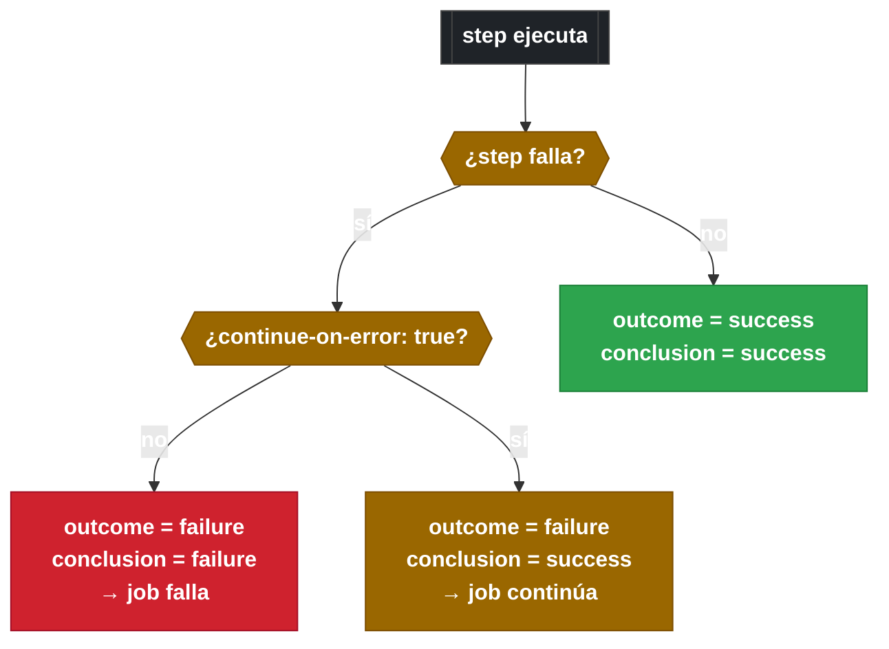
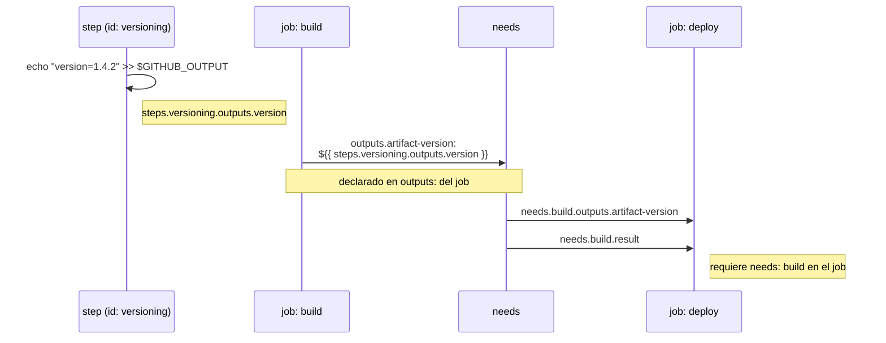

# 1.12 Contextos de estado, datos y flujo: steps, needs, secrets, inputs, matrix

[← 1.11 Contextos de workflow y ambiente](gha-d1-contextos-workflow.md) | [→ 1.13 Expresiones y funciones built-in](gha-d1-expresiones.md)

---

## Introducción

Los contextos de datos son el mecanismo principal de comunicación entre los diferentes niveles de ejecución de un workflow: pasos dentro de un job, jobs entre sí, y el exterior que dispara o configura el workflow. Mientras que los contextos `github`, `runner` y `env` exponen el entorno de ejecución, los contextos `steps`, `needs`, `secrets`, `inputs` y `matrix` transportan datos producidos o suministrados durante la ejecución. Entender cuándo cada contexto está disponible y qué propiedades expone es esencial tanto para el examen GH-200 como para diseñar workflows robustos y mantenibles.

---

## Tabla de disponibilidad de contextos por nivel

| Contexto     | Nivel workflow | Nivel job | Nivel step |
|--------------|:--------------:|:---------:|:----------:|
| `github`     | si             | si        | si         |
| `env`        | si             | si        | si         |
| `vars`       | si             | si        | si         |
| `runner`     | no             | si        | si         |
| `secrets`    | no             | si        | si         |
| `inputs`     | si             | si        | si         |
| `matrix`     | no             | si        | si         |
| `needs`      | no             | si        | no         |
| `steps`      | no             | no        | si         |
| `job`        | no             | si        | si         |
| `strategy`   | no             | si        | si         |

> **Regla general:** `steps` solo existe dentro del step que lo consulta (referencia steps anteriores del mismo job). `needs` existe al nivel de job pero no dentro de steps individuales. `secrets` y `matrix` no están disponibles en la clave de nivel de workflow (fuera de jobs).

---

## Contexto `steps`

El contexto `steps` permite a un step acceder a los resultados de steps anteriores del mismo job, siempre que esos steps tengan un `id` definido. Expone tres propiedades por step referenciado:

- `steps.<id>.outputs.<nombre>`: valor producido mediante `echo "nombre=valor" >> $GITHUB_OUTPUT`
- `steps.<id>.outcome`: resultado **antes** de aplicar `continue-on-error`; puede ser `success`, `failure`, `cancelled` o `skipped`
- `steps.<id>.conclusion`: resultado **después** de aplicar `continue-on-error`; es el valor que el resto del workflow observa

La diferencia entre `outcome` y `conclusion` es sutil pero importante para el examen. Si un step falla (`outcome: failure`) pero tiene `continue-on-error: true`, su `conclusion` será `success` porque el job no se interrumpió. Usar `outcome` permite detectar el fallo real; usar `conclusion` refleja el impacto visible en el job.



```yaml
steps:
  - id: build
    run: ./gradlew build
    continue-on-error: true

  - run: |
      echo "outcome real: ${{ steps.build.outcome }}"
      echo "conclusion visible: ${{ steps.build.conclusion }}"
```

Un step sin `id` no es accesible desde el contexto `steps`. El `id` debe ser único dentro del job y solo puede contener letras, dígitos y guiones.

---

## Contexto `needs`

El contexto `needs` proporciona acceso a los resultados de los jobs de los que el job actual depende directamente (declarados en la clave `needs:` del job). Expone dos propiedades por job dependencia:

- `needs.<job_id>.result`: estado final del job; valores posibles: `success`, `failure`, `cancelled`, `skipped`
- `needs.<job_id>.outputs.<nombre>`: valor que el job upstream declaró en su sección `outputs`

Para que un job exponga outputs al contexto `needs` de sus dependientes, debe declarar la sección `outputs` a nivel de job y mapear los valores desde step outputs:

```yaml
jobs:
  build:
    runs-on: ubuntu-latest
    outputs:
      artifact-version: ${{ steps.versioning.outputs.version }}
    steps:
      - id: versioning
        run: echo "version=1.4.2" >> $GITHUB_OUTPUT

  deploy:
    needs: build
    runs-on: ubuntu-latest
    steps:
      - run: echo "Desplegando version ${{ needs.build.outputs.artifact-version }}"
      - run: echo "Estado del build: ${{ needs.build.result }}"
```

`needs` solo referencia dependencias directas. Si `deploy` depende de `test` y `test` depende de `build`, `deploy` no puede acceder a `needs.build` a menos que lo declare explícitamente en su propia clave `needs`.



---

## Contexto `secrets`

El contexto `secrets` expone los secrets configurados en el repositorio, la organización o el environment activo. Se accede por nombre: `secrets.NOMBRE_DEL_SECRET`. GitHub enmascara automáticamente los valores de secrets en los logs de ejecución, reemplazándolos con `***`. Este enmascaramiento ocurre porque GitHub registra los valores al inicio de la ejecución y aplica redacción activa en toda la salida de logs.

```yaml
steps:
  - name: Login en registry
    run: echo "${{ secrets.REGISTRY_PASSWORD }}" | docker login -u "${{ secrets.REGISTRY_USER }}" --password-stdin registry.example.com
```

Hay un secret especial gestionado automáticamente: `secrets.GITHUB_TOKEN`, que es un token de acceso temporal creado por GitHub Actions para cada ejecución con permisos configurables. No requiere configuración manual.

Los secrets no están disponibles en workflows disparados desde forks en pull requests (por seguridad). En workflows de `workflow_call`, los secrets deben pasarse explícitamente desde el workflow llamador usando la sección `secrets:` de la llamada, o declararse como `secrets: inherit` para heredarlos todos.

La gestión de secrets a nivel de organización, repositorio y environment mediante UI y API se cubre en detalle en [D4: Gestión de secrets](gha-d4-secrets-ui.md).

---

## Contexto `inputs`

El contexto `inputs` expone los valores de entrada suministrados al workflow. Está disponible en dos escenarios:

1. **`workflow_dispatch`**: cuando un usuario dispara el workflow manualmente desde la UI o la API, los valores que ingresa están disponibles en `inputs.<nombre>`
2. **`workflow_call`**: cuando otro workflow llama al workflow actual como reutilizable, los valores pasados en la llamada están disponibles en `inputs.<nombre>`

```yaml
on:
  workflow_dispatch:
    inputs:
      environment:
        description: "Entorno de despliegue"
        required: true
        type: choice
        options: [dev, staging, prod]
      debug:
        description: "Activar modo debug"
        type: boolean
        default: false

jobs:
  deploy:
    runs-on: ubuntu-latest
    steps:
      - run: echo "Desplegando en ${{ inputs.environment }}"
      - if: ${{ inputs.debug }}
        run: echo "Modo debug activado"
```

Los tipos soportados para inputs son `string`, `boolean`, `choice` y `number`. Si no se proporciona un valor y existe `default`, se usa ese valor. `inputs` también puede accederse mediante `github.event.inputs` para compatibilidad, pero `inputs` es la forma canónica y recomendada desde 2021.

---

## Contexto `matrix`

El contexto `matrix` expone los valores actuales de las dimensiones de la estrategia de matrix para la combinación específica que se está ejecutando. Cada job en una matrix strategy recibe su propio `matrix` con los valores de esa combinación particular.

```yaml
jobs:
  test:
    strategy:
      matrix:
        os: [ubuntu-latest, windows-latest]
        node: [18, 20]
    runs-on: ${{ matrix.os }}
    steps:
      - uses: actions/setup-node@v4
        with:
          node-version: ${{ matrix.node }}
      - run: echo "Ejecutando en ${{ matrix.os }} con Node ${{ matrix.node }}"
```

En la combinación `ubuntu-latest + node 18`, `matrix.os` vale `ubuntu-latest` y `matrix.node` vale `18`. En la combinación `windows-latest + node 20`, los valores cambian correspondientemente. Es posible añadir propiedades extra en `matrix.include` para combinaciones específicas, y esas propiedades adicionales también son accesibles via `matrix.<propiedad>`.

`matrix` está disponible a nivel de job y de step, pero no a nivel de workflow. No existe fuera de jobs que declaren `strategy.matrix`.

---

## Ejemplo central: workflow con steps, needs, secrets, inputs y matrix

El siguiente workflow combina todos los contextos cubiertos en este subtema. Ilustra el flujo completo: un job de build produce outputs que el job de deploy consume via `needs`, ambos jobs leen inputs del disparador manual, el job de build usa un secret para autenticarse, y el job de test usa matrix para ejecutarse en múltiples versiones.

```yaml
name: Pipeline completo

on:
  workflow_dispatch:
    inputs:
      environment:
        description: "Entorno destino"
        required: true
        type: choice
        options: [dev, staging, prod]
      run-tests:
        description: "Ejecutar tests"
        type: boolean
        default: true

jobs:
  build:
    runs-on: ubuntu-latest
    outputs:
      image-tag: ${{ steps.tag.outputs.tag }}
      build-status: ${{ steps.compile.conclusion }}
    steps:
      - uses: actions/checkout@v4

      - name: Autenticar en registry
        run: |
          echo "${{ secrets.REGISTRY_TOKEN }}" | \
            docker login ghcr.io -u ${{ github.actor }} --password-stdin

      - id: compile
        name: Compilar aplicacion
        run: ./gradlew build
        continue-on-error: true

      - name: Verificar resultado real de compilacion
        run: |
          echo "outcome (real):    ${{ steps.compile.outcome }}"
          echo "conclusion (visto): ${{ steps.compile.conclusion }}"

      - id: tag
        name: Generar tag de imagen
        if: steps.compile.outcome == 'success'
        run: |
          TAG="ghcr.io/${{ github.repository }}:${{ github.sha }}"
          echo "tag=${TAG}" >> $GITHUB_OUTPUT

  test:
    needs: build
    if: inputs.run-tests && needs.build.result == 'success'
    strategy:
      matrix:
        java: [17, 21]
        os: [ubuntu-latest, windows-latest]
    runs-on: ${{ matrix.os }}
    steps:
      - uses: actions/checkout@v4
      - uses: actions/setup-java@v4
        with:
          java-version: ${{ matrix.java }}
          distribution: temurin
      - run: |
          echo "Test en ${{ matrix.os }} con Java ${{ matrix.java }}"
          echo "Imagen del build: ${{ needs.build.outputs.image-tag }}"
          ./gradlew test

  deploy:
    needs: [build, test]
    if: |
      needs.build.result == 'success' &&
      needs.test.result == 'success'
    runs-on: ubuntu-latest
    environment: ${{ inputs.environment }}
    steps:
      - name: Desplegar imagen
        run: |
          echo "Desplegando ${{ needs.build.outputs.image-tag }}"
          echo "Entorno: ${{ inputs.environment }}"
          echo "Build status: ${{ needs.build.outputs.build-status }}"
        env:
          DEPLOY_KEY: ${{ secrets.DEPLOY_KEY }}
```

Puntos clave del ejemplo:
- `steps.compile.outcome` detecta el fallo real aunque `continue-on-error: true` haga que `conclusion` sea `success`
- `build.outputs.image-tag` se declara a nivel de job y se mapea desde `steps.tag.outputs.tag`
- `needs.build.outputs.image-tag` y `needs.build.result` son accesibles en todos los jobs que declaran `needs: build`
- `inputs.environment` y `inputs.run-tests` están disponibles en todos los jobs
- `matrix.os` y `matrix.java` son distintos en cada combinación del job `test`

---

## Tabla de propiedades clave por contexto

| Contexto | Propiedad | Tipo | Descripcion |
|----------|-----------|------|-------------|
| `steps`  | `steps.<id>.outputs.<n>` | string | Valor exportado via `$GITHUB_OUTPUT` |
| `steps`  | `steps.<id>.outcome` | string | Resultado real (antes de `continue-on-error`) |
| `steps`  | `steps.<id>.conclusion` | string | Resultado visible (despues de `continue-on-error`) |
| `needs`  | `needs.<job>.result` | string | Estado final del job upstream |
| `needs`  | `needs.<job>.outputs.<n>` | string | Output declarado en la seccion `outputs` del job |
| `secrets`| `secrets.<NOMBRE>` | string | Valor del secret (enmascarado en logs) |
| `secrets`| `secrets.GITHUB_TOKEN` | string | Token automatico de cada ejecucion |
| `inputs` | `inputs.<nombre>` | string/bool/number | Valor del input del disparador |
| `matrix` | `matrix.<dimension>` | any | Valor de esa dimension en la combinacion actual |

---

## Buenas y malas practicas

**1. Outputs de jobs: declarar siempre en la seccion `outputs` del job**

Correcto: declarar `outputs` a nivel de job para que `needs` pueda acceder a ellos.
```yaml
jobs:
  build:
    outputs:
      version: ${{ steps.ver.outputs.version }}
```

Incorrecto: intentar acceder directamente a `steps` de otro job desde `needs`. Los `steps` de un job no son accesibles desde otros jobs; solo los outputs declarados explicitamente en `outputs` del job lo son.

---

**2. Diferenciar `outcome` de `conclusion` al tomar decisiones**

Correcto: usar `steps.<id>.outcome == 'failure'` cuando se quiere detectar un fallo real independientemente de `continue-on-error`.

Incorrecto: usar `steps.<id>.conclusion == 'failure'` para detectar fallos en steps con `continue-on-error: true`; `conclusion` sera `success` en esos casos y la condicion nunca se cumplira.

---

**3. Secrets: nunca imprimirlos directamente en logs**

Correcto: pasar secrets como variables de entorno a scripts y que el script los use internamente sin imprimirlos.
```yaml
- run: ./deploy.sh
  env:
    API_KEY: ${{ secrets.API_KEY }}
```

Incorrecto: usar `echo ${{ secrets.API_KEY }}` en un `run`. Aunque GitHub enmascara el valor, la practica expone el secret en el comando y es un riesgo si el enmascaramiento falla.

---

**4. Contexto `inputs`: validar valores de tipo `choice` antes de usarlos**

Correcto: definir `type: choice` con una lista de `options` para garantizar valores validos desde el origen.

Incorrecto: usar `type: string` para inputs que solo admiten un conjunto fijo de valores; un usuario podria ingresar un valor inesperado que rompa pasos posteriores.

---

**5. Matrix: evitar combinaciones explosivas sin `fail-fast`**

Correcto: configurar `fail-fast: false` cuando cada combinacion es independiente y no se quiere cancelar todas por un fallo parcial.
```yaml
strategy:
  fail-fast: false
  matrix:
    os: [ubuntu-latest, windows-latest, macos-latest]
    version: [18, 20, 22]
```

Incorrecto: dejar `fail-fast: true` (valor por defecto) en matrices grandes donde las combinaciones son independientes; un fallo en una combinacion cancela todas las demas y se pierde informacion de las que no ejecutaron.

---

## Verificacion

### Preguntas estilo GH-200

**Pregunta 1.** Un step tiene `continue-on-error: true` y falla durante la ejecucion. El step siguiente evalua `${{ steps.anterior.conclusion }}`. Que valor obtiene?

- A) `failure`
- B) `success`
- C) `cancelled`
- D) `skipped`

**Respuesta correcta: B.** Con `continue-on-error: true`, aunque `outcome` es `failure`, `conclusion` es `success` porque el job no se interrumpio.

---

**Pregunta 2.** Un workflow tiene dos jobs: `lint` y `build`. El job `build` declara `needs: lint`. Desde un step dentro del job `build`, cual expresion es valida para leer el resultado del job `lint`?

- A) `${{ steps.lint.result }}`
- B) `${{ needs.lint.result }}`
- C) `${{ jobs.lint.result }}`
- D) `${{ github.lint.result }}`

**Respuesta correcta: B.** El contexto `needs` esta disponible a nivel de job (incluyendo sus steps) y expone `.result` para cada job dependencia directa.

---

**Pregunta 3.** Un workflow reutilizable declara un input llamado `version`. El workflow llamador no pasa ese input en la llamada, pero el input tiene `default: "1.0.0"`. Que valor tendra `${{ inputs.version }}` dentro del workflow reutilizable?

- A) Cadena vacia
- B) `null`
- C) `"1.0.0"`
- D) Error de ejecucion

**Respuesta correcta: C.** Cuando un input tiene `default` y no se provee valor, GitHub Actions utiliza el valor por defecto; `inputs.version` valdra `"1.0.0"`.

---

### Ejercicio practico

Crea un workflow con las siguientes caracteristicas:

1. Se dispara con `workflow_dispatch` y recibe dos inputs: `service` (string, requerido) y `dry-run` (boolean, default false)
2. Job `prepare`: ejecuta un step con id `config` que exporta un output `endpoint` con valor `https://api.example.com/${{ inputs.service }}`
3. Job `execute`: depende de `prepare`; lee `needs.prepare.outputs.endpoint`; si `inputs.dry-run` es true, solo imprime el endpoint sin ejecutar; si es false, usa `secrets.API_TOKEN` para autenticarse y hace el deploy

Verifica que:
- `steps.config.outputs.endpoint` sea accesible dentro del job `prepare`
- `needs.prepare.outputs.endpoint` sea accesible dentro del job `execute`
- El secret `API_TOKEN` solo se use cuando `dry-run` es false

<details>
<summary>Solucion de referencia</summary>

```yaml
name: Deploy service

on:
  workflow_dispatch:
    inputs:
      service:
        description: "Nombre del servicio"
        required: true
        type: string
      dry-run:
        description: "Ejecutar en modo simulacion"
        type: boolean
        default: false

jobs:
  prepare:
    runs-on: ubuntu-latest
    outputs:
      endpoint: ${{ steps.config.outputs.endpoint }}
    steps:
      - id: config
        run: |
          ENDPOINT="https://api.example.com/${{ inputs.service }}"
          echo "endpoint=${ENDPOINT}" >> $GITHUB_OUTPUT
          echo "Endpoint configurado: ${ENDPOINT}"

  execute:
    needs: prepare
    runs-on: ubuntu-latest
    steps:
      - name: Mostrar configuracion
        run: echo "Endpoint: ${{ needs.prepare.outputs.endpoint }}"

      - name: Deploy real
        if: ${{ !inputs.dry-run }}
        run: |
          echo "Desplegando en ${{ needs.prepare.outputs.endpoint }}"
          curl -H "Authorization: Bearer $API_TOKEN" \
            "${{ needs.prepare.outputs.endpoint }}/deploy"
        env:
          API_TOKEN: ${{ secrets.API_TOKEN }}

      - name: Simulacion dry-run
        if: ${{ inputs.dry-run }}
        run: |
          echo "[DRY-RUN] Se desplegaria en: ${{ needs.prepare.outputs.endpoint }}"
          echo "[DRY-RUN] Se usaria secrets.API_TOKEN para autenticacion"
```

</details>

---

## Referencias rapidas

- `steps.<id>.outputs.<n>` — requiere `id` en el step y `echo "n=v" >> $GITHUB_OUTPUT`
- `steps.<id>.outcome` — resultado real; `steps.<id>.conclusion` — resultado tras `continue-on-error`
- `needs.<job>.outputs.<n>` — requiere seccion `outputs:` declarada en el job upstream
- `needs.<job>.result` — `success | failure | cancelled | skipped`
- `secrets.GITHUB_TOKEN` — token automatico; resto de secrets requieren configuracion manual
- `inputs.<n>` — disponible en `workflow_dispatch` y `workflow_call`
- `matrix.<dim>` — valor especifico de la combinacion en ejecucion

---

[← 1.11 Contextos de workflow y ambiente](gha-d1-contextos-workflow.md) | [→ 1.13 Expresiones y funciones built-in](gha-d1-expresiones.md)
