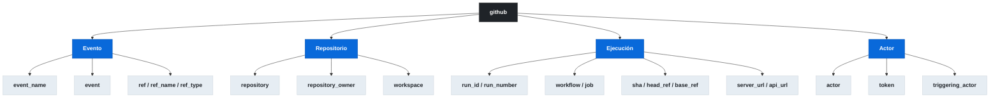
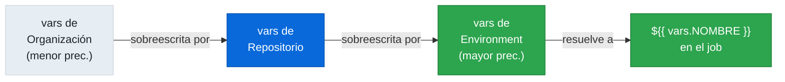

# 1.11 Contextos de workflow y ambiente

[← 1.10 Matrix strategy](gha-d1-matrix-strategy.md) | [→ 1.12 Contextos de estado, datos y flujo](gha-d1-contextos-estado.md)

---

## Introducción

GitHub Actions expone información del entorno de ejecución a través de un sistema de **contextos**: objetos accesibles mediante la sintaxis `${{ context.property }}` en expresiones. En tiempo de ejecución, el motor de Actions hidrata estos objetos con datos reales del evento disparador, el runner, las variables configuradas y el estado del job. Comprender qué contexto usar y cuándo es esencial para construir workflows dinámicos, reutilizables y seguros. Este archivo cubre los cinco contextos de metadatos más usados: `github`, `runner`, `env`, `vars` y `job`.

---

## Contexto `github`

El contexto `github` es el más rico de todos: contiene información sobre el evento que disparó el workflow, el repositorio, el commit y la ejecución actual.



**Campos de uso frecuente:**

| Campo | Valor de ejemplo | Uso típico |
|---|---|---|
| `github.ref` | `refs/heads/main` | Condiciones de branch |
| `github.ref_name` | `main` | Mensajes, etiquetas |
| `github.sha` | `a1b2c3d...` | Tags de imagen Docker |
| `github.actor` | `octocat` | Logs, notificaciones |
| `github.run_id` | `9876543210` | URLs de artefactos |
| `github.run_number` | `42` | Versiones de build |
| `github.token` | `***` | Autenticación en API |
| `github.head_ref` | `feature/login` | Checkout en PRs |
| `github.base_ref` | `main` | Comparaciones en PRs |

---

## `github.event_name` vs `github.event`

Estos dos campos se confunden con frecuencia pero sirven propósitos distintos.

`github.event_name` es una **cadena de texto** con el nombre del evento que disparó el workflow: `"push"`, `"pull_request"`, `"workflow_dispatch"`, `"schedule"`, etc. Es ideal para condiciones (`if: github.event_name == 'push'`) porque es un valor simple y predecible.

`github.event` es el **payload JSON completo** del evento tal como lo envía GitHub. Su estructura varía completamente según el tipo de evento. Para un `pull_request`, contiene `github.event.pull_request.number`, `github.event.pull_request.title`, `github.event.pull_request.merged`, etc. Para un `push`, contiene `github.event.commits`, `github.event.pusher`, etc. Usar `github.event` requiere conocer la estructura del webhook del evento específico.

```yaml
# Diferencia práctica
- name: Mostrar tipo de evento
  run: echo "Evento: ${{ github.event_name }}"

- name: Mostrar título del PR (solo si es pull_request)
  if: github.event_name == 'pull_request'
  run: echo "PR: ${{ github.event.pull_request.title }}"
```

Regla práctica: usa `github.event_name` para condiciones de control de flujo y `github.event.*` para acceder a datos específicos del payload.

---

## Contexto `runner`

El contexto `runner` expone información sobre la máquina que ejecuta el job actual.

| Campo | Descripción | Ejemplo |
|---|---|---|
| `runner.os` | Sistema operativo | `Linux`, `Windows`, `macOS` |
| `runner.arch` | Arquitectura del procesador | `X64`, `ARM64` |
| `runner.temp` | Directorio temporal del runner | `/tmp` / `D:\a\_temp` |
| `runner.tool_cache` | Caché de herramientas (actions/setup-*) | `/opt/hostedtoolcache` |
| `runner.name` | Nombre del runner | `Hosted Agent` |
| `runner.environment` | Tipo de runner | `github-hosted` |

El campo `runner.os` es especialmente útil en matrices multi-plataforma para adaptar comandos según el sistema operativo. `runner.temp` es el lugar correcto para escribir archivos temporales ya que se limpia automáticamente después del job. `runner.tool_cache` lo usan internamente las actions de setup (como `actions/setup-node`) para almacenar versiones de herramientas.

---

## Contexto `env`

El contexto `env` permite acceder a variables de entorno definidas en el workflow (a nivel `workflow`, `job` o `step`) **desde expresiones** `${{ }}`. Es distinto de usar `$VARIABLE` o `%VARIABLE%` en el shell.

```yaml
env:
  APP_ENV: production
  VERSION: "1.0.0"

jobs:
  build:
    runs-on: ubuntu-latest
    env:
      BUILD_DIR: ./dist
    steps:
      - name: Usar env en expresión
        if: env.APP_ENV == 'production'
        run: echo "Construyendo para ${{ env.APP_ENV }}"
```

La diferencia entre `${{ env.VAR }}` y `$VAR` es el momento de evaluación: las expresiones `${{ }}` se resuelven antes de ejecutar el step (nivel de Actions), mientras que `$VAR` se expande en el shell durante la ejecución. Para condiciones `if:` solo funciona la sintaxis de expresión `${{ env.VAR }}` o directamente `env.VAR`.

Las variables definidas en un `step` con `env:` solo son accesibles en ese step. Las definidas a nivel `job` o `workflow` son accesibles en todos los steps subordinados. El contexto `env` refleja la jerarquía de herencia: un step hereda las variables del job y del workflow, y puede sobreescribirlas localmente.

---

## Contexto `vars`

El contexto `vars` da acceso a las **Configuration Variables** (variables de configuración no secretas) definidas en la interfaz de GitHub: Settings → Secrets and variables → Actions → Variables. A diferencia de los secretos, estas variables son visibles en los logs y están pensadas para valores de configuración reutilizables como nombres de entornos, URLs de registros, o flags de feature.

```yaml
steps:
  - name: Usar variable de configuración
    run: |
      echo "Registry: ${{ vars.CONTAINER_REGISTRY }}"
      echo "Region: ${{ vars.DEPLOY_REGION }}"
```

Las `vars` pueden definirse a tres niveles con orden de precedencia: organización → repositorio → entorno (environment). Si se define `DEPLOY_REGION` en la organización y también en el repositorio, el valor del repositorio tiene precedencia. Si el job especifica un `environment:`, las variables de ese entorno tienen la mayor precedencia.



A diferencia de `env` (que contiene variables del workflow YAML), `vars` contiene variables configuradas externamente en GitHub. Esto las hace ideales para valores que cambian entre repositorios o entornos sin modificar el código del workflow.

---

## Contexto `job`

El contexto `job` contiene información sobre el job que se está ejecutando actualmente.

| Campo | Descripción | Ejemplo |
|---|---|---|
| `job.status` | Estado actual del job | `success`, `failure`, `cancelled` |
| `job.container.id` | ID del contenedor del job | `abc123...` |
| `job.container.network` | Red del contenedor | `github_network_abc` |
| `job.services.<id>.id` | ID del contenedor del servicio | `def456...` |
| `job.services.<id>.network` | Red del servicio | `github_network_abc` |
| `job.services.<id>.ports` | Puertos mapeados del servicio | `{"5432": "32768"}` |

El campo `job.status` es accesible en steps y se actualiza dinámicamente. Un step posterior puede consultar `job.status` para saber si los steps anteriores tuvieron éxito o fallaron. Sin embargo, para condiciones de cleanup con `always()`, se usa más frecuentemente `job.status` combinado con condiciones explícitas.

El sub-objeto `job.services` es crucial cuando el job define servicios de contenedor (como bases de datos o caches): permite acceder a los puertos dinámicos asignados por el runner sin hardcodearlos.

---

## Ejemplo central: los 5 contextos en acción

```yaml
name: Ejemplo Contextos

on:
  push:
    branches: [main, develop]
  pull_request:
    branches: [main]

env:
  APP_NAME: mi-aplicacion
  LOG_LEVEL: info

jobs:
  contextos-demo:
    runs-on: ubuntu-latest
    environment: staging
    services:
      postgres:
        image: postgres:15
        env:
          POSTGRES_PASSWORD: postgres
        ports:
          - 5432/tcp

    steps:
      # --- Contexto github ---
      - name: Información del evento
        run: |
          echo "Evento:      ${{ github.event_name }}"
          echo "Rama:        ${{ github.ref_name }}"
          echo "SHA:         ${{ github.sha }}"
          echo "Actor:       ${{ github.actor }}"
          echo "Run number:  ${{ github.run_number }}"

      # github.event (payload completo, solo en PR)
      - name: Datos del Pull Request
        if: github.event_name == 'pull_request'
        run: |
          echo "PR #${{ github.event.pull_request.number }}"
          echo "Título: ${{ github.event.pull_request.title }}"
          echo "De '${{ github.head_ref }}' hacia '${{ github.base_ref }}'"

      # --- Contexto runner ---
      - name: Información del runner
        run: |
          echo "OS:   ${{ runner.os }}"
          echo "Arch: ${{ runner.arch }}"
          echo "Temp: ${{ runner.temp }}"

      # --- Contexto env ---
      - name: Build condicional por entorno
        if: env.LOG_LEVEL == 'info'
        run: |
          echo "Construyendo ${{ env.APP_NAME }}"
          echo "Log level: ${{ env.LOG_LEVEL }}"

      # --- Contexto vars (Configuration Variables) ---
      - name: Desplegar usando variables de configuración
        run: |
          echo "Registry: ${{ vars.CONTAINER_REGISTRY }}"
          echo "Región:   ${{ vars.DEPLOY_REGION }}"
          docker build \
            -t ${{ vars.CONTAINER_REGISTRY }}/${{ env.APP_NAME }}:${{ github.sha }} \
            .

      # --- Contexto job (puerto dinámico del servicio) ---
      - name: Conectar a Postgres con puerto dinámico
        run: |
          PGPORT=${{ job.services.postgres.ports['5432'] }}
          echo "Puerto Postgres: $PGPORT"
          psql -h localhost -p $PGPORT -U postgres -c "SELECT version();"
        env:
          PGPASSWORD: postgres

      # job.status en cleanup
      - name: Notificar resultado
        if: always()
        run: |
          echo "Estado del job: ${{ job.status }}"
          if [ "${{ job.status }}" = "failure" ]; then
            echo "El workflow falló en ${{ github.workflow }} run #${{ github.run_number }}"
          fi
```

---

## Buenas y malas prácticas

**Acceso al token**

- Correcto: usar `${{ github.token }}` (o `${{ secrets.GITHUB_TOKEN }}`) y limitar los permisos del job con `permissions:`.
- Incorrecto: imprimir `${{ github.token }}` en logs o pasarlo como argumento visible en comandos de shell. GitHub enmascara el token automáticamente, pero es una mala práctica conceptual.

**Condiciones de evento**

- Correcto: `if: github.event_name == 'push'` para condiciones de control de flujo.
- Incorrecto: `if: github.event.pusher != ''` para detectar si es un push. Depende de la estructura del payload, que puede variar; `event_name` es más robusto y legible.

**Variables de configuración vs secretos**

- Correcto: usar `vars.DEPLOY_REGION` para valores no sensibles como regiones, URLs de registros, o nombres de entornos. Estos valores son visibles en logs y auditables.
- Incorrecto: almacenar valores sensibles (tokens, contraseñas, claves) en `vars`. Para eso existen `secrets`. El contexto `vars` no enmascara su contenido en los logs.

**Referencia al directorio temporal**

- Correcto: `${{ runner.temp }}` para crear archivos temporales dentro del job.
- Incorrecto: hardcodear `/tmp` o `D:\Temp`. El path varía según el OS y el runner; `runner.temp` es portable entre Linux, Windows y macOS.

**Puertos de servicios**

- Correcto: `${{ job.services.postgres.ports['5432'] }}` para obtener el puerto dinámico asignado.
- Incorrecto: asumir que el puerto del contenedor es el mismo en el host (`5432`). El runner asigna un puerto aleatorio del host para evitar conflictos.

**Herencia de variables de entorno**

- Correcto: definir variables comunes a nivel `workflow` con `env:` y sobreescribir solo las específicas a nivel `job` o `step`.
- Incorrecto: repetir la misma variable `env:` en cada step. Genera duplicación y riesgo de inconsistencias al actualizar valores.

---

## Verificación

**Pregunta 1 — GH-200**
Un step necesita conocer el número de puerto asignado por el runner al servicio `redis` definido en el job. ¿Cuál es la expresión correcta?

- A) `${{ env.REDIS_PORT }}`
- B) `${{ job.services.redis.ports['6379'] }}`
- C) `${{ runner.services.redis.port }}`
- D) `${{ github.event.services.redis }}`

Respuesta correcta: **B**. El contexto `job.services.<id>.ports` mapea el puerto del contenedor al puerto dinámico del host.

---

**Pregunta 2 — GH-200**
¿Cuál es la diferencia entre `vars.DEPLOY_ENV` y `env.DEPLOY_ENV` en una expresión de workflow?

- A) No hay diferencia; ambos acceden a las mismas variables.
- B) `vars` accede a Configuration Variables definidas en GitHub Settings; `env` accede a variables definidas en el YAML del workflow.
- C) `vars` solo está disponible en jobs; `env` solo en steps.
- D) `env` accede a Configuration Variables; `vars` accede a variables de entorno del sistema operativo.

Respuesta correcta: **B**. `vars` son variables externas al workflow configuradas en la interfaz de GitHub. `env` son las definidas dentro del YAML con la clave `env:`.

---

**Pregunta 3 — GH-200**
Un workflow se dispara con `on: [push, pull_request]`. Un step tiene la condición `if: github.head_ref != ''`. ¿En qué caso se ejecutará ese step?

- A) Siempre que el workflow se ejecute.
- B) Solo en eventos `push` a cualquier rama.
- C) Solo en eventos `pull_request`, ya que `head_ref` solo se popula en ese contexto.
- D) Solo en eventos `push` a la rama principal.

Respuesta correcta: **C**. `github.head_ref` solo tiene valor en eventos de tipo `pull_request` (la rama de origen del PR). En un `push`, `head_ref` es una cadena vacía.

---

**Ejercicio práctico**

Escribe un step que imprima en una sola línea el siguiente mensaje usando los cinco contextos:

```
[run-42] push por octocat en main (Linux/X64) | env=production | registry=ghcr.io
```

Los valores `run-42`, `push`, `octocat`, `main`, `Linux`, `X64` vienen de contextos `github` y `runner`. `production` viene del contexto `env` (variable `APP_ENV`). `ghcr.io` viene del contexto `vars` (variable `CONTAINER_REGISTRY`).

Solución de referencia:

```yaml
- name: Mensaje de estado completo
  run: |
    echo "[run-${{ github.run_number }}] ${{ github.event_name }} por ${{ github.actor }} en ${{ github.ref_name }} (${{ runner.os }}/${{ runner.arch }}) | env=${{ env.APP_ENV }} | registry=${{ vars.CONTAINER_REGISTRY }}"
```

---

[← 1.10 Matrix strategy](gha-d1-matrix-strategy.md) | [→ 1.12 Contextos de estado, datos y flujo](gha-d1-contextos-estado.md)
