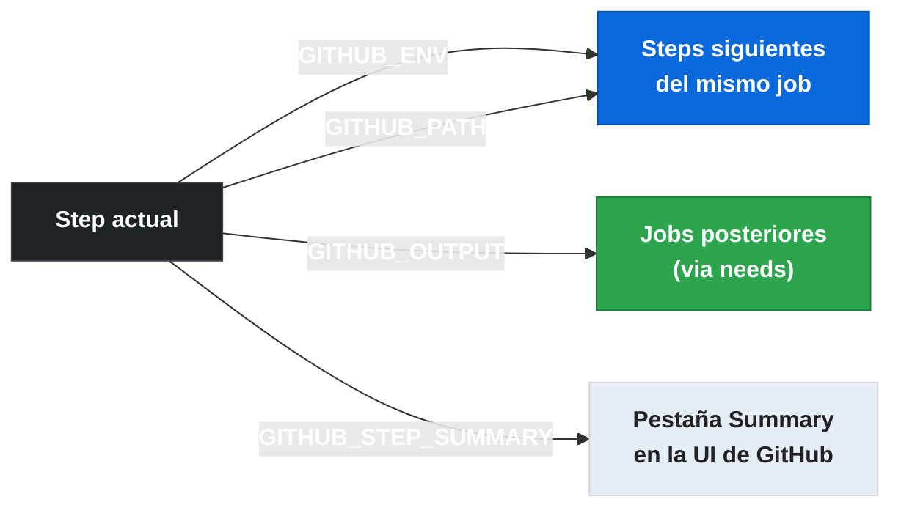

# X.16 File commands del workflow

[anterior: 1.15 Artefactos](gha-d1-artefactos.md) | [siguiente: 1.17 Variables predefinidas del runner](gha-d1-variables-predefinidas.md)

## Por que los file commands reemplazaron los workflow commands de stdout

Hasta 2022, GitHub Actions usaba workflow commands escritos en stdout con la sintaxis `::set-output name=VAR::valor`. El problema era que cualquier dato en stdout que tuviera ese formato podía ser interpretado como un comando, abriendo una superficie de inyeccion si el valor provenia de entrada del usuario o de salidas de herramientas externas. La solucion fue reemplazar estos comandos por file commands: en lugar de escribir a stdout, el runner lee archivos cuyas rutas expone en variables de entorno especiales. Escribir `echo "nombre=valor" >> $GITHUB_ENV` es seguro porque el contenido va a un archivo temporal del runner, no a stdout, y no puede interferir con los logs del workflow. Los cuatro file commands principales son `GITHUB_ENV`, `GITHUB_OUTPUT`, `GITHUB_STEP_SUMMARY` y `GITHUB_PATH`.

## Tabla comparativa de los 4 file commands

| Variable | Scope | Proposito | Sintaxis de escritura | Como leerla |
|---|---|---|---|---|
| `GITHUB_ENV` | Steps siguientes del mismo job | Exponer variable de entorno | `echo "VAR=valor" >> $GITHUB_ENV` | `$VAR` o `${{ env.VAR }}` |
| `GITHUB_OUTPUT` | Steps siguientes + jobs posteriores (via `needs`) | Exponer output de un step | `echo "key=valor" >> $GITHUB_OUTPUT` | `${{ steps.ID.outputs.key }}` |
| `GITHUB_STEP_SUMMARY` | Pestaña Summary de la UI | Mostrar markdown en el resumen | `echo "# Titulo" >> $GITHUB_STEP_SUMMARY` | Solo visible en la UI |
| `GITHUB_PATH` | Steps siguientes del mismo job | Añadir directorio al PATH | `echo "/ruta/bin" >> $GITHUB_PATH` | Uso transparente con el nombre del binario |



## GITHUB_ENV: variables entre steps del mismo job

`GITHUB_ENV` permite que un step defina una variable de entorno que estara disponible en todos los steps siguientes del mismo job. La variable NO cruza a jobs posteriores; para eso se necesita `GITHUB_OUTPUT` combinado con `needs`. La sintaxis es `echo "NOMBRE=valor" >> $GITHUB_ENV`. El archivo al que apunta `$GITHUB_ENV` es creado por el runner antes de ejecutar el job y eliminado al terminar. Si se necesita un valor multilínea, se usa un delimitador: `echo "BODY<<EOF" >> $GITHUB_ENV`, luego el contenido, luego `echo "EOF" >> $GITHUB_ENV`. El scope limitado al job es intencional: cada job corre en un runner propio (o en un entorno limpio), por lo que no hay memoria compartida entre jobs.

## GITHUB_OUTPUT: outputs de steps y comunicacion entre jobs

`GITHUB_OUTPUT` reemplaza la sintaxis `::set-output name=...::` que fue deprecada en 2022. Un step escribe `echo "resultado=42" >> $GITHUB_OUTPUT` y el valor queda disponible para steps posteriores del mismo job con `${{ steps.ID_DEL_STEP.outputs.resultado }}`. Para que un job posterior lo consuma, el job que lo produce debe declarar `outputs` a nivel de job (mapeando el output del step al output del job), y el job consumidor usa `${{ needs.JOB_ID.outputs.NOMBRE }}`. Sin esa declaracion explicita en el bloque `outputs` del job, el valor no cruza la barrera entre jobs. El output se almacena en el archivo temporal apuntado por `$GITHUB_OUTPUT` y el runner lo parsea al finalizar el step.

## GITHUB_STEP_SUMMARY: markdown en la pestaña Summary

`GITHUB_STEP_SUMMARY` permite que cualquier step escriba contenido markdown que aparece en la pestaña "Summary" de la ejecucion del workflow en la UI de GitHub. Es util para mostrar reportes de tests, metricas de build, o cualquier informacion que el equipo necesite ver de un vistazo sin entrar a los logs. La escritura es acumulativa: varios steps pueden hacer append al mismo archivo y todo el contenido aparece concatenado en el Summary. Soporta markdown completo: encabezados, tablas, listas, codigo. No tiene efecto funcional sobre el workflow; es puramente informativo para quien revisa la ejecucion.

## GITHUB_PATH: agregar directorios al PATH

`GITHUB_PATH` permite que un step agregue un directorio al `PATH` del sistema operativo para todos los steps siguientes del mismo job. La sintaxis es simplemente `echo "/ruta/al/directorio" >> $GITHUB_PATH`. El directorio se antepone al PATH existente, de modo que los binarios ahi colocados tienen prioridad. Esto es especialmente util cuando un step instala una herramienta en un directorio no estandar y los steps siguientes necesitan invocarla por nombre sin ruta completa. Al igual que `GITHUB_ENV`, el scope es el job actual; los jobs posteriores parten de un PATH limpio.

## Sintaxis de escritura: el patron de redireccion con >>

Todos los file commands usan la misma convencion: `echo "contenido" >> $VARIABLE_ARCHIVO`. El operador `>>` hace append al archivo (no sobreescritura), lo que permite que multiples steps escriban al mismo archivo acumulando entradas. El archivo es una ruta temporal generada por el runner para cada ejecucion, algo como `/home/runner/work/_temp/_runner_file_commands/set_env_XXXX`. El desarrollador nunca necesita conocer la ruta exacta; solo usa la variable de entorno como destino. En scripts de shell mas complejos, la misma sintaxis funciona: `printf "NOMBRE=%s\n" "$valor" >> "$GITHUB_ENV"`.

## Ejemplo central: los 4 file commands en un mismo job

```yaml
name: Demo file commands
on: [push]

jobs:
  demo:
    runs-on: ubuntu-latest
    outputs:
      build-version: ${{ steps.set-version.outputs.version }}

    steps:
      - name: Definir variable de entorno
        run: echo "APP_ENV=production" >> $GITHUB_ENV

      - name: Usar variable de entorno en step siguiente
        run: echo "El entorno es $APP_ENV"

      - name: Instalar herramienta custom y agregar al PATH
        run: |
          mkdir -p $HOME/.tools/bin
          echo '#!/bin/sh\necho "mi-tool v1.0"' > $HOME/.tools/bin/mi-tool
          chmod +x $HOME/.tools/bin/mi-tool
          echo "$HOME/.tools/bin" >> $GITHUB_PATH

      - name: Usar herramienta del PATH
        run: mi-tool

      - id: set-version
        name: Calcular version y exponer output
        run: |
          VERSION="1.0.${{ github.run_number }}"
          echo "version=$VERSION" >> $GITHUB_OUTPUT

      - name: Escribir resumen en la UI
        run: |
          echo "## Resultado del build" >> $GITHUB_STEP_SUMMARY
          echo "" >> $GITHUB_STEP_SUMMARY
          echo "| Campo | Valor |" >> $GITHUB_STEP_SUMMARY
          echo "|---|---|" >> $GITHUB_STEP_SUMMARY
          echo "| Entorno | $APP_ENV |" >> $GITHUB_STEP_SUMMARY
          echo "| Version | ${{ steps.set-version.outputs.version }} |" >> $GITHUB_STEP_SUMMARY

  consume:
    needs: demo
    runs-on: ubuntu-latest
    steps:
      - name: Usar output del job anterior
        run: echo "Version del build anterior: ${{ needs.demo.outputs.build-version }}"
```

## Buenas y malas practicas

**Mal: usar set-output deprecado**
```yaml
- run: echo "::set-output name=version::1.0.0"
```
**Bien: usar GITHUB_OUTPUT**
```yaml
- id: calc
  run: echo "version=1.0.0" >> $GITHUB_OUTPUT
```
La sintaxis `::set-output::` fue deprecada en 2022 y eliminada posteriormente. Cualquier workflow que todavia la use recibira advertencias o fallara.

---

**Mal: intentar leer GITHUB_ENV en el mismo step que lo escribe**
```yaml
- run: |
    echo "COLOR=blue" >> $GITHUB_ENV
    echo "El color es $COLOR"   # COLOR aun no esta disponible aqui
```
**Bien: leer la variable en el step siguiente**
```yaml
- run: echo "COLOR=blue" >> $GITHUB_ENV
- run: echo "El color es $COLOR"   # Disponible aqui
```
El runner inyecta las variables de `GITHUB_ENV` al entorno solo entre steps, no dentro del mismo step.

---

**Mal: asumir que GITHUB_ENV comparte datos entre jobs**
```yaml
jobs:
  job1:
    steps:
      - run: echo "DATO=hola" >> $GITHUB_ENV
  job2:
    needs: job1
    steps:
      - run: echo $DATO   # Vacio; GITHUB_ENV no cruza jobs
```
**Bien: usar GITHUB_OUTPUT + outputs de job para cruzar datos entre jobs**
```yaml
jobs:
  job1:
    outputs:
      dato: ${{ steps.s1.outputs.dato }}
    steps:
      - id: s1
        run: echo "dato=hola" >> $GITHUB_OUTPUT
  job2:
    needs: job1
    steps:
      - run: echo "${{ needs.job1.outputs.dato }}"
```

---

**Mal: sobreescribir el archivo con > en lugar de >>**
```yaml
- run: echo "KEY=valor" > $GITHUB_ENV   # Borra entradas anteriores
```
**Bien: siempre usar >> para hacer append**
```yaml
- run: echo "KEY=valor" >> $GITHUB_ENV
```

## Verificacion

**Pregunta 1 (GH-200):** Un step define `echo "TOKEN=abc" >> $GITHUB_ENV`. El siguiente step del mismo job intenta leer `$TOKEN`. Que ocurrira?

A) Error porque TOKEN no se declaro en `env:` del job
B) TOKEN estara disponible y valdra "abc"
C) TOKEN solo estara disponible si el job declara `outputs`
D) TOKEN estara disponible pero solo con la sintaxis `${{ env.TOKEN }}`

Respuesta correcta: **B**. GITHUB_ENV inyecta la variable en el entorno del runner para todos los steps siguientes del mismo job; no requiere declaracion adicional.

---

**Pregunta 2 (GH-200):** Cual es la diferencia principal entre GITHUB_ENV y GITHUB_OUTPUT?

A) GITHUB_ENV soporta valores multilínea; GITHUB_OUTPUT no
B) GITHUB_OUTPUT permite cruzar datos a jobs posteriores via `needs`; GITHUB_ENV solo alcanza steps del mismo job
C) GITHUB_ENV requiere que el step tenga un `id`; GITHUB_OUTPUT no
D) No hay diferencia; ambos tienen el mismo scope

Respuesta correcta: **B**. GITHUB_OUTPUT, combinado con la declaracion de `outputs` a nivel de job y `needs`, permite que jobs posteriores consuman el valor.

---

**Pregunta 3 (GH-200):** Un workflow usa `echo "::set-output name=ver::1.0"`. Que se debe hacer para modernizarlo?

A) Cambiar a `echo "ver=1.0" >> $GITHUB_ENV`
B) Cambiar a `echo "ver=1.0" >> $GITHUB_OUTPUT`
C) Declarar el output en el bloque `env:` del job
D) Usar `actions/core` en lugar de echo

Respuesta correcta: **B**. `GITHUB_OUTPUT` es el reemplazo directo de `set-output`.

---

**Ejercicio practico:** Crea un workflow con dos jobs. El primer job tiene un step que calcula la fecha actual (`date +%Y-%m-%d`) y la expone como output. Ese mismo job escribe un resumen en `GITHUB_STEP_SUMMARY` con la fecha. El segundo job consume el output del primero y lo imprime. Verifica que la variable de fecha NO sea accesible en el segundo job via `$GITHUB_ENV` (debe usarse el mecanismo de outputs).

[anterior: 1.15 Artefactos](gha-d1-artefactos.md) | [siguiente: 1.17 Variables predefinidas del runner](gha-d1-variables-predefinidas.md)
