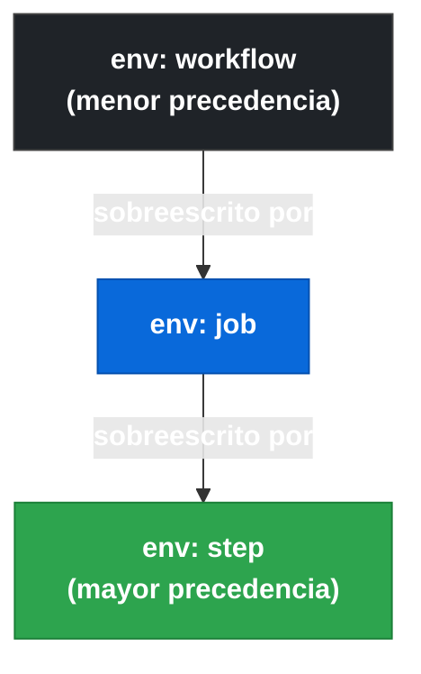
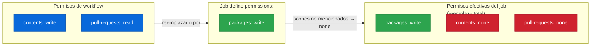

# 1.5a Propiedades de identidad, entorno y salidas del job

[← 1.4 Triggers de eventos del repositorio](gha-d1-triggers-eventos.md) | [1.5b Propiedades de control de flujo →](gha-d1-jobs-control-flujo.md)

---

## Por qué configurar la identidad del job antes de sus steps

Cada job en GitHub Actions es una unidad de ejecución aislada que corre en su propio runner. Antes de que el primer step se ejecute, el motor de Actions necesita resolver cuatro preguntas fundamentales: ¿en qué máquina corre?, ¿cómo se llama en la interfaz?, ¿qué variables de entorno están disponibles?, y ¿qué permisos tiene el token sobre la API de GitHub? Si alguna de estas propiedades no se define explícitamente, se aplican valores heredados del workflow o valores por defecto que suelen ser más permisivos de lo conveniente. Definirlos de forma deliberada reduce la superficie de ataque, mejora la legibilidad de los logs y permite que jobs posteriores consuman datos producidos por el job actual mediante outputs.

---

## Árbol de propiedades: jerarquía de env



La regla es simple: el scope más cercano al step gana. Un valor definido en `env` de step tiene prioridad absoluta sobre el mismo nombre definido en job o en workflow. Esta jerarquía es evaluada en tiempo de ejecución, no en tiempo de parseo.

---

## Referencia rápida de propiedades

| Propiedad      | Requerida | Hereda de workflow | Puede usar expresiones |
|----------------|-----------|-------------------|------------------------|
| `runs-on`      | Sí        | No                | Sí (desde `inputs`)    |
| `name`         | No        | No                | Sí                     |
| `env`          | No        | Sí (merge)        | Sí                     |
| `permissions`  | No        | Sí (override)     | No                     |
| `outputs`      | No        | No                | Sí (referencias)       |

---

## `runs-on`: dónde se ejecuta el job

La propiedad `runs-on` es la única obligatoria de un job; sin ella el workflow falla en el parse. Acepta un string o un array de labels. GitHub proporciona tres familias de runners hospedados:

- **ubuntu-latest** — imagen Ubuntu actualizada periódicamente por GitHub (actualmente apunta a Ubuntu 22.04). Es la opción más rápida de arrancar y la más usada en proyectos open source.
- **windows-latest** — imagen Windows Server con PowerShell y herramientas de desarrollo .NET.
- **macos-latest** — imagen macOS, necesaria para compilar apps iOS/macOS. Es la más cara en minutos de Actions.

Para fijar una versión exacta se usa `ubuntu-24.04`, `ubuntu-22.04`, `windows-2022`, `macos-14`, etc. Usar `latest` es conveniente pero puede romper pipelines si GitHub actualiza la imagen; en proyectos con dependencias de sistema se recomienda fijar la versión.

Para **self-hosted runners** se usa el label `self-hosted` junto con labels adicionales que identifican capacidades (`self-hosted, linux, gpu`). La configuración y registro de self-hosted runners se cubre en detalle en [D4: Self-hosted runners](gha-d4-self-hosted-runners-registro.md).

```yaml
runs-on: ubuntu-latest          # hosted runner, última Ubuntu
runs-on: ubuntu-22.04           # versión fija
runs-on: [self-hosted, linux]   # runner propio con labels
runs-on: macos-14               # macOS con Apple Silicon
```

---

## `name`: cómo aparece el job en la UI

Por defecto, GitHub muestra el identificador YAML del job (ej. `build`, `deploy`) en la interfaz. La propiedad `name` permite definir un texto legible que aparece en el panel de checks, en las notificaciones de PR y en el historial de Actions.

```yaml
jobs:
  build:
    name: "Build & Test (${{ matrix.os }})"
```

Admite expresiones con `${{ }}`, lo que permite nombres dinámicos especialmente útiles en matrices: un job con `matrix.os` en el nombre permite distinguir visualmente las ejecuciones `Build & Test (ubuntu-latest)` de `Build & Test (windows-2022)` sin tener que entrar en los logs.

---

## `env` a nivel de job: herencia y precedencia

Las variables definidas en `env` a nivel de job están disponibles en todos los steps de ese job, pero no en otros jobs del mismo workflow. Si el workflow raíz define `ENV: production` y el job define `ENV: staging`, dentro del job el valor será `staging`.

```yaml
env:                      # nivel workflow
  APP_NAME: my-app
  ENV: production

jobs:
  deploy-staging:
    env:                  # nivel job — sobreescribe ENV
      ENV: staging
    steps:
      - run: echo "$APP_NAME en $ENV"   # "my-app en staging"
```

Las variables de `env` de workflow que el job no redefine se heredan directamente. No hay merging parcial de objetos; cada clave se resuelve de forma independiente según el scope más cercano.

---

## `permissions`: el job override más importante de seguridad

El token `GITHUB_TOKEN` recibe por defecto permisos amplios (lectura o escritura según la configuración del repositorio). La propiedad `permissions` permite restringir esos permisos al mínimo necesario para cada job. Cuando se define en un job, **reemplaza completamente** los permisos definidos a nivel de workflow para ese job; no se fusionan.

Los scopes más usados son:

| Scope            | Uso típico                                  |
|------------------|---------------------------------------------|
| `contents`       | Leer/escribir código, crear releases, tags  |
| `pull-requests`  | Comentar, aprobar, etiquetar PRs            |
| `issues`         | Crear/cerrar issues, añadir comentarios     |
| `packages`       | Publicar en GitHub Packages / GHCR          |
| `id-token`       | Obtener OIDC token para auth en cloud       |
| `checks`         | Crear check runs y check suites             |
| `statuses`       | Actualizar commit statuses                  |

```yaml
jobs:
  release:
    permissions:
      contents: write      # crear release y subir assets
      packages: write      # publicar imagen en GHCR
      pull-requests: read  # solo lectura en PRs
```

Cualquier scope no mencionado queda a `none` cuando se especifica `permissions` en el job. Para revocar todo: `permissions: {}`.



---

## `outputs` del job: declarar y exponer datos

Los outputs permiten que un job exponga valores calculados durante su ejecución para que jobs posteriores los consuman mediante `needs.<job>.outputs.<name>`. El flujo tiene dos pasos:

1. El **step** escribe el valor en `$GITHUB_OUTPUT` con el formato `clave=valor`.
2. El **job** declara en `outputs` qué claves expone y de qué step provienen.

```yaml
jobs:
  prepare:
    outputs:
      version: ${{ steps.get-version.outputs.version }}
      sha: ${{ steps.get-sha.outputs.sha }}
    steps:
      - id: get-version
        run: echo "version=$(cat VERSION)" >> $GITHUB_OUTPUT
      - id: get-sha
        run: echo "sha=${GITHUB_SHA::8}" >> $GITHUB_OUTPUT

  deploy:
    needs: prepare
    steps:
      - run: echo "Deploying ${{ needs.prepare.outputs.version }}"
```

Los outputs solo están disponibles en jobs que declaran `needs` hacia el job que los produce. Un output no declarado en `job.outputs` no puede ser referenciado desde otro job aunque el step lo haya escrito en `$GITHUB_OUTPUT`.

---

## Ejemplo central: job completo con las cinco propiedades

```yaml
name: Release Pipeline

env:
  APP_NAME: my-service       # nivel workflow

jobs:
  build-and-publish:
    name: "Build ${{ github.ref_name }}"
    runs-on: ubuntu-22.04
    permissions:
      contents: read
      packages: write
      id-token: write        # necesario para OIDC
    env:
      REGISTRY: ghcr.io
      IMAGE: ${{ github.repository }}
    outputs:
      image-tag: ${{ steps.meta.outputs.tag }}
      digest: ${{ steps.push.outputs.digest }}
    steps:
      - uses: actions/checkout@v4

      - name: Generate image metadata
        id: meta
        run: |
          TAG="${REGISTRY}/${IMAGE}:${GITHUB_SHA::8}"
          echo "tag=${TAG}" >> $GITHUB_OUTPUT

      - name: Build image
        run: docker build -t "${{ steps.meta.outputs.tag }}" .

      - name: Push image
        id: push
        run: |
          docker push "${{ steps.meta.outputs.tag }}"
          DIGEST=$(docker inspect --format='{{index .RepoDigests 0}}' \
            "${{ steps.meta.outputs.tag }}")
          echo "digest=${DIGEST}" >> $GITHUB_OUTPUT

  deploy:
    needs: build-and-publish
    runs-on: ubuntu-22.04
    permissions:
      contents: read
    steps:
      - run: |
          echo "Image: ${{ needs.build-and-publish.outputs.image-tag }}"
          echo "Digest: ${{ needs.build-and-publish.outputs.digest }}"
```

Este ejemplo muestra el flujo completo: `build-and-publish` define `runs-on` con versión fija, un `name` dinámico con `github.ref_name`, `env` que extiende el nivel workflow, `permissions` restringidos al mínimo y `outputs` que el job `deploy` consume via `needs`.

---

## Buenas y malas practicas

**runs-on**

- Buena: fijar la versión del runner (`ubuntu-22.04`) en pipelines de produccion para reproducibilidad.
- Mala: usar `ubuntu-latest` en jobs que dependen de versiones de sistema (openssl, glibc) porque GitHub puede actualizarla sin previo aviso.

**permissions**

- Buena: declarar `permissions` en cada job con solo los scopes necesarios; comenzar con `permissions: {}` y añadir lo que falta.
- Mala: omitir `permissions` completamente y confiar en el default del repositorio, que suele ser `write-all` para workflows en rama principal.

**env**

- Buena: definir secretos en `secrets` y valores no sensibles en `env`; nunca poner un secret directamente en `env`.
- Mala: repetir la misma variable en workflow, job y step sin documentar la intención; genera confusión sobre qué valor rige.

**outputs**

- Buena: usar outputs tipados y con nombres descriptivos (`image-tag`, `deploy-url`) en lugar de valores crudos.
- Mala: pasar datos entre jobs escribiendo artefactos en disco sin usar el mecanismo de outputs; rompe la trazabilidad en la UI.

---

## Preguntas de verificacion GH-200

**P1.** Un workflow define `permissions: contents: write` a nivel raíz. Un job del mismo workflow define `permissions: pull-requests: write`. ¿Qué permisos tiene ese job sobre `contents`?

<details>
<summary>Respuesta</summary>
`none`. Cuando `permissions` se define en el job, reemplaza completamente los permisos del workflow para ese job. `contents` no fue mencionado, por lo que queda a `none`.
</details>

**P2.** ¿Cuál es el mecanismo correcto para que un job `test` exponga el resultado de cobertura a un job `report` que depende de el?

<details>
<summary>Respuesta</summary>
1. En el step de `test` escribir `echo "coverage=87" >> $GITHUB_OUTPUT` con un `id` asignado al step.
2. Declarar en `jobs.test.outputs: coverage: ${{ steps.ese-id.outputs.coverage }}`.
3. En `report` declarar `needs: test` y referenciar `${{ needs.test.outputs.coverage }}`.
</details>

**P3.** ¿Qué diferencia hay entre `runs-on: [self-hosted, linux]` y `runs-on: ubuntu-latest` desde la perspectiva de seguridad del token?

<details>
<summary>Respuesta</summary>
En ambos casos el `GITHUB_TOKEN` tiene los mismos permisos definidos en `permissions`. La diferencia es que en un self-hosted runner el codigo del job corre en infraestructura propia, donde el token podria quedar expuesto en cache o en artefactos si el runner no esta correctamente aislado. Con hosted runners GitHub destruye la VM tras cada ejecucion.
</details>

**Ejercicio practico:** Crea un workflow con dos jobs. El primero (`setup`) debe correr en `ubuntu-22.04`, tener `permissions: contents: read`, definir una variable `env: BUILD_ID` con el valor del SHA corto del commit, y exponer ese valor como output. El segundo job (`verify`) debe consumir ese output e imprimirlo. Verifica que sin `needs` el segundo job no puede acceder al output.

---

[← 1.4 Triggers de eventos del repositorio](gha-d1-triggers-eventos.md) | [1.5b Propiedades de control de flujo →](gha-d1-jobs-control-flujo.md)
