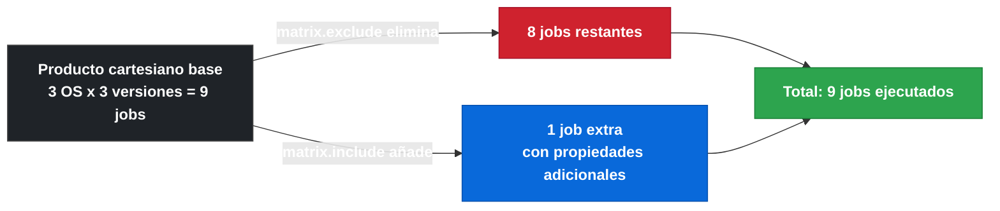

# 1.10 Matrix strategy

[← 1.9.2 Container jobs](gha-d1-container-jobs.md) | [→ 1.11 Contextos de workflow y ambiente](gha-d1-contextos-workflow.md)

---

## El problema que resuelve

Imagina que necesitas ejecutar tu suite de tests en Ubuntu, Windows y macOS, y además con Node.js 18, 20 y 22. Sin matrix strategy tendrías que escribir nueve jobs prácticamente idénticos, cada uno con un nombre diferente y los valores de plataforma y versión hardcodeados. Cualquier cambio en la lógica del job (añadir un paso, cambiar una variable de entorno) requeriría editar los nueve jobs por separado. El mantenimiento se vuelve insostenible en cuanto crece el número de combinaciones.

La **matrix strategy** resuelve exactamente este problema: defines las variables y sus valores posibles una sola vez, y GitHub Actions genera automáticamente todas las combinaciones y las ejecuta en paralelo. El job se escribe una única vez y referencia los valores de la matrix como variables.

---

## `strategy.matrix` con una dimensión

La forma más sencilla de matrix es una única dimensión: una lista de valores para una variable. La sintaxis básica define la clave `matrix` dentro de `strategy`, y dentro de ella cada variable como una lista YAML:

```yaml
jobs:
  test:
    strategy:
      matrix:
        node-version: [18, 20, 22]
    runs-on: ubuntu-latest
    steps:
      - uses: actions/checkout@v4
      - uses: actions/setup-node@v4
        with:
          node-version: ${{ matrix.node-version }}
      - run: npm test
```

Este ejemplo genera tres jobs en paralelo: uno con `node-version: 18`, otro con `node-version: 20` y otro con `node-version: 22`. Cada job es independiente y puede ejecutarse simultáneamente en runners distintos. El nombre que aparece en la UI de GitHub Actions incluye el valor de la variable para identificar cada ejecución, por ejemplo `test (18)`, `test (20)`, `test (22)`.

---

## `strategy.matrix` con múltiples dimensiones: producto cartesiano

Cuando defines más de una variable en la matrix, GitHub Actions calcula el **producto cartesiano** de todos los valores: cada combinación posible de un valor de cada variable genera un job separado.

```yaml
jobs:
  test:
    strategy:
      matrix:
        os: [ubuntu-latest, windows-latest, macos-latest]
        node-version: [18, 20, 22]
    runs-on: ${{ matrix.os }}
    steps:
      - uses: actions/checkout@v4
      - uses: actions/setup-node@v4
        with:
          node-version: ${{ matrix.node-version }}
      - run: npm test
```

Con tres sistemas operativos y tres versiones de Node.js, este ejemplo genera **9 jobs** en paralelo. La tabla siguiente muestra el producto cartesiano completo:

| Job | `matrix.os`      | `matrix.node-version` |
|-----|------------------|-----------------------|
| 1   | ubuntu-latest    | 18                    |
| 2   | ubuntu-latest    | 20                    |
| 3   | ubuntu-latest    | 22                    |
| 4   | windows-latest   | 18                    |
| 5   | windows-latest   | 20                    |
| 6   | windows-latest   | 22                    |
| 7   | macos-latest     | 18                    |
| 8   | macos-latest     | 20                    |
| 9   | macos-latest     | 22                    |

Cada celda de la tabla corresponde a un job independiente con su propio runner. El número total de jobs es el producto de las longitudes de todas las listas: 3 × 3 = 9 en este caso.

---

## Ejemplo central: matrix multi-dimensión completo

El siguiente ejemplo combina todos los conceptos principales en un workflow real que prueba una aplicación Node.js en múltiples sistemas operativos y versiones, con includes, excludes y fail-fast desactivado:

```yaml
name: CI Matrix

on: [push, pull_request]

jobs:
  test:
    strategy:
      fail-fast: false
      max-parallel: 4
      matrix:
        os: [ubuntu-latest, windows-latest, macos-latest]
        node-version: [18, 20, 22]
        include:
          # Añadir una combinación extra que no está en el producto cartesiano
          - os: ubuntu-latest
            node-version: 16
            experimental: true
          # Añadir una propiedad extra a una combinación existente
          - os: windows-latest
            node-version: 20
            coverage: true
        exclude:
          # Excluir una combinación costosa/inestable del producto cartesiano
          - os: macos-latest
            node-version: 18

    runs-on: ${{ matrix.os }}

    steps:
      - uses: actions/checkout@v4

      - name: Setup Node.js ${{ matrix.node-version }}
        uses: actions/setup-node@v4
        with:
          node-version: ${{ matrix.node-version }}
          cache: npm

      - name: Install dependencies
        run: npm ci

      - name: Run tests with coverage
        if: ${{ matrix.coverage == true }}
        run: npm run test:coverage

      - name: Run tests
        if: ${{ matrix.coverage != true }}
        run: npm test

      - name: Mark as experimental
        if: ${{ matrix.experimental == true }}
        run: echo "This combination is experimental"
        continue-on-error: true
```

Este ejemplo produce el siguiente conjunto de jobs: el producto cartesiano base (9 combinaciones) menos la combinación excluida `macos-latest / 18` (8 combinaciones) más las dos combinaciones añadidas por `include` — siendo una de ellas (`ubuntu-latest / 16`) enteramente nueva y la otra (`windows-latest / 20`) una combinación ya existente a la que solo se añade la propiedad `coverage: true`. El total es **9 jobs**.

---

## `strategy.fail-fast`

El parámetro `fail-fast` controla qué ocurre cuando alguna de las combinaciones de la matrix falla. Su **valor por defecto es `true`**: si un job de la matrix falla, GitHub Actions cancela inmediatamente todos los demás jobs de esa matrix que aún estén en ejecución o pendientes. Esto ahorra tiempo de runner cuando un fallo indica que todo el conjunto fallará de todas formas.

```yaml
jobs:
  test:
    strategy:
      fail-fast: false
      matrix:
        os: [ubuntu-latest, windows-latest, macos-latest]
        node-version: [18, 20, 22]
    runs-on: ${{ matrix.os }}
```

Con `fail-fast: false`, todos los jobs de la matrix continúan ejecutándose independientemente de si otros fallan. Esto es útil cuando quieres obtener el resultado completo de todas las combinaciones, por ejemplo para identificar exactamente qué plataformas o versiones tienen problemas. El comportamiento por defecto (`true`) es más eficiente en tiempo de CI cuando un fallo en cualquier combinación hace innecesario el resto; el valor `false` es más informativo cuando necesitas diagnóstico completo.

---

## `strategy.max-parallel`

Por defecto, GitHub Actions ejecuta todos los jobs de una matrix en paralelo (sujeto a la disponibilidad de runners y a los límites de concurrencia del plan). El parámetro `max-parallel` limita cuántos jobs de la matrix pueden ejecutarse simultáneamente:

```yaml
jobs:
  test:
    strategy:
      max-parallel: 2
      matrix:
        os: [ubuntu-latest, windows-latest, macos-latest]
        node-version: [18, 20, 22]
    runs-on: ${{ matrix.os }}
```

En este ejemplo, aunque la matrix genera 9 jobs, solo 2 se ejecutarán a la vez. Los demás esperan en cola hasta que uno de los activos termine. Esto es útil cuando el recurso externo al que acceden los jobs (una base de datos de staging, un servicio de licencias, una API con rate limiting) no puede manejar muchas conexiones simultáneas. También ayuda a controlar el consumo de minutos de runner en planes con límites.

---

## `matrix.include`

El bloque `include` permite dos operaciones distintas sobre el producto cartesiano base:

1. **Añadir una combinación completamente nueva** que no existe en el producto cartesiano. Esto ocurre cuando los valores de la entrada `include` no coinciden con ninguna combinación existente.
2. **Añadir propiedades extra a una combinación existente**. Si los valores de la entrada coinciden exactamente con una combinación del producto cartesiano, esa combinación hereda las propiedades adicionales definidas en el `include`.

```yaml
matrix:
  os: [ubuntu-latest, windows-latest]
  node-version: [18, 20]
  include:
    # Combinación nueva (node-version: 16 no está en la lista base)
    - os: ubuntu-latest
      node-version: 16
    # Propiedad extra para una combinación existente
    - os: windows-latest
      node-version: 20
      extra-flag: "--win-specific"
```

El resultado: cuatro combinaciones del producto cartesiano base, más una combinación nueva (`ubuntu-latest / 16`), más la combinación `windows-latest / 20` enriquecida con la propiedad `extra-flag`. En total cinco jobs.

---

## `matrix.exclude`

El bloque `exclude` elimina combinaciones específicas del producto cartesiano antes de que se generen los jobs. Permite descartar combinaciones que no tienen sentido, que son inestables o que son demasiado costosas:

```yaml
matrix:
  os: [ubuntu-latest, windows-latest, macos-latest]
  node-version: [18, 20, 22]
  exclude:
    - os: macos-latest
      node-version: 18
    - os: windows-latest
      node-version: 22
```

Con estas exclusiones, el producto cartesiano de 9 combinaciones se reduce a 7 jobs. La coincidencia para excluir es exacta: todos los pares clave-valor del objeto `exclude` deben coincidir con la combinación para que esta sea descartada. Si solo se especifica una clave, se descartan todas las combinaciones que tengan ese valor para esa clave.

Una diferencia importante con `include`: las entradas de `exclude` nunca añaden nuevos jobs, solo eliminan. Las entradas de `include` se procesan después de `exclude`, por lo que es posible añadir de vuelta (con `include`) una combinación que fue excluida, aunque esto raramente es intencional.



---

## Acceso a valores de matrix en steps

Dentro de los steps de un job, los valores de la matrix están disponibles a través del **contexto `matrix`**. Se accede a cada variable con la sintaxis `${{ matrix.NOMBRE_VARIABLE }}`:

```yaml
steps:
  - name: Mostrar combinación actual
    run: |
      echo "OS: ${{ matrix.os }}"
      echo "Node version: ${{ matrix.node-version }}"

  - name: Setup Node.js
    uses: actions/setup-node@v4
    with:
      node-version: ${{ matrix.node-version }}

  - name: Condicional basado en matrix
    if: matrix.os == 'windows-latest'
    run: echo "Ejecutando en Windows"
```

El contexto `matrix` también está disponible en la clave `name` del job para personalizar el nombre que aparece en la UI, y en expresiones condicionales (`if:`). Las propiedades añadidas mediante `include` también son accesibles con `${{ matrix.PROPIEDAD }}` en los jobs que las tienen definidas; en los jobs sin esa propiedad la expresión evalúa a cadena vacía.

---

## Límite de 256 combinaciones

GitHub Actions impone un **límite máximo de 256 jobs por matrix en un mismo workflow run**. Si el producto cartesiano (después de aplicar `exclude` y `include`) supera este límite, el workflow falla con un error en tiempo de validación.

Este límite es importante en matrices con muchas dimensiones o listas largas: 3 dimensiones con 7 valores cada una generan 343 combinaciones, superando el límite. Las estrategias para mantenerse dentro del límite incluyen reducir el número de valores en alguna dimensión, dividir la matrix en múltiples jobs con matrices más pequeñas, o utilizar `exclude` para eliminar combinaciones poco prioritarias.

El límite también aplica a las combinaciones añadidas por `include`: el total de jobs resultantes (producto cartesiano base, menos excluidos, más los nuevos de include) no puede superar 256.

---

## Tabla de parámetros de `strategy`

| Parámetro            | Tipo             | Default | Descripción |
|----------------------|------------------|---------|-------------|
| `strategy.matrix`    | map              | —       | Define las variables y sus valores posibles |
| `strategy.fail-fast` | boolean          | `true`  | Cancela jobs restantes si alguno falla |
| `strategy.max-parallel` | integer       | sin límite | Número máximo de jobs simultáneos |
| `matrix.include`     | lista de objetos | —       | Añade combinaciones nuevas o propiedades a existentes |
| `matrix.exclude`     | lista de objetos | —       | Elimina combinaciones del producto cartesiano |

---

## Buenas y malas prácticas

**Buena practica: desactivar `fail-fast` para diagnóstico completo**
Cuando estás investigando fallos en distintas plataformas o versiones, usa `fail-fast: false` para obtener resultados de todas las combinaciones. Con el valor por defecto (`true`), un fallo temprano cancela el resto y puede ocultarte que otras combinaciones también fallan o que el fallo es específico de una sola.

**Mala practica: dejar `fail-fast: true` en workflows de diagnóstico**
Si usas `fail-fast: true` (o lo omites) cuando necesitas saber qué combinaciones fallan, corres el riesgo de que un fallo en el primer job cancele todos los demás y no obtengas información sobre el resto. Perderás tiempo de CI en re-ejecuciones manuales para descubrir fallos adicionales.

---

**Buena practica: usar `exclude` para eliminar combinaciones sin sentido**
Si ciertas combinaciones de variables no tienen sentido (por ejemplo, una feature que no está disponible en una plataforma concreta) o son conocidamente inestables, exclúyelas explícitamente con `exclude` en lugar de ignorar sus fallos. Esto mantiene el número de jobs manejable y el resultado del workflow limpio.

**Mala practica: ignorar fallos esperados con `continue-on-error: true` en toda la matrix**
Usar `continue-on-error: true` a nivel de job para ignorar fallos de combinaciones inestables oculta problemas reales. Es mejor usar `exclude` para eliminar las combinaciones problemáticas, o usar `include` con `experimental: true` y aplicar `continue-on-error` solo condicionalmente con `if: matrix.experimental`.

---

**Buena practica: mantener el número de combinaciones bajo control**
Diseña la matrix con el mínimo de dimensiones y valores necesarios. Combinar cuatro dimensiones con cinco valores cada una genera 625 combinaciones, superando el límite de 256 y aumentando enormemente el consumo de minutos de runner. Usa `max-parallel` si necesitas limitar el impacto en recursos compartidos.

**Mala practica: añadir dimensiones innecesarias a la matrix**
Incluir variables en la matrix que no afectan a la lógica del job (por ejemplo, una variable de entorno que podría configurarse de otra forma) infla innecesariamente el número de jobs. Cada combinación adicional consume tiempo de runner y puede acercar al límite de 256.

---

## Verificacion

**Pregunta 1 (GH-200):** Tienes una matrix con `os: [ubuntu, windows, macos]` y `version: [1, 2, 3, 4]`. Quieres excluir `windows / 4` y añadir la propiedad `legacy: true` a la combinacion `ubuntu / 1`. ¿Cuantos jobs genera el workflow final?

<details>
<summary>Respuesta</summary>

El producto cartesiano base es 3 × 4 = 12. Tras excluir `windows / 4` quedan 11. La entrada de `include` para `ubuntu / 1` no añade un job nuevo (esa combinacion ya existe), solo añade la propiedad `legacy: true`. Total: **11 jobs**.

</details>

---

**Pregunta 2 (GH-200):** Con `fail-fast` en su valor por defecto, el job `test (windows-latest, 20)` falla a los 2 minutos. Los jobs `test (ubuntu-latest, 22)` y `test (macos-latest, 18)` llevan 5 minutos ejecutandose. ¿Que ocurre con esos dos jobs?

<details>
<summary>Respuesta</summary>

Con `fail-fast: true` (valor por defecto), GitHub Actions **cancela** todos los jobs de la matrix que aun esten en ejecucion o pendientes cuando alguno falla. Los jobs `test (ubuntu-latest, 22)` y `test (macos-latest, 18)` son cancelados inmediatamente aunque llevaban 5 minutos ejecutandose.

</details>

---

**Ejercicio practico:** Escribe una matrix strategy para un proyecto Python que debe probarse con Python 3.10, 3.11 y 3.12 en Ubuntu y Windows. Excluye la combinacion `Windows / 3.10` por ser inestable. Añade la combinacion `ubuntu-latest / 3.9` como experimental (con `continue-on-error: true` condicional). Limita el paralelismo a 3 jobs simultaneos y no canceles el resto si alguno falla.

<details>
<summary>Solucion</summary>

```yaml
jobs:
  test:
    strategy:
      fail-fast: false
      max-parallel: 3
      matrix:
        os: [ubuntu-latest, windows-latest]
        python-version: ["3.10", "3.11", "3.12"]
        include:
          - os: ubuntu-latest
            python-version: "3.9"
            experimental: true
        exclude:
          - os: windows-latest
            python-version: "3.10"
    runs-on: ${{ matrix.os }}
    continue-on-error: ${{ matrix.experimental == true }}
    steps:
      - uses: actions/checkout@v4
      - uses: actions/setup-python@v5
        with:
          python-version: ${{ matrix.python-version }}
      - run: pip install -r requirements.txt
      - run: pytest
```

Jobs generados: producto cartesiano base 2 × 3 = 6, menos 1 excluido = 5, mas 1 nuevo de include = **6 jobs** en total.

</details>

---

[← 1.9.2 Container jobs](gha-d1-container-jobs.md) | [→ 1.11 Contextos de workflow y ambiente](gha-d1-contextos-workflow.md)

