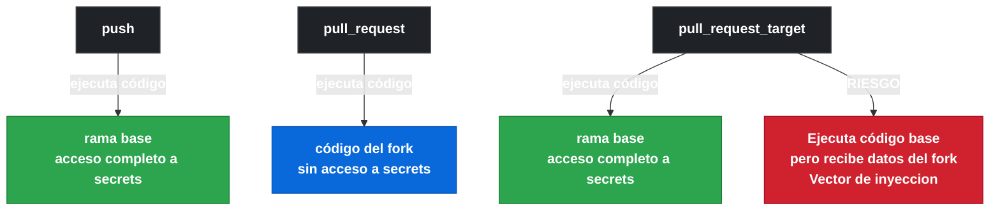
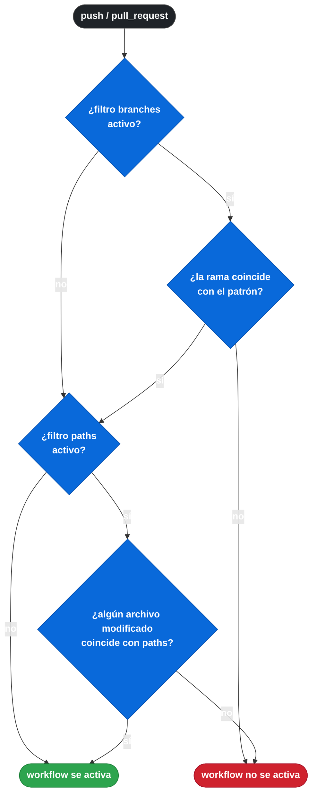

[anterior: 1.1 Estructura raíz](gha-d1-estructura-workflow.md) | [siguiente: 1.3 Triggers de automatización](gha-d1-triggers-automatizacion.md)

# 1.2 Triggers de código y filtros: push, pull_request, pull_request_target

GitHub Actions distingue entre eventos de código fuente y otros tipos de eventos porque el código fuente es el artefacto central del desarrollo de software. Cuando un desarrollador hace un push o abre un pull request, normalmente espera que ocurra algo: tests, linting, despliegues. Los triggers de código existen para capturar exactamente esos momentos y activar workflows de forma precisa. A diferencia de eventos de UI como `issues` o `discussion`, los triggers de código están íntimamente ligados al estado del repositorio y ofrecen filtros que permiten responder solo a los cambios relevantes, evitando ejecuciones innecesarias.

---

## El evento `push`

El evento `push` se dispara cuando alguien sube commits a cualquier rama o tag del repositorio, incluidos commits directos y merges. Sin filtros, cualquier push a cualquier rama activa el workflow, lo que puede ser excesivo en repositorios con muchas ramas de trabajo. Los filtros `branches`, `branches-ignore`, `paths`, `paths-ignore`, `tags` y `tags-ignore` permiten acotar exactamente qué pushes importan. Un push a una rama que no coincida con ningún filtro activo simplemente no activa el workflow, sin errores ni notificaciones.

```yaml
on:
  push:
    branches:
      - main
      - 'release/**'
    paths:
      - 'src/**'
      - 'package.json'
    tags:
      - 'v[0-9]+.[0-9]+.[0-9]+'
```

---

## El evento `pull_request`

El evento `pull_request` se activa cuando ocurre alguna acción sobre un pull request: apertura, sincronización (nuevos commits), reapertura, cierre, adición de etiquetas, entre otras. Por defecto, sin especificar `types`, GitHub activa el workflow para los tipos `opened`, `synchronize` y `reopened`. Esto cubre el ciclo habitual de CI: la primera vez que se abre un PR, cada vez que se añaden commits, y si se reabre tras cerrarse. Los tipos disponibles incluyen `closed`, `labeled`, `unlabeled`, `assigned`, `unassigned`, `review_requested`, `review_request_removed`, `ready_for_review` y `converted_to_draft`, lo que permite workflows altamente específicos.

```yaml
on:
  pull_request:
    types:
      - opened
      - synchronize
      - reopened
      - labeled
    branches:
      - main
      - 'release/**'
    paths:
      - 'src/**'
```

Una propiedad clave de `pull_request` es su contexto de seguridad: el workflow se ejecuta en el contexto del fork o de la rama del PR, con acceso limitado a secrets y sin permisos de escritura al repositorio base por defecto. Esto lo hace seguro para contribuciones externas, pero limita lo que puede hacer.

---

## El evento `pull_request_target`

El evento `pull_request_target` fue introducido para resolver un problema concreto: a veces los workflows de PR necesitan acceso a secrets o permisos de escritura al repositorio base, por ejemplo para publicar comentarios con resultados de tests o etiquetar PRs automáticamente. A diferencia de `pull_request`, este evento se ejecuta en el contexto de la rama destino (normalmente `main`), no en la del PR. Esto significa que tiene acceso completo a los secrets del repositorio y permisos de escritura.

La diferencia fundamental entre `pull_request` y `pull_request_target` es el contexto de ejecución: `pull_request` ejecuta el código del PR con acceso restringido, mientras que `pull_request_target` ejecuta el código de la rama base con acceso completo. Usar `pull_request_target` para hacer checkout del código del PR y ejecutarlo es un riesgo de seguridad grave conocido como script injection. Si se necesita ejecutar código del PR dentro de `pull_request_target`, es imprescindible separar las responsabilidades en dos workflows: uno que genere artefactos y otro que los consuma con permisos elevados. Este vector de ataque se cubre en detalle en [D5: Script injection y vectores de ataque](gha-script-injection-vectores.md).

```yaml
on:
  pull_request_target:
    types:
      - opened
      - labeled
```

---

## Tabla comparativa: push vs pull_request vs pull_request_target

Los tres eventos de código cubren escenarios distintos y es importante elegir el correcto según el propósito del workflow.

| Característica | `push` | `pull_request` | `pull_request_target` |
|---|---|---|---|
| Contexto de ejecución | Rama pusheada | Rama del PR (merge commit) | Rama base (destino) |
| Acceso a secrets | Completo (rama propia) | Restringido (forks) | Completo |
| Permisos de escritura | Sí (rama propia) | No por defecto | Sí |
| Código ejecutado | Código del push | Código del PR | Código de la rama base |
| Caso de uso típico | CI en ramas propias, CD | Tests en PRs de forks | Etiquetar, comentar en PRs |
| Riesgo con forks | Bajo | Bajo | Alto si se hace checkout del PR |
| Filtros disponibles | branches, paths, tags | branches, paths, types | branches, paths, types |



---

## Filtro `branches` vs `branches-ignore`

Los filtros `branches` y `branches-ignore` son mutuamente excluyentes: no pueden usarse juntos en el mismo evento. `branches` es una lista de patrones de rama que deben coincidir para que el evento active el workflow, es decir, actúa como lista de inclusión. `branches-ignore` actúa como lista de exclusión: el workflow se activa para todas las ramas excepto las que coincidan con los patrones. La elección entre uno y otro depende de cuántas ramas quieras incluir versus excluir. Si tienes diez ramas y quieres que nueve activen el workflow, es más práctico excluir la única que no debe activarlo con `branches-ignore`. Si quieres que solo dos ramas activen el workflow, usa `branches` con esas dos.

Los patrones aceptan glob syntax: `**` coincide con cualquier secuencia de caracteres incluyendo `/`, `*` coincide con cualquier secuencia sin `/`, `?` coincide con un único carácter, y `[abc]` coincide con cualquiera de los caracteres dentro de los corchetes. Por ejemplo, `'feature/**'` captura `feature/login`, `feature/auth/oauth` y cualquier subdirectorio. Un detalle del examen: si el nombre de la rama contiene un `/`, el patrón `'feature/*'` no lo capturará (porque `*` no cruza `/`), pero `'feature/**'` sí. Esta distinción es frecuente en preguntas de certificación.

```yaml
# Incluir solo estas ramas
on:
  push:
    branches:
      - main
      - 'release/**'
      - 'hotfix/**'

# Excluir estas ramas (todas las demás activan el workflow)
on:
  push:
    branches-ignore:
      - 'dependabot/**'
      - 'renovate/**'
```

---

## Filtro `paths` vs `paths-ignore`

Los filtros `paths` y `paths-ignore` también son mutuamente excluyentes y funcionan de forma análoga a sus equivalentes de ramas. `paths` limita el workflow a pushes o PRs que toquen al menos uno de los archivos o directorios especificados. `paths-ignore` activa el workflow en todos los casos excepto cuando los únicos archivos modificados coinciden con los patrones ignorados. Un caso de uso habitual de `paths` es separar el CI de backend y frontend: el workflow de backend solo se activa si se modifican archivos en `backend/**`, y el de frontend solo si se tocan archivos en `frontend/**`. Un caso habitual de `paths-ignore` es excluir cambios en documentación para no lanzar tests innecesarios.

```yaml
# Solo activa si se tocan archivos relevantes
on:
  push:
    paths:
      - 'src/**'
      - 'tests/**'
      - 'package.json'
      - 'package-lock.json'

# Activa en todos los casos excepto cambios solo en docs
on:
  push:
    paths-ignore:
      - 'docs/**'
      - '*.md'
      - '.github/ISSUE_TEMPLATE/**'
```

Es importante entender la semántica exacta: con `paths`, si un push modifica `src/index.js` Y `docs/readme.md`, el workflow se activa porque al menos un archivo coincide. Con `paths-ignore`, si un push modifica solo `docs/readme.md`, el workflow no se activa; pero si modifica `docs/readme.md` y `src/index.js`, sí se activa porque no todos los archivos están ignorados.

---

## Filtro `tags` vs `tags-ignore`

Los filtros `tags` y `tags-ignore` aplican únicamente al evento `push` (los eventos de PR no usan tags). Son también mutuamente excluyentes. `tags` activa el workflow solo cuando se hace push de un tag que coincida con el patrón, lo que es ideal para workflows de release: publicar paquetes, generar changelogs, crear releases en GitHub. `tags-ignore` activa el workflow en todos los pushes de tags excepto los que coincidan con los patrones ignorados, aunque su uso es menos frecuente.

Una consideración importante sobre cómo interactúan `branches` y `tags`: si se especifican ambos en un mismo evento `push`, el workflow se activa si el push es a una rama que coincida O a un tag que coincida (es un OR, no un AND). Esto significa que si quieres un workflow que solo se active en tags y nunca en ramas, debes omitir el filtro `branches` por completo y usar exclusivamente `tags`. Los patrones de tags aceptan los mismos wildcards que los filtros de ramas: `*`, `**`, `?` y rangos con `[...]`. El patrón `v[0-9]+.[0-9]+.[0-9]+` es el estándar para semver, pero también es válido usar `v*` para cualquier tag que empiece por `v`.

```yaml
# Workflow de release activado por tags semánticos
on:
  push:
    tags:
      - 'v[0-9]+.[0-9]+.[0-9]+'
      - 'v[0-9]+.[0-9]+.[0-9]+-rc.[0-9]+'

# Ignorar tags de pre-release
on:
  push:
    tags-ignore:
      - '*-alpha*'
      - '*-beta*'
```

---

## Activity types en eventos: cuándo son necesarios

Los activity types permiten especificar qué acciones concretas dentro de un evento deben activar el workflow. No todos los eventos los soportan: `push` no tiene tipos de actividad, pero `pull_request`, `pull_request_target`, `issues`, `discussion` y otros sí. Cuando no se especifican `types` en `pull_request`, GitHub usa el conjunto por defecto `[opened, synchronize, reopened]`. Si se necesita reaccionar a un evento diferente, como cuando se convierte un PR a draft o cuando se asigna un revisor, es imprescindible declarar `types` explícitamente.

Declarar `types` también tiene implicaciones de rendimiento y coste: un workflow que reacciona a `labeled` se ejecuta cada vez que alguien añade una etiqueta a un PR, lo que puede ser muy frecuente en proyectos con triaje activo. Si el workflow tiene un propósito específico, limitar los `types` evita ejecuciones costosas innecesarias. Cuando se usan múltiples tipos, el workflow se activa si cualquiera de los tipos listados ocurre. No es posible hacer AND entre tipos (por ejemplo, no existe una sintaxis para "solo cuando se abre Y se etiqueta simultáneamente"); para lógica más compleja, es necesario usar condiciones `if` dentro del workflow. Omitir `types` significa usar los valores por defecto del evento, que varían según el evento; es mejor declararlos explícitamente en workflows de producción para evitar sorpresas cuando GitHub añade nuevos tipos de actividad en el futuro.

```yaml
on:
  pull_request:
    types:
      - ready_for_review    # PR sale de draft
      - review_requested    # Se solicita una revisión
  pull_request_target:
    types:
      - labeled             # Se añade una etiqueta al PR
```

---

## Tabla de referencia: filtros, tipos y valores por defecto

La siguiente tabla resume los filtros disponibles por evento y sus valores por defecto cuando no se especifican.

| Elemento | `push` | `pull_request` | `pull_request_target` | Valores por defecto |
|---|---|---|---|---|
| `branches` | Si | Si | Si | todas las ramas |
| `branches-ignore` | Si | Si | Si | ninguna |
| `paths` | Si | Si | No | todos los archivos |
| `paths-ignore` | Si | Si | No | ninguno |
| `tags` | Si | No | No | ningún tag |
| `tags-ignore` | Si | No | No | ninguno |
| `types` | No | Si | Si | opened, synchronize, reopened |

Cuando `branches` y `paths` se combinan en el mismo evento `push` o `pull_request`, ambos filtros se evalúan en serie con lógica AND: el workflow solo se activa si la rama coincide Y algún archivo modificado coincide.



---

## Ejemplo central: workflow con los tres triggers

El siguiente ejemplo muestra un repositorio monorepo donde conviven CI de backend, CI para PRs de forks y un workflow de release por tags, todo en un único archivo.

```yaml
name: CI Pipeline

on:
  # CI en ramas de desarrollo propias
  push:
    branches:
      - main
      - 'develop'
      - 'feature/**'
      - 'hotfix/**'
    paths:
      - 'src/**'
      - 'tests/**'
      - 'package.json'
    tags:
      - 'v[0-9]+.[0-9]+.[0-9]+'

  # Tests en PRs (incluidos forks), contexto restringido
  pull_request:
    types:
      - opened
      - synchronize
      - reopened
      - ready_for_review
    branches:
      - main
      - 'release/**'
    paths:
      - 'src/**'
      - 'tests/**'

  # Etiquetar PRs automáticamente, necesita permisos de escritura
  pull_request_target:
    types:
      - opened
      - labeled

jobs:
  test:
    # No ejecutar en PRs en estado draft
    if: github.event.pull_request.draft == false || github.event_name == 'push'
    runs-on: ubuntu-latest
    steps:
      - uses: actions/checkout@v4
      - name: Run tests
        run: npm test

  release:
    # Solo en push de tags
    if: github.event_name == 'push' && startsWith(github.ref, 'refs/tags/')
    runs-on: ubuntu-latest
    needs: test
    steps:
      - uses: actions/checkout@v4
      - name: Publish release
        run: npm publish

  label-pr:
    # Solo en pull_request_target, no hace checkout del código del PR
    if: github.event_name == 'pull_request_target'
    runs-on: ubuntu-latest
    permissions:
      pull-requests: write
    steps:
      - name: Add label
        uses: actions/github-script@v7
        with:
          script: |
            github.rest.issues.addLabels({
              owner: context.repo.owner,
              repo: context.repo.repo,
              issue_number: context.payload.pull_request.number,
              labels: ['needs-review']
            })
```

---

## Buenas y malas prácticas

Las siguientes prácticas están basadas en patrones reales observados en proyectos de producción y en la documentación oficial de GitHub Actions.

**Usar `paths` para reducir ejecuciones innecesarias (buena practica):** En monorepos o repositorios con documentación, añadir filtros de rutas evita ejecutar tests de backend cuando solo se modifican archivos Markdown. Esto reduce el consumo de minutos de Actions y acelera el feedback.

**No usar `paths` en workflows de seguridad (mala practica):** Los workflows que comprueban dependencias vulnerables o realizan análisis de seguridad nunca deben filtrarse por `paths`. Un cambio en `package.json` que actualiza una dependencia vulnerable podría estar en una ruta ignorada. Los workflows de seguridad deben activarse en todos los pushes relevantes.

**Declarar `types` explícitamente en `pull_request` (buena practica):** Depender del comportamiento por defecto es frágil. Si GitHub añade un nuevo tipo de actividad en el futuro y el workflow no declara `types`, podría activarse en situaciones inesperadas. Declarar los tipos hace el workflow predecible y autodocumentado.

**Usar `pull_request_target` con checkout del PR (mala practica):** Combinar `pull_request_target` con `actions/checkout@v4` apuntando al código del PR (`ref: ${{ github.event.pull_request.head.sha }}`) permite a un contribuidor malicioso modificar el workflow en su fork y ejecutar código arbitrario con acceso a los secrets del repositorio base. Solo debe usarse `pull_request_target` para operaciones que no requieran el código del PR.

**Usar `branches-ignore` para ramas de bots (buena practica):** Las ramas creadas por Dependabot o Renovate generan mucho ruido si activan todos los workflows. Añadir `branches-ignore: ['dependabot/**', 'renovate/**']` en workflows de CI principal y crear workflows específicos para esas ramas con los checks necesarios mejora la eficiencia y el control.

**Combinar `branches` y `paths` en el mismo evento (consideración):** Cuando se combinan `branches` y `paths`, ambos filtros deben cumplirse simultáneamente (es un AND lógico). Un push a `main` que no toca ningún archivo en `paths` no activa el workflow. Esto puede generar confusión cuando se espera que un push a `main` siempre ejecute CI. Si se necesita que ciertos pushes a `main` siempre activen el workflow independientemente de los archivos tocados, `paths` no es el filtro adecuado.

**No mezclar `push` y `pull_request` en el mismo workflow sin condiciones (mala practica):** Cuando un workflow tiene ambos eventos, el mismo job se ejecuta dos veces cuando se hace push a la rama base de un PR abierto: una vez por el evento `push` y otra vez por el evento `pull_request` (synchronize). Esto duplica el consumo de minutos sin aportar valor. La solución es usar condiciones `if` para separar la lógica según `github.event_name`, o dividir en workflows distintos con propósitos claros.

**Usar filtros de paths en CI de infraestructura (buena practica):** En repositorios que combinan código de aplicación e infraestructura como código (Terraform, Helm charts), usar `paths` para activar el pipeline de infraestructura solo cuando cambian archivos en `infra/**` o `helm/**` evita despliegues accidentales cuando solo se modifica el código de la aplicación. Esta separación reduce el riesgo operativo y hace más predecible el proceso de despliegue.

---

## Contexto de ejecucion y permisos por defecto

El contexto de ejecución determina qué código se ejecuta y qué acceso tiene el workflow al repositorio y sus secrets. Es un aspecto crítico para la seguridad que el examen GH-200 testa con frecuencia. Para `push` en ramas propias del repositorio, el runner recibe el `GITHUB_TOKEN` con permisos de lectura y escritura por defecto (aunque esto se puede restringir en la configuración del repositorio o de la organización). Para `pull_request` desde un fork, el `GITHUB_TOKEN` tiene permisos de solo lectura y los secrets del repositorio no están disponibles, lo que es una medida de seguridad intencional.

Este modelo de permisos tiene consecuencias prácticas: un workflow de CI para PRs de forks que intente publicar comentarios con los resultados de los tests fallará porque no tiene permisos de escritura. La solución correcta en este caso es un patrón de dos workflows: el primero usa `pull_request` para ejecutar los tests y subir los resultados como artefacto, y el segundo usa `workflow_run` (que se cubre en el siguiente subtema) o `pull_request_target` para leer el artefacto y publicar el comentario con permisos de escritura, sin ejecutar el código del PR.

---

## Verificacion: preguntas estilo GH-200

Las siguientes preguntas replican el estilo y dificultad del examen de certificacion GitHub Actions.

**Pregunta 1:** Un workflow tiene el evento `pull_request` sin especificar `types`. Un contribuidor abre un PR, añade tres commits y lo convierte a draft. ¿Cuántas veces se ejecuta el workflow?

A) 1 (solo al abrir)
B) 4 (abrir + 3 commits)
C) 5 (abrir + 3 commits + convertir a draft)
D) 4 (abrir + 3 commits, convertir a draft no está en los tipos por defecto)

Respuesta correcta: D. Los tipos por defecto son `opened`, `synchronize`, `reopened`. `converted_to_draft` no está incluido, por lo que la conversión a draft no activa el workflow. Se activa 1 vez al abrir (opened) y 3 veces al sincronizar (synchronize) = 4 ejecuciones.

**Pregunta 2:** Un repositorio tiene un workflow con `pull_request_target`. Un contribuidor externo abre un PR desde su fork y modifica el archivo `.github/workflows/ci.yml` en su rama. ¿Qué código del workflow se ejecuta?

A) El código del workflow modificado en el fork del contribuidor
B) El código del workflow en la rama base del repositorio original
C) GitHub bloquea la ejecución por ser un fork
D) Se ejecuta el workflow del fork solo si tiene los permisos necesarios

Respuesta correcta: B. `pull_request_target` siempre ejecuta el código de la rama base del repositorio destino, no el código del PR. Por eso es importante no hacer checkout del código del PR en este contexto.

**Pregunta 3:** Un desarrollador quiere que el workflow de CI no se active cuando solo se modifican archivos en `docs/**` o archivos `.md` en la raíz. ¿Cuál es la configuración correcta?

A) `paths: ['!docs/**', '!*.md']`
B) `paths-ignore: ['docs/**', '*.md']`
C) `branches-ignore: ['docs/**']`
D) `paths: ['src/**']` y confiar en que los cambios de docs no tocan src

Respuesta correcta: B. `paths-ignore` excluye los paths especificados. La opción A es incorrecta porque `paths` no acepta negaciones con `!`. La opción D es frágil porque un commit podría tocar tanto `docs/` como `src/`.

---

## Ejercicio YAML

Configura los triggers para un repositorio con las siguientes reglas de negocio:

1. El CI de tests debe activarse en push a `main`, `develop` y cualquier rama `feature/**`, pero solo si se modificaron archivos en `src/` o `tests/`.
2. Los PRs hacia `main` deben activar el CI cuando se abren, actualizan o reabren, pero no cuando se cierran.
3. Un workflow de release debe activarse solo cuando se hace push de un tag con formato `v1.2.3`.
4. Las ramas de Dependabot no deben activar el CI de tests principal.

```yaml
# Solución

on:
  push:
    branches:
      - main
      - develop
      - 'feature/**'
    branches-ignore:
      # ERROR: branches y branches-ignore son mutuamente excluyentes
      # La solución correcta es no usar branches-ignore aquí
      # y manejar Dependabot con una condición if en el job
    paths:
      - 'src/**'
      - 'tests/**'
    tags:
      - 'v[0-9]+.[0-9]+.[0-9]+'
  pull_request:
    types:
      - opened
      - synchronize
      - reopened
    branches:
      - main
```

La restricción 4 no puede resolverse con `branches-ignore` si ya se usa `branches`. La solución correcta es añadir una condición `if` en el job:

```yaml
jobs:
  test:
    if: "!startsWith(github.head_ref, 'dependabot/')"
    runs-on: ubuntu-latest
    steps:
      - uses: actions/checkout@v4
      - run: npm test
```

O bien, crear un workflow separado para Dependabot con los checks que correspondan, manteniendo el workflow principal limpio y sin lógica de exclusión.

**Pregunta 4 (nivel avanzado):** Un repositorio tiene el siguiente workflow. Se abre un PR desde la rama `feature/login` hacia `main` tocando solo `docs/setup.md`. Luego se añade un commit que modifica `src/auth.js`. ¿Cuántas veces se ejecuta el workflow?

```yaml
on:
  pull_request:
    types:
      - opened
      - synchronize
    branches:
      - main
    paths:
      - 'src/**'
```

A) 2 (opened + synchronize)
B) 1 (solo synchronize, porque opened no toca src/)
C) 0 (ninguna, porque el PR toca docs/ primero)
D) 1 (synchronize, porque es el único evento que toca src/)

Respuesta correcta: B. El evento `opened` se evalúa contra los archivos del PR en ese momento: solo `docs/setup.md`, que no coincide con `src/**`. El workflow no se activa. Cuando llega el commit que modifica `src/auth.js`, el evento `synchronize` se evalúa y ahora sí hay archivos que coinciden con `src/**`, por lo que el workflow se activa una vez.

---

**Pregunta adicional (ejercicio de diagnóstico):** El siguiente workflow nunca se activa aunque se hace push de tags. ¿Cuál es el problema?

```yaml
on:
  push:
    branches:
      - main
    tags:
      - 'v*'
    paths:
      - 'src/**'
```

El problema es la combinación de `branches`, `tags` y `paths`. Cuando se hace push de un tag, GitHub comprueba si el push cumple los filtros de `branches` O `tags`, pero también aplica el filtro de `paths`. Si el commit del tag no modifica ningún archivo en `src/**`, el workflow no se activa aunque el tag coincida con `v*`. La solución es separar los eventos: un evento `push` con `branches` y `paths` para CI, y un segundo evento `push` con solo `tags` para release (sin filtro de paths).

```yaml
# Solución correcta: separar CI de release
on:
  push:
    branches:
      - main
    paths:
      - 'src/**'

---

on:
  push:
    tags:
      - 'v*'
```

En la práctica, esto se implementa en dos archivos de workflow separados, no con `---` en el mismo archivo. Cada archivo tiene su sección `on:` independiente y sus propios jobs.

---

## Referencia rapida: patrones glob mas usados en filtros

Los filtros de ramas, paths y tags usan la sintaxis glob de `fnmatch`. La siguiente tabla resume los patrones más frecuentes en proyectos reales y en el examen GH-200.

| Patron | Coincide con | No coincide con |
|---|---|---|
| `main` | `main` exactamente | `main-v2`, `maintenance` |
| `release/*` | `release/1.0`, `release/hotfix` | `release/1.0/patch` |
| `release/**` | `release/1.0`, `release/1.0/patch` | `main`, `develop` |
| `v[0-9]+` | `v1`, `v99` | `v1.0`, `va` |
| `v*` | `v1.0.0`, `v2-rc1` | `1.0.0` (sin prefijo v) |
| `*.js` | `index.js`, `app.js` | `src/index.js` (incluye ruta) |
| `**/*.js` | `src/index.js`, `a/b/c.js` | `index.ts` |
| `src/**` | `src/a.js`, `src/a/b/c.py` | `tests/a.js` |
| `!src/**` | No valido en `paths`, solo en `.gitignore` | — |

Una nota sobre `!` en filtros de GitHub Actions: a diferencia de `.gitignore`, los filtros `paths` y `branches` no aceptan patrones de negación con `!`. Si se necesita excluir dentro de una lista de inclusión, la única opción es usar `paths-ignore` en lugar de `paths`, o gestionar la lógica con condiciones `if` dentro del workflow. Esta es una confusión común que aparece en el examen.

---

## Resumen de conceptos clave

Los tres eventos de código (`push`, `pull_request`, `pull_request_target`) son los triggers más usados en GitHub Actions y tienen diferencias fundamentales en contexto de seguridad y permisos. `push` es el más simple y poderoso: activa workflows directamente en el código subido. `pull_request` es el estándar para CI en proyectos con contribuciones externas gracias a su modelo de permisos restringido. `pull_request_target` resuelve el problema de operaciones que necesitan permisos de escritura sobre PRs, pero introduce riesgos de seguridad que requieren conocimiento explícito para mitigar.

Los filtros `branches`, `paths` y `tags` (y sus variantes `*-ignore`) permiten activar workflows con precisión quirúrgica, reduciendo consumo de recursos y aumentando la claridad de intención. La regla general es: cuando el conjunto de casos a incluir es pequeño, usa el filtro de inclusión; cuando el conjunto a excluir es pequeño, usa el filtro de exclusión. Nunca mezcles un filtro con su variante `*-ignore` en el mismo evento. Los activity types en `pull_request` y `pull_request_target` son una capa adicional de control que conviene declarar siempre explícitamente en entornos de producción.

---

[anterior: 1.1 Estructura raíz](gha-d1-estructura-workflow.md) | [siguiente: 1.3 Triggers de automatización](gha-d1-triggers-automatizacion.md)
