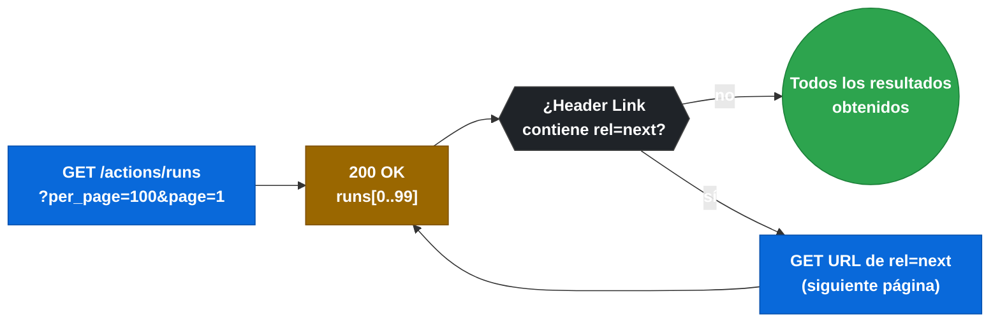
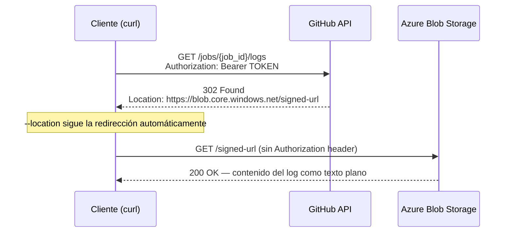

> **Navegación:** [← 2.10 Deshabilitar y eliminar workflows](gha-d2-deshabilitar-workflows.md) | [2.12 Testing / Verificación de D2 →](gha-d2-testing.md)

# 2.11 API REST de GitHub Actions para ejecuciones y logs

La interfaz web de GitHub es suficiente para el trabajo diario, pero en cuanto necesitas auditar cientos de ejecuciones, integrar resultados de CI en herramientas externas, descargar logs de forma masiva o disparar workflows desde un pipeline de CD, la interfaz gráfica se convierte en un cuello de botella. La API REST de GitHub Actions resuelve exactamente eso: expone todas las operaciones de gestión de workflows como endpoints HTTP estándar, lo que permite automatizar cualquier flujo de trabajo con un simple script o desde cualquier herramienta que entienda HTTP.

Conocer esta API es un requisito práctico para la certificación GH-200 porque una parte de los escenarios de examen presentan situaciones donde la solución correcta implica llamar a un endpoint concreto, usar el token adecuado o aplicar los filtros correctos en el listado.

## Autenticación en la API de Actions

Antes de hacer cualquier llamada a la API necesitas un token válido. Existen dos opciones principales y elegir la incorrecta es el error más común.

**Personal Access Token (PAT):** es un token generado desde la configuración de tu cuenta de GitHub. Para acceder a endpoints de Actions necesitas el scope `repo` (repositorios privados) o solo `public_repo` (repositorios públicos). Los PAT clásicos tienen acceso amplio, por lo que GitHub recomienda usar **Fine-grained PATs** donde puedes limitar el acceso a repositorios concretos y solo a los permisos `actions: read` o `actions: write` según la operación.

**GITHUB_TOKEN:** es el token que GitHub inyecta automáticamente en cada ejecución de workflow. Su alcance está limitado al repositorio actual y sus permisos se configuran en el workflow con la clave `permissions`. Es la opción segura cuando llamas a la API desde dentro de un workflow. No funciona fuera del contexto de una ejecución.

La autenticación en todas las llamadas se pasa mediante el encabezado HTTP:

```
Authorization: Bearer <TOKEN>
```

También es obligatorio incluir el encabezado `Accept` con el tipo de media correcto para que GitHub devuelva JSON:

```
Accept: application/vnd.github+json
```

## Tabla de endpoints clave

La siguiente tabla resume los endpoints más relevantes para el examen. Todos usan como base `https://api.github.com`.

| Operación | Método | Ruta | Permiso mínimo |
|-----------|--------|------|----------------|
| Listar workflow runs | GET | `/repos/{owner}/{repo}/actions/runs` | `actions: read` |
| Obtener un workflow run | GET | `/repos/{owner}/{repo}/actions/runs/{run_id}` | `actions: read` |
| Cancelar un run | POST | `/repos/{owner}/{repo}/actions/runs/{run_id}/cancel` | `actions: write` |
| Re-ejecutar un run | POST | `/repos/{owner}/{repo}/actions/runs/{run_id}/rerun` | `actions: write` |
| Eliminar un run | DELETE | `/repos/{owner}/{repo}/actions/runs/{run_id}` | `actions: write` |
| Listar jobs de un run | GET | `/repos/{owner}/{repo}/actions/runs/{run_id}/jobs` | `actions: read` |
| Descargar logs de un job | GET | `/repos/{owner}/{repo}/actions/jobs/{job_id}/logs` | `actions: read` |
| Descargar logs del run | GET | `/repos/{owner}/{repo}/actions/runs/{run_id}/logs` | `actions: read` |
| Eliminar logs del run | DELETE | `/repos/{owner}/{repo}/actions/runs/{run_id}/logs` | `actions: write` |
| Listar workflows del repo | GET | `/repos/{owner}/{repo}/actions/workflows` | `actions: read` |
| Disparar workflow_dispatch | POST | `/repos/{owner}/{repo}/actions/workflows/{workflow_id}/dispatches` | `actions: write` |

## Listar workflow runs con filtros

El endpoint de listado `GET /repos/{owner}/{repo}/actions/runs` acepta varios parámetros de query string que permiten reducir los resultados antes de procesarlos. Usarlos correctamente ahorra tanto tiempo de red como cuota de API.

Los filtros más importantes para el examen son:

- `status`: filtra por estado de la ejecución. Valores válidos: `queued`, `in_progress`, `completed`, `action_required`, `cancelled`, `failure`, `neutral`, `skipped`, `stale`, `success`, `timed_out`, `waiting`.
- `branch`: limita los resultados a ejecuciones disparadas desde una rama concreta.
- `event`: filtra por tipo de evento que disparó el workflow (`push`, `pull_request`, `schedule`, `workflow_dispatch`, etc.).
- `actor`: filtra por el usuario que disparó la ejecución.
- `created`: filtra por fecha de creación usando el formato ISO 8601 con operadores `>`, `<`, `>=`, `<=`.
- `per_page`: número de resultados por página (máximo 100, por defecto 30).
- `page`: número de página para la paginación.

## Paginación en la API de Actions

La API de GitHub pagina automáticamente las respuestas cuando hay más elementos de los que caben en una página. El número de resultados por defecto es 30 y el máximo por página es 100. Cuando hay más páginas disponibles, GitHub incluye un encabezado `Link` en la respuesta HTTP con URLs para las páginas `next`, `prev`, `first` y `last`.

Un error habitual es asumir que la primera respuesta contiene todos los resultados. Si un repositorio activo tiene miles de runs, solo verás 30 (o los que hayas pedido) y debes seguir la paginación hasta que no haya página `next` en el encabezado `Link`.

El encabezado `Link` tiene este formato:

```
Link: <https://api.github.com/repos/owner/repo/actions/runs?page=2>; rel="next",
      <https://api.github.com/repos/owner/repo/actions/runs?page=10>; rel="last"
```


*Bucle de paginación: iterar sobre el header Link rel=next hasta que desaparezca.*

## Disparar un workflow via API con workflow_dispatch

Para disparar un workflow mediante la API, ese workflow debe tener el trigger `workflow_dispatch` definido en su configuración. Sin ese trigger, la API devuelve un error `422 Unprocessable Entity`.

El endpoint es `POST /repos/{owner}/{repo}/actions/workflows/{workflow_id}/dispatches`. El parámetro `{workflow_id}` puede ser el nombre del fichero del workflow (por ejemplo `deploy.yml`) o el ID numérico del workflow que devuelve el endpoint de listado.

El cuerpo de la petición es JSON con los campos:

- `ref` (obligatorio): rama, tag o SHA desde el que ejecutar el workflow.
- `inputs` (opcional): objeto con los valores para los inputs definidos en `workflow_dispatch`.

```json
{
  "ref": "main",
  "inputs": {
    "environment": "production",
    "debug": "false"
  }
}
```

Si el dispatch tiene éxito, la API devuelve `204 No Content` sin cuerpo. Para obtener el `run_id` de la ejecución disparada tienes que listar los runs inmediatamente después y filtrar por actor y tiempo de creación.

## Ejemplo central: script bash completo con curl

El siguiente script demuestra en un solo fichero las operaciones más habituales: listar runs con filtros, obtener detalles de uno concreto y descargar los logs de su primer job. El script está pensado para ejecutarse desde una terminal con las variables de entorno `GITHUB_TOKEN`, `OWNER` y `REPO` definidas.

```bash
#!/usr/bin/env bash
# ---------------------------------------------------------------
# Ejemplo: listado de runs, detalle y descarga de logs via API
# Requisitos: curl, jq
# Variables necesarias: GITHUB_TOKEN, OWNER, REPO
# ---------------------------------------------------------------

set -euo pipefail

BASE_URL="https://api.github.com"
AUTH_HEADER="Authorization: Bearer ${GITHUB_TOKEN}"
ACCEPT_HEADER="Accept: application/vnd.github+json"
API_VERSION_HEADER="X-GitHub-Api-Version: 2022-11-28"

# --- 1. Listar los últimos 5 runs completados en la rama main ---
echo "=== Últimos 5 runs completados en main ==="

runs_response=$(curl --silent --fail \
  --header "${AUTH_HEADER}" \
  --header "${ACCEPT_HEADER}" \
  --header "${API_VERSION_HEADER}" \
  "${BASE_URL}/repos/${OWNER}/${REPO}/actions/runs?status=completed&branch=main&per_page=5")

# Mostrar id, nombre del workflow y conclusión de cada run
echo "${runs_response}" | jq -r '.workflow_runs[] | "\(.id)\t\(.name)\t\(.conclusion)"'

# --- 2. Obtener el run_id del run más reciente ---
run_id=$(echo "${runs_response}" | jq -r '.workflow_runs[0].id')
echo ""
echo "=== Detalle del run más reciente (ID: ${run_id}) ==="

curl --silent --fail \
  --header "${AUTH_HEADER}" \
  --header "${ACCEPT_HEADER}" \
  --header "${API_VERSION_HEADER}" \
  "${BASE_URL}/repos/${OWNER}/${REPO}/actions/runs/${run_id}" \
  | jq '{id, name, status, conclusion, created_at, updated_at, html_url}'

# --- 3. Listar jobs del run y obtener el id del primero ---
echo ""
echo "=== Jobs del run ${run_id} ==="

jobs_response=$(curl --silent --fail \
  --header "${AUTH_HEADER}" \
  --header "${ACCEPT_HEADER}" \
  --header "${API_VERSION_HEADER}" \
  "${BASE_URL}/repos/${OWNER}/${REPO}/actions/runs/${run_id}/jobs")

echo "${jobs_response}" | jq -r '.jobs[] | "\(.id)\t\(.name)\t\(.conclusion)"'

job_id=$(echo "${jobs_response}" | jq -r '.jobs[0].id')

# --- 4. Descargar los logs del primer job ---
echo ""
echo "=== Descargando logs del job ${job_id} ==="

# La API devuelve una redirección 302 hacia la URL real de los logs.
# --location sigue la redirección automáticamente.
curl --silent --fail \
  --location \
  --header "${AUTH_HEADER}" \
  --header "${ACCEPT_HEADER}" \
  --header "${API_VERSION_HEADER}" \
  --output "job_${job_id}.log" \
  "${BASE_URL}/repos/${OWNER}/${REPO}/actions/jobs/${job_id}/logs"

echo "Logs guardados en: job_${job_id}.log"
echo "Primeras 20 líneas:"
head -20 "job_${job_id}.log"
```

Hay un detalle importante en el paso 4: el endpoint de descarga de logs devuelve un código `302 Found` con una URL firmada de Azure Blob Storage en el encabezado `Location`. Si no usas `--location` en curl (o el equivalente en tu cliente HTTP), obtendrás el redirect en lugar del contenido real. El token de acceso no se reenvía en la redirección, por lo que la URL firmada es temporal y no requiere autenticación adicional.


*El endpoint de logs delega en Azure Blob Storage mediante un 302 — usar --location en curl es obligatorio para obtener el contenido.*

## Obtener detalles de un workflow run

El endpoint `GET /repos/{owner}/{repo}/actions/runs/{run_id}` devuelve un objeto JSON con toda la información de una ejecución concreta. Los campos más relevantes para auditoría y scripting son:

- `id`: identificador numérico único del run.
- `name`: nombre del workflow.
- `status`: estado actual (`queued`, `in_progress`, `completed`).
- `conclusion`: resultado final (`success`, `failure`, `cancelled`, `skipped`, `timed_out`, `action_required`, `neutral`). Este campo es `null` si el run aún no ha terminado.
- `workflow_id`: ID numérico del workflow que generó este run.
- `head_branch`: rama desde la que se ejecutó.
- `head_sha`: SHA del commit.
- `event`: tipo de evento que lo disparó.
- `created_at` / `updated_at`: marcas de tiempo ISO 8601.
- `html_url`: URL para ver el run en la interfaz web.
- `jobs_url`: URL directa para consultar los jobs de este run.

## Listar jobs de un run

El endpoint `GET /repos/{owner}/{repo}/actions/runs/{run_id}/jobs` devuelve todos los jobs que forman parte de ese run. Cada job incluye su propio `id`, `name`, `status`, `conclusion`, los `steps` con sus duraciones y los `runner_name` y `runner_group_name` que ejecutaron el job.

Este endpoint es el punto de entrada para llegar a los logs de un job concreto, ya que necesitas el `job_id` para el endpoint de descarga de logs.

## Buenas y malas prácticas

Trabajar con la API de Actions de forma eficiente y segura requiere conocer los errores más comunes antes de escribir el primer script.

**Autenticación: Fine-grained PAT vs PAT clásico.**

> Buena práctica: usa Fine-grained PATs con el permiso `actions: read` o `actions: write` limitado al repositorio concreto. Así si el token se filtra, el impacto está acotado.

> Mala práctica: usar un PAT clásico con scope `repo` completo para leer logs. Ese token permite también hacer push, gestionar issues y mucho más.

**Paginación: leer todos los resultados.**

> Buena práctica: implementa siempre un bucle que siga el encabezado `Link: rel="next"` hasta que no haya más páginas. Usa `per_page=100` para minimizar el número de peticiones.

> Mala práctica: asumir que la primera página de 30 resultados es suficiente. En repositorios activos puedes estar ignorando el 99% de las ejecuciones.

**Disparar workflows: verificar el trigger workflow_dispatch.**

> Buena práctica: antes de llamar al endpoint de dispatch, verifica que el workflow tiene el trigger `workflow_dispatch` consultando `GET /repos/{owner}/{repo}/actions/workflows/{workflow_id}`. El campo `state` debe ser `active`.

> Mala práctica: llamar directamente al endpoint de dispatch asumiendo que el workflow existe y tiene el trigger correcto. Obtendrás un `422` sin contexto claro si el workflow no está configurado para dispatch manual.

**Logs: seguir redirecciones.**

> Buena práctica: usa `--location` en curl o el método equivalente de tu cliente HTTP para seguir automáticamente la redirección `302` que devuelve el endpoint de logs.

> Mala práctica: tratar el código `302` como un error o intentar autenticar la URL de Azure Blob Storage con el token de GitHub. La URL ya está firmada y es de uso único temporal.

**Rate limiting: respetar los límites de la API.**

> Buena práctica: comprueba los encabezados `X-RateLimit-Remaining` y `X-RateLimit-Reset` en cada respuesta. Si `Remaining` está cerca de cero, espera hasta el tiempo `Reset` antes de continuar.

> Mala práctica: hacer peticiones en bucle sin control de rate limit. La API de GitHub tiene un límite de 5000 peticiones por hora para tokens autenticados y bloqueará las peticiones cuando se supere.

## Verificación y práctica

Las siguientes preguntas están diseñadas para repasar los conceptos clave de este tema con el formato del examen GH-200.

**Pregunta 1.** Quieres listar todos los workflow runs del repositorio `acme/backend` que hayan fallado en la rama `release/v2`. ¿Qué parámetros de query string necesitas?

- A) `status=failure&branch=release/v2`
- B) `conclusion=failure&branch=release/v2`
- C) `status=failed&ref=release/v2`
- D) `result=failure&branch=release/v2`

> Respuesta correcta: **A**. El parámetro es `status` (no `conclusion`) y acepta `failure` como valor. El filtro de rama usa `branch`.

**Pregunta 2.** Llamas a `POST /repos/acme/backend/actions/workflows/deploy.yml/dispatches` y recibes un `422 Unprocessable Entity`. ¿Cuál es la causa más probable?

- A) El token no tiene el scope `workflow`.
- B) El workflow `deploy.yml` no tiene el trigger `workflow_dispatch` definido.
- C) El campo `ref` está vacío en el cuerpo de la petición.
- D) El workflow está desactivado.

> Respuesta correcta: **B**. El `422` en este endpoint indica que el workflow no acepta dispatches manuales. Asegúrate de que el fichero tiene `on: workflow_dispatch:` en su configuración.

**Pregunta 3.** Llamas a `GET /repos/acme/backend/actions/jobs/98765/logs` y recibes un código `302`. ¿Qué significa esto?

- A) No tienes permisos para acceder a los logs.
- B) El job aún no ha terminado y los logs no están disponibles.
- C) La API está redirigiendo a la URL real de los logs, que es una URL firmada temporal.
- D) El token ha expirado.

> Respuesta correcta: **C**. El `302` es el comportamiento esperado. Debes seguir la redirección con `--location` o el equivalente para obtener el contenido real.

**Ejercicio práctico.** Escribe un script bash que haga lo siguiente:

1. Liste los últimos 10 runs del repositorio en estado `failure`.
2. Para cada run fallido, obtenga los jobs y filtre solo los que tengan `conclusion: failure`.
3. Descargue los logs de cada job fallido en un fichero con el formato `logs_{run_id}_{job_id}.log`.
4. Al final, muestre un resumen con el número total de runs fallidos procesados.

Puedes usar `curl` y `jq`. Define `OWNER`, `REPO` y `GITHUB_TOKEN` como variables de entorno antes de ejecutar el script.

---

> **Navegación:** [← 2.10 Deshabilitar y eliminar workflows](gha-d2-deshabilitar-workflows.md) | [2.12 Testing / Verificación de D2 →](gha-d2-testing.md)

