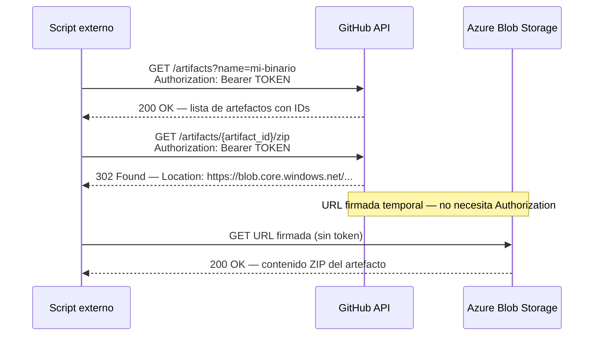
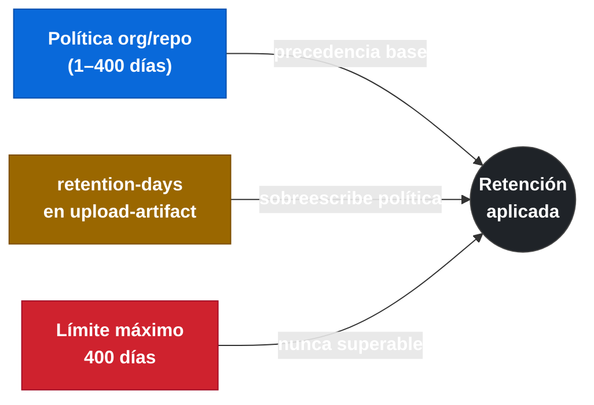

← [2.4 Re-ejecución de workflows y jobs](gha-d2-reejecutar.md) | → [2.6 Interpretación de matrix strategy](gha-d2-matrix-interpretacion.md)

# 2.5 Artefactos: consumo, gestión y API

> **Prerequisito:** Este fichero cubre el CONSUMO, gestión y API de artefactos. La subida con `actions/upload-artifact` y la descarga dentro del mismo workflow con `actions/download-artifact` se tratan en [gha-d1-artefactos.md](gha-d1-artefactos.md). Revisa ese documento primero si no conoces los fundamentos.

Los artefactos de GitHub Actions resuelven un problema muy concreto: conservar los ficheros producidos por un workflow para usarlos después de que la ejecución haya terminado. Un job que compila una aplicación, ejecuta tests y genera un informe de cobertura, o produce binarios listos para distribuir, necesita algún mecanismo para que esos ficheros sobrevivan más allá del ciclo de vida del runner. Ese mecanismo son los artefactos.

Una vez que el workflow finaliza, los artefactos quedan almacenados en GitHub y son accesibles desde la interfaz web, desde la REST API y, si así se diseña, desde otros workflows. Entender cómo acceder a ellos, cuánto tiempo se conservan, qué límites existen y en qué se diferencian de la caché es esencial tanto para el trabajo diario como para la certificación GH-200.

---

## A5.2 Descarga de artefactos desde la UI

La forma más inmediata de acceder a un artefacto es a través de la interfaz web de GitHub. Tras abrir una ejecución de workflow (pestaña **Actions** del repositorio, clic sobre la ejecución concreta), aparece la página de resumen. Al final de esa página hay una sección llamada **Artifacts** que lista todos los artefactos subidos durante esa ejecución.

Cada artefacto aparece como un enlace descargable. Al hacer clic, el navegador descarga un fichero `.zip` que contiene todos los ficheros que se subieron con `actions/upload-artifact` para ese artefacto. No existe opción de previsualizar el contenido desde la UI; la descarga siempre es el zip completo.

La sección Artifacts solo es visible si el workflow subió al menos un artefacto y si la retención del artefacto no ha expirado. Si el artefacto fue eliminado manualmente o su período de retención venció, la sección aparece vacía o no aparece.

---

## A5.3 Listar artefactos via REST API

La REST API de GitHub permite automatizar la gestión de artefactos. El endpoint principal para listar todos los artefactos de un repositorio es el siguiente.

```
GET /repos/{owner}/{repo}/actions/artifacts
```

Este endpoint devuelve una lista paginada de artefactos con sus metadatos: identificador numérico (`id`), nombre (`name`), tamaño en bytes (`size_in_bytes`), fecha de creación (`created_at`), fecha de expiración (`expires_at`) y URL de descarga (`archive_download_url`). Requiere autenticación con un token que tenga el scope `actions:read` o, en repositorios privados, `repo`.

Un ejemplo con `curl` usando el token de autenticación:

```bash
curl -L \
  -H "Accept: application/vnd.github+json" \
  -H "Authorization: Bearer $GITHUB_TOKEN" \
  -H "X-GitHub-Api-Version: 2022-11-28" \
  "https://api.github.com/repos/mi-org/mi-repo/actions/artifacts"
```

La respuesta incluye un campo `total_count` y un array `artifacts`. Cada elemento del array contiene los campos mencionados. Para filtrar por nombre de artefacto se puede añadir el parámetro de query `name`:

```bash
curl -L \
  -H "Accept: application/vnd.github+json" \
  -H "Authorization: Bearer $GITHUB_TOKEN" \
  -H "X-GitHub-Api-Version: 2022-11-28" \
  "https://api.github.com/repos/mi-org/mi-repo/actions/artifacts?name=mi-binario"
```

También es posible filtrar los artefactos de una ejecución concreta usando el endpoint específico de run:

```
GET /repos/{owner}/{repo}/actions/runs/{run_id}/artifacts
```

---

## A5.4 Descargar un artefacto específico via API

Una vez que se conoce el `id` de un artefacto (obtenido del listado anterior), se puede descargar su contenido mediante el endpoint de descarga.

```
GET /repos/{owner}/{repo}/actions/artifacts/{artifact_id}/{archive_format}
```

El parámetro `archive_format` acepta únicamente el valor `zip`. Este endpoint redirige a una URL temporal firmada de Azure Blob Storage donde se aloja el contenido real. Por eso es imprescindible usar la opción `-L` de `curl` para seguir la redirección.

```bash
# Primero obtener el artifact_id listando los artefactos
ARTIFACT_ID=$(curl -s \
  -H "Authorization: Bearer $GITHUB_TOKEN" \
  -H "Accept: application/vnd.github+json" \
  "https://api.github.com/repos/mi-org/mi-repo/actions/artifacts?name=mi-binario" \
  | jq '.artifacts[0].id')

# Luego descargar el zip
curl -L \
  -H "Authorization: Bearer $GITHUB_TOKEN" \
  -H "Accept: application/vnd.github+json" \
  -o artefacto.zip \
  "https://api.github.com/repos/mi-org/mi-repo/actions/artifacts/${ARTIFACT_ID}/zip"

# Descomprimir
unzip artefacto.zip -d ./artefacto-contenido
```

Este flujo es el patrón habitual cuando un sistema externo (un script de CD, una herramienta de release, un pipeline de otro sistema) necesita consumir los artefactos producidos por GitHub Actions sin intervención manual.


*Descarga de artefacto via API: GitHub responde con 302 que redirige a una URL firmada temporal en Azure Blob Storage.*

---

## A5.5 Retención de artefactos

Por defecto, GitHub conserva los artefactos durante **90 días** en repositorios públicos y en organizaciones con plan de pago. Para repositorios en cuentas gratuitas de GitHub.com el valor por defecto también es 90 días, pero los administradores pueden cambiarlo.

La retención se puede configurar en tres niveles, de menor a mayor precedencia:

1. **Nivel de organización o repositorio:** desde Settings > Actions > General se puede establecer un período de retención diferente al valor por defecto. El rango permitido es de 1 a 400 días.
2. **Nivel de workflow:** el campo `retention-days` del step `actions/upload-artifact` permite especificar un valor concreto para ese artefacto. Si se especifica, sobreescribe la política del repositorio para ese artefacto en concreto.
3. **Límite máximo:** ningún valor puede superar 400 días. Si se especifica un valor mayor, GitHub lo rechaza con error.

Cuando el período de retención expira, el artefacto se elimina automáticamente y ya no es recuperable. La fecha de expiración es visible en el campo `expires_at` de la API.


*Precedencia de retención: el valor del step sobreescribe la política del repositorio; nunca puede superar 400 días.*

---

## A5.6 Eliminación de artefactos

Los artefactos se pueden eliminar de dos formas: manualmente desde la UI o mediante la REST API. La eliminación es irreversible; una vez borrado un artefacto no hay papelera ni recuperación posible.

Desde la UI, al acceder a la página de resumen de una ejecución, cada artefacto de la sección Artifacts tiene un icono de papelera que permite eliminarlo. Solo los usuarios con permisos de escritura en el repositorio pueden eliminar artefactos.

Desde la API, el endpoint de eliminación es:

```
DELETE /repos/{owner}/{repo}/actions/artifacts/{artifact_id}
```

Requiere un token con scope `repo` (escritura). Si la operación tiene éxito devuelve un código HTTP `204 No Content` sin cuerpo de respuesta.

```bash
# Eliminar un artefacto por su ID
curl -L \
  -X DELETE \
  -H "Authorization: Bearer $GITHUB_TOKEN" \
  -H "Accept: application/vnd.github+json" \
  -H "X-GitHub-Api-Version: 2022-11-28" \
  "https://api.github.com/repos/mi-org/mi-repo/actions/artifacts/123456789"
```

La API también permite eliminar todos los artefactos de una ejecución concreta de una sola llamada:

```
DELETE /repos/{owner}/{repo}/actions/runs/{run_id}/artifacts
```

Este endpoint es útil en scripts de limpieza que recorren ejecuciones antiguas para liberar espacio de almacenamiento.

---

## A5.7 Límites de tamaño y cuotas de almacenamiento

GitHub impone límites tanto al tamaño individual de los artefactos como al almacenamiento total consumido por una cuenta u organización.

El **tamaño máximo de un artefacto individual** es de **10 GB** por artefacto subido con `actions/upload-artifact`. Si el directorio o fichero que se intenta subir supera ese límite, el step de upload falla con un error explícito.

El **almacenamiento total gratuito** incluido en cada plan de GitHub es el siguiente (valores de referencia; consultar la documentación oficial para los valores actuales):

| Plan | Almacenamiento incluido | Minutos incluidos |
|------|------------------------|-------------------|
| GitHub Free (personal) | 500 MB | 2 000 min/mes |
| GitHub Pro | 1 GB | 3 000 min/mes |
| GitHub Free (organización) | 500 MB | 2 000 min/mes |
| GitHub Team | 2 GB | 3 000 min/mes |
| GitHub Enterprise Cloud | 50 GB | 50 000 min/mes |

El almacenamiento se mide como el total de artefactos y caché activos en el repositorio o la organización. Cuando se supera el límite incluido en el plan, GitHub cobra el exceso por GB/mes según las tarifas vigentes. Reducir el período de retención y eliminar artefactos innecesarios son las dos palancas principales para controlar el gasto en almacenamiento.

---

## A5.8 Diferencia entre artefactos y caché

Artefactos y caché son dos mecanismos de almacenamiento de GitHub Actions que a menudo se confunden porque ambos persisten datos entre steps. Sin embargo, tienen propósitos, ciclos de vida y comportamientos muy distintos.

La **caché** (gestionada con `actions/cache`) está diseñada para acelerar workflows almacenando dependencias que tardan en descargarse o en compilarse, como los módulos de `npm`, los paquetes de Maven o las dependencias de `pip`. La caché se invalida automáticamente cuando cambia la clave (`key`), tiene un límite global de 10 GB por repositorio y se elimina automáticamente si no se accede a ella en 7 días o cuando el repositorio supera el límite de almacenamiento de caché.

Los **artefactos** están diseñados para conservar los resultados de una ejecución: binarios compilados, informes de tests, imágenes de contenedor, ficheros de configuración generados. Los artefactos persisten aunque el workflow no se vuelva a ejecutar, son accesibles desde la UI y la API, y su ciclo de vida está controlado por el período de retención (hasta 400 días).

La tabla siguiente resume las diferencias clave.

| Dimensión | Artefactos | Caché |
|-----------|-----------|-------|
| Propósito | Conservar resultados del workflow | Acelerar ejecuciones futuras |
| Acceso externo | UI, REST API, otros workflows | Solo desde dentro del workflow |
| Ciclo de vida | Período de retención (1-400 días) | 7 días sin acceso o límite de repo superado |
| Límite por ítem | 10 GB | Sin límite por ítem individual |
| Límite total | Cuota del plan | 10 GB por repositorio |
| Uso típico | Binarios, informes, releases | node_modules, .m2, pip cache |
| Eliminación | Manual o por expiración | Automática por LRU o manual |

> **Regla de oro:** si el dato necesita sobrevivir más allá de la ejecución y ser accesible desde fuera del workflow, usa artefactos. Si el dato solo sirve para evitar recompilar o redescargar dependencias, usa caché.

---

## A5.10 Artefactos en workflows reutilizables

Los workflows reutilizables (callee workflows llamados desde un caller con `uses:`) no exponen directamente sus artefactos al caller a través de ningún output especial. Los artefactos subidos por un callee se asocian a la misma ejecución del workflow raíz (el caller), lo que significa que son accesibles en la pestaña Summary de esa ejecución y a través de la API usando el `run_id` del caller.

Este comportamiento tiene una implicación importante: si el callee sube un artefacto con `actions/upload-artifact`, ese artefacto aparece como parte de la ejecución del caller. Otro job dentro del caller (o un callee diferente) puede descargar ese artefacto con `actions/download-artifact` usando el mismo nombre, siempre que se especifique la dependencia correcta con `needs:`.

El siguiente ejemplo muestra un workflow completo que ilustra este patrón: un job de build sube un binario, y un workflow reutilizable de validación lo descarga para comprobar su integridad.

```yaml
# .github/workflows/caller.yml
name: Pipeline principal

on:
  push:
    branches: [main]

jobs:
  build:
    runs-on: ubuntu-latest
    steps:
      - uses: actions/checkout@v4

      - name: Compilar aplicación
        run: |
          mkdir -p dist
          echo "binario-compilado-v$(date +%s)" > dist/app

      - name: Subir artefacto de build
        uses: actions/upload-artifact@v4
        with:
          name: binario-app
          path: dist/
          retention-days: 30

  validate:
    needs: build
    uses: ./.github/workflows/validar-binario.yml
    with:
      artifact-name: binario-app
```

```yaml
# .github/workflows/validar-binario.yml
name: Validar binario (reutilizable)

on:
  workflow_call:
    inputs:
      artifact-name:
        required: true
        type: string

jobs:
  validar:
    runs-on: ubuntu-latest
    steps:
      - name: Descargar artefacto del caller
        uses: actions/download-artifact@v4
        with:
          name: ${{ inputs.artifact-name }}
          path: ./descargado

      - name: Verificar contenido
        run: |
          echo "Contenido del artefacto:"
          ls -la ./descargado
          cat ./descargado/app
```

En este ejemplo, el callee `validar-binario.yml` accede al artefacto `binario-app` subido por el job `build` del caller. Esto funciona porque ambos forman parte de la misma ejecución y comparten el mismo `run_id`. La clave es que el callee debe declarar la dependencia con `needs: build` en el caller para garantizar que el artefacto ya existe antes de intentar descargarlo.

> **Advertencia:** si el caller y el callee están en repositorios diferentes, la descarga de artefactos entre workflows no funciona con `actions/download-artifact` directamente. En ese caso hay que usar la REST API con autenticación explícita para acceder a los artefactos del repositorio origen.

---

## Ejemplo central: subida, listado y descarga via API

El siguiente ejemplo integra todos los conceptos anteriores. Define un workflow que sube un artefacto y muestra cómo un script externo puede listarlo y descargarlo.

```yaml
# .github/workflows/generar-release.yml
name: Generar release artifact

on:
  workflow_dispatch:
    inputs:
      version:
        description: 'Versión del release'
        required: true
        default: '1.0.0'

jobs:
  build-and-upload:
    runs-on: ubuntu-latest
    steps:
      - uses: actions/checkout@v4

      - name: Crear ficheros de release
        run: |
          mkdir -p release
          echo "Versión: ${{ github.event.inputs.version }}" > release/VERSION.txt
          echo "SHA: ${{ github.sha }}" >> release/VERSION.txt
          echo "Fecha: $(date -u +%Y-%m-%dT%H:%M:%SZ)" >> release/VERSION.txt
          tar -czf release/app-${{ github.event.inputs.version }}.tar.gz -C release VERSION.txt

      - name: Subir artefacto de release
        uses: actions/upload-artifact@v4
        with:
          name: release-${{ github.event.inputs.version }}
          path: release/app-${{ github.event.inputs.version }}.tar.gz
          retention-days: 90

      - name: Mostrar ID de ejecución para uso en API
        run: echo "Run ID es ${{ github.run_id }}"
```

Una vez que el workflow ha terminado, el siguiente script bash lista los artefactos de la ejecución y descarga el primero que coincide con el prefijo `release-`.

```bash
#!/usr/bin/env bash
# script-descarga.sh
# Uso: GITHUB_TOKEN=ghp_xxx ./script-descarga.sh mi-org mi-repo 12345678

set -euo pipefail

OWNER=$1
REPO=$2
RUN_ID=$3
OUTPUT_DIR="./descargado"

# Listar artefactos de la ejecución
ARTIFACTS_JSON=$(curl -s \
  -H "Authorization: Bearer $GITHUB_TOKEN" \
  -H "Accept: application/vnd.github+json" \
  -H "X-GitHub-Api-Version: 2022-11-28" \
  "https://api.github.com/repos/${OWNER}/${REPO}/actions/runs/${RUN_ID}/artifacts")

echo "Artefactos disponibles:"
echo "$ARTIFACTS_JSON" | jq -r '.artifacts[] | "\(.id)  \(.name)  \(.size_in_bytes) bytes  expira: \(.expires_at)"'

# Seleccionar el primer artefacto cuyo nombre empieza por "release-"
ARTIFACT_ID=$(echo "$ARTIFACTS_JSON" \
  | jq -r '.artifacts[] | select(.name | startswith("release-")) | .id' \
  | head -1)

if [[ -z "$ARTIFACT_ID" ]]; then
  echo "ERROR: No se encontró ningún artefacto con prefijo 'release-'" >&2
  exit 1
fi

echo "Descargando artefacto ID: $ARTIFACT_ID"
mkdir -p "$OUTPUT_DIR"

curl -L \
  -H "Authorization: Bearer $GITHUB_TOKEN" \
  -H "Accept: application/vnd.github+json" \
  -H "X-GitHub-Api-Version: 2022-11-28" \
  -o "${OUTPUT_DIR}/release.zip" \
  "https://api.github.com/repos/${OWNER}/${REPO}/actions/artifacts/${ARTIFACT_ID}/zip"

echo "Descomprimiendo en ${OUTPUT_DIR}/"
unzip -o "${OUTPUT_DIR}/release.zip" -d "$OUTPUT_DIR"

echo "Contenido descargado:"
ls -la "$OUTPUT_DIR"
```

---

## Referencia rápida de endpoints

La tabla siguiente consolida todos los endpoints de la REST API cubiertos en este documento.

| Operación | Método | Endpoint |
|-----------|--------|----------|
| Listar artefactos del repositorio | GET | `/repos/{owner}/{repo}/actions/artifacts` |
| Listar artefactos de una ejecución | GET | `/repos/{owner}/{repo}/actions/runs/{run_id}/artifacts` |
| Obtener metadatos de un artefacto | GET | `/repos/{owner}/{repo}/actions/artifacts/{artifact_id}` |
| Descargar un artefacto (zip) | GET | `/repos/{owner}/{repo}/actions/artifacts/{artifact_id}/zip` |
| Eliminar un artefacto | DELETE | `/repos/{owner}/{repo}/actions/artifacts/{artifact_id}` |
| Eliminar todos los artefactos de una ejecución | DELETE | `/repos/{owner}/{repo}/actions/runs/{run_id}/artifacts` |

Todos los endpoints requieren autenticación. Para operaciones de lectura es suficiente con `actions:read`. Para eliminación se necesita `repo` (acceso de escritura al repositorio).

---

## Buenas y malas prácticas

Las siguientes prácticas recogen los errores más frecuentes y sus soluciones recomendadas.

> **Buena práctica 1:** Establece siempre un `retention-days` explícito acorde al uso del artefacto. Los binarios de release pueden necesitar 90 días; los informes de test de PRs con 7 días es suficiente.

> **Mala práctica 1:** Dejar todos los artefactos con la retención por defecto (90 días) sin importar su tipo. Acumula gigabytes de artefactos temporales que incrementan el coste de almacenamiento innecesariamente.

> **Buena práctica 2:** Usa la API con `run_id` para localizar artefactos de una ejecución específica cuando automatizas pipelines externos. Así evitas ambigüedades cuando hay múltiples artefactos con el mismo nombre en distintas ejecuciones.

> **Mala práctica 2:** Usar el parámetro `name` del listado general para buscar artefactos sin filtrar por `run_id`. Si el nombre del artefacto se repite en varias ejecuciones (cosa habitual), obtienes múltiples resultados y tienes que lógica adicional para seleccionar el correcto.

> **Buena práctica 3:** Implementa scripts de limpieza periódica que eliminen artefactos de ejecuciones antiguas fallidas o canceladas. GitHub no elimina automáticamente los artefactos de workflows que no terminan con éxito si no han expirado.

> **Mala práctica 3:** Usar artefactos como mecanismo de caché de dependencias. Subir y bajar `node_modules` como artefacto es mucho más lento y costoso que usar `actions/cache`, que está optimizado para ese caso de uso.

> **Buena práctica 4:** En workflows reutilizables, documenta en el `workflow_call` qué artefactos produce el callee (nombre y formato) para que el caller pueda acceder a ellos de forma predecible.

> **Mala práctica 4:** Asumir que los artefactos de un callee son automáticamente accesibles al caller como outputs. Los artefactos no son outputs; el caller debe descargarlos explícitamente con el mismo nombre usando `actions/download-artifact`.

---

## Verificación y práctica

Las siguientes preguntas están diseñadas para preparar la certificación GH-200 y verificar la comprensión de los conceptos de este documento.

**Pregunta 1**

Un workflow sube un artefacto con `retention-days: 5`. La política del repositorio establece una retención por defecto de 30 días. ¿Cuántos días se conservará el artefacto?

A) 30 días, porque la política del repositorio tiene precedencia  
B) 5 días, porque el valor del step sobreescribe la política del repositorio  
C) 35 días, porque se suman ambos valores  
D) Depende del plan de GitHub de la organización

> **Respuesta correcta: B.** El valor especificado en `retention-days` del step `actions/upload-artifact` sobreescribe la política del repositorio para ese artefacto concreto.

**Pregunta 2**

¿Qué código HTTP devuelve el endpoint `DELETE /repos/{owner}/{repo}/actions/artifacts/{artifact_id}` cuando la eliminación es exitosa?

A) 200 OK  
B) 201 Created  
C) 204 No Content  
D) 404 Not Found

> **Respuesta correcta: C.** El endpoint de eliminación devuelve `204 No Content` cuando el artefacto se elimina correctamente, sin cuerpo de respuesta.

**Pregunta 3**

Un job `deploy` en el caller necesita usar un artefacto producido por un callee `build-callee`. ¿Cuál es la forma correcta de acceder a ese artefacto?

A) Usar un output del callee que devuelva la URL de descarga del artefacto  
B) Descargar el artefacto con `actions/download-artifact` en el job `deploy` del caller, especificando el nombre correcto y declarando la dependencia con `needs:`  
C) Los artefactos del callee solo son accesibles desde dentro del callee  
D) Acceder al artefacto directamente desde la variable de entorno `ARTIFACT_URL`

> **Respuesta correcta: B.** Los artefactos del callee se asocian a la ejecución del caller y son descargables con `actions/download-artifact` desde cualquier job del caller que declare la dependencia correcta.

---

**Ejercicio práctico**

Objetivo: automatizar la descarga de artefactos usando la REST API.

1. Crea un workflow en tu repositorio que suba un artefacto con el nombre `practica-api` conteniendo un fichero `resultado.txt` con el texto `ejercicio completado`. Configura una retención de 7 días.
2. Ejecuta el workflow manualmente con `workflow_dispatch`.
3. Desde tu máquina local, usa `curl` y `jq` para:
   a. Listar todos los artefactos del repositorio y encontrar el `id` del artefacto `practica-api`.
   b. Descargar el artefacto como zip.
   c. Descomprimir el zip y verificar que el fichero `resultado.txt` contiene el texto esperado.
4. Usa el endpoint DELETE para eliminar el artefacto y verifica que ya no aparece en el listado.

Este ejercicio refuerza el flujo completo: subida desde workflow, listado, descarga y eliminación via API.

---

← [2.4 Re-ejecución de workflows y jobs](gha-d2-reejecutar.md) | → [2.6 Interpretación de matrix strategy](gha-d2-matrix-interpretacion.md)
