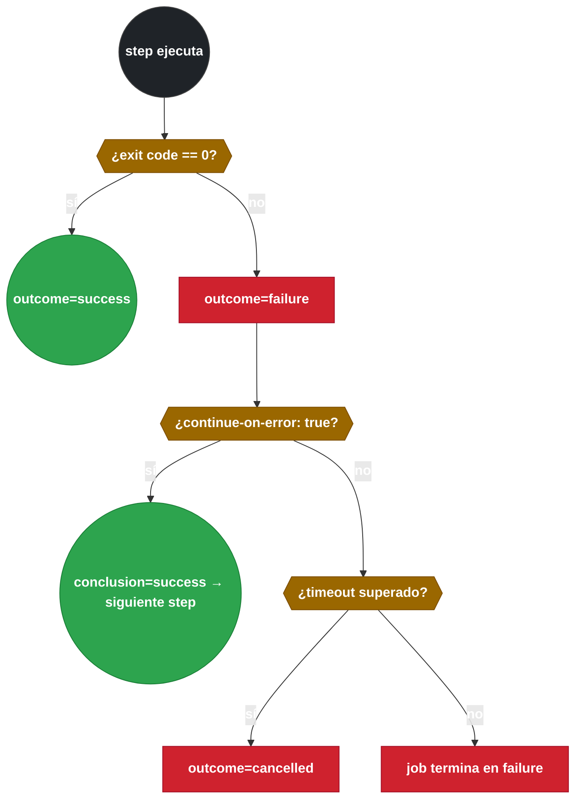

# 2.3.1 Diagnóstico de comportamiento: exit codes, continue-on-error y timeout

← [2.2 Lectura e interpretación de logs](gha-d2-logs.md) | [Índice](README.md) | [2.3.2 Depuración avanzada: runner debug, step debug, matrix y concurrencia](gha-d2-debug-avanzado.md) →

---

Cuando un step termina, el runner captura su código de salida (exit code) y decide si el job debe fallar o continuar. Sin entender este mecanismo, un log que muestra `Process completed with exit code 1` resulta opaco: ¿fallo de lógica? ¿comando no encontrado? ¿proceso eliminado por el sistema operativo? Este fichero establece el vocabulario de fallo que cualquier diagnóstico de GitHub Actions requiere como punto de partida; [2.3.2](gha-d2-debug-avanzado.md) asume estos conceptos al explicar los modos de depuración avanzada.

> [PREREQUISITO] Saber leer los logs de la UI (grupos, timestamps, búsqueda) tal como se describe en [2.2 Lectura e interpretación de logs](gha-d2-logs.md).

## Flujo de decisión ante un fallo

El siguiente diagrama muestra cómo el runner evalúa el exit code de cada step y qué resultado propaga al job:


*Evaluación del exit code: outcome refleja el resultado real; conclusion aplica continue-on-error.*

> [CONCEPTO] `steps.<id>.outcome` refleja el resultado real del step: `success`, `failure`, `skipped` o `cancelled`. `steps.<id>.conclusion` es el valor tras aplicar `continue-on-error`; puede ser `success` aunque el step haya fallado. El job evalúa `conclusion`, no `outcome`.

## Exit codes

El exit code es el número entero que un proceso devuelve al sistema operativo al terminar. En GitHub Actions, cualquier valor distinto de 0 hace que el step falle. Conocer los códigos frecuentes permite distinguir entre un fallo de lógica de la aplicación, un comando inexistente en el runner o una terminación forzada por el sistema operativo, sin necesidad de activar modos de depuración adicionales.

| Código | Significado habitual |
|-------:|----------------------|
| `0` | Éxito |
| `1` | Error genérico del script o la aplicación |
| `2` | Uso incorrecto del comando (argumento inválido) |
| `127` | Comando no encontrado (`command not found`) |
| `128+n` | Proceso terminado por señal `n` (ej: 137 = SIGKILL, 143 = SIGTERM) |

> [EXAMEN] Exit code `127` en un step indica que el binario no está disponible en el runner; no se resuelve reintentando sino instalando la herramienta o cambiando de imagen de runner.

## continue-on-error

`continue-on-error` es una propiedad booleana que se puede definir tanto en un step como en un job. Cuando se define en un **step** y su valor es `true`, el runner marca ese step con `conclusion=success` aunque su `outcome` sea `failure`, lo que permite al job continuar ejecutando los steps siguientes. Esta distinción entre `outcome` y `conclusion` es la fuente más frecuente de confusión en el examen: el resultado real del step no desaparece, queda accesible en `steps.<id>.outcome` para usarlo en condicionales (`if: steps.lint.outcome == 'failure'`).

Cuando se define en un **job**, el efecto es diferente: el workflow reporta `success` aunque ese job haya fallado, lo que puede ocultar fallos reales en los status checks de pull requests.

> [ADVERTENCIA] `continue-on-error: true` en el job no evita que los steps fallen entre sí; evita que el **workflow** marque ese job como fallido. Es semánticamente distinto de aplicarlo a un step individual.

## timeout-minutes

`timeout-minutes` define cuántos minutos puede ejecutarse un job o step antes de que el runner lo cancele forzosamente. Existe en dos niveles independientes: si ambos están configurados, el límite más restrictivo que se alcanza primero es el que actúa. Sin este parámetro, el timeout por defecto de un job es 360 minutos (6 horas), tiempo suficiente para agotar el cupo mensual de minutos si un proceso queda esperando entrada de red o genera un bucle infinito.

Cuando el timeout se supera, el step o job termina con `outcome=cancelled`. Si el step que cancela no tiene `continue-on-error: true`, el job falla.

## Mensajes estructurados: ::error:: y ::warning::

`::error::` y `::warning::` son workflow commands que se escriben en la salida estándar de un step y que el runner intercepta para crear anotaciones visibles en la UI de GitHub: aparecen en la pestaña de logs como líneas resaltadas y, en el caso de pull requests, como anotaciones sobre el diff. Su valor diagnóstico radica en que son visibles en la vista resumen del workflow sin necesidad de expandir cada step manualmente.

La sintaxis completa permite añadir metadatos de localización:

```
::error file=src/app.js,line=42,col=5::Mensaje de error descriptivo
::warning title=Lint fallido::Revisar las reglas de estilo antes del merge
```

## Ejemplo central

El siguiente workflow demuestra los cinco conceptos en un mismo job: identificación del step que falla, exit codes, `continue-on-error`, `timeout-minutes` a dos niveles y mensajes estructurados.

```yaml
# .github/workflows/diagnostico-comportamiento.yml
name: Diagnóstico de comportamiento

on: [push]

jobs:
  demo:
    runs-on: ubuntu-latest
    timeout-minutes: 10                  # Timeout de job: cancela todo si supera 10 min

    steps:
      - name: Lint (puede fallar)
        id: lint
        run: |
          echo "::warning::El lint falló — revisar antes del merge"
          exit 1                         # exit code 1 → outcome=failure
        continue-on-error: true          # conclusion=success → el job continúa

      - name: Mostrar outcome vs conclusion del lint
        run: |
          echo "outcome : ${{ steps.lint.outcome }}"     # failure
          echo "conclusion: ${{ steps.lint.conclusion }}" # success

      - name: Build con timeout propio
        timeout-minutes: 3               # Cancela solo este step si supera 3 min
        run: npm run build

      - name: Paso que falla con código conocido
        run: |
          echo "::error file=src/main.js,line=10::Variable no definida"
          exit 127                       # command not found — aparece en logs resaltado
```

> [ADVERTENCIA] El step `Paso que falla con código conocido` no tiene `continue-on-error: true`, por lo que el job fallará cuando llegue a ese step. El workflow completo termina en `failure`.

## Tabla de elementos clave

Los parámetros de este subtema y su comportamiento:

| Parámetro | Nivel | Tipo | Default | Descripción |
|-----------|-------|------|---------|-------------|
| `timeout-minutes` | job | integer | 360 | Minutos máximos para todo el job; superado → job `cancelled` |
| `timeout-minutes` | step | integer | — | Minutos máximos para ese step; superado → step `cancelled` |
| `continue-on-error` | job | boolean | `false` | Si `true`, el workflow reporta `success` aunque el job falle |
| `continue-on-error` | step | boolean | `false` | Si `true`, el job continúa aunque el step falle |
| `::error::[msg]` | step `run` | workflow command | — | Anota un error en los logs de la UI y en el diff del PR |
| `::warning::[msg]` | step `run` | workflow command | — | Anota un aviso en los logs de la UI y en el diff del PR |

## Buenas y malas prácticas

**Hacer:**
- **Configurar `timeout-minutes` en jobs de larga duración** — razón: el default de 360 min puede consumir todo el cupo mensual si un proceso queda bloqueado esperando entrada externa o genera un bucle infinito.
- **Usar `continue-on-error: true` a nivel de step, no de job** — razón: aplicado al job hace que el workflow reporte `success` aunque haya fallos reales, ocultando el estado en los status checks de pull requests y en los dashboards de monitorización.
- **Consultar `steps.<id>.outcome` tras `continue-on-error`** — razón: permite tomar decisiones condicionales basadas en el resultado real del step sin perder la trazabilidad del fallo.

**Evitar:**
- **Ignorar exit code 127** — razón: indica que un binario no está instalado en el runner; reintentar la ejecución o activar debug no lo resuelve — hay que instalar la herramienta o cambiar de imagen de runner.
- **Poner `timeout-minutes` demasiado bajos en steps de compilación** — razón: compilaciones de proyectos medianos y grandes pueden superar umbrales de 2–3 minutos; el step se cancelará sin producir artefactos y el fallo parecerá un timeout de red.
- **Emitir `::error::` sin texto descriptivo** — razón: GitHub crea la anotación pero vacía; no aparece en la vista de anotaciones del PR y el mensaje no tiene utilidad diagnóstica para quien revisa el código.

## Comparación: timeout y continue-on-error a nivel job vs step

Ambas propiedades existen en dos niveles con semánticas distintas que el examen suele confundir deliberadamente:

| Propiedad | A nivel de `job` | A nivel de `step` |
|-----------|-----------------|-------------------|
| `timeout-minutes` | Cancela todo el job si se supera el límite total del job | Cancela solo ese step; el job puede continuar con los siguientes |
| `continue-on-error` | El **workflow** reporta `success` aunque el job falle | Solo ese **step** se ignora; el job puede fallar por otros steps |
| Efecto en PR status checks | Workflow aparece como ✅ aunque el job haya fallado | No afecta al resultado del workflow directamente |
| Caso de uso típico | Job de notificación no crítico que nunca debe bloquear el merge | Step de lint o análisis estático opcional en un job de CI |

> [EXAMEN] Pregunta frecuente: ¿qué ocurre si `continue-on-error: true` está en el step y el step cancela por `timeout-minutes`? El `outcome` del step es `cancelled` y `conclusion` es `success`; el job continúa. El timeout del step no afecta al timeout del job.

## Verificación y práctica

### Preguntas de examen

**Pregunta 1.** Un step termina con exit code 1 y tiene `continue-on-error: true`. ¿Cuál es el valor de `steps.mi-step.outcome` y `steps.mi-step.conclusion`?

- A) `outcome: success`, `conclusion: success`
- B) `outcome: failure`, `conclusion: failure`
- **C) `outcome: failure`, `conclusion: success`** ✅
- D) `outcome: cancelled`, `conclusion: success`

*A es incorrecta*: `outcome` refleja el exit code real; no puede ser `success` si el proceso terminó con código 1. *B es incorrecta*: `continue-on-error: true` cambia `conclusion` a `success`. *D es incorrecta*: `cancelled` solo aparece cuando hay timeout o cancelación manual, no por exit code distinto de 0.

---

**Pregunta 2.** Un job tiene `timeout-minutes: 5` y un step tiene `timeout-minutes: 3`. El step tarda 4 minutos. ¿Qué ocurre?

- A) El job cancela a los 5 minutos con el step marcado como `success`
- **B) El step cancela a los 3 minutos con `outcome: cancelled`; si no tiene `continue-on-error`, el job falla** ✅
- C) El step ignora su propio timeout y respeta el del job
- D) Los timeouts se suman y el step dispone de 8 minutos

*A es incorrecta*: el timeout del step (3 min) es más restrictivo y actúa antes. *C y D son incorrectas*: cada timeout opera de forma independiente en su nivel; no se heredan ni suman.

---

**Ejercicio práctico.** Escribe un workflow que: (1) ejecute un step de lint que puede fallar sin detener el pipeline; (2) si el lint falla, emita un warning con el mensaje `"Lint fallido — revisar antes del merge"`; (3) el step de build cancele si tarda más de 5 minutos; (4) todo el job cancele si supera 15 minutos.

```yaml
# .github/workflows/lint-build.yml
name: Lint y Build

on: [push]

jobs:
  ci:
    runs-on: ubuntu-latest
    timeout-minutes: 15

    steps:
      - uses: actions/checkout@v4

      - name: Lint
        id: lint
        run: npx eslint . --ext .js,.ts
        continue-on-error: true

      - name: Avisar si lint falló
        if: steps.lint.outcome == 'failure'
        run: echo "::warning::Lint fallido — revisar antes del merge"

      - name: Build
        timeout-minutes: 5
        run: npm run build
```

---

← [2.2 Lectura e interpretación de logs](gha-d2-logs.md) | [Índice](README.md) | [2.3.2 Depuración avanzada: runner debug, step debug, matrix y concurrencia](gha-d2-debug-avanzado.md) →
