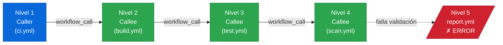

<!-- anterior: [2.8.1 Reusable workflows: sintaxis de llamada](gha-d2-reusable-workflows-consumo.md) -->
<!-- siguiente: [2.9 Composite actions: consumo](gha-d2-composite-actions-consumo.md) -->

# 2.8.2 Reusable workflows: restricciones, contextos, artefactos y comparativa con otros patrones

Antes de adoptar reusable workflows como patrón principal de reutilización, conviene entender con precisión qué pueden hacer, qué no pueden hacer y en qué se diferencian de las otras dos alternativas que ofrece GitHub Actions: los starter workflows y las composite actions. Tomar esta decisión sin ese contexto lleva a rediseños costosos cuando el proyecto crece o cuando los límites de la plataforma aparecen de forma inesperada.

Este fichero cubre las restricciones formales de los reusable workflows, el acceso a contextos y artefactos entre el workflow llamador (caller) y el workflow llamado (callee), las diferencias de comportamiento según si el callee está en el mismo repositorio o en uno externo, y —como elemento central— una tabla comparativa que permite elegir entre los tres patrones disponibles.

## Por qué importan las restricciones

Un reusable workflow es un workflow completo que otro workflow invoca mediante el evento `workflow_call`. Esa capacidad de invocar workflows enteros es muy potente, pero la plataforma impone límites concretos para evitar ciclos, explosiones de consumo y problemas de seguridad. Conocer esos límites con anticipación es parte de lo que evalúa el examen GH-200, porque la certificación mide si el candidato puede diseñar soluciones correctas y no solo escribir YAML que compile.

## Tabla comparativa: Starter workflow · Reusable workflow · Composite action

Los tres mecanismos sirven para "no repetirse", pero operan en capas distintas del sistema. La tabla siguiente es el punto de referencia para elegir entre ellos. El fichero `gha-d2-composite-actions-consumo.md` remite a esta tabla en lugar de duplicarla.

| Dimensión | Starter workflow | Reusable workflow | Composite action |
|---|---|---|---|
| **¿Qué es?** | Plantilla de workflow para nuevos repos | Workflow invocable desde otro workflow | Action que agrupa pasos (`steps`) |
| **Trigger de activación** | Se copia al repo; usa sus propios triggers | `workflow_call` | Se invoca como un `uses` dentro de un `step` |
| **Unidad de reutilización** | Workflow completo (plantilla) | Workflow completo (en tiempo de ejecución) | Conjunto de pasos dentro de un job |
| **Dónde vive** | `.github/workflow-templates/` de una org | Cualquier repo, cualquier ruta `.github/workflows/` | Repo propio, directorio raíz o `action.yml` |
| **Nivel de anidamiento** | No aplica (se copia, no se llama) | Hasta 4 niveles (caller + 3 callees anidados) | Sin límite de anidamiento propio |
| **Contexto `secrets`** | Del repo donde se copió | Debe pasarse explícitamente con `secrets:` o `secrets: inherit` | Hereda los secrets del job llamador automáticamente |
| **Contexto `env`** | Del repo donde se copió | No se hereda; debe pasarse como `inputs` | Hereda el `env` del job llamador |
| **Artefactos** | Del repo donde se copió | Espacio compartido del mismo run; acceso con `needs` | Mismo espacio que el job que los contiene |
| **Runners** | Definidos en la plantilla copiada | Definidos en el callee, no en el caller | Misma máquina que el job llamador |
| **Visibilidad** | Org pública o privada | Mismo repo, org o público según permisos | Mismo repo o acción publicada |
| **Casos de uso típicos** | Onboarding de nuevos repos en una org | Pipelines de CI/CD compartidos entre repos | Pasos atómicos reutilizables (build, lint, etc.) |
| **Requiere metadatos `action.yml`** | No | No | Sí |

> **Regla práctica para el examen:** Si necesitas reutilizar un *workflow entero* (con sus jobs y runners), usa reusable workflow. Si necesitas reutilizar *pasos* dentro de un job existente, usa composite action. Si necesitas ofrecer una *plantilla* de partida para nuevos repositorios de la organización, usa starter workflow.

## Restricción principal: límite de anidamiento de 4 niveles

GitHub Actions permite que un reusable workflow llame a su vez a otro reusable workflow, pero establece un límite estricto: no pueden existir más de 4 niveles de anidamiento contando el workflow raíz. Dicho de otro modo, el caller es el nivel 1, y el callee más profundo que se puede alcanzar es el nivel 4.

Si se supera ese límite, la ejecución falla en tiempo de validación con un error del tipo "Reusable workflows can only be nested to 4 levels deep". Este límite existe para evitar grafos de llamadas imposibles de rastrear y para proteger los recursos de la plataforma.


*Límite de 4 niveles: el caller es nivel 1, quedan 3 niveles de callees anidados disponibles.*

La implicación de diseño es clara: si una organización tiene pipelines muy profundos, alguna parte de la lógica tendrá que implementarse con composite actions (que no consumen niveles de anidamiento de reusable workflows) o bien refactorizarse para aplanar la jerarquía.

> **Advertencia F6/exam trap:** El límite es 4 niveles, no 3. El caller ocupa el nivel 1, así que quedan 3 niveles de callees anidados. El examen puede formular la pregunta como "¿cuántos niveles de callees se pueden anidar?" y la respuesta correcta es 3 (dentro de un total de 4 contando el caller).

## Acceso a contextos del caller desde el callee

Cuando un workflow llama a otro mediante `workflow_call`, el callee se ejecuta con su propio contexto aislado. Esto tiene implicaciones importantes para tres tipos de datos: secrets, variables de entorno y outputs.

**Secrets:** el callee no hereda automáticamente los secrets del caller. El caller debe pasarlos de forma explícita en la sección `secrets:` de la llamada, o bien usar `secrets: inherit` para propagar todos los secrets accesibles en el caller. Sin esa declaración explícita, el callee no puede acceder a ningún secret del repositorio que lo invoca.

**Variables de entorno (`env`):** las variables definidas con `env:` a nivel de workflow o job en el caller no se propagan al callee. Si el callee necesita un valor de entorno, el caller debe pasarlo como `input`. Esta es una fuente frecuente de errores cuando se migra lógica de un workflow monolítico a reusable workflows.

**Outputs:** el callee puede declarar outputs en su sección `on.workflow_call.outputs` y el caller puede consumirlos mediante `needs.<job_id>.outputs.<name>`. El mecanismo es análogo al de outputs entre jobs dentro del mismo workflow.

> **Regla de diseño:** trata la interfaz del callee como la interfaz de una función: todo lo que necesita debe pasarse explícitamente. Nada llega "por defecto" desde el contexto del caller excepto cuando se usa `secrets: inherit`.

## Acceso a artefactos entre caller y callee

Los artefactos en GitHub Actions se almacenan a nivel de *run* (ejecución), no a nivel de job individual. Esto significa que tanto el caller como el callee comparten el mismo espacio de artefactos dentro de una misma ejecución de workflow.

El callee puede subir artefactos con `actions/upload-artifact` y el caller puede descargarlos con `actions/download-artifact` en un job posterior, siempre que ese job declare `needs:` apuntando al job que invocó el callee. A la inversa, si el caller sube un artefacto antes de invocar el callee, el callee puede descargarlo especificando el mismo nombre.

Esta capacidad de compartir artefactos es una de las razones por las que los reusable workflows son útiles para pipelines de construcción: un callee puede compilar y subir un binario, y el caller puede desplegarlo en un job posterior sin necesidad de volver a compilar.

> **Límite a tener en cuenta:** los artefactos tienen un periodo de retención configurable (por defecto 90 días) y un tamaño máximo por artefacto. Si el callee produce artefactos muy pesados, es recomendable configurar `retention-days` explícitamente.

## Mismo repositorio vs repositorio externo

Un reusable workflow puede estar en el mismo repositorio que el caller o en un repositorio externo. La sintaxis es la misma (`uses: owner/repo/.github/workflows/file.yml@ref`), pero el comportamiento difiere en aspectos de permisos y acceso.

**Mismo repositorio:** cuando el callee está en el mismo repo, la referencia puede usar `./.github/workflows/file.yml` (ruta relativa). No hay restricciones adicionales de visibilidad: el caller puede siempre acceder al callee del mismo repo. Los secrets del repositorio están disponibles para ambos si se usa `secrets: inherit`.

**Repositorio externo:** para llamar a un workflow de otro repositorio, ese repositorio debe ser público, o bien pertenecer a la misma organización y tener la opción "Allow reusable workflows" habilitada en la configuración de Actions. Si el repositorio externo es privado y pertenece a otra organización, la llamada fallará aunque se tengan tokens con acceso. El caller debe especificar una referencia concreta: una rama, un tag o un SHA.

> **Buena práctica de seguridad:** para reusable workflows externos, ancla siempre la referencia a un SHA completo o a un tag semántico versionado. Usar una rama como `main` expone el caller a cambios no controlados en el callee.

## Ejemplo completo: anidamiento y artefactos compartidos

El siguiente ejemplo muestra tres archivos: un workflow caller en `repo-A`, un callee de primer nivel en `repo-shared`, y un callee de segundo nivel también en `repo-shared`. El callee de segundo nivel sube un artefacto que el caller descarga en un job posterior.

**Archivo 1: `.github/workflows/pipeline.yml` (repo-A — el caller)**

```yaml
name: Pipeline principal

on:
  push:
    branches:
      - main

jobs:
  build:
    uses: org/repo-shared/.github/workflows/build-callee.yml@v2
    with:
      artifact-name: my-app-binary
    secrets: inherit

  deploy:
    needs: build
    runs-on: ubuntu-latest
    steps:
      - name: Descargar artefacto producido por el callee
        uses: actions/download-artifact@v4
        with:
          name: my-app-binary
          path: ./dist

      - name: Verificar contenido descargado
        run: ls -lh ./dist
```

**Archivo 2: `.github/workflows/build-callee.yml` (repo-shared — callee nivel 1)**

```yaml
name: Build callee nivel 1

on:
  workflow_call:
    inputs:
      artifact-name:
        description: Nombre del artefacto a producir
        required: true
        type: string
    secrets:
      NPM_TOKEN:
        required: false

jobs:
  compile:
    uses: org/repo-shared/.github/workflows/compile-callee.yml@v2
    with:
      artifact-name: ${{ inputs.artifact-name }}
    secrets: inherit
```

**Archivo 3: `.github/workflows/compile-callee.yml` (repo-shared — callee nivel 2)**

```yaml
name: Compile callee nivel 2

on:
  workflow_call:
    inputs:
      artifact-name:
        description: Nombre del artefacto a producir
        required: true
        type: string

jobs:
  build-binary:
    runs-on: ubuntu-latest
    steps:
      - name: Checkout del código
        uses: actions/checkout@v4

      - name: Compilar aplicación
        run: |
          mkdir -p dist
          echo "binario-simulado-$(date +%s)" > dist/app

      - name: Subir artefacto al espacio compartido del run
        uses: actions/upload-artifact@v4
        with:
          name: ${{ inputs.artifact-name }}
          path: dist/
          retention-days: 1
```

En este ejemplo, el caller (nivel 1) invoca `build-callee.yml` (nivel 2), que a su vez invoca `compile-callee.yml` (nivel 3). Aún quedaría un nivel disponible antes de alcanzar el límite de 4. El artefacto subido por el nivel 3 es accesible desde el job `deploy` del caller porque todos comparten el mismo `run`.

> **Punto clave del ejemplo:** el job `deploy` en el caller usa `needs: build` para garantizar que el callee ha terminado antes de intentar descargar el artefacto. Sin esa dependencia, la descarga podría ejecutarse antes de que el artefacto exista.

## Buenas y malas prácticas

Las prácticas siguientes resumen los errores más comunes en el uso de reusable workflows y las formas de evitarlos.

**1. Pasar secrets explícitamente vs asumir herencia**

Mala práctica: omitir la declaración de secrets esperando que el callee los reciba automáticamente del contexto del caller.

```yaml
# MAL: el callee no recibirá secrets.DEPLOY_KEY aunque exista en el repo
jobs:
  deploy:
    uses: org/shared/.github/workflows/deploy.yml@v1
```

Buena práctica: declarar `secrets: inherit` o listar los secrets necesarios de forma explícita.

```yaml
# BIEN: todos los secrets accesibles en el caller se propagan al callee
jobs:
  deploy:
    uses: org/shared/.github/workflows/deploy.yml@v1
    secrets: inherit
```

**2. Referenciar callees externos por SHA vs por rama**

Mala práctica: usar el nombre de una rama como referencia al callee externo.

```yaml
# MAL: cualquier commit en main del repo externo cambia el comportamiento
uses: org/shared/.github/workflows/build.yml@main
```

Buena práctica: usar un tag semántico o un SHA completo.

```yaml
# BIEN: la referencia es inmutable
uses: org/shared/.github/workflows/build.yml@v3.1.0
```

**3. Usar reusable workflow cuando composite action es suficiente**

Mala práctica: crear un reusable workflow para reutilizar un único paso o un grupo pequeño de comandos que no requieren su propio runner. Esto consume un nivel de anidamiento innecesario y aumenta el tiempo de setup del runner.

Buena práctica: usar una composite action cuando la lógica a reutilizar cabe dentro de los steps de un job existente. Reservar los reusable workflows para lógica que necesita jobs independientes, matrices o runners propios.

**4. No declarar outputs en el callee cuando el caller los necesita**

Mala práctica: intentar acceder a una variable del callee directamente desde el contexto del caller sin declararla como output.

```yaml
# MAL: version no está disponible en el caller de esta forma
- run: echo "version=1.2.3" >> $GITHUB_OUTPUT
```

Buena práctica: declarar el output en `on.workflow_call.outputs` y leerlo con `needs.<job>.outputs.<name>`.

```yaml
# En el callee: declarar el output
on:
  workflow_call:
    outputs:
      version:
        description: Version compilada
        value: ${{ jobs.build.outputs.version }}

jobs:
  build:
    runs-on: ubuntu-latest
    outputs:
      version: ${{ steps.get-version.outputs.version }}
    steps:
      - id: get-version
        run: echo "version=1.2.3" >> $GITHUB_OUTPUT
```

**5. Anidar más de 4 niveles de reusable workflows**

Mala práctica: construir una cadena de llamadas que supere el límite de la plataforma confiando en que funcionará.

Buena práctica: si la profundidad de la cadena se acerca al límite, introducir composite actions para consolidar pasos sin consumir niveles de anidamiento de reusable workflows.

## Verificación y práctica

Las siguientes preguntas simulan el estilo del examen GH-200 para los conceptos de este fichero.

**Pregunta 1**

Un equipo tiene esta cadena: `ci.yml` llama a `build.yml`, que llama a `test.yml`, que llama a `scan.yml`, que intenta llamar a `report.yml`. ¿Qué ocurrirá al ejecutar `ci.yml`?

A) La ejecución funcionará correctamente porque cada workflow es independiente.  
B) La ejecución fallará porque se superan los 4 niveles de anidamiento permitidos.  
C) La ejecución fallará porque los reusable workflows no pueden llamarse entre sí.  
D) La ejecución funcionará pero `report.yml` no tendrá acceso a secrets.

> **Respuesta correcta: B.** La cadena tiene 5 niveles (ci → build → test → scan → report). El límite es 4. La ejecución falla con error de validación.

**Pregunta 2**

Un callee necesita acceder a la variable de entorno `DATABASE_URL` que el caller define en su sección `env:`. ¿Cuál es la forma correcta de pasarla?

A) No es necesario hacer nada; las variables `env` se propagan automáticamente.  
B) Usar `secrets: inherit` para propagar todas las variables de entorno.  
C) Declarar un `input` en el callee y pasarlo explícitamente desde el caller con `with:`.  
D) Acceder a ella con `${{ env.DATABASE_URL }}` directamente en el callee.

> **Respuesta correcta: C.** Las variables `env` no se heredan entre caller y callee. Deben pasarse como `inputs`.

**Pregunta 3**

¿Cuál es la diferencia principal entre un starter workflow y un reusable workflow?

A) El starter workflow puede anidar otros workflows; el reusable workflow no.  
B) El starter workflow es una plantilla que se copia en nuevos repositorios; el reusable workflow se invoca en tiempo de ejecución desde otro workflow.  
C) El reusable workflow solo puede usarse en el mismo repositorio; el starter workflow puede usarse en repositorios externos.  
D) No hay diferencia funcional; ambos se activan con `workflow_call`.

> **Respuesta correcta: B.** El starter workflow es una plantilla estática de onboarding; el reusable workflow es un workflow invocable dinámicamente.

**Ejercicio práctico**

Diseña una estructura de dos archivos YAML para una organización con los siguientes requisitos:

1. El workflow caller (`main-pipeline.yml`) se activa en cada push a `main`.
2. Invoca un reusable workflow externo (`org/platform/.github/workflows/lint.yml@v1`) pasando el secret `GH_TOKEN` de forma heredada.
3. Si el job de lint pasa, el caller ejecuta un job `release` que descarga un artefacto llamado `dist-package` que el callee subió durante su ejecución.
4. El callee declara un output `lint-status` con el valor `passed` que el job `release` del caller imprime en pantalla.

Escribe ambos archivos YAML completos asegurándote de que la interfaz de `workflow_call` está declarada correctamente y de que el output se lee con `needs`.

---

**Navegación**

- Anterior: [2.8.1 Reusable workflows: sintaxis de llamada](gha-d2-reusable-workflows-consumo.md)
- Siguiente: [2.9 Composite actions: consumo](gha-d2-composite-actions-consumo.md)

