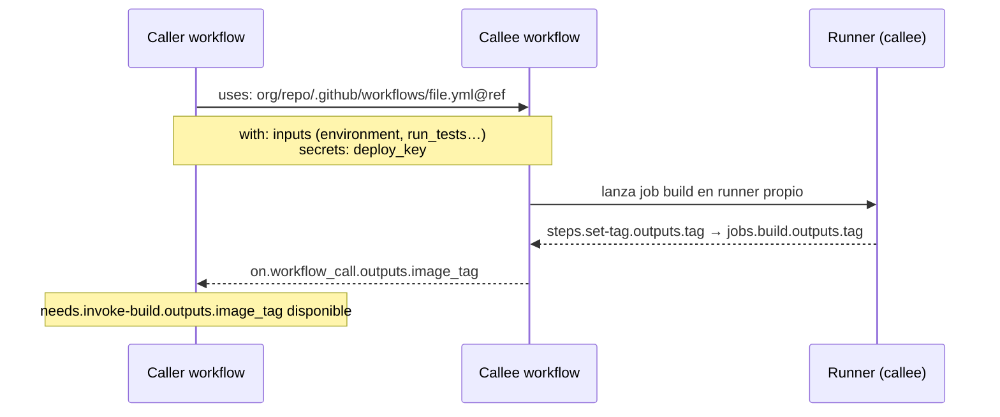
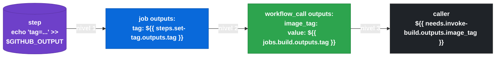

> Anterior: [2.7 Starter workflows](gha-d2-starter-workflows.md) | Siguiente: [2.8.2 Reusable workflows: restricciones y comparativa](gha-d2-reusable-workflows-avanzado.md)

# 2.8.1 Reusable workflows: sintaxis de llamada, inputs, secrets y outputs

## El problema que resuelven los reusable workflows

Cuando varios repositorios o pipelines necesitan ejecutar la misma lógica —compilar una imagen Docker, ejecutar un análisis de seguridad, desplegar en un entorno concreto— la tentación natural es copiar y pegar el bloque de YAML. El resultado es deuda técnica: cuando la lógica cambia hay que actualizar cada copia manualmente, con el riesgo de que una versión quede desactualizada.

Los reusable workflows resuelven este problema permitiendo que un workflow (el **callee**) sea invocado directamente desde otro workflow (el **caller**) como si fuera un job. El callee vive en su propio archivo `.yml`, puede estar en el mismo repositorio o en uno externo, y se versiona con la referencia habitual de Git (`@main`, `@v1.2`, `@abc1234`). El caller no copia nada: simplemente lo llama.

Es importante distinguir este mecanismo del uso de acciones (`uses:` dentro de un `step`). Una acción es un paso dentro de un job; un reusable workflow es un job completo que corre en su propio runner. Esto tiene implicaciones: el callee tiene su propio contexto de ejecución, sus propios secrets montados y su propio sistema de archivos.

## Anatomía de la llamada: el keyword `uses` a nivel de job

Para invocar un reusable workflow, el caller utiliza `uses:` directamente en la declaración del job, no dentro de `steps:`. Esta distinción es fundamental para el examen.

La forma general es:

```
uses: OWNER/REPO/.github/workflows/ARCHIVO.yml@REF
```

Donde `REF` puede ser una rama, una etiqueta o un SHA completo. Para workflows del mismo repositorio se puede omitir el prefijo `OWNER/REPO` y escribir `./.github/workflows/ARCHIVO.yml`.

El callee, por su parte, debe declarar `on: workflow_call` para anunciar que acepta ser invocado de esta forma. Sin ese trigger, GitHub rechazará la llamada.

## Diagrama: flujo caller → callee

El siguiente diagrama representa la relación entre los dos workflows durante la ejecución.


*Flujo de datos entre caller y callee: inputs y secrets van al callee; outputs regresar al caller en tres niveles.*

El caller pasa datos hacia el callee mediante `with:` (inputs) y `secrets:`. El callee devuelve datos al caller mediante `outputs:` definidos a nivel de workflow.

## Ejemplo central: caller completo con inputs, secrets y outputs

El siguiente ejemplo muestra un workflow de caller que invoca un reusable workflow de build y despliegue, pasando parámetros, propagando un secret y leyendo el output producido.

```yaml
# .github/workflows/pipeline.yml  (CALLER)
name: Pipeline principal

on:
  push:
    branches:
      - main

jobs:
  invoke-build:
    uses: my-org/shared-workflows/.github/workflows/build-and-push.yml@v2
    with:
      image_name: my-app
      environment: staging
      run_tests: true
    secrets:
      registry_token: ${{ secrets.DOCKER_REGISTRY_TOKEN }}

  notify:
    runs-on: ubuntu-latest
    needs: invoke-build
    steps:
      - name: Mostrar tag de imagen generado
        run: |
          echo "La imagen publicada tiene el tag: ${{ needs.invoke-build.outputs.image_tag }}"
```

Y el callee mínimo que corresponde a esa llamada:

```yaml
# .github/workflows/build-and-push.yml  (CALLEE, en my-org/shared-workflows)
name: Build and Push reusable

on:
  workflow_call:
    inputs:
      image_name:
        description: "Nombre de la imagen Docker"
        required: true
        type: string
      environment:
        description: "Entorno de destino"
        required: false
        default: "staging"
        type: string
      run_tests:
        description: "Ejecutar suite de tests antes del build"
        required: false
        default: false
        type: boolean
    secrets:
      registry_token:
        description: "Token para autenticarse en el registry"
        required: true
    outputs:
      image_tag:
        description: "Tag SHA de la imagen publicada"
        value: ${{ jobs.build.outputs.tag }}

jobs:
  build:
    runs-on: ubuntu-latest
    outputs:
      tag: ${{ steps.set-tag.outputs.tag }}
    steps:
      - uses: actions/checkout@v4

      - name: Ejecutar tests
        if: ${{ inputs.run_tests }}
        run: echo "Ejecutando tests para ${{ inputs.image_name }}"

      - name: Generar tag
        id: set-tag
        run: echo "tag=${{ inputs.image_name }}-${{ github.sha }}" >> "$GITHUB_OUTPUT"

      - name: Build y push de imagen
        run: |
          echo "Login al registry..."
          echo "${{ secrets.registry_token }}" | docker login -u _ --password-stdin ghcr.io
          docker build -t ghcr.io/my-org/${{ inputs.image_name }}:${{ steps.set-tag.outputs.tag }} .
          docker push ghcr.io/my-org/${{ inputs.image_name }}:${{ steps.set-tag.outputs.tag }}
```

Observa la cadena de outputs: el step `set-tag` escribe en `$GITHUB_OUTPUT`, el job `build` lo eleva con `outputs:`, y el workflow callee lo reexpone en `on.workflow_call.outputs`. Finalmente el caller accede mediante `needs.invoke-build.outputs.image_tag`.

## Tabla de elementos clave de la sintaxis de llamada

Los siguientes elementos configuran la relación caller-callee. Todos aparecen en el bloque del job del caller, excepto `workflow_call` que pertenece al callee.

| Elemento | Nivel | Descripción |
|---|---|---|
| `uses:` | job (caller) | Ruta al archivo callee con formato `owner/repo/.github/workflows/file.yml@ref` |
| `with:` | job (caller) | Diccionario de inputs que se pasan al callee; las claves deben coincidir con los `inputs` declarados en `workflow_call` |
| `secrets:` | job (caller) | Diccionario de secrets explícitamente pasados; la clave es el nombre que el callee espera |
| `secrets: inherit` | job (caller) | Propaga automáticamente todos los secrets del caller al callee sin listarlos uno a uno |
| `on: workflow_call` | workflow (callee) | Trigger que habilita al archivo a ser invocado como reusable workflow |
| `inputs:` | `workflow_call` (callee) | Declara los parámetros que el callee acepta, con tipo, descripción y valor por defecto |
| `secrets:` | `workflow_call` (callee) | Declara los secrets que el callee espera recibir |
| `outputs:` | `workflow_call` (callee) | Declara los valores que el callee expone hacia el caller |
| `needs.JOB.outputs.KEY` | step (caller) | Forma de acceder a los outputs del callee desde el caller |

## Tipos de inputs en `workflow_call`

Los inputs declarados en `on.workflow_call.inputs` admiten tres tipos: `string`, `boolean` y `number`. Declarar el tipo correcto no es opcional: GitHub validará que el valor pasado desde el caller sea compatible, y un tipo incorrecto producirá un error de validación antes de que el callee llegue a ejecutarse.

Cada input puede tener un campo `default:` que se usa cuando el caller no proporciona ese valor y `required: false`. Si `required: true` y el caller no lo pasa, GitHub también reportará error antes de ejecutar.

Dentro del callee, los valores se consumen con el contexto `inputs`: `${{ inputs.nombre_del_input }}`. Este contexto solo existe dentro de `workflow_call`; no existe en workflows normales.

## Secrets en reusable workflows: explícitos vs. `inherit`

Existen dos formas de pasar secrets a un callee. La primera es explícita: el caller lista cada secret bajo `secrets:` dentro del bloque del job, mapeando el nombre que el caller conoce al nombre que el callee espera. Esta forma es más segura porque limita exactamente qué secrets puede ver el callee.

La segunda forma es `secrets: inherit`. Cuando se usa esta palabra clave en lugar de un diccionario, GitHub propaga automáticamente todos los secrets del caller —incluyendo los de organización, repositorio y entorno— al callee, usando los mismos nombres. Esto simplifica la configuración cuando el callee necesita muchos secrets o cuando el nombre coincide exactamente. Sin embargo, implica que el callee tiene acceso a todos los secrets del contexto del caller, lo que puede ser excesivo en términos de mínimo privilegio.

```yaml
# Opción A: explícito
jobs:
  invoke:
    uses: ./.github/workflows/deploy.yml@main
    secrets:
      db_password: ${{ secrets.PRODUCTION_DB_PASSWORD }}
      api_key: ${{ secrets.THIRD_PARTY_KEY }}

# Opción B: propagación automática
jobs:
  invoke:
    uses: ./.github/workflows/deploy.yml@main
    secrets: inherit
```

## Acceder a outputs del callee desde el caller

Los outputs del callee se consumen en el caller exactamente igual que los outputs entre jobs normales: mediante la expresión `${{ needs.NOMBRE_DEL_JOB.outputs.CLAVE }}`. Para que funcione, el job del caller que consume el output debe declarar el job callee en su campo `needs:`.

La cadena de propagación es siempre de tres niveles: el step escribe en `$GITHUB_OUTPUT`, el job lo eleva en su bloque `outputs:`, y el callee lo reexpone en `on.workflow_call.outputs`. Si se omite cualquiera de esos tres niveles, el valor no llegará al caller.


*Cadena de tres niveles obligatoria — omitir cualquiera hace que el valor llegue vacío al caller.*

Es importante recordar que los outputs del callee son siempre de tipo string. Aunque el input sea de tipo `number` o `boolean`, al exponerse como output se convierte en string y el caller debe tenerlo en cuenta.

## Buenas y malas prácticas

Las siguientes prácticas cubren los errores más frecuentes al consumir reusable workflows y las recomendaciones que favorece GitHub.

**Pinear siempre la referencia del callee a una versión inmutable.**
Usar `@main` o `@latest` puede causar que una actualización del callee rompa silenciosamente los pipelines del caller. La buena práctica es usar un SHA completo o una etiqueta semántica (`@v2.1.0`) para tener builds reproducibles.

> Buena practica: `uses: my-org/shared/.github/workflows/build.yml@v2.1.0`
> Mala practica: `uses: my-org/shared/.github/workflows/build.yml@main`

**Preferir secrets explícitos sobre `secrets: inherit` para callees de terceros o de repositorios públicos.**
`secrets: inherit` es conveniente en equipos internos con alta confianza, pero un callee externo que hereda todos los secrets puede acceder a credenciales que no necesita. El mínimo privilegio obliga a listar solo los secrets necesarios.

> Buena practica: pasar solo `deploy_key` y `registry_token` si el callee solo los usa a ellos.
> Mala practica: usar `secrets: inherit` con un callee de un repositorio fuera del control del equipo.

**Declarar todos los outputs que el caller necesita en `on.workflow_call.outputs`.**
Si el callee produce un valor en `$GITHUB_OUTPUT` pero no lo expone en `workflow_call.outputs`, el caller no podrá acceder a él. No asumir que los outputs del job del callee son automáticamente visibles.

> Buena practica: reexponer explícitamente cada output relevante en la sección `outputs:` del callee.
> Mala practica: asumir que `needs.job.outputs.key` en el caller resolverá si el callee no declara ese output en `workflow_call`.

**Validar tipos de inputs en el callee antes de usarlos en comandos críticos.**
Aunque GitHub valida el tipo, un input de tipo `string` puede contener valores inesperados. Usar condicionales o pasos de validación temprana evita efectos secundarios.

> Buena practica: añadir un step inicial que valide que `inputs.environment` es uno de los valores permitidos.
> Mala practica: usar `${{ inputs.environment }}` directamente en una URL de despliegue sin sanitizar.

## Verificación y práctica

Las siguientes preguntas siguen el estilo del examen GH-200. Intenta responderlas antes de ver la respuesta.

**Pregunta 1.** Un job en un caller workflow tiene la siguiente configuración:

```yaml
jobs:
  deploy:
    uses: my-org/infra/.github/workflows/terraform.yml@v3
    with:
      workspace: production
```

El callee declara `inputs.workspace` con `required: true` y `type: string`. Pero el callee también necesita el secret `TF_API_TOKEN`. El caller no pasa ningún secret. ¿Qué ocurre?

> Respuesta: El workflow fallará en tiempo de ejecución o validación porque el callee declara el secret como `required: true` y el caller no lo proporciona. GitHub reportará un error antes de ejecutar ningún step del callee.

**Pregunta 2.** ¿Cuál es la diferencia entre usar `secrets: inherit` y listar secrets explícitamente en un job que invoca un reusable workflow?

> Respuesta: Con `secrets: inherit`, todos los secrets disponibles en el contexto del caller se propagan automáticamente al callee con el mismo nombre. Con la lista explícita, solo se pasan los secrets especificados, permitiendo remapear nombres y aplicar el principio de mínimo privilegio.

**Pregunta 3.** Un step del caller intenta leer `${{ needs.build.outputs.image_tag }}` pero el valor es siempre una cadena vacía. El step del callee escribe correctamente en `$GITHUB_OUTPUT`. ¿Cuál es la causa más probable?

> Respuesta: El callee no está reexponiendo ese output en la sección `outputs:` del bloque `on: workflow_call`. La cadena de propagación requiere tres niveles: step → job outputs → workflow_call outputs.

### Ejercicio práctico

Crea en tu repositorio un workflow callee en `.github/workflows/greet.yml` que:
- Declare `on: workflow_call`
- Acepte un input `username` de tipo `string` y `required: true`
- Acepte un secret `greeting_token` de tipo string
- Ejecute un step que imprima `Hola, <username>` (sin usar el secret realmente, solo que esté declarado)
- Exponga un output `message` con el valor `Hola, <username>`

Luego crea un caller en `.github/workflows/main.yml` que invoque ese callee pasando tu nombre de usuario de GitHub como input y que en un step posterior imprima el output recibido.

Verifica en la pestaña Actions que el output se transmite correctamente entre los dos workflows.

---

> Anterior: [2.7 Starter workflows](gha-d2-starter-workflows.md) | Siguiente: [2.8.2 Reusable workflows: restricciones y comparativa](gha-d2-reusable-workflows-avanzado.md)

