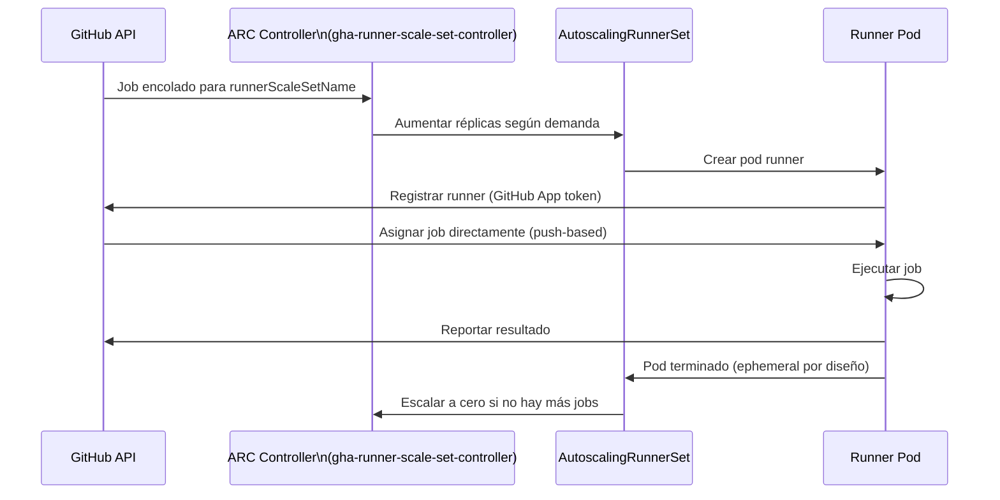
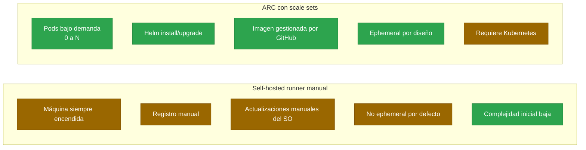

# 4.8 Actions Runner Controller (ARC) y Scale Sets

← [4.7.2 Self-Hosted Runners: seguridad](gha-d4-self-hosted-runners-seguridad.md) | [Índice](README.md) | [4.9.1 Secrets: UI](gha-d4-secrets-ui.md) →

---

Actions Runner Controller (ARC) es un operador de Kubernetes que gestiona el ciclo de vida de self-hosted runners automáticamente dentro de un clúster. En lugar de mantener máquinas permanentes esperando jobs, ARC escala runners según la demanda: crea pods cuando hay jobs en cola y los elimina cuando no hay trabajo, reduciendo costes y eliminando la gestión manual de runners.

> [CONCEPTO] ARC implementa el patrón operator de Kubernetes: extiende la API de K8s con Custom Resource Definitions (CRDs) y reconcilia continuamente el estado deseado (runners configurados) con el estado real (pods corriendo).

## Evolución del modelo: listener-based vs. scale sets

ARC ha evolucionado desde su modelo original hacia el modelo de **runner scale sets**, que es el modelo actual y recomendado. Es importante conocer la diferencia porque la documentación y recursos más antiguos aún mencionan el modelo basado en listener.

| Característica | Modelo listener (legacy) | Runner Scale Sets (actual) |
|----------------|--------------------------|---------------------------|
| CRD principal | `RunnerDeployment` | `AutoscalingRunnerSet` |
| Asignación de jobs | Compite entre runners | Asignación directa por GitHub |
| Eficiencia | Menor (polling) | Mayor (push-based) |
| Soporte oficial | Deprecado | Recomendado |
| Helm chart | `actions-runner-controller` | `gha-runner-scale-set-controller` + `gha-runner-scale-set` |

> [ADVERTENCIA] El modelo legacy basado en `RunnerDeployment` está deprecado. Para nuevas instalaciones usar siempre el modelo de runner scale sets con los Helm charts `gha-runner-scale-set-controller` y `gha-runner-scale-set`.

## Instalación de ARC con Helm

La instalación de ARC con el modelo de scale sets requiere dos charts de Helm: primero el controlador (una sola vez por clúster) y luego uno o más scale sets (uno por configuración de runner que se necesite).



*Flujo de ARC con scale sets: GitHub asigna jobs directamente a los pods (push-based), que se crean y destruyen por cada job.*

Los prerrequisitos son un clúster Kubernetes (1.25+), Helm 3+ instalado y acceso a la API de GitHub mediante GitHub App o PAT.

```bash
# 1. Añadir el repositorio Helm de ARC
helm repo add actions-runner-controller \
  https://actions-runner-controller.github.io/actions-runner-controller
helm repo update

# 2. Instalar el controlador (una sola vez por clúster)
helm install arc \
  --namespace arc-systems \
  --create-namespace \
  oci://ghcr.io/actions/actions-runner-controller-charts/gha-runner-scale-set-controller

# 3. Crear el secret con las credenciales de la GitHub App
kubectl create secret generic github-app-secret \
  --namespace arc-runners \
  --from-literal=github_app_id="APP_ID" \
  --from-literal=github_app_installation_id="INSTALLATION_ID" \
  --from-literal=github_app_private_key="$(cat private-key.pem)"

# 4. Instalar un runner scale set
helm install arc-runner-set \
  --namespace arc-runners \
  --create-namespace \
  --set githubConfigUrl="https://github.com/mi-organizacion" \
  --set githubConfigSecret="github-app-secret" \
  --set minRunners=0 \
  --set maxRunners=10 \
  oci://ghcr.io/actions/actions-runner-controller-charts/gha-runner-scale-set
```

## Tabla de elementos clave del RunnerScaleSet

Los parámetros del Helm chart del runner scale set controlan el comportamiento del autoscaling y la identidad con la que los runners se autentican ante GitHub. Los parámetros más relevantes para el examen GH-200 son los siguientes.

| Parámetro Helm | Tipo | Obligatorio | Default | Descripción |
|----------------|------|-------------|---------|-------------|
| `githubConfigUrl` | string | Sí | — | URL del repo, org o enterprise de destino |
| `githubConfigSecret` | string | Sí | — | Nombre del K8s secret con credenciales |
| `minRunners` | int | No | 0 | Mínimo de runners activos (0 = escala a cero) |
| `maxRunners` | int | No | — | Máximo de runners simultáneos |
| `runnerScaleSetName` | string | No | nombre del release | Label que usa el workflow en `runs-on` |
| `containerMode.type` | string | No | — | `dind` para Docker-in-Docker, `kubernetes` para modo K8s |

> [EXAMEN] El valor de `runnerScaleSetName` es el que se especifica en `runs-on` del workflow. Si no se configura, el workflow debe usar el nombre del Helm release como label en `runs-on`.

## Autenticación de ARC: GitHub App vs. PAT

ARC necesita autenticarse ante GitHub para recibir asignaciones de jobs y registrar runners. Existen dos métodos: GitHub App (recomendado) y Personal Access Token (PAT).

La GitHub App es preferida porque sus tokens de acceso expiran cada hora (se renuevan automáticamente), sus permisos son granulares y no están ligados a una cuenta de usuario individual. Un PAT expira según su configuración y si el usuario que lo generó pierde acceso, ARC deja de funcionar.

| Método | Permisos necesarios | Expiración | Recomendado |
|--------|---------------------|------------|-------------|
| GitHub App | `Actions: Read`, `Administration: Write` | Auto-renovable | Sí |
| PAT (classic) | `repo` (privado) o `public_repo` | Configurable | No |
| PAT (fine-grained) | `Actions: Read/Write` | Max 1 año | Aceptable |

## Ejemplo central

El siguiente ejemplo muestra la configuración completa de ARC para una organización: instalación del controlador, creación del secret de GitHub App, despliegue del scale set y el workflow que lo utiliza.

```yaml
# values-arc-runner-set.yaml
# Configuración del RunnerScaleSet para la organización
githubConfigUrl: "https://github.com/mi-organizacion"
githubConfigSecret: "github-app-secret"

# Autoscaling: de 0 a 5 runners según demanda
minRunners: 0
maxRunners: 5

# Nombre usado en runs-on del workflow
runnerScaleSetName: "arc-runner-set"

# Modo de contenedor: dind permite ejecutar Docker dentro del runner pod
containerMode:
  type: "dind"

# Configuración del pod del runner
template:
  spec:
    containers:
      - name: runner
        image: ghcr.io/actions/actions-runner:latest
        resources:
          requests:
            cpu: "500m"
            memory: "512Mi"
          limits:
            cpu: "2"
            memory: "2Gi"
```

```bash
# Desplegar con el archivo de valores
helm install arc-runner-set \
  --namespace arc-runners \
  --create-namespace \
  --values values-arc-runner-set.yaml \
  oci://ghcr.io/actions/actions-runner-controller-charts/gha-runner-scale-set
```

```yaml
# Workflow que usa el runner scale set de ARC
name: CI con ARC

on:
  push:
    branches: [main]
  pull_request:

jobs:
  build:
    # Usa el runnerScaleSetName configurado en Helm
    runs-on: arc-runner-set
    steps:
      - uses: actions/checkout@v4

      - name: Verificar entorno ARC
        run: |
          echo "Runner: $RUNNER_NAME"
          echo "OS: $RUNNER_OS"
          kubectl version --client 2>/dev/null || echo "kubectl no disponible en runner"

      - name: Build y test
        run: |
          docker build -t mi-app:${{ github.sha }} .
          docker run --rm mi-app:${{ github.sha }} npm test

  deploy:
    needs: build
    runs-on: arc-runner-set
    if: github.ref == 'refs/heads/main'
    steps:
      - uses: actions/checkout@v4
      - name: Deploy a staging
        run: ./scripts/deploy.sh staging
```

## ARC vs. self-hosted runner manual

La diferencia fundamental entre ARC y los self-hosted runners registrados manualmente es que ARC gestiona el ciclo de vida completo de los runners de forma automática y elástica. La tabla siguiente compara los dos enfoques para ayudar a decidir cuándo usar cada uno.



| Aspecto | Self-hosted runner manual | ARC con scale sets |
|---------|--------------------------|-------------------|
| Escalado | Manual (máquinas fijas) | Automático (0 a N pods) |
| Coste en reposo | Máquina siempre encendida | Cero pods (si `minRunners: 0`) |
| Gestión | Alta (registro, actualizaciones, SO) | Baja (Helm upgrades) |
| Aislamiento | Por máquina | Por pod (K8s namespaces) |
| Ephemeral por defecto | No (requiere `--ephemeral`) | Sí (cada job = pod nuevo) |
| Complejidad inicial | Baja | Alta (requiere K8s) |

> [CONCEPTO] ARC en modo scale sets crea un pod por job y lo destruye al terminar. Es ephemeral por diseño, lo que elimina la contaminación entre ejecuciones sin configuración adicional.

## Buenas y malas prácticas

**Hacer:**
- Usar GitHub App en lugar de PAT para autenticar ARC — razón: los tokens se renuevan automáticamente y los permisos no están ligados a un usuario individual.
- Configurar `minRunners: 0` en entornos de baja demanda — razón: escala a cero cuando no hay jobs, eliminando el coste de pods en reposo.
- Definir `resources.requests` y `resources.limits` en la spec del pod — razón: evita que runners consuman todos los recursos del nodo y afecten a otras cargas del clúster.
- Usar el modelo de runner scale sets (charts `gha-runner-scale-set-*`) en lugar del modelo legacy — razón: el modelo legacy está deprecado y recibirá menos soporte y actualizaciones.

**Evitar:**
- Usar el modelo legacy `RunnerDeployment` para nuevas instalaciones — razón: está deprecado; migrar al modelo de scale sets para obtener mejor soporte y asignación de jobs más eficiente.
- Omitir `maxRunners` en entornos de producción — razón: sin límite superior, un spike de jobs puede crear cientos de pods y saturar el clúster.
- Almacenar el private key de la GitHub App directamente en el values.yaml de Helm — razón: el archivo quedaría en el repositorio; usar siempre K8s secrets o un gestor de secretos como Vault.

## Verificación y práctica

**Pregunta 1:** ¿Cuál es la diferencia principal entre el modelo legacy de ARC (`RunnerDeployment`) y el modelo de runner scale sets?

Respuesta: En el modelo legacy, los runners compiten por jobs mediante polling. En el modelo de scale sets, GitHub asigna jobs directamente a los runners (push-based), lo que es más eficiente. Además, el modelo legacy está deprecado y el de scale sets es el recomendado actualmente.

**Pregunta 2:** ¿Qué parámetro del Helm chart controla el nombre que se usa en `runs-on` del workflow?

Respuesta: El parámetro `runnerScaleSetName`. Si no se especifica, se usa el nombre del Helm release (`helm install <nombre>`).

**Pregunta 3:** ¿Por qué se recomienda GitHub App sobre PAT para autenticar ARC?

Respuesta: La GitHub App renueva sus tokens automáticamente cada hora, tiene permisos granulares y no está vinculada a una cuenta de usuario. Un PAT expira y si el usuario pierde acceso a la organización, ARC deja de funcionar.

**Ejercicio:** Dado el siguiente values.yaml incompleto para ARC, añade los parámetros faltantes para que el scale set escale entre 1 y 8 runners, use una GitHub App para autenticarse y el workflow pueda referenciarlo con `runs-on: runners-backend`.

```yaml
# values incompleto
githubConfigUrl: "https://github.com/mi-org"
# COMPLETAR: secret, escalado, nombre
```

```yaml
# Solución
githubConfigUrl: "https://github.com/mi-org"
githubConfigSecret: "github-app-secret"
minRunners: 1
maxRunners: 8
runnerScaleSetName: "runners-backend"

# Workflow que lo usa
# runs-on: runners-backend
```

---
← [4.7.2 Self-Hosted Runners: seguridad](gha-d4-self-hosted-runners-seguridad.md) | [Índice](README.md) | [4.9.1 Secrets: UI](gha-d4-secrets-ui.md) →
