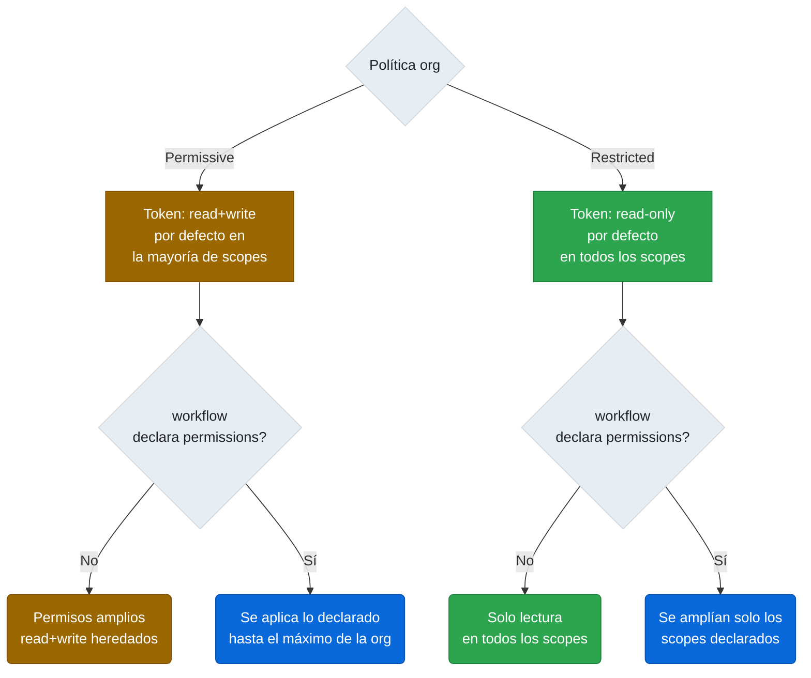

← [4.3.1 Políticas allow-list](gha-d4-politicas-allow-list.md) | [Índice](README.md) | [4.4 IP Allow Lists](gha-d4-ip-allow-lists.md) →

# 4.3.2 Permisos predeterminados de GITHUB_TOKEN y retención de datos a nivel org

Dos configuraciones de organización que a menudo pasan desapercibidas en el onboarding tienen consecuencias directas en la seguridad y en los costos de almacenamiento: el modo de permisos por defecto del `GITHUB_TOKEN` y la retención de artefactos y logs. Comprenderlas antes de que un incidente las haga visibles es el objetivo de este documento.

## Modos de permisos del GITHUB_TOKEN a nivel org

GitHub ofrece dos modos globales para los permisos del `GITHUB_TOKEN`, configurables en **Settings > Actions > General** a nivel de organización y también a nivel de repositorio individual.

**Modo permissive (read+write por defecto):** el token recibe permisos de lectura y escritura en la mayoría de scopes (`contents: write`, `pull-requests: write`, `issues: write`, etc.) a menos que el workflow los restrinja explícitamente. Es el modo histórico y es el que tienen activado muchas organizaciones que no han revisado esta configuración.

**Modo restricted (read-only por defecto):** el token solo recibe permisos de lectura en todos los scopes. Cualquier operación de escritura requiere que el workflow o el job declaren explícitamente el permiso necesario mediante la clave `permissions`. Este es el modo recomendado por GitHub desde 2023 para nuevas organizaciones.

La regla de override entre org y repositorio es estricta: un repositorio puede igualar o endurecer la política de la organización, pero **nunca puede ser más permisivo**. Si la org está en modo restricted, un administrador de repositorio no puede cambiar ese repositorio a modo permissive.



*La declaración `permissions:` en el workflow interactúa con la política de la org: la política establece el techo, el workflow puede moverse dentro de ese techo.*

> **Trampa de examen:** la política de token a nivel org no sobreescribe la declaración `permissions:` en el workflow. Lo que aplica es el **mínimo** entre la política org/repo y lo declarado en el workflow. Si la org está en modo restricted (read-only) y el workflow declara `contents: write`, el token efectivamente recibe `contents: write` porque el workflow lo ha solicitado explícitamente. Si el workflow no declara nada y la política org es permissive, el token recibe los permisos amplios por defecto. El workflow puede siempre reducir permisos; la política org establece el techo máximo permitido.

## Retención de artefactos y logs

La retención controla cuánto tiempo GitHub almacena los artefactos producidos por `actions/upload-artifact` y los logs de las ejecuciones antes de eliminarlos automáticamente. La configuración vive en **Settings > Actions > General** tanto a nivel de organización como de repositorio.

Los valores por defecto y los rangos configurables son:

| Tipo de dato | Valor por defecto | Rango configurable |
|---|---|---|
| Artefactos | 90 días | 1 – 400 días |
| Logs de workflow | 90 días | 1 – 400 días |

Un repositorio puede configurar un valor menor al de la organización, pero no mayor. Si la organización establece retención máxima de 30 días, ningún repositorio puede configurar 90 días.

Adicionalmente, cada ejecución de `actions/upload-artifact` acepta el parámetro `retention-days` para sobreescribir la retención del repositorio para ese artefacto específico. El valor no puede superar la retención máxima configurada en el repositorio u organización.

## Límites de almacenamiento por plan de GitHub

El almacenamiento de artefactos y caché consume el límite de almacenamiento de la cuenta. Los límites oficiales actuales son:

| Plan | Almacenamiento de artefactos | Almacenamiento de caché |
|---|---|---|
| GitHub Free (personal) | 500 MB | 10 GB |
| GitHub Free (organizaciones) | 500 MB | 10 GB |
| GitHub Pro | 1 GB | 10 GB |
| GitHub Team | 2 GB | 10 GB |
| GitHub Enterprise Cloud | 50 GB | 10 GB |

Los logs no cuentan contra el límite de almacenamiento. El caché (`actions/cache`) tiene su propio límite separado y se elimina automáticamente cuando no ha sido accedido en 7 días o cuando el total de la organización supera el límite del plan, empezando por los caches más antiguos.

> **Punto de examen:** el límite de 500 MB en el plan Free se refiere a artefactos, no incluye el almacenamiento de caché que tiene su propio presupuesto de 10 GB. Son dos contadores independientes.

## Tabla comparativa: modo permissive vs. restricted

| Dimensión | Permissive (read+write) | Restricted (read-only) |
|---|---|---|
| **Permisos por defecto** | read+write en la mayoría de scopes | read en todos los scopes |
| **Requiere declarar `permissions:`** | No (para operaciones de escritura habituales) | Sí, para cualquier operación de escritura |
| **Riesgo si el workflow es comprometido** | Alto: el token puede modificar código, crear releases, comentar PRs | Bajo: el token no puede escribir sin declaración explícita |
| **Compatibilidad con workflows legacy** | Alta: los workflows sin `permissions:` siguen funcionando | Baja: workflows legacy pueden fallar si asumen write |
| **Recomendación GitHub** | No recomendado para organizaciones nuevas | Recomendado como punto de partida seguro |
| **Override desde el workflow** | Se puede reducir con `permissions:` | Se puede ampliar con `permissions:` hasta el máximo permitido |

## Ejemplo central: workflow con permissions a nivel top y por job

El siguiente workflow muestra la práctica recomendada: declarar `permissions: {}` a nivel raíz para revocar todo, y luego conceder exactamente lo necesario en cada job.

```yaml
# .github/workflows/release-seguro.yml
name: Release seguro

on:
  push:
    tags:
      - "v*"

# Revocación total a nivel de workflow: ningún job hereda permisos por defecto
permissions: {}

jobs:
  build:
    runs-on: ubuntu-latest
    permissions:
      contents: read     # solo lectura para checkout
    outputs:
      version: ${{ steps.get-version.outputs.version }}
    steps:
      - name: Checkout
        uses: actions/checkout@v4

      - name: Obtener versión del tag
        id: get-version
        run: echo "version=${GITHUB_REF_NAME}" >> $GITHUB_OUTPUT

      - name: Compilar aplicación
        run: |
          mkdir -p dist
          echo "build-${{ github.sha }}" > dist/app.bin

      - name: Subir artefacto
        uses: actions/upload-artifact@v4
        with:
          name: app-binary
          path: dist/
          retention-days: 7    # sobreescribe retención del repo para este artefacto

  create-release:
    needs: build
    runs-on: ubuntu-latest
    permissions:
      contents: write    # necesario para crear releases y subir assets
    steps:
      - name: Descargar artefacto compilado
        uses: actions/download-artifact@v4
        with:
          name: app-binary
          path: ./dist

      - name: Crear GitHub Release
        uses: actions/github-script@v7
        with:
          script: |
            const fs = require('fs');
            const release = await github.rest.repos.createRelease({
              owner: context.repo.owner,
              repo: context.repo.repo,
              tag_name: '${{ needs.build.outputs.version }}',
              name: 'Release ${{ needs.build.outputs.version }}',
              draft: false,
            });
            console.log('Release creada:', release.data.html_url);

  notify-team:
    needs: create-release
    runs-on: ubuntu-latest
    permissions:
      issues: write      # para comentar en issues relacionados
    steps:
      - name: Comentar en issues con label "pending-release"
        uses: actions/github-script@v7
        with:
          script: |
            const issues = await github.rest.issues.listForRepo({
              owner: context.repo.owner,
              repo: context.repo.repo,
              labels: 'pending-release',
              state: 'open',
            });
            for (const issue of issues.data) {
              await github.rest.issues.createComment({
                owner: context.repo.owner,
                repo: context.repo.repo,
                issue_number: issue.number,
                body: `Publicada la release ${{ needs.build.outputs.version }}.`,
              });
            }
```

En este workflow, el job `build` solo puede leer el repositorio; no puede escribir ni crear issues. El job `create-release` tiene `contents: write` para publicar la release. El job `notify-team` tiene `issues: write` únicamente para comentar. Cualquier scope no declarado dentro de un job con `permissions:` explícito queda automáticamente en `none`.

## Buenas prácticas

**Token permissions:** adoptar modo restricted a nivel de organización y usar `permissions: {}` como línea de apertura en todos los workflows nuevos. Añadir scopes según los identifique un error de permisos, no de forma preventiva.

**Retención de artefactos:** reducir la retención por defecto a 30 días en la organización para la mayoría de repositorios. Usar `retention-days: N` en `upload-artifact` para artefactos de debugging que solo se necesitan 3-5 días. Solo aumentar la retención para artefactos de auditoría o compliance con requisitos legales.

**Almacenamiento de caché:** monitorizar el uso total de caché si se está en el plan Free. Un pipeline de Go o Rust con múltiples matrices puede consumir los 10 GB disponibles rápidamente; configurar claves de caché que incluyan la semana o el mes del año puede reducir la acumulación.

## Preguntas de verificación GH-200

**P1.** Una organización tiene el modo restricted activo. Un workflow declara `permissions: contents: write` a nivel de workflow y un job específico no declara `permissions`. ¿Qué permisos tiene ese job sobre `contents`?

<details>
<summary>Respuesta</summary>
`contents: write`. El job hereda los permisos declarados a nivel de workflow (`contents: write`) porque no tiene su propio bloque `permissions`. La política restricted de la org no bloquea esto porque el workflow lo ha declarado explícitamente; el modo restricted solo afecta cuando no hay declaración en el workflow.
</details>

**P2.** Un repositorio tiene retención de artefactos configurada a 60 días. Un step usa `actions/upload-artifact@v4` con `retention-days: 90`. ¿Cuántos días se retiene el artefacto?

<details>
<summary>Respuesta</summary>
60 días. El valor declarado en `upload-artifact` no puede superar la retención máxima configurada en el repositorio u organización. GitHub aplica el mínimo entre el valor del step y el límite del repositorio.
</details>

**P3.** ¿Qué ocurre con los permisos de los scopes no declarados cuando un job tiene un bloque `permissions:` explícito?

<details>
<summary>Respuesta</summary>
Quedan a `none`. Cuando se declara `permissions:` en un job (o en el workflow), todos los scopes no mencionados son revocados. No existe herencia parcial desde la política org para los scopes omitidos; la declaración explícita reemplaza completamente los defaults.
</details>

---

← [4.3.1 Políticas allow-list](gha-d4-politicas-allow-list.md) | [Índice](README.md) | [4.4 IP Allow Lists](gha-d4-ip-allow-lists.md) →
