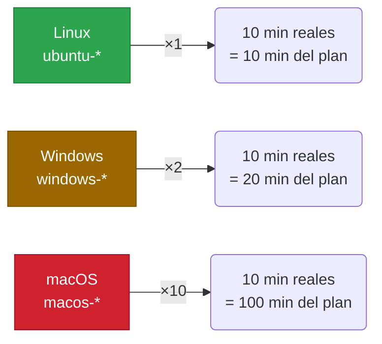

# 4.6 Preinstalled Software en GitHub-Hosted Runners

← [4.5.2 Runner Groups: asignación](gha-d4-runner-groups-asignacion.md) | [Índice](README.md) | [4.7.1 Self-Hosted Runners: registro](gha-d4-self-hosted-runners-registro.md) →

---

Los runners GitHub-hosted son máquinas virtuales efímeras que GitHub aprovisiona, ejecuta y destruye por cada job. Su gran ventaja es que vienen con un conjunto amplio de herramientas preinstaladas, lo que elimina la necesidad de instalar dependencias básicas en cada workflow. Saber exactamente qué software está disponible en cada imagen permite diseñar workflows más rápidos, evitar instalaciones redundantes y anticipar posibles problemas cuando las imágenes se actualizan. Para el examen GH-200, es esencial conocer las imágenes disponibles, las herramientas preinstaladas más comunes, cómo consultar el inventario completo y cómo afectan los multiplicadores de minutos al coste.

## Imágenes de runner disponibles

GitHub ofrece varias imágenes para runners hosted. Cada imagen corresponde a un sistema operativo y versión. En los workflows se especifica la imagen en `runs-on`.

Las imágenes más relevantes para el examen son:

| Label en `runs-on` | Sistema operativo | Notas |
|---|---|---|
| `ubuntu-latest` | Ubuntu (versión actual) | Apunta a la versión LTS más reciente; puede cambiar |
| `ubuntu-24.04` | Ubuntu 24.04 LTS | Versión fija, más predecible |
| `ubuntu-22.04` | Ubuntu 22.04 LTS | Versión fija, ampliamente usada |
| `ubuntu-20.04` | Ubuntu 20.04 LTS | Versión fija, en proceso de deprecación |
| `windows-latest` | Windows Server (versión actual) | Puede cambiar de versión subyacente |
| `windows-2022` | Windows Server 2022 | Versión fija |
| `macos-latest` | macOS (versión actual) | Mayor coste; puede cambiar |
| `macos-14` | macOS 14 Sonoma | Versión fija; procesadores Apple Silicon |
| `macos-13` | macOS 13 Ventura | Versión fija; procesadores Intel |

> **Clave para el examen:** Las labels `-latest` son convenientes pero introducen riesgo de rotura silenciosa cuando GitHub actualiza la versión subyacente. Para workflows de producción, preferir versiones fijas como `ubuntu-22.04`.

## Herramientas preinstaladas en ubuntu-latest

La imagen de Ubuntu es la más usada y contiene un inventario extenso de herramientas. Las más relevantes para el examen GH-200 son:

Las herramientas de **lenguajes y runtimes** preinstaladas incluyen múltiples versiones de Node.js, Python, Java (OpenJDK), Ruby, Go, .NET y PHP. No es necesario instalarlas manualmente para versiones estándar, aunque sí es recomendable usar las actions `setup-*` para fijar versiones exactas.

Las herramientas de **contenedores e infraestructura** incluyen Docker (con soporte de Docker Compose), kubectl, Helm, Terraform y AWS CLI, Azure CLI, Google Cloud SDK.

Las herramientas de **build y testing** incluyen Maven, Gradle, Ant, cmake, make, y varios frameworks de testing.

```yaml
# Ejemplo: verificar versiones disponibles sin instalar nada
name: Check preinstalled tools

on: workflow_dispatch

jobs:
  check:
    runs-on: ubuntu-latest
    steps:
      - name: Versiones preinstaladas
        run: |
          node --version
          python3 --version
          java -version
          docker --version
          kubectl version --client
          terraform --version
          aws --version
```

## Cómo consultar el software preinstalado

Conocer la lista completa de software preinstalado es fundamental para diseñar workflows eficientes. GitHub proporciona dos mecanismos para consultarlo.

**Mecanismo 1: Enlace en la UI de GitHub Actions.** En cada job completado, el log de la step "Set up job" muestra un enlace llamado **"Included software"** que apunta a la página de documentación de la imagen exacta que se usó. Este enlace refleja la versión real de la imagen que ejecutó el job, no una versión genérica.

**Mecanismo 2: Repositorio `actions/runner-images`.** El repositorio público `github.com/actions/runner-images` contiene las definiciones de todas las imágenes, incluidos los scripts de instalación y archivos de documentación con el inventario completo. Para cada imagen existe un archivo como `Ubuntu2204-Readme.md` que lista todas las herramientas instaladas con sus versiones.

> **Clave para el examen:** Para saber exactamente qué hay instalado, consultar el repositorio `github.com/actions/runner-images` o el enlace "Included software" en los logs de ejecución. No asumir que una herramienta está disponible sin verificarlo.

## Multiplicadores de minutos por sistema operativo

El uso de runners GitHub-hosted consume minutos del plan de la organización o cuenta. Sin embargo, los minutos no se contabilizan de la misma forma para todos los sistemas operativos: se aplican **multiplicadores** que reflejan el coste relativo de aprovisionar cada tipo de máquina.

Los multiplicadores oficiales son:

| Sistema operativo | Multiplicador | Ejemplo: job de 10 min reales |
|---|---|---|
| Linux (ubuntu-*) | x1 | Consume 10 minutos del plan |
| Windows (windows-*) | x2 | Consume 20 minutos del plan |
| macOS (macos-*) | x10 | Consume 100 minutos del plan |

Esto significa que un job de 10 minutos en macOS consume lo mismo del plan que 100 jobs de 1 minuto en Linux. Para organizaciones con planes limitados de minutos, esta diferencia es crítica.

> **Clave para el examen:** Los multiplicadores son Linux x1, Windows x2, macOS x10. Un job de macOS es 10 veces más "caro" en minutos del plan que el mismo job en Linux.

La implicación práctica es que los jobs que no requieren macOS o Windows de forma estricta (tests de lógica de negocio, linting, builds de contenedores) deben ejecutarse en Linux para optimizar el consumo de minutos.



*Multiplicadores de minutos: un job de 10 minutos en macOS consume el mismo presupuesto que 10 jobs idénticos en Linux.*

## Actualización semanal de imágenes y riesgo de rotura

Las imágenes de GitHub-hosted runners se **actualizan semanalmente**. GitHub instala versiones más recientes de las herramientas preinstaladas, aplica parches de seguridad y puede añadir o retirar herramientas.

Esta actualización automática tiene consecuencias para los workflows:

1. **Versión de herramienta cambia sin aviso:** Si el workflow asume que `node --version` devolverá `v18.x`, una actualización semanal puede cambiarlo a `v20.x`, potencialmente rompiendo el build.
2. **Herramienta retirada:** En raras ocasiones, una herramienta obsoleta se elimina de la imagen en una actualización.
3. **Cambio de label `-latest`:** Cuando GitHub decide que `ubuntu-latest` ahora apunta a Ubuntu 24.04 en lugar de 22.04, todos los workflows que usan `ubuntu-latest` cambian de entorno.

La mitigación principal es usar **actions `setup-*`** para fijar versiones exactas de los runtimes más importantes.

> **Advertencia:** No fijar versiones con `setup-*` y depender de las versiones preinstaladas introduce el riesgo de que una actualización semanal de la imagen rompa silenciosamente los workflows. Los workflows de producción siempre deben fijar versiones.

## Actions setup-* para versiones específicas

Las actions del namespace `actions/` proporcionan una forma estándar de instalar o activar versiones específicas de runtimes, incluso si ya están preinstalados:

| Action | Propósito | Ejemplo de versión |
|---|---|---|
| `actions/setup-node` | Node.js | `node-version: '20.x'` |
| `actions/setup-python` | Python | `python-version: '3.11'` |
| `actions/setup-java` | Java (JDK) | `java-version: '21'` |
| `actions/setup-go` | Go | `go-version: '1.22'` |
| `actions/setup-dotnet` | .NET | `dotnet-version: '8.x'` |
| `actions/setup-ruby` | Ruby | `ruby-version: '3.2'` |

Estas actions usan el **tool cache** del runner para evitar descargas repetidas en jobs consecutivos del mismo runner (aunque en runners efímeros esto es menos relevante que en self-hosted).

## Ejemplo central

Un equipo necesita un workflow que compile un proyecto Java, ejecute tests y construya una imagen Docker. En lugar de instalar Java manualmente, aprovecha el software preinstalado, pero fija la versión con `setup-java` para evitar sorpresas con las actualizaciones de imagen.

```yaml
# .github/workflows/build-and-test.yml
name: Build, Test and Docker

on:
  push:
    branches: [main, develop]
  pull_request:
    branches: [main]

jobs:
  build-and-test:
    # Linux x1 multiplicador: más económico en minutos del plan
    runs-on: ubuntu-22.04  # Versión fija, no ubuntu-latest
    steps:
      - uses: actions/checkout@v4

      # Fijar versión de Java aunque ya esté preinstalado
      # Evita rotura si la imagen actualiza la versión por defecto
      - uses: actions/setup-java@v4
        with:
          java-version: '21'
          distribution: 'temurin'

      # Maven ya está preinstalado en ubuntu-22.04
      - name: Build con Maven
        run: mvn -B package --no-transfer-progress

      # Tests
      - name: Ejecutar tests
        run: mvn -B test --no-transfer-progress

      # Docker ya está preinstalado en ubuntu-22.04
      - name: Build Docker image
        run: |
          docker build -t myapp:${{ github.sha }} .
          docker images myapp

      # Verificar software preinstalado (útil para debugging)
      - name: Información del entorno
        if: failure()  # Solo si algo falla
        run: |
          java -version
          mvn --version
          docker --version

  # Job de tests en Windows para verificar compatibilidad
  # NOTA: Windows x2 — consume el doble de minutos del plan
  test-windows:
    runs-on: windows-2022
    # Solo ejecutar en PR hacia main para controlar consumo de minutos
    if: github.event_name == 'pull_request'
    steps:
      - uses: actions/checkout@v4
      - uses: actions/setup-java@v4
        with:
          java-version: '21'
          distribution: 'temurin'
      - name: Tests en Windows
        run: mvn -B test --no-transfer-progress

  # macOS solo para tests específicos de plataforma
  # NOTA: macOS x10 — muy costoso en minutos del plan
  test-macos:
    runs-on: macos-14
    # Solo en push a main, no en cada PR
    if: github.ref == 'refs/heads/main'
    steps:
      - uses: actions/checkout@v4
      - uses: actions/setup-java@v4
        with:
          java-version: '21'
          distribution: 'temurin'
      - name: Tests en macOS
        run: mvn -B test --no-transfer-progress
```

Este ejemplo muestra tres patrones importantes: uso de versión fija de imagen (`ubuntu-22.04`), fijado de versión de runtime con `setup-java`, y control de costes ejecutando jobs de Windows y macOS solo cuando es necesario.

## Tabla de elementos clave

Esta tabla resume los aspectos del software preinstalado más relevantes para el examen GH-200.

| Aspecto | Detalle | Impacto |
|---|---|---|
| Imagen `ubuntu-latest` | Apunta a la LTS más reciente; puede cambiar | Posible rotura silenciosa al cambiar versión de Ubuntu |
| Imagen versión fija (`ubuntu-22.04`) | Entorno estable y predecible | Recomendado para producción |
| Multiplicador Linux | x1 | Referencia base de coste |
| Multiplicador Windows | x2 | El doble de minutos del plan |
| Multiplicador macOS | x10 | Diez veces más minutos del plan |
| Frecuencia de actualización | Semanal | Herramientas preinstaladas pueden cambiar versión |
| Consulta de inventario | `github.com/actions/runner-images` o "Included software" en logs | Fuente de verdad para versiones exactas |
| Fijado de versión | `actions/setup-node`, `setup-python`, etc. | Protege contra cambios en actualizaciones de imagen |

## Buenas y malas prácticas

**Hacer:**
- Usar versiones de imagen fijas (`ubuntu-22.04`) en workflows de producción — razón: las labels `-latest` pueden cambiar de versión subyacente sin previo aviso, rompiendo el workflow.
- Fijar la versión de runtimes con `actions/setup-*` aunque estén preinstalados — razón: las actualizaciones semanales de imagen pueden cambiar la versión por defecto y romper el build.
- Ejecutar jobs que no requieren macOS en Linux — razón: el multiplicador x10 de macOS hace que los minutos del plan se consuman diez veces más rápido.
- Consultar `github.com/actions/runner-images` antes de asumir que una herramienta está disponible — razón: la lista de software preinstalado varía entre imágenes y versiones.

**Evitar:**
- Depender de la versión exacta de una herramienta preinstalada sin fijarla — razón: las actualizaciones semanales pueden cambiar la versión y romper silenciosamente el workflow.
- Usar `ubuntu-latest` en workflows donde la estabilidad del entorno es crítica — razón: cuando GitHub actualiza `ubuntu-latest` a una nueva versión de Ubuntu, el entorno cambia completamente.
- Instalar herramientas que ya están preinstaladas desde cero sin necesidad — razón: aumenta el tiempo de ejecución del job y el consumo de minutos del plan sin beneficio.

## Verificación y práctica

Las siguientes preguntas están modeladas sobre el formato del examen GH-200.

**Pregunta 1:** Un workflow con tres jobs idénticos de 10 minutos cada uno se ejecuta en Linux, Windows y macOS respectivamente. ¿Cuántos minutos del plan consume en total?

> **Respuesta: 130 minutos.** Linux: 10 × 1 = 10 minutos. Windows: 10 × 2 = 20 minutos. macOS: 10 × 10 = 100 minutos. Total: 10 + 20 + 100 = 130 minutos. El job de macOS representa el 77% del consumo total aunque dure lo mismo que los otros dos.

**Pregunta 2:** ¿Dónde se puede consultar la lista exacta de software preinstalado en la imagen `ubuntu-22.04`?

> **Respuesta:** En dos lugares: (1) el repositorio público `github.com/actions/runner-images`, donde existe un archivo `Ubuntu2204-Readme.md` con el inventario completo; y (2) el enlace "Included software" que aparece en los logs de la step "Set up job" de cualquier job que haya usado esa imagen.

**Pregunta 3:** Un workflow usa `runs-on: ubuntu-latest` y en `runs` invoca directamente `node` sin `actions/setup-node`. Ha funcionado correctamente durante 6 meses. ¿Qué riesgo existe?

> **Respuesta:** Dos riesgos distintos: (1) GitHub puede actualizar `ubuntu-latest` para que apunte a una nueva versión de Ubuntu (por ejemplo, de 22.04 a 24.04), cambiando las versiones de todas las herramientas preinstaladas. (2) Las actualizaciones semanales de imagen pueden cambiar la versión de Node.js preinstalada, potencialmente rompiendo código que depende de características de una versión específica. La mitigación es usar `ubuntu-22.04` (versión fija) y `actions/setup-node` con una versión explícita.

**Ejercicio práctico:** Escribe un workflow que ejecute tests de Python en tres versiones (3.10, 3.11, 3.12) en Linux, y que además ejecute los mismos tests en Windows solo para Python 3.12. Ten en cuenta los multiplicadores de minutos.

```yaml
# Solución:
name: Python Tests Matrix

on: [push, pull_request]

jobs:
  test-linux:
    # Linux x1 — ejecutar matrix completa en Linux
    runs-on: ubuntu-22.04
    strategy:
      matrix:
        python-version: ['3.10', '3.11', '3.12']
    steps:
      - uses: actions/checkout@v4
      - uses: actions/setup-python@v5
        with:
          python-version: ${{ matrix.python-version }}
      - run: |
          pip install -r requirements.txt
          pytest

  test-windows:
    # Windows x2 — solo la versión más reciente para controlar costes
    runs-on: windows-2022
    steps:
      - uses: actions/checkout@v4
      - uses: actions/setup-python@v5
        with:
          python-version: '3.12'
      - run: |
          pip install -r requirements.txt
          pytest
```

---

← [4.5.2 Runner Groups: asignación](gha-d4-runner-groups-asignacion.md) | [Índice](README.md) | [4.7.1 Self-Hosted Runners: registro](gha-d4-self-hosted-runners-registro.md) →
