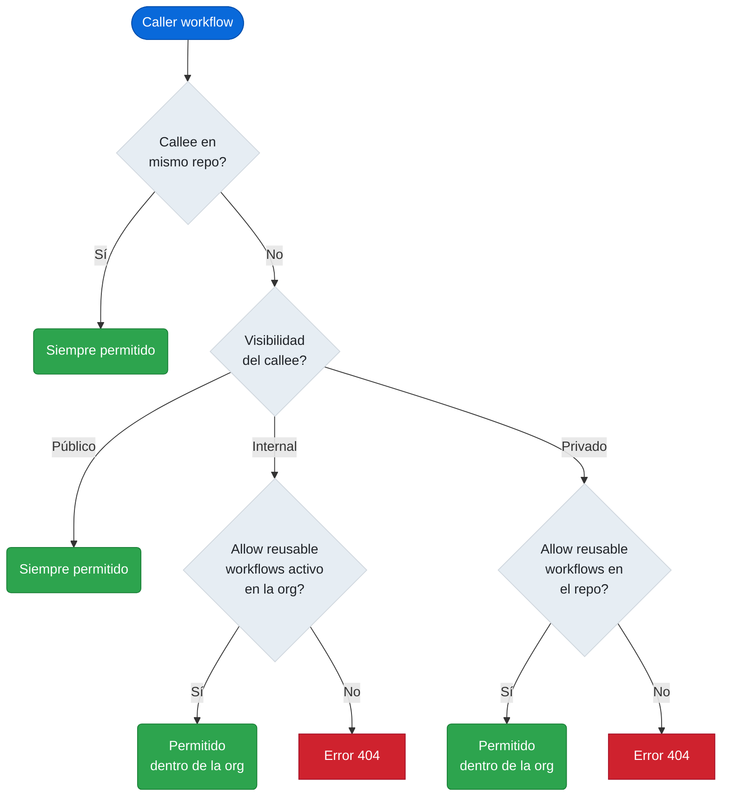

# 4.2.1 Reusable Workflows: autoría, on: workflow_call, inputs, outputs y secrets

← [4.1 Workflow Templates](gha-d4-workflow-templates.md) | [Índice](README.md) | [4.2.2 Reusable Workflows: consumo](gha-d4-reusable-workflows-consumo.md) →

---

Un reusable workflow es un archivo `.yml` que declara `on: workflow_call` y puede ser invocado desde otro workflow (el caller) como si fuera un job. En lugar de copiar lógica de CI/CD entre repositorios, el callee vive en un único lugar, se versiona con Git y el caller lo llama con una referencia inmutable. Esta sección cubre la perspectiva del **autor del callee**: cómo declarar la interfaz completa de `workflow_call` con inputs tipados, outputs y secrets.

> **Distinción clave para el examen (GH-200):** un reusable workflow lanza sus **propios jobs en runners independientes**; una composite action ejecuta sus pasos **en el mismo runner del job padre**. La elección entre ambos depende de si se necesita aislamiento de runner, matrices propias o lógica multi-job.

## Trigger on: workflow_call

Para que un archivo YAML pueda ser invocado como reusable workflow debe declarar `workflow_call` dentro de la clave `on:`. Sin este trigger, cualquier intento de referenciarlo con `uses:` desde un caller producirá un error de validación inmediato.

```yaml
on:
  workflow_call:
    inputs:  # opcional
    secrets: # opcional
    outputs: # opcional
```

El bloque `workflow_call` acepta tres sub-claves opcionales: `inputs`, `secrets` y `outputs`. Si el callee no necesita recibir parámetros ni exponer resultados, puede declarar `on: workflow_call` sin sub-claves. En la práctica, casi todos los callees útiles definen al menos `inputs` o `secrets`.

> **Requisito de accesibilidad:** el archivo callee debe estar en la **rama predeterminada** del repositorio (normalmente `main`) para ser invocable desde repositorios externos. Si el archivo solo existe en una rama de feature, los callers de otros repos no podrán encontrarlo. Dentro del mismo repositorio sí se puede referenciar cualquier rama con `@nombre-rama`.

## Inputs tipados

Los inputs tipados permiten al callee declarar qué parámetros acepta, qué tipo tienen y si son obligatorios. GitHub valida el tipo antes de ejecutar cualquier step del callee.

```yaml
on:
  workflow_call:
    inputs:
      environment:
        description: "Entorno de destino (staging, production)"
        required: true
        type: string
      version:
        description: "Versión semántica a construir"
        required: false
        default: "latest"
        type: string
      run_lint:
        description: "Ejecutar análisis de lint antes del build"
        required: false
        default: false
        type: boolean
      replica_count:
        description: "Número de réplicas en el despliegue"
        required: false
        default: 1
        type: number
```

Los inputs se consumen dentro del callee con el contexto `inputs`: `${{ inputs.environment }}`. Este contexto solo existe en workflows que declaran `workflow_call`; en workflows normales no está disponible.

## Outputs del reusable workflow

Los outputs permiten al callee devolver valores al caller. Siempre siguen una cadena de tres niveles: el step escribe en `$GITHUB_OUTPUT`, el job lo eleva en su bloque `outputs:`, y el callee lo reexpone en `on.workflow_call.outputs`.

```yaml
on:
  workflow_call:
    outputs:
      artifact-path:
        description: "Ruta del artefacto generado durante el build"
        value: ${{ jobs.build.outputs.artifact-path }}

jobs:
  build:
    runs-on: ubuntu-latest
    outputs:
      artifact-path: ${{ steps.set-path.outputs.artifact-path }}
    steps:
      - id: set-path
        run: echo "artifact-path=dist/app-${{ github.sha }}.tar.gz" >> "$GITHUB_OUTPUT"
```

Si se omite cualquiera de los tres niveles, el valor no llegará al caller. Los outputs de `workflow_call` son siempre de tipo string, independientemente del tipo del input original.

## Secrets declarados

El callee debe declarar explícitamente qué secrets espera recibir. Un secret no declarado no puede ser referenciado dentro del callee.

```yaml
on:
  workflow_call:
    secrets:
      DEPLOY_KEY:
        description: "Clave SSH para despliegue en el servidor de destino"
        required: true
      NOTIFY_WEBHOOK:
        description: "URL de webhook para notificaciones opcionales"
        required: false
```

Dentro del callee, los secrets se consumen con `${{ secrets.DEPLOY_KEY }}`, igual que en cualquier workflow normal. La diferencia es que estos secrets provienen del caller, no del repositorio propio del callee.

### Secrets explícitos vs. secrets: inherit

Existen dos formas de que el **caller** pase secrets al callee. El callee no controla cuál usa el caller, pero su declaración de `secrets:` en `workflow_call` es la que define qué nombres espera recibir.

**Explícito (en el caller):** el caller lista cada secret individualmente, pudiendo remapear nombres. Solo llegan al callee los secrets declarados.

```yaml
# Caller — paso explícito
jobs:
  invoke:
    uses: ./.github/workflows/build-reusable.yml
    secrets:
      DEPLOY_KEY: ${{ secrets.PROD_SSH_KEY }}
```

**`secrets: inherit` (en el caller):** el caller propaga automáticamente todos sus secrets accesibles al callee con los mismos nombres. Es conveniente pero viola el principio de mínimo privilegio cuando el callee es externo o no es de confianza total.

```yaml
# Caller — propagación automática
jobs:
  invoke:
    uses: ./.github/workflows/build-reusable.yml
    secrets: inherit
```

> **Regla de seguridad:** usar `secrets: inherit` solo con callees del mismo repositorio o de la misma organización con acceso de confianza plena. Para callees de repositorios públicos o externos, siempre usar declaración explícita.

## Visibilidad y acceso entre repositorios

El alcance desde el que un callee puede ser invocado depende de la visibilidad del repositorio que lo contiene:

| Repositorio del callee | Caller en el mismo repo | Caller en la misma org | Caller en org externa |
|---|---|---|---|
| **Público** | Sí | Sí | Sí |
| **Internal** | Sí | Sí (si "Allow reusable workflows" está activo) | No |
| **Privado** | Sí | Solo si el repositorio tiene activada la opción "Allow reusable workflows" para la org | No |

Para invocar un callee de otro repositorio, la organización propietaria del callee debe haber habilitado la opción **"Allow reusable workflows"** en la configuración de Actions de la organización o del repositorio.



*Árbol de decisión para invocar un callee cross-repo: la visibilidad del repositorio y la configuración de la org determinan si la llamada es válida.*

## Ejemplo central

El siguiente workflow es un callee completo que implementa un pipeline de build parametrizado. Acepta el entorno y la versión como inputs, requiere una clave de despliegue como secret y expone la ruta del artefacto generado como output.

```yaml
# .github/workflows/build-reusable.yml  (CALLEE)
name: Build Reusable

on:
  workflow_call:
    inputs:
      environment:
        description: "Entorno de destino: staging o production"
        required: true
        type: string
      version:
        description: "Versión semántica del artefacto (ej: 1.4.2)"
        required: false
        default: "latest"
        type: string
    secrets:
      DEPLOY_KEY:
        description: "Clave SSH para autenticarse en el servidor de despliegue"
        required: true
    outputs:
      artifact-path:
        description: "Ruta relativa del artefacto .tar.gz generado"
        value: ${{ jobs.build.outputs.artifact-path }}

jobs:
  build:
    runs-on: ubuntu-latest
    outputs:
      artifact-path: ${{ steps.package.outputs.artifact-path }}
    steps:
      - name: Checkout del código fuente
        uses: actions/checkout@v4

      - name: Validar entorno recibido
        run: |
          if [[ "${{ inputs.environment }}" != "staging" && \
                "${{ inputs.environment }}" != "production" ]]; then
            echo "ERROR: environment debe ser 'staging' o 'production'"
            exit 1
          fi

      - name: Construir artefacto
        run: |
          mkdir -p dist
          echo "build-${{ inputs.version }}-${{ github.sha }}" > dist/app.bin

      - name: Empaquetar artefacto
        id: package
        run: |
          ARTIFACT="dist/app-${{ inputs.environment }}-${{ inputs.version }}.tar.gz"
          tar -czf "$ARTIFACT" dist/app.bin
          echo "artifact-path=$ARTIFACT" >> "$GITHUB_OUTPUT"

      - name: Subir artefacto al run
        uses: actions/upload-artifact@v4
        with:
          name: app-${{ inputs.environment }}-${{ inputs.version }}
          path: ${{ steps.package.outputs.artifact-path }}
          retention-days: 7

      - name: Notificar despliegue (usa DEPLOY_KEY)
        run: |
          echo "Simulando conexión SSH con la clave de despliegue..."
          echo "Entorno: ${{ inputs.environment }} | Versión: ${{ inputs.version }}"
```

La cadena de output en este ejemplo: el step `package` escribe `artifact-path` en `$GITHUB_OUTPUT` → el job `build` lo eleva en su bloque `outputs:` → el bloque `on.workflow_call.outputs` lo reexposa con `value: ${{ jobs.build.outputs.artifact-path }}`. El caller accederá a este valor con `needs.<job-id>.outputs.artifact-path`.


*Los tres niveles obligatorios para propagar un output desde un callee al caller: cualquier nivel ausente devuelve cadena vacía.*

## Tabla de elementos clave

Los parámetros del bloque `on: workflow_call` controlan la interfaz pública del callee. La tabla siguiente resume cada parámetro junto con sus propiedades configurables.

| Parámetro | Tipo | Obligatorio | Default | Descripción |
|---|---|---|---|---|
| `inputs.<name>.type` | `string` \| `boolean` \| `number` | Sí (si se declara input) | — | Tipo del input; GitHub valida antes de ejecutar |
| `inputs.<name>.required` | boolean | No | `false` | Si `true` y el caller no lo pasa, falla en validación |
| `inputs.<name>.default` | igual que `type` | No | — | Valor usado cuando el caller omite el input |
| `inputs.<name>.description` | string | No | — | Texto descriptivo; aparece en la UI de GitHub |
| `secrets.<name>.required` | boolean | No | `false` | Si `true` y el caller no lo pasa, falla en validación |
| `secrets.<name>.description` | string | No | — | Texto descriptivo del secret esperado |
| `outputs.<name>.value` | expresión | Sí (si se declara output) | — | Expresión que apunta a `jobs.<job>.outputs.<key>` |
| `outputs.<name>.description` | string | No | — | Texto descriptivo del output producido |

> **Nota sobre `type: choice` y `type: environment`:** estos tipos están disponibles únicamente en `workflow_dispatch`, no en `workflow_call`. En `workflow_call` los tipos válidos son exclusivamente `string`, `boolean` y `number`.

## Buenas y malas prácticas

**Hacer:** declarar `required: true` solo en los inputs y secrets que el callee no puede sustituir con un valor por defecto razonable — reduce la carga del caller sin sacrificar seguridad.

**Hacer:** validar explícitamente en un step inicial los valores de inputs de tipo `string` que tengan un conjunto cerrado de valores válidos (como `environment`). La plataforma no hace esta validación semántica, solo la de tipo.

**Hacer:** incluir `description` en todos los inputs, secrets y outputs. Esta documentación aparece en la UI de GitHub cuando se navega a la pestaña Actions del repositorio del callee.

**Hacer:** mantener el callee en la rama predeterminada antes de comunicar la referencia a otros equipos. Un callee solo en una rama de feature no es accesible para callees de repositorios externos.

**Evitar:** usar `secrets: inherit` en el caller cuando el callee pertenece a un repositorio externo o público — el callee recibirá todos los secrets del contexto del caller, incluyendo credenciales que no necesita.

**Evitar:** exponer como output valores que el callee no ha verificado. Si el step que produce el output falla silenciosamente (por ejemplo, un `run` que no llega al `echo >> $GITHUB_OUTPUT`), el output será vacío y el caller obtendrá una cadena vacía sin error explícito.

**Evitar:** asumir que las variables de entorno (`env:`) del caller se propagan al callee. No lo hacen; deben pasarse como `inputs`.

**Evitar:** usar `type: choice` o `type: environment` en `workflow_call` — son tipos de `workflow_dispatch` y causarán error de validación.

## Verificación y práctica

**Pregunta 1.** Un callee declara `on: workflow_call` con un input `environment` de `type: string` y `required: true`. El caller invoca el workflow sin pasar ese input. ¿Qué ocurre?

> Respuesta: GitHub detecta la violación antes de lanzar ningún runner y reporta un error de validación. El workflow no llega a ejecutarse. Este comportamiento es idéntico al de `workflow_dispatch` con inputs requeridos.

**Pregunta 2.** ¿Cuál es la diferencia principal entre un reusable workflow y una composite action?

> Respuesta: Un reusable workflow lanza sus propios jobs en runners independientes (puede tener matrices, múltiples jobs, runners distintos). Una composite action agrupa pasos (`steps`) que se ejecutan en el mismo runner del job que la invoca. El reusable workflow se invoca con `uses:` a nivel de job; la composite action se invoca con `uses:` dentro de un step.

**Pregunta 3.** Un callee tiene este output declarado:
```yaml
outputs:
  build-id:
    value: ${{ jobs.compile.outputs.build-id }}
```
El step que escribe el valor en `$GITHUB_OUTPUT` funciona correctamente, pero el caller recibe siempre una cadena vacía. ¿Cuál es la causa más probable?

> Respuesta: El job `compile` no eleva el output del step en su propio bloque `outputs:`. La cadena completa requiere tres niveles: step → `jobs.compile.outputs` → `on.workflow_call.outputs`. Si el nivel intermedio (el bloque `outputs:` del job) está ausente, el valor no se propaga al workflow.

### Ejercicio YAML

Crea un reusable workflow en `.github/workflows/release-reusable.yml` con los siguientes requisitos:

- Inputs: `app-name` (`string`, requerido), `dry-run` (`boolean`, default `false`)
- Secrets: `RELEASE_TOKEN` (requerido)
- Output: `release-url` con la URL simulada del release
- Un job `release` que:
  1. Valide que `app-name` no esté vacío
  2. Si `dry-run` es `false`, simule la creación del release con `echo`
  3. Escriba en `$GITHUB_OUTPUT` un valor `release-url`

Luego escribe el caller mínimo en `.github/workflows/ci.yml` que invoque ese callee pasando `app-name: my-service`, `dry-run: false` y el secret `RELEASE_TOKEN` de forma explícita, y que en un job posterior imprima la URL recibida.

---
← [4.1 Workflow Templates](gha-d4-workflow-templates.md) | [Índice](README.md) | [4.2.2 Reusable Workflows: consumo](gha-d4-reusable-workflows-consumo.md) →
