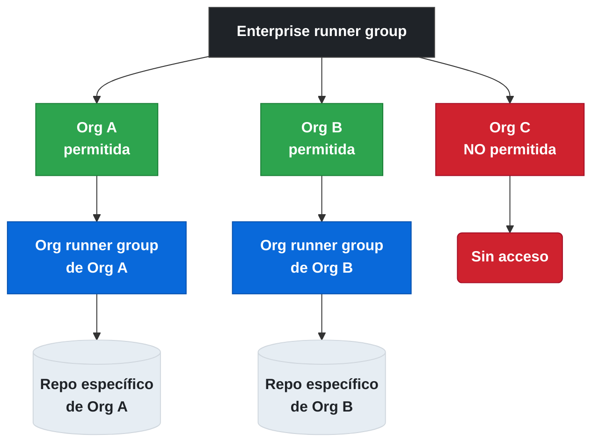

# 4.5.2 Runner Groups: asignación de repositorios, gestión de runners y ciclo de vida

← [4.5.1 Runner Groups: creación](gha-d4-runner-groups-creacion.md) | [Índice](README.md) | [4.6 Preinstalled Software](gha-d4-preinstalled-software.md) →

---

Crear un runner group es solo el primer paso. El valor real llega cuando se asignan repositorios concretos al grupo y se gestionan los runners dentro de él a lo largo del tiempo. Esta sección cubre el ciclo de vida completo: cómo asociar repositorios a un grupo, cómo seleccionar runners en los workflows, cómo mover runners entre grupos, y qué ocurre cuando un grupo se elimina. Entender este ciclo es fundamental para administrar la infraestructura de CI/CD de una organización de forma controlada.

## Asignar repositorios a un runner group

Una vez creado el runner group con política "Selected repositories", es necesario añadir explícitamente los repositorios que tendrán acceso. Esto se hace desde la configuración del propio grupo.

**Ruta de navegación:** `Settings de la organización > Actions > Runner groups > [nombre del grupo] > Repository access`

Desde esa pantalla se pueden buscar y añadir repositorios por nombre. Los cambios son inmediatos: en cuanto un repositorio se añade, sus workflows pueden usar los runners del grupo. De igual manera, si se elimina un repositorio de la lista, sus workflows dejan de poder usar esos runners (los jobs en cola fallarán si no encuentran otro runner compatible).

> **Clave para el examen:** Añadir un repositorio a un runner group no cambia nada en el repositorio en sí. El control está enteramente en la configuración de la organización, no en el repositorio.

## Usar un runner group en un workflow

Los runner groups no tienen una sintaxis propia en `runs-on`. La selección de runners se hace mediante **labels**: cada runner self-hosted tiene labels que lo describen (sistema operativo, arquitectura, capacidades especiales), y el runner group controla la visibilidad.

El workflow especifica las labels requeridas y GitHub busca un runner disponible que tenga esas labels y que pertenezca a un grupo accesible para ese repositorio:

```yaml
jobs:
  deploy:
    # GitHub buscará un runner con estas tres labels
    # que pertenezca a un grupo accesible para este repositorio
    runs-on: [self-hosted, linux, deploy]
    steps:
      - uses: actions/checkout@v4
      - run: ./deploy.sh
```

Si el repositorio no tiene acceso a ningún runner con esas labels (porque el runner group no le da acceso), el job quedará en cola indefinidamente o fallará con un mensaje de error indicando que no hay runner disponible.

> **Advertencia:** Un job que queda esperando runner puede bloquearse indefinidamente si el repositorio no está autorizado en el runner group correcto. Monitorizar tiempos de espera ayuda a detectar estas situaciones.

## Mover un runner entre grupos

Un runner self-hosted solo puede pertenecer a **un único grupo** en cada momento. Para moverlo a otro grupo, se usa la interfaz de administración de la organización.

**Ruta de navegación:** `Settings de la organización > Actions > Runners > [nombre del runner] > [botón de menú] > Move to group`

Al mover un runner a otro grupo, el cambio es inmediato para nuevos jobs. Los jobs que ya están en ejecución en ese runner no se interrumpen; solo los jobs nuevos que se encolen después del cambio usarán la nueva política de acceso del grupo destino.

El escenario más común para mover runners es la promoción entre entornos: un runner que estuvo en el grupo `staging-runners` se mueve a `production-runners` después de validar que está correctamente configurado.

## Comportamiento al eliminar un runner group

Cuando se elimina un runner group, los runners que contenía no se eliminan. GitHub los mueve automáticamente al **grupo Default** de la organización. Este comportamiento garantiza que los runners no queden en un estado huérfano y sigan siendo accesibles (aunque bajo la política más permisiva del grupo Default).

```mermaid
stateDiagram-v2
    [*] --> Default : Runner registrado
    Default --> GrupoCustom : Movido manualmente
    GrupoCustom --> Default : Grupo eliminado\nautomáticamente
    GrupoCustom --> OtroGrupo : Movido manualmente
    OtroGrupo --> Default : Grupo eliminado\nautomáticamente
    Default --> [*] : Runner eliminado
    GrupoCustom --> [*] : Runner eliminado
```

*Ciclo de vida de asignación a runner groups: los runners siempre regresan al grupo Default cuando su grupo es eliminado.*

Este comportamiento tiene implicaciones de seguridad importantes:

1. Si el grupo eliminado tenía runners con acceso privilegiado, esos runners quedan automáticamente en el grupo Default, que puede estar abierto a toda la organización.
2. Es necesario revisar los runners del grupo Default después de eliminar un grupo para asegurarse de que no hay runners sensibles expuestos inadvertidamente.

> **Clave para el examen:** Al eliminar un runner group, los runners NO se eliminan; se mueven automáticamente al grupo `Default`. Es necesario revisar el grupo Default después de esta operación.

## Jerarquía de precedencia: enterprise vs. organización

Cuando existe un nivel enterprise, los runner groups operan en dos niveles con una relación jerárquica clara:

- Los runner groups de **enterprise** definen qué organizaciones pueden acceder a qué runners.
- Los runner groups de **organización** definen qué repositorios dentro de la org pueden acceder a los runners.

Una organización no puede ampliar el acceso más allá de lo que el enterprise permite. Si el runner group de enterprise solo incluye las organizaciones A y B, la organización C no puede crear un runner group que apunte a esos runners aunque lo intente.

La jerarquía se puede visualizar así:



> **Clave para el examen:** Los runner groups de enterprise establecen el techo de acceso. Las organizaciones solo pueden restringir más, nunca ampliar más allá de lo que el enterprise permite.

## Labels vs. runner groups: roles complementarios

Es importante distinguir entre **labels** y **runner groups** porque cumplen funciones diferentes aunque trabajen juntos:

- **Runner groups**: controlan la **visibilidad** — qué repositorios pueden ver y usar los runners del grupo.
- **Labels**: controlan la **selección** — dentro de los runners visibles, cuál se usa para ejecutar el job.

Un runner puede tener múltiples labels (por ejemplo: `self-hosted`, `linux`, `x64`, `gpu`, `deploy`) y pertenece a exactamente un runner group. El workflow especifica labels; el runner group garantiza que solo ciertos repositorios tengan acceso a los runners con esas labels.

| Concepto | Función | Configurado en | Usado en workflow |
|---|---|---|---|
| Runner group | Visibilidad / acceso | Settings de org/enterprise | Indirectamente (labels) |
| Label | Selección de runner | Settings del runner | `runs-on: [label1, label2]` |

## Ejemplo central

Un equipo de plataforma gestiona runners especializados para tres entornos. Necesita asegurarse de que solo los repositorios correctos usen cada tipo de runner, y que los cambios en la asignación no interrumpan jobs en curso.

```yaml
# .github/workflows/integration-tests.yml
# Repositorio: backend-api (asignado al grupo 'integration-runners')
name: Integration Tests

on:
  pull_request:
    branches: [main, develop]

jobs:
  # Job de unit tests usa runner estándar (sin restricción de grupo)
  unit-tests:
    runs-on: ubuntu-latest
    steps:
      - uses: actions/checkout@v4
      - uses: actions/setup-node@v4
        with:
          node-version: '20'
      - run: npm ci && npm test

  # Job de integration tests necesita runner con acceso a base de datos interna
  # Solo funciona si 'backend-api' está en el runner group 'integration-runners'
  integration-tests:
    needs: unit-tests
    runs-on: [self-hosted, linux, integration]
    steps:
      - uses: actions/checkout@v4
      - name: Esperar a que DB esté lista
        run: |
          until pg_isready -h $DB_HOST -p 5432; do
            echo "Esperando base de datos..."
            sleep 2
          done
        env:
          DB_HOST: internal-db.company.local

      - name: Ejecutar migrations
        run: npm run db:migrate
        env:
          DATABASE_URL: ${{ secrets.INTERNAL_DB_URL }}

      - name: Tests de integración
        run: npm run test:integration

  # Job de deploy solo en rama main, runner con acceso a producción
  # Solo funciona si 'backend-api' está en el runner group 'production-deployers'
  deploy:
    if: github.ref == 'refs/heads/main'
    needs: integration-tests
    runs-on: [self-hosted, linux, deploy]
    environment: production
    steps:
      - uses: actions/checkout@v4
      - name: Deploy
        run: ./scripts/deploy.sh
        env:
          DEPLOY_KEY: ${{ secrets.PROD_DEPLOY_KEY }}
```

Este workflow requiere que el repositorio `backend-api` esté en dos runner groups distintos: `integration-runners` (para los tests de integración) e `production-deployers` (para el deploy). Si se retira el acceso de cualquiera de los grupos, el job correspondiente fallará.

## Tabla de elementos clave

Esta tabla resume los conceptos de ciclo de vida de runner groups relevantes para el examen GH-200.

| Operación | Mecanismo | Efecto inmediato | Consideración de seguridad |
|---|---|---|---|
| Añadir repo al grupo | UI de org Settings | Sí — nuevos jobs pueden usar el grupo | Verificar que el repo sea de confianza |
| Retirar repo del grupo | UI de org Settings | Sí — jobs en cola sin runner disponible | Jobs activos no se interrumpen |
| Mover runner a otro grupo | UI de org Settings | Sí para nuevos jobs | Jobs activos no se interrumpen |
| Eliminar runner group | UI de org Settings | Runners van al grupo Default | Revisar Default para runners sensibles |
| Runner recién registrado | Automático | Va al grupo Default | Mover antes de dar acceso a repos |

## Buenas y malas prácticas

**Hacer:**
- Revisar el grupo Default después de eliminar cualquier runner group — razón: runners con acceso privilegiado pueden quedar expuestos a toda la organización.
- Usar labels descriptivas y consistentes para los runners (`env:production`, `tier:gpu`) — razón: facilita la selección en workflows y la comprensión del inventario.
- Mover runners nuevos del grupo Default al grupo adecuado antes de usarlos en producción — razón: el Default es accesible por todos los repos y no debe contener runners sensibles.

**Evitar:**
- Depender solo del nombre del runner group para la selección (no hay sintaxis directa en `runs-on`) — razón: los grupos controlan visibilidad, pero la selección se hace por labels; sin labels correctas el job no encontrará el runner.
- Dejar repositorios en un runner group más permisivo del necesario "por comodidad" — razón: el principio de mínimo privilegio aplica también a los runners.
- Eliminar un runner group sin revisar primero qué runners contiene y a qué tienen acceso — razón: esos runners se moverán automáticamente al Default con acceso a toda la organización.

## Verificación y práctica

Las siguientes preguntas están modeladas sobre el formato del examen GH-200.

**Pregunta 1:** Se elimina el runner group `staging-runners` que contenía 5 runners. ¿Dónde están esos runners ahora y qué nivel de acceso tienen?

> **Respuesta:** Los 5 runners se han movido automáticamente al grupo `Default`. Dependiendo de la configuración del grupo Default, pueden tener acceso a todos los repositorios de la organización. Es necesario revisar y posiblemente mover esos runners a otro grupo o ajustar la política del Default.

**Pregunta 2:** Un job especifica `runs-on: [self-hosted, linux, gpu]`. El repositorio tiene acceso a un runner group que contiene 3 runners: uno con labels `[self-hosted, linux, x64]`, otro con `[self-hosted, linux, gpu]` y otro con `[self-hosted, windows, gpu]`. ¿Cuál runner ejecutará el job?

> **Respuesta:** El runner con labels `[self-hosted, linux, gpu]`, porque es el único que satisface todas las labels especificadas. El runner con `x64` no tiene la label `gpu`, y el runner con `windows` no tiene la label `linux`. El job necesita que el runner tenga **todas** las labels listadas.

**Pregunta 3:** Un runner group de enterprise incluye las organizaciones A y B. La organización A quiere dar acceso a todos sus repositorios a los runners de ese grupo enterprise. ¿Puede hacerlo aunque el enterprise solo permite ciertas organizaciones?

> **Respuesta:** Sí, la organización A puede configurar su runner group para permitir "All repositories" dentro de A, siempre que la organización A esté incluida en el runner group de enterprise. La restricción enterprise es sobre qué organizaciones pueden acceder, no sobre cuántos repositorios dentro de una organización permitida pueden usar el grupo.

**Ejercicio práctico:** Una organización tiene runners en el grupo `ci-runners` asignado solo al repositorio `frontend`. Necesitas dar acceso también al repositorio `backend` sin cambiar el acceso de `frontend`. Además, escribe el fragmento de workflow que `backend` usaría para ejecutar tests en esos runners (los runners tienen label `ci`).

```yaml
# Solución:
# 1. En Settings > Actions > Runner groups > ci-runners > Repository access:
#    Añadir 'backend' a la lista de repositorios seleccionados
#    ('frontend' sigue en la lista — no se modifica)

# 2. Fragmento de workflow en backend/.github/workflows/ci.yml:
name: CI

on: [push, pull_request]

jobs:
  test:
    runs-on: [self-hosted, linux, ci]
    steps:
      - uses: actions/checkout@v4
      - run: npm ci && npm test
```

---

← [4.5.1 Runner Groups: creación](gha-d4-runner-groups-creacion.md) | [Índice](README.md) | [4.6 Preinstalled Software](gha-d4-preinstalled-software.md) →
