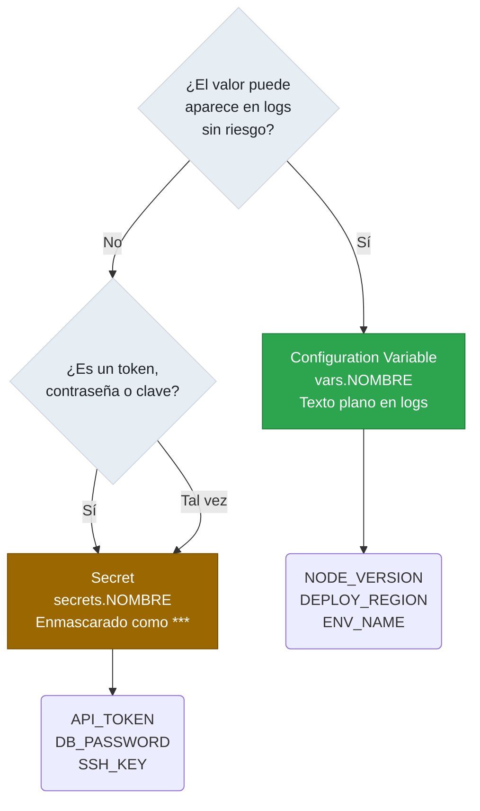
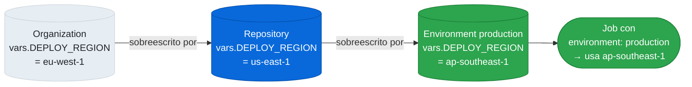

# 4.10 Variables de Configuración (Configuration Variables)

← [4.9.2 Secrets via REST API](gha-d4-secrets-api.md) | [Índice](README.md) | [4.11 REST API Enterprise](gha-d4-api-rest-enterprise.md) →

---

Las configuration variables (variables de configuración) permiten almacenar valores de texto reutilizables que los workflows necesitan pero que no son secretos: versiones de herramientas, nombres de regiones, identificadores de entorno. A diferencia de los secrets, su valor es visible en los logs del workflow, lo que las hace apropiadas para configuración no sensible y facilita la depuración.

## Variables vs. Secrets: diferencia fundamental

Tanto las variables como los secrets pueden definirse a nivel de repositorio, entorno u organización. La diferencia clave está en cómo se tratan sus valores durante la ejecución del workflow.



*Criterio de decisión: si el valor puede aparecer en los logs de CI/CD sin riesgo de seguridad, es una variable; de lo contrario, es un secret.*

Los secrets están enmascarados en los logs: si el valor de un secret aparece en la salida de un step, GitHub lo reemplaza automáticamente por `***`. Las variables no tienen este comportamiento: su valor se imprime tal cual en los logs.

> [EXAMEN] Esta diferencia es el punto más evaluado en el examen. Las variables nunca se enmascaran en los logs, independientemente de cómo se usen. Cualquier dato sensible (tokens, contraseñas, claves privadas) debe almacenarse siempre como secret, nunca como variable.

## Niveles de definición

Las variables, al igual que los secrets, pueden definirse en tres niveles de alcance:

**Nivel repositorio:** disponible para todos los workflows del repositorio. Se define en Settings > Secrets and variables > Actions > pestaña Variables.

**Nivel environment (entorno):** disponible solo cuando el job especifica ese entorno con `environment:`. Permite tener valores distintos para `development`, `staging` y `production`.

**Nivel organización:** disponible para todos los repositorios de la organización que tengan acceso a la variable. El administrador puede restringir la visibilidad a repositorios específicos, igual que con los secrets de organización.

## Crear y gestionar variables desde la UI

La ruta de creación en la UI difiere ligeramente según el nivel:

Para variables de repositorio:
```
Settings > Secrets and variables > Actions > Variables > New repository variable
```

Para variables de entorno:
```
Settings > Environments > [nombre del entorno] > Variables > Add variable
```

Para variables de organización:
```
Settings (organización) > Secrets and variables > Actions > Variables > New organization variable
```

En todos los casos, el formulario solicita nombre (solo letras mayúsculas, números y guiones bajos; no puede empezar por número ni usar el prefijo `GITHUB_`) y valor.

## Acceso en el workflow

Las variables de configuración se acceden en los workflows con el contexto `vars`:

```yaml
name: Build y deploy

on:
  push:
    branches: [main]

env:
  # Variable de repositorio: versión de Node definida en Settings
  NODE_VERSION: ${{ vars.NODE_VERSION }}

jobs:
  build:
    runs-on: ubuntu-latest
    steps:
      - uses: actions/checkout@v4

      - name: Configurar Node.js
        uses: actions/setup-node@v4
        with:
          node-version: ${{ vars.NODE_VERSION }}

      - name: Build
        run: npm ci && npm run build

  deploy:
    runs-on: ubuntu-latest
    # Variable de entorno: DEPLOY_REGION depende del environment
    environment: production
    steps:
      - name: Deploy en región configurada
        run: |
          echo "Desplegando en región: ${{ vars.DEPLOY_REGION }}"
          ./scripts/deploy.sh \
            --region "${{ vars.DEPLOY_REGION }}" \
            --env "${{ vars.ENV_NAME }}"
```

## Precedencia

Cuando existe la misma variable definida en varios niveles, la precedencia es (de mayor a menor):

1. Environment (entorno del job)
2. Repository (repositorio)
3. Organization (organización)

Esta jerarquía es idéntica a la de los secrets. Si un job tiene `environment: production` y la variable `DEPLOY_REGION` existe tanto a nivel de entorno como a nivel de repositorio, el workflow usará el valor del entorno.



*Jerarquía de precedencia de variables: environment > repository > organization. El nivel más específico reemplaza completamente el valor del nivel superior.*

> [CONCEPTO] La precedencia no es aditiva: el valor del nivel más específico reemplaza completamente al del nivel superior. No hay fusión ni herencia parcial de valores.

## REST API: gestión programática

La API permite listar, crear, actualizar y eliminar variables sin necesidad de la UI. A diferencia de los secrets, los valores de las variables sí se devuelven en las respuestas GET, ya que son texto plano no sensible.

Endpoints de repositorio:

```
GET    /repos/{owner}/{repo}/actions/variables
GET    /repos/{owner}/{repo}/actions/variables/{name}
POST   /repos/{owner}/{repo}/actions/variables
PATCH  /repos/{owner}/{repo}/actions/variables/{name}
DELETE /repos/{owner}/{repo}/actions/variables/{name}
```

Endpoints de organización:

```
GET    /orgs/{org}/actions/variables
POST   /orgs/{org}/actions/variables
PATCH  /orgs/{org}/actions/variables/{name}
DELETE /orgs/{org}/actions/variables/{name}
```

Endpoints de environment (usando ID numérico del repositorio):

```
GET    /repositories/{repo_id}/environments/{env}/variables
POST   /repositories/{repo_id}/environments/{env}/variables
PATCH  /repositories/{repo_id}/environments/{env}/variables/{name}
DELETE /repositories/{repo_id}/environments/{env}/variables/{name}
```

> [CONCEPTO] A diferencia de la API de secrets, la API de variables usa **POST** para crear y **PATCH** para actualizar. No existe un único endpoint PUT que unifique ambas operaciones. El body de POST y PATCH incluye `name` y `value` en texto plano, sin necesidad de cifrado.

Ejemplo de llamada para crear una variable de repositorio:

```bash
# Crear variable de repositorio via API
curl -X POST \
  -H "Authorization: Bearer $GH_TOKEN" \
  -H "Accept: application/vnd.github+json" \
  -H "X-GitHub-Api-Version: 2022-11-28" \
  https://api.github.com/repos/mi-org/mi-repo/actions/variables \
  -d '{"name":"NODE_VERSION","value":"20"}'

# Actualizar variable existente (PATCH, no PUT)
curl -X PATCH \
  -H "Authorization: Bearer $GH_TOKEN" \
  -H "Accept: application/vnd.github+json" \
  -H "X-GitHub-Api-Version: 2022-11-28" \
  https://api.github.com/repos/mi-org/mi-repo/actions/variables/NODE_VERSION \
  -d '{"name":"NODE_VERSION","value":"22"}'
```

## Casos de uso apropiados

Las variables de configuración encajan bien cuando el valor cumple estos criterios: no es sensible, puede aparecer en logs sin riesgo, y cambia según el entorno o repositorio.

Ejemplos válidos de uso como variable (no como secret):

- `NODE_VERSION`: versión de Node.js usada en los steps de build
- `DEPLOY_REGION`: región de AWS o Azure donde se despliega la aplicación
- `ENV_NAME`: nombre del entorno (development, staging, production)
- `JAVA_VERSION`: versión del JDK para compilar el proyecto
- `DOCKER_REGISTRY_URL`: URL pública del registro de contenedores (no las credenciales)

Ejemplos de valores que deben ser secrets, no variables:

- Tokens de acceso a servicios externos
- Contraseñas de bases de datos
- Claves privadas (certificados, SSH, GPG)
- Cualquier valor que no deba aparecer en los logs del workflow

## Tabla comparativa: Variables vs. Secrets

| Característica | Variables (`vars.*`) | Secrets (`secrets.*`) |
|----------------|---------------------|----------------------|
| Visibilidad en logs | Texto plano, visible | Enmascarado como `***` |
| Niveles disponibles | Repositorio, entorno, organización | Repositorio, entorno, organización |
| API GET devuelve el valor | Sí | No (solo metadatos) |
| Cifrado en almacenamiento | No especificado / texto plano | Cifrado con LibSodium |
| Método API para crear | POST | PUT |
| Método API para actualizar | PATCH | PUT |
| Prefijo en workflow | `${{ vars.NOMBRE }}` | `${{ secrets.NOMBRE }}` |
| Caso de uso típico | Versiones, regiones, flags | Tokens, contraseñas, claves |
| Máximo de variables/secrets | 500 por repositorio, 1000 por org | 100 por repositorio, 10 por entorno, 1000 por org |

> [EXAMEN] El examen suele presentar escenarios donde hay que elegir entre variable y secret. La regla práctica es: si el valor puede mostrarse en un log de CI/CD sin riesgo de seguridad, es una variable; si no, es un secret. Nunca uses variables para credenciales, aunque sean de entornos de desarrollo.

## Buenas y malas prácticas

**Hacer:**
- Centralizar valores comunes (como versiones de herramientas) como variables de organización — razón: un cambio en la organización propaga el nuevo valor a todos los repositorios sin modificar cada workflow individualmente.
- Verificar que la variable existe antes de usarla en lógica crítica — razón: si la variable no está definida, `${{ vars.NOMBRE }}` devuelve una cadena vacía sin error, lo que puede causar comportamientos inesperados.
- Documentar el propósito de cada variable en el README o runbook del repositorio — razón: a diferencia de los secrets, las variables no tienen campo de descripción en la UI de GitHub.

**Evitar:**
- Almacenar valores semisensibles como variables argumentando que "no son tan secretos" — razón: si el valor aparece en los logs, cualquier persona con acceso de lectura al repositorio puede verlo en los registros de ejecución.
- Duplicar la misma variable en repositorio y organización con valores distintos sin documentarlo — razón: la precedencia (repositorio sobre organización) puede causar confusión si un desarrollador no sabe que el valor del repositorio está sobreescribiendo el valor organizacional.

## Verificación y práctica

**Pregunta 1:** ¿Cuál es la diferencia de comportamiento entre `${{ vars.NODE_VERSION }}` y `${{ secrets.API_TOKEN }}` cuando sus valores aparecen en la salida de un step?

**Respuesta:** El valor de `vars.NODE_VERSION` se imprime en texto plano en los logs del workflow. El valor de `secrets.API_TOKEN` es reemplazado automáticamente por `***` en los logs por el mecanismo de enmascarado de GitHub. Esta diferencia es independiente de cómo se use el valor: aunque se pase como argumento a un comando o se almacene en una variable de shell, el enmascarado de secrets funciona a nivel de output del runner.

---

**Pregunta 2:** Un workflow necesita la misma variable `DEPLOY_REGION` con valor `us-east-1` para el entorno `production` y `eu-west-1` para el entorno `staging`. ¿Cómo se configura esto con variables de configuración?

**Respuesta:** Se crea la variable `DEPLOY_REGION` a nivel de entorno en cada environment: en `production` con valor `us-east-1` y en `staging` con valor `eu-west-1`. El workflow accede a ella con `${{ vars.DEPLOY_REGION }}` en un job que especifica `environment: production` o `environment: staging`. GitHub resuelve automáticamente el valor correcto según el entorno del job gracias a la precedencia: environment > repository > organization.

---

**Pregunta 3:** ¿Por qué la API de variables usa POST para crear y PATCH para actualizar, mientras que la API de secrets usa PUT para ambas operaciones?

**Respuesta:** La API de secrets usa PUT porque el endpoint opera de forma idempotente: si el secret no existe, lo crea; si existe, lo actualiza. Esto simplifica el flujo de rotación automatizada. La API de variables sigue el modelo REST estándar donde POST crea un recurso nuevo (falla si ya existe) y PATCH modifica un recurso existente (falla si no existe). Al gestionar variables programáticamente, hay que verificar primero si la variable existe para elegir el método correcto.

---

← [4.9.2 Secrets via REST API](gha-d4-secrets-api.md) | [Índice](README.md) | [4.11 REST API Enterprise](gha-d4-api-rest-enterprise.md) →
