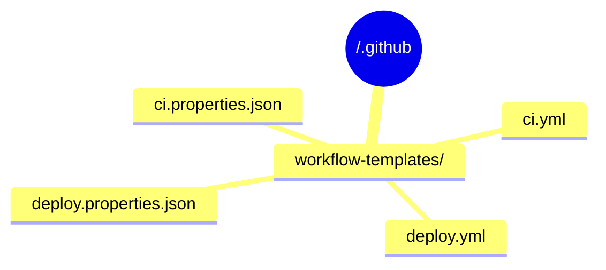
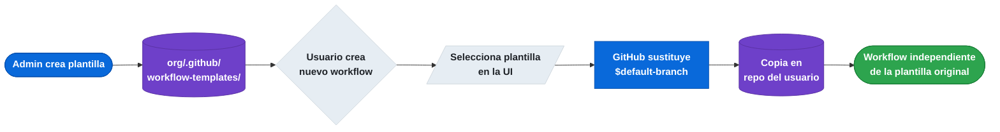

# 4.1 Workflow Templates (Starter Workflows) para la organización

← [3.8 Testing / Verificación de D3](gha-d3-testing.md) | [Índice](README.md) | [4.2.1 Reusable Workflows: autoría](gha-d4-reusable-workflows-autoria.md) →

---

Los **starter workflows** (plantillas de workflow) permiten a las organizaciones ofrecer a sus miembros un punto de partida estandarizado para crear workflows. Aparecen en la UI de Actions al crear un nuevo workflow y se copian al repositorio destino — son una plantilla, no una referencia en tiempo de ejecución.

> [EXAMEN] Distinción crítica: un **starter workflow** es una plantilla que se *copia* al repositorio del usuario en el momento de crearlo. Un **reusable workflow** es un workflow que se *llama* en tiempo de ejecución mediante `uses:`. Son mecanismos completamente distintos y no intercambiables.

## Repositorio `.github` de la organización

El repositorio especial `.github` de una organización actúa como almacén de configuración compartida. Dentro de él, la carpeta `.github/workflow-templates/` alberga las plantillas de workflow disponibles para todos los repositorios de esa organización.



> [CONCEPTO] Solo los administradores del repositorio `.github` de la organización pueden crear, editar o eliminar starter workflows. Los miembros con acceso de escritura en sus propios repositorios solo pueden *usar* las plantillas, no gestionarlas.

## Ficheros requeridos: `.yml` + `.properties.json`

Cada plantilla requiere exactamente dos ficheros con el mismo nombre base:

- `nombre.yml` — el workflow YAML que se copiará al repositorio destino.
- `nombre.properties.json` — metadatos que controlan cómo aparece la plantilla en la UI.

Los campos del fichero `.properties.json` son:

| Campo | Obligatorio | Descripción |
|---|---|---|
| `name` | Sí | Título visible en la UI de Actions |
| `description` | Sí | Texto descriptivo mostrado bajo el título |
| `iconName` | No | Nombre del icono Octicon (sin el prefijo `octicon-`) |
| `categories` | No | Array de strings para filtrar por categoría (p.ej. `["ci", "java"]`) |

> [ADVERTENCIA] Si el fichero `.properties.json` no existe o tiene un nombre distinto al `.yml`, la plantilla no aparecerá en la UI. Ambos ficheros deben compartir exactamente el mismo nombre base.

## Variable especial `$default-branch`

En el YAML de la plantilla se puede usar la variable `$default-branch`. GitHub la sustituye automáticamente por el nombre de la rama predeterminada del repositorio destino (habitualmente `main` o `master`) en el momento en que el usuario copia la plantilla.

```yaml
on:
  push:
    branches: [ $default-branch ]
  pull_request:
    branches: [ $default-branch ]
```

> [EXAMEN] `$default-branch` no es una expresión de GitHub Actions ni una variable de contexto. Es un marcador de sustitución estático que solo funciona en starter workflows y es reemplazado por GitHub *antes* de que el YAML llegue al runner.

## Ejemplo central

Los dos ficheros siguientes definen una plantilla de CI para Node.js disponible para toda la organización.

```yaml
# .github/workflow-templates/ci.yml
name: CI Node.js

on:
  push:
    branches: [ $default-branch ]
  pull_request:
    branches: [ $default-branch ]

jobs:
  build:
    runs-on: ubuntu-latest

    strategy:
      matrix:
        node-version: [18.x, 20.x]

    steps:
      - name: Checkout del código
        uses: actions/checkout@v4

      - name: Configurar Node.js ${{ matrix.node-version }}
        uses: actions/setup-node@v4
        with:
          node-version: ${{ matrix.node-version }}
          cache: 'npm'

      - name: Instalar dependencias
        run: npm ci

      - name: Ejecutar tests
        run: npm test
```

```json
// .github/workflow-templates/ci.properties.json
{
  "name": "CI Node.js",
  "description": "Plantilla de integración continua para proyectos Node.js. Ejecuta tests en Node 18 y 20.",
  "iconName": "nodejs",
  "categories": ["ci", "javascript", "nodejs"]
}
```

## Cómo aparecen en la UI

Una vez creados los dos ficheros en el repositorio `.github` de la organización, cualquier miembro puede acceder a las plantillas desde su repositorio:

1. Ir a la pestaña **Actions** del repositorio.
2. Hacer clic en **New workflow**.
3. Desplazarse hasta la sección **Workflows created by [nombre de la organización]**.
4. Seleccionar la plantilla y hacer clic en **Configure**.

GitHub abre el editor con el YAML ya copiado y sustituye `$default-branch` por la rama predeterminada real. El usuario guarda el fichero en su propio repositorio — a partir de ese momento el workflow es independiente de la plantilla original.



*Ciclo de vida de un starter workflow: la plantilla se copia al repositorio destino y queda desconectada de la original.*

## Tabla de elementos clave

Los siguientes elementos son los que el examen GH-200 suele evaluar en relación con los starter workflows.

| Elemento | Detalle |
|---|---|
| Ubicación | `<org>/.github/workflow-templates/` |
| Fichero YAML | Define el workflow que se copiará; usa `$default-branch` |
| Fichero JSON | Metadatos de UI: `name`, `description`, `iconName`, `categories` |
| Permisos para gestionar | Administradores del repo `.github` de la organización |
| Permisos para usar | Cualquier miembro con acceso de escritura en su repositorio |
| Sustitución de rama | `$default-branch` → rama predeterminada del repo destino |
| Naturaleza de la copia | El YAML se copia; los cambios posteriores en la plantilla no afectan a copias existentes |

## Buenas y malas prácticas

**Hacer:**
- Incluir siempre `$default-branch` en los triggers `push`/`pull_request` — razón: la plantilla funciona para repos con `main`, `master` o cualquier otra rama predeterminada.
- Mantener las plantillas bajo control de versiones con revisión de PR — razón: evita que plantillas defectuosas lleguen a toda la organización.
- Rellenar `categories` con valores descriptivos — razón: facilita que los equipos encuentren la plantilla correcta en una lista larga.
- Usar versiones fijas (`@v4`) en las actions del template — razón: los repos que copien la plantilla heredan inmediatamente una versión probada.

**Evitar:**
- Usar contextos de Actions (`${{ github.ref_name }}`) para referirse a la rama en el trigger — razón: los contextos no están disponibles en `on:` y el workflow fallará.
- Poner secretos hardcodeados o nombres de entorno específicos de un proyecto concreto — razón: la plantilla se distribuye a todos los repos de la organización y expone o rompe configuraciones ajenas.
- Olvidar el fichero `.properties.json` — razón: sin él la plantilla no aparece en la UI aunque el YAML esté bien formado.

## Verificación y práctica

**P1.** Un desarrollador quiere que su organización ofrezca una plantilla de CI estándar. ¿En qué repositorio y carpeta debe crear los ficheros?

**R:** En el repositorio `.github` de la organización, dentro de la carpeta `.github/workflow-templates/`. Son necesarios dos ficheros: `nombre.yml` y `nombre.properties.json`.

**P2.** ¿Qué ocurre con los repositorios que ya copiaron un starter workflow cuando un administrador actualiza la plantilla original?

**R:** Nada. El starter workflow se copia en el momento de crearlo; las actualizaciones posteriores a la plantilla original no se propagan a los workflows ya existentes en otros repositorios. Cada copia es independiente.

**P3.** ¿Cuál es la diferencia entre `$default-branch` y `${{ github.event.repository.default_branch }}`?

**R:** `$default-branch` es un marcador de sustitución estático que GitHub reemplaza al copiar la plantilla al repositorio destino; funciona solo en starter workflows. `${{ github.event.repository.default_branch }}` es una expresión de contexto que se evalúa en tiempo de ejecución dentro de un workflow activo; no tiene efecto en los triggers (`on:`).

---
← [3.8 Testing / Verificación de D3](gha-d3-testing.md) | [Índice](README.md) | [4.2.1 Reusable Workflows: autoría](gha-d4-reusable-workflows-autoria.md) →
