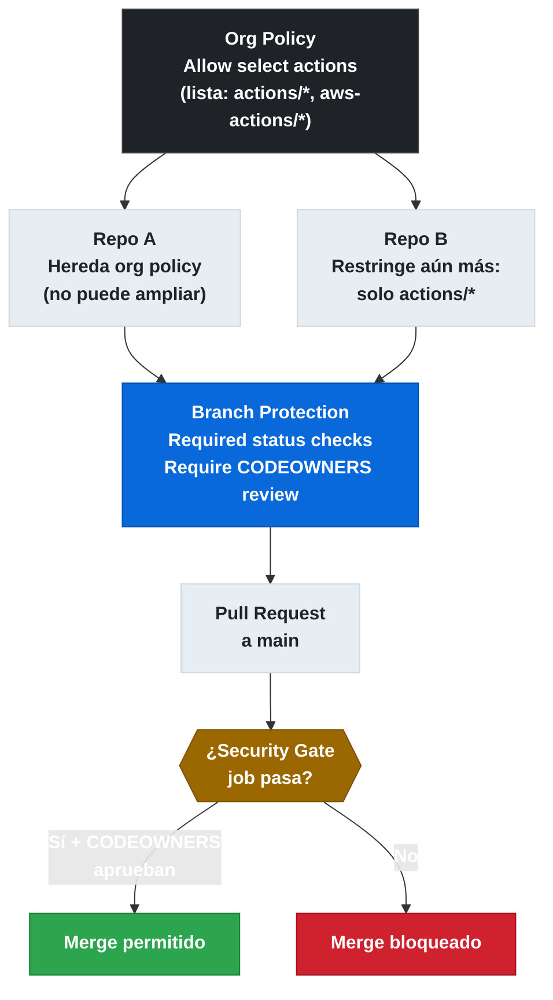

# 5.6 Enforcement de Policies de Seguridad

← [5.5.2 Pin SHA — Dependabot](gha-pin-actions-sha-dependabot.md) | [Índice](README.md) | [5.7.1 SLSA Provenance — Fundamentos](gha-slsa-provenance-fundamentos.md) →

---

Configurar qué actions se ejecutan en una organización no es opcional: es la primera línea de defensa contra el supply chain compromise. Este documento cubre cómo las policies de organización, los required status checks, CODEOWNERS y los rulesets forman una capa de enforcement coherente que impide que un repositorio degrade la postura de seguridad de toda la organización.

> [CONCEPTO] El enforcement de seguridad en GitHub Actions opera en dos planos: **plano de configuración** (qué está permitido ejecutar) y **plano de flujo de trabajo** (qué debe pasar para que el código avance). Las policies de organización cubren el primero; branch protection y rulesets cubren el segundo.

## Políticas de organización para GitHub Actions

Las políticas de organización controlan qué actions y workflows reutilizables pueden ejecutarse en los repositorios de la organización. Se configuran en **Organization Settings → Actions → General → Actions permissions**.

Existen tres niveles de permisividad:

| Opción | Descripción | Cuándo usarla |
|---|---|---|
| Allow all actions | Sin restricción | No recomendado en producción |
| Allow local + GitHub-owned | Solo actions del mismo repo u organización y las de `actions/*` y `github/*` | Punto de partida equilibrado |
| Allow select actions | Lista explícita de actions permitidas (con soporte de wildcard) | Máximo control; compliance estricto |

La lista de actions permitidas acepta patrones como `aws-actions/*` o `actions/checkout@*`. El asterisco en la versión permite cualquier versión pero no valida que sea un SHA.

> [ADVERTENCIA] Permitir `<owner>/*` en la lista de selección no garantiza que las actions de ese owner estén pineadas a SHA. La política de organización controla qué actions se pueden referenciar, pero no cómo se referencian. El SHA pinning debe reforzarse por separado mediante Dependabot y revisión de código.

## Opciones de política y su aplicación

La política se aplica en cascada: la organización puede permitir que los repositorios tengan una política más restrictiva, pero nunca más permisiva. Un repositorio puede elegir "Allow select actions" con una lista más corta que la de la organización, pero no puede desbloquear actions que la organización ha bloqueado.

Para workflows reutilizables existe una opción adicional: **Allow workflows created by [organization]**, que permite que repositorios de la organización llamen a workflows de otros repositorios de la misma organización sin necesidad de listarlos explícitamente.



*Cascada de enforcement: la política de organización es el techo máximo; branch protection y required status checks controlan el flujo de merge.*

## Required Status Checks como mecanismo de enforcement

Los required status checks son la herramienta principal para bloquear el merge de pull requests hasta que determinados workflows pasen. Se configuran en la branch protection rule de la rama objetivo (normalmente `main` o `release/*`).

Un status check corresponde a un job de GitHub Actions o a un check externo. El nombre del check debe coincidir exactamente con el nombre del job en el YAML del workflow.

> [EXAMEN] El nombre del required status check en la branch protection rule debe coincidir con el **nombre del job** (`jobs.<job_id>.name` si existe, o el `job_id` si no tiene `name`), no con el nombre del workflow ni con el nombre del step.

La opción **"Require branches to be up to date before merging"** complementa los required status checks: obliga a que la rama esté actualizada respecto a la rama base antes de que el check verde permita el merge. Esto evita que un PR pase los checks en un estado obsoleto del código.

## CODEOWNERS para workflows

El fichero `.github/CODEOWNERS` permite designar revisores obligatorios para cambios en rutas específicas. Para proteger los workflows de modificaciones no autorizadas se añade una entrada que cubra el directorio `.github/workflows/`.

```
# .github/CODEOWNERS
.github/workflows/  @org/security-team
```

Con esta configuración, cualquier PR que modifique un fichero bajo `.github/workflows/` requiere la aprobación de al menos un miembro de `@org/security-team` antes de poder hacer merge. Para que CODEOWNERS sea efectivo, la branch protection rule debe tener activada la opción **"Require review from Code Owners"**.

## Rulesets para protección de ramas

Los rulesets son la evolución de las branch protection rules: ofrecen mayor granularidad, se pueden aplicar a múltiples ramas y repositorios con un único ruleset a nivel de organización, y soportan bypass lists (listas de actores que pueden saltarse las reglas en casos justificados).

Un ruleset de organización puede exigir, para todas las ramas que coincidan con un patrón:

- Required status checks (misma semántica que en branch protection)
- Required signatures (commits firmados)
- Restricción de quién puede hacer push directo
- Restricción de quién puede hacer merge

> [CONCEPTO] La diferencia clave entre branch protection rules y rulesets es el **ámbito**: las branch protection rules son por repositorio, los rulesets pueden aplicarse a toda la organización desde un único punto de configuración.

## Ejemplo central

El siguiente workflow implementa un gate de seguridad completo: ejecuta un análisis de seguridad y un linting de workflows. El job `security-gate` es el que se registra como required status check en la branch protection rule.

```yaml
# .github/workflows/security-gate.yml
name: Security Gate

on:
  pull_request:
    branches: [main, "release/*"]

permissions:
  contents: read
  security-events: write

jobs:
  security-gate:
    name: Security Gate
    runs-on: ubuntu-latest
    steps:
      - name: Checkout
        uses: actions/checkout@v4

      - name: Lint workflows with actionlint
        uses: docker://rhysd/actionlint:latest
        with:
          args: -color .github/workflows/*.yml

      - name: Run dependency review
        uses: actions/dependency-review-action@v4
        with:
          fail-on-severity: high

      - name: Detect hardcoded secrets
        uses: trufflesecurity/trufflehog@v3
        with:
          path: ./
          base: ${{ github.event.pull_request.base.sha }}
          head: ${{ github.event.pull_request.head.sha }}
          extra_args: --only-verified
```

Para que este workflow actúe como enforcement, en la branch protection rule de `main` se añade `Security Gate` como required status check. Mientras el job no pase en verde, el merge queda bloqueado.

## Audit log para supervisión de actions

El audit log de la organización registra todos los eventos relacionados con GitHub Actions: qué actions se ejecutaron, en qué repositorios, bajo qué workflows y quién las activó. Se accede desde **Organization Settings → Audit log** o mediante la API REST.

Los eventos relevantes para auditoría de actions incluyen:

| Evento | Descripción |
|---|---|
| `workflows.completed_workflow_run` | Ejecución de workflow completada |
| `org.actions_allowed_actions_policy` | Cambio en la política de actions permitidas |
| `org.add_actions_allowed_actions` | Actions añadidas a la lista de permitidas |
| `protected_branch.update_required_status_checks` | Cambio en required status checks |

> [EXAMEN] El audit log de GitHub es **inmutable** desde la perspectiva de los usuarios: nadie puede borrar entradas. Se retiene 90 días para el plan gratuito y 180 días para GitHub Enterprise. Para retención mayor es necesario exportar a un SIEM externo mediante la API de streaming.

Para consultar el audit log mediante la CLI:

```bash
gh api \
  "orgs/{org}/audit-log?phrase=action:workflows.completed_workflow_run&per_page=100" \
  --paginate \
  --jq '.[] | {actor, repo, action, created_at}'
```

## Tabla de elementos clave

Los siguientes parámetros y opciones son los más relevantes para el examen GH-200 en este dominio.

| Elemento | Tipo | Dónde se configura | Descripción |
|---|---|---|---|
| Actions permissions | Política org | Org Settings → Actions | Controla qué actions pueden usarse |
| Required status checks | Branch protection | Repo → Branch protection rules | Bloquea merge hasta que el job pase |
| Require up-to-date branches | Branch protection | Repo → Branch protection rules | Exige que la rama esté actualizada |
| Require CODEOWNERS review | Branch protection | Repo → Branch protection rules | Activa revisión obligatoria de CODEOWNERS |
| Rulesets | Política org/repo | Org Settings → Rulesets | Reglas aplicables a múltiples repos |
| Bypass list | Ruleset | Dentro del ruleset | Actores que pueden saltarse el ruleset |
| Audit log streaming | API | Org Settings → Audit log | Exporta eventos a SIEM externo |

## Buenas y malas prácticas

**Hacer:**
- Usar "Allow select actions" con una lista explícita de actions aprobadas — razón: limita la superficie de ataque a actions conocidas y revisadas por el equipo de seguridad.
- Registrar el job de seguridad como required status check con el nombre exacto del job — razón: si el nombre no coincide, el check nunca se satisface o nunca bloquea.
- Combinar CODEOWNERS en `.github/workflows/` con "Require CODEOWNERS review" — razón: impide que cualquier desarrollador modifique workflows sin supervisión del equipo de seguridad.
- Exportar el audit log a un SIEM con retención larga — razón: GitHub retiene solo 90-180 días; los incidentes de supply chain pueden detectarse tarde.

**Evitar:**
- Dejar "Allow all actions" en producción — razón: cualquier acción de terceros maliciosa o comprometida puede ejecutarse en los runners de la organización.
- Añadir `*/*@*` en la lista de actions permitidas — razón: equivale a "Allow all actions" pero con apariencia de control; no ofrece ninguna restricción real.
- Confiar solo en la política de organización sin required status checks — razón: la política controla qué se puede ejecutar, pero no garantiza que los checks de seguridad pasen antes del merge.
- Usar branch protection rules individuales por repositorio cuando hay decenas de repos — razón: los rulesets de organización son más mantenibles y consistentes.

## Verificación y práctica

**Pregunta 1:** Un equipo configura la lista de actions permitidas con el patrón `actions/*`. ¿Qué acciones quedan permitidas?

Respuesta: Solo las actions cuyo owner es `actions` (por ejemplo `actions/checkout`, `actions/upload-artifact`). No se permite ninguna action de terceros ni de la propia organización, a menos que se añadan entradas adicionales. El patrón `actions/*` no incluye `github/*`.

**Pregunta 2:** ¿Qué debe coincidir exactamente con el nombre del required status check en la branch protection rule?

Respuesta: El campo `name` del job si está definido (`jobs.<id>.name`), o el `job_id` si no tiene `name`. No es el nombre del workflow (`name:` al nivel raíz), ni el nombre de ningún step.

**Pregunta 3:** Un ruleset de organización tiene una bypass list que incluye al equipo `@org/release-managers`. ¿Qué pueden hacer los miembros de ese equipo que otros no pueden?

Respuesta: Pueden saltarse las reglas del ruleset (por ejemplo hacer push directo a una rama protegida o hacer merge sin que pasen los required status checks), siempre que la opción de bypass esté configurada para "always" o para un tipo específico de acción. El bypass es explícito: si no están en la lista, no pueden saltarse las reglas.

**Ejercicio:** Configura un workflow que actúe como required status check para PRs a `main`, ejecute `actionlint` y falle si encuentra errores. El nombre del job debe ser `Workflow Lint`.

```yaml
# .github/workflows/workflow-lint.yml
name: Workflow Lint CI

on:
  pull_request:
    branches: [main]

permissions:
  contents: read

jobs:
  workflow-lint:
    name: Workflow Lint
    runs-on: ubuntu-latest
    steps:
      - name: Checkout
        uses: actions/checkout@v4

      - name: Run actionlint
        uses: docker://rhysd/actionlint:latest
        with:
          args: -color .github/workflows/*.yml
```

En la branch protection rule de `main`, el required status check debe registrarse como `Workflow Lint` (el valor del campo `name:` del job).

---

← [5.5.2 Pin SHA — Dependabot](gha-pin-actions-sha-dependabot.md) | [Índice](README.md) | [5.7.1 SLSA Provenance — Fundamentos](gha-slsa-provenance-fundamentos.md) →
