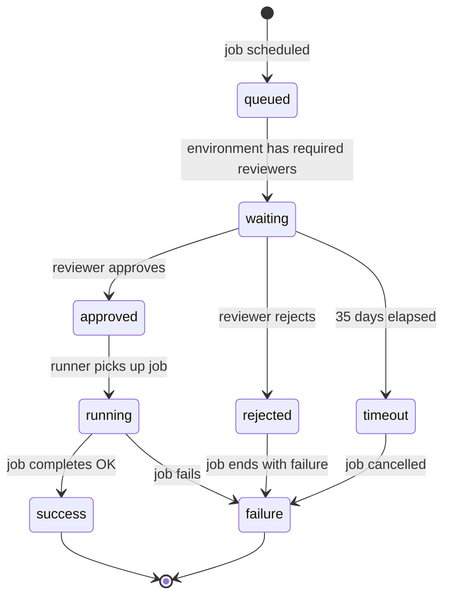
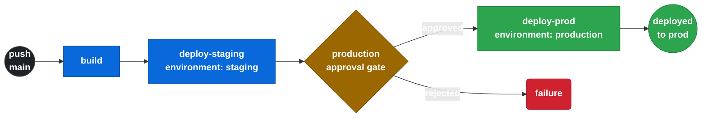

# 5.1 Environment Protections y Approval Gates

← [4.13 Testing D4](gha-d4-testing.md) | [Índice](README.md) | [5.2.1 Script Injection — Vectores](gha-script-injection-vectores.md) →

---

Un **environment** en GitHub Actions es un scope con nombre que agrupa secrets, variables y protection rules orientadas al deployment. A diferencia de los secrets de repositorio, los secrets de environment solo están disponibles cuando un job referencia ese environment con `environment:`. Las protection rules bloquean la ejecución del job hasta que se cumplan las condiciones configuradas, lo que convierte a los environments en la principal herramienta nativa de GitHub para controlar deployments a producción.

> [CONCEPTO] Un environment no es solo un grupo de secrets: es una puerta de control que puede pausar la ejecución de un job hasta obtener aprobación humana o cumplir condiciones de tiempo y rama.

## Tipos de protection rules

Los environments soportan cuatro tipos de protection rules configurables desde **Settings > Environments > [nombre]**:

- **Required reviewers**: hasta 6 personas o equipos que deben aprobar el deployment antes de que el job se ejecute. El job queda en estado `waiting` en la UI hasta recibir aprobación.
- **Wait timer**: número de minutos (0–43 200) que el job espera antes de ejecutarse, incluso si no hay revisores. Útil para dar tiempo a cancelar un deployment accidental.
- **Deployment branches and tags**: filtro que restringe qué ramas o tags pueden deployar al environment. Acepta patrones glob (`release/*`, `v*`).
- **Custom deployment protection rules**: webhooks externos que GitHub invoca antes de ejecutar el job. Permiten integrar sistemas externos (ITSM, compliance gates) como aprobadores.

> [EXAMEN] El límite de required reviewers es 6 (personas + equipos combinados). Superar ese número no es posible desde la UI ni la API.

## Estado del job durante aprobación

Cuando un job referencia un environment con required reviewers, la ejecución se pausa y aparece en la UI con estado `waiting`. El job no consume minutos de ejecución mientras espera. Los revisores reciben una notificación por email y pueden aprobar o rechazar desde la interfaz de GitHub Actions o desde la API. Si se rechaza, el job termina con estado `failure`.



*Estados posibles de un job que referencia un environment protegido, desde la cola hasta la resolución final.*

> [ADVERTENCIA] Un job en estado `waiting` ocupa una posición en la cola del runner pero no ejecuta código. Sin embargo, el timeout del workflow sigue corriendo (máximo 35 días para espera de aprobación, configurable).

## Diferencia entre environment protection y branch protection

Ambas coexisten pero controlan cosas distintas. La siguiente tabla resume las diferencias clave:

| Aspecto | Environment protection | Branch protection |
|---|---|---|
| ¿Qué bloquea? | Ejecución del job de deployment | Merge del pull request |
| ¿Dónde se configura? | Settings > Environments | Settings > Branches |
| ¿Quién aprueba? | Revisores del environment | Reviewers del PR o CODEOWNERS |
| ¿Afecta a runners? | Sí, job queda en `waiting` | No |
| ¿Aplica a tags? | Sí, con deployment branches/tags | No directamente |

> [CONCEPTO] Branch protection y environment protection no son mutuamente excluyentes. Un flujo robusto usa branch protection para el PR y environment protection para el deployment job.

## Ejemplo central

El siguiente workflow completo muestra un pipeline de CI/CD con tres stages: build, deploy a staging (sin aprobación) y deploy a producción (con environment protection). El job `deploy-prod` solo se ejecuta si `deploy-staging` tiene éxito y si los revisores del environment `production` aprueban.



*Pipeline CI/CD: los dos primeros jobs se ejecutan sin interrupción; el approval gate pausa el pipeline antes del deploy a producción.*

```yaml
name: CI/CD con Environment Protection

on:
  push:
    branches:
      - main

jobs:
  build:
    runs-on: ubuntu-latest
    steps:
      - uses: actions/checkout@v4
      - name: Build
        run: |
          echo "Building application..."
          # Aquí iría el build real: npm run build, docker build, etc.

  deploy-staging:
    needs: build
    runs-on: ubuntu-latest
    environment:
      name: staging
      url: https://staging.example.com
    steps:
      - name: Deploy a staging
        run: echo "Deploying to staging..."

  deploy-prod:
    needs: deploy-staging
    runs-on: ubuntu-latest
    environment:
      name: production
      url: https://example.com
    steps:
      - name: Deploy a producción
        run: echo "Deploying to production..."
      - name: Notificar deployment
        run: echo "Production deployment complete at $(date)"
```

> [EXAMEN] La propiedad `url` en `environment:` no afecta la protección pero sí aparece en la UI de deployments de GitHub como enlace al entorno desplegado.

## Tabla de elementos clave

Los siguientes parámetros definen la configuración de un environment y sus protection rules. Todos se configuran en Settings > Environments > [nombre del environment].

| Elemento | Tipo | Obligatorio | Default | Descripción |
|----------|------|:-----------:|---------|-------------|
| `required reviewers` | Lista (personas/equipos) | No | — | Hasta 6 revisores que deben aprobar el deployment |
| `wait timer` | Integer (minutos) | No | 0 | Retraso fijo antes de ejecutar el job (0–43200 min) |
| `deployment branches` | Patrón de ramas/tags | No | All branches | Qué ramas o tags pueden deployar al environment |
| `custom protection rules` | Webhook URL | No | — | Integración con sistemas externos de aprobación |
| `environment:` (en el job) | String | No | — | Asocia el job al environment (activa las protections) |
| `environment.url` | URL | No | — | Enlace que aparece en la UI de deployments |

## Buenas y malas prácticas

**Hacer:**
- Configurar `required reviewers` en el environment `production` con al menos dos revisores — razón: una aprobación de una sola persona es un single point of failure; dos revisores garantizan supervisión
- Combinar `deployment branches: release/*` con `required reviewers` en producción — razón: impide que ramas de feature hagan deploy directo a producción aunque los revisores aprueben
- Usar `wait-timer` (5-10 min) en producción además de required reviewers — razón: da una ventana para cancelar un deployment accidental antes de que llegue a ejecutarse
- Acceder a `${{ secrets.DEPLOY_KEY }}` solo dentro del job que referencia el environment — razón: los secrets de environment solo están disponibles en ese job; declararlos en otro job no funciona

**Evitar:**
- Usar el mismo environment para staging y producción con las mismas protection rules — razón: reduce el valor de la separación de entornos; staging debe ser inmediato y producción debe tener aprobación
- Configurar más de 6 revisores en un environment — razón: GitHub impone ese límite; intentar añadir más silenciosamente ignora los adicionales
- Omitir el campo `environment:` en el job esperando que las protection rules apliquen igualmente — razón: las rules solo se aplican cuando el job declara explícitamente el environment

## Verificación y práctica

**P1: ¿Qué ocurre con un job que referencia un environment con `required reviewers` cuando ningún revisor responde?**

a) El job se cancela automáticamente tras 30 minutos.
b) El job continúa ejecutándose después de 1 hora.
c) El job permanece en estado `waiting` hasta 30 días (límite configurable hasta 35 días).
d) El job falla inmediatamente si no hay revisores disponibles.

**Respuesta: c** — El job espera aprobación de forma indefinida hasta el límite de la ventana de aprobación (configurable, máximo 35 días). No se cancela automáticamente por inactividad del revisor.

**P2: Un pipeline tiene tres jobs: `test`, `deploy-staging` y `deploy-prod`. Solo `deploy-prod` tiene `environment: production` con required reviewers. ¿Cuándo se pausa el workflow?**

a) Al inicio del workflow, antes de `test`.
b) Después de `test`, antes de `deploy-staging`.
c) Después de `deploy-staging`, antes de `deploy-prod`.
d) El workflow no se pausa; la aprobación se solicita post-deploy.

**Respuesta: c** — La pausa ocurre justo antes de ejecutar el job que referencia el environment protegido. Los jobs anteriores (`test`, `deploy-staging`) se ejecutan sin interrupción.

**P3: ¿Qué diferencia hay entre configurar `deployment branches: main` en un environment y una branch protection rule en `main`?**

a) Son equivalentes; ambas bloquean merges no autorizados a `main`.
b) La branch protection bloquea el merge del PR; la deployment branch rule bloquea el deploy desde esa rama.
c) La deployment branch rule también requiere que el PR tenga revisores aprobados.
d) Las deployment branch rules solo aplican a self-hosted runners.

**Respuesta: b** — Las deployment branch rules restringen qué ramas pueden disparar deployments al environment; no tienen relación con merges de PRs. La branch protection rule de GitHub es independiente y controla el proceso de merge.

**Ejercicio práctico:** Escribe un workflow que deploya a staging automáticamente en cada push a `main`, y a producción solo cuando el deployment a staging tenga éxito y los revisores del environment `production` aprueben. El job de producción debe usar los secrets `PROD_DB_URL` y `PROD_API_KEY` configurados en el environment.

```yaml
# .github/workflows/deploy.yml
name: Deploy pipeline

on:
  push:
    branches:
      - main

jobs:
  deploy-staging:
    runs-on: ubuntu-latest
    environment:
      name: staging
      url: https://staging.myapp.com
    steps:
      - uses: actions/checkout@v4
      - name: Deploy a staging
        env:
          DB_URL: ${{ secrets.STAGING_DB_URL }}
        run: ./scripts/deploy.sh staging

  deploy-prod:
    needs: deploy-staging
    runs-on: ubuntu-latest
    environment:
      name: production
      url: https://myapp.com
    steps:
      - uses: actions/checkout@v4
      - name: Deploy a producción
        env:
          DB_URL: ${{ secrets.PROD_DB_URL }}
          API_KEY: ${{ secrets.PROD_API_KEY }}
        run: ./scripts/deploy.sh production
```

---

← [4.13 Testing D4](gha-d4-testing.md) | [Índice](README.md) | [5.2.1 Script Injection — Vectores](gha-script-injection-vectores.md) →
