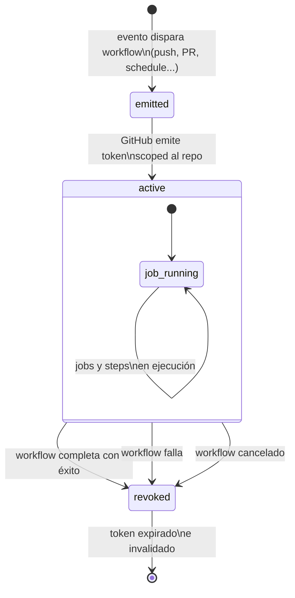
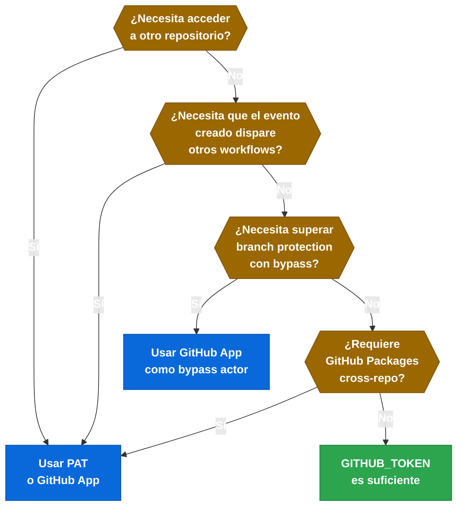

# 5.3.1 GITHUB_TOKEN — Naturaleza, Lifecycle y Scope

[← 5.2.2 Script Injection — Mitigación](gha-script-injection-mitigacion.md) | [Índice](README.md) | [5.3.2 GITHUB_TOKEN — Permisos Granulares](gha-github-token-permisos.md) →

---

## Qué es el GITHUB_TOKEN

Cada vez que GitHub ejecuta un workflow, crea automáticamente un token de acceso temporal llamado `GITHUB_TOKEN`. Este token no lo genera el usuario ni el administrador del repositorio: es el propio servicio de GitHub Actions quien lo emite al inicio de cada run y lo revoca cuando el run finaliza. Su propósito es permitir que los steps del workflow interactúen con la API de GitHub sin necesidad de almacenar credenciales de larga duración en los secrets del repositorio.

El token se expone de dos formas equivalentes dentro de los workflows:

- `${{ secrets.GITHUB_TOKEN }}` — disponible como cualquier otro secret
- `${{ github.token }}` — accesible directamente desde el contexto `github`

Ambas referencias apuntan al mismo token. La primera forma es más explícita y facilita la búsqueda en código; la segunda es más concisa. En la práctica se usan indistintamente.

---

## Ciclo de vida del token

El ciclo de vida del `GITHUB_TOKEN` sigue este flujo:



*El token se emite una vez por run completo y se revoca al terminar el run, independientemente de cuántos jobs tenga.*

El token se crea una vez por run, no una vez por job. Todos los jobs de un mismo run comparten el mismo token, aunque cada job también puede recibir un token con permisos reducidos si se declara `permissions:` a nivel de job. La revocación ocurre al finalizar el run completo, no al finalizar cada job individual.

---

## Scope: siempre limitado al repositorio del workflow

El `GITHUB_TOKEN` tiene un scope fijo e irreducible: solo puede actuar sobre el repositorio donde se define el workflow. No puede leer ni escribir en otros repositorios de la organización, ni en repositorios personales del propietario. Esta limitación es estructural y no puede cambiarse mediante configuración.

Acciones que el token puede realizar (según los permisos concedidos):

- Leer y escribir código en el mismo repositorio
- Crear, comentar y cerrar issues y pull requests del mismo repositorio
- Publicar packages en GitHub Packages del mismo repositorio
- Gestionar releases, deployments y GitHub Pages del mismo repositorio
- Obtener el token OIDC del job (con permiso `id-token: write`)

Acciones que el token **nunca** puede realizar, independientemente de los permisos:

- Acceder a repositorios distintos al del workflow
- Actuar en nombre de un usuario concreto fuera del repo
- Modificar configuraciones de organización

---

## Modo permissive vs. restricted

GitHub permite configurar el comportamiento por defecto del token a nivel de organización y de repositorio en **Settings → Actions → Workflow permissions**.

| Modo | Comportamiento | Cuándo usarlo |
|---|---|---|
| **Read and write** (permissive) | El token tiene `write` en `contents`, `pull-requests`, etc. por defecto | Repos internos de confianza donde la comodidad prima |
| **Read repository contents** (restricted) | El token solo tiene `read` en todos los scopes por defecto | Repos públicos, repos que reciben PRs de forks, entornos regulados |

En modo restricted, cualquier workflow que necesite escribir debe declarar explícitamente los permisos necesarios. Esta es la configuración recomendada para organizaciones que siguen el principio de mínimo privilegio.

---

## PRs de forks: el token es read-only

Cuando un pull request proviene de un fork externo, GitHub Actions limita automáticamente el `GITHUB_TOKEN` a permisos de solo lectura, sin importar la configuración del repositorio. Esta restricción protege los secrets del repositorio base: un actor malicioso no puede exfiltrar secrets inyectando código en un PR porque el token del fork no puede escribir en el repo ni acceder a secrets protegidos.

Consecuencias prácticas para workflows con PRs de forks:

- Los steps que intentan hacer `git push`, crear comentarios o publicar resultados de checks fallarán si dependen del `GITHUB_TOKEN`
- El evento `pull_request_target` sí ejecuta el workflow con acceso al repositorio base y token con permisos completos, pero con el código del fork — esto requiere cuidado extremo para evitar script injection
- Para comentar en PRs de forks de forma segura se usa el patrón de dos workflows: uno con `pull_request` que guarda artefactos, y otro con `workflow_run` que los consume con permisos de escritura

---

## GITHUB_TOKEN vs. Personal Access Token (PAT)

| Característica | GITHUB_TOKEN | PAT |
|---|---|---|
| **Duración** | Temporal (duración del run) | Larga duración (configurable, hasta ilimitada) |
| **Scope** | Solo el repositorio del workflow | Cualquier repo al que tenga acceso el propietario |
| **Emisor** | GitHub Actions automáticamente | El usuario manualmente (o mediante OAuth app) |
| **Almacenamiento** | No requiere secret manual | Debe guardarse como secret |
| **Rotación** | Automática en cada run | Manual o mediante scripts de rotación |
| **Auditoría** | Atribuida al actor `github-actions[bot]` | Atribuida al usuario propietario del PAT |
| **Branch protection** | No puede superar reglas que requieran review | Puede configurarse como bypass si el repo lo permite |

---

## Cuándo se necesita un PAT en lugar de GITHUB_TOKEN

Existen escenarios donde el `GITHUB_TOKEN` es insuficiente por diseño y se debe usar un PAT (o una GitHub App):



*Árbol de decisión: usa GITHUB_TOKEN siempre que sea posible; recurre a PAT o GitHub App solo cuando el scope o las restricciones lo exigen.*

**Crear PRs que disparen otros workflows.** Los eventos generados por el `GITHUB_TOKEN` no disparan nuevos workflow runs para evitar bucles infinitos. Si un workflow crea un PR y se necesita que ese PR dispare el workflow de CI, el `git push` o la creación del PR debe realizarse con un PAT.

**Acceder a otros repositorios.** Clonar dependencias privadas, publicar en registros de otro repo, o leer configuración de un repositorio central requiere un PAT o una GitHub App con acceso multi-repo.

**GitHub Packages cross-repo.** Publicar o consumir packages de un repositorio distinto al del workflow requiere autenticación con un PAT que tenga el scope `read:packages` o `write:packages`.

**Superar branch protection rules.** El `GITHUB_TOKEN` no puede hacer push a ramas protegidas que requieran pull request reviews, incluso con `contents: write`. Un PAT tampoco puede saltarse esta regla a menos que el usuario sea designado como bypass actor en la configuración de la regla.

> **[EXAMEN]** El `GITHUB_TOKEN` con `contents: write` puede hacer `git push` a ramas sin protección, pero **no puede** hacer push a ramas que tengan activado "Require a pull request before merging" o cualquier otra regla de branch protection que requiera revisión. Para automatizar merges en ramas protegidas se necesita una GitHub App configurada como bypass actor, no un PAT ordinario.

---

## Referencia rápida de acceso

```yaml
jobs:
  ejemplo:
    runs-on: ubuntu-latest
    steps:
      # Forma 1: como secret (más explícita)
      - name: Usar token como secret
        run: gh issue list --repo ${{ github.repository }}
        env:
          GH_TOKEN: ${{ secrets.GITHUB_TOKEN }}

      # Forma 2: desde el contexto github (más concisa)
      - name: Usar token desde contexto
        run: gh pr comment ${{ github.event.pull_request.number }} --body "CI pasó"
        env:
          GH_TOKEN: ${{ github.token }}

      # Forma 3: pasado directamente a una action
      - name: Checkout con token explícito
        uses: actions/checkout@v4
        with:
          token: ${{ secrets.GITHUB_TOKEN }}
```
