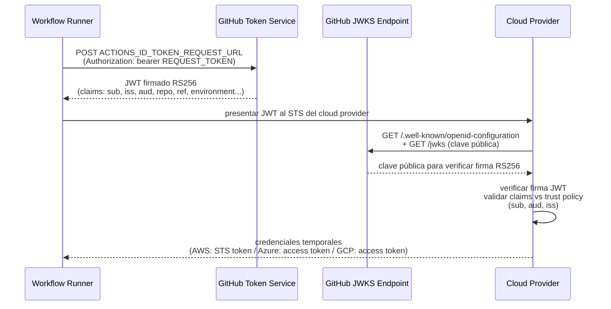
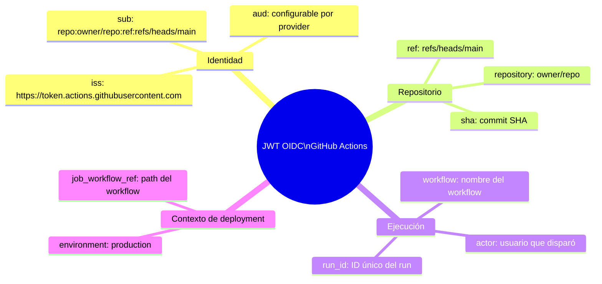

# 5.4.1 OIDC — Fundamentos, Claims y Flujo

← [5.3.2 GITHUB_TOKEN — Permisos Granulares](gha-github-token-permisos.md) | [Índice](README.md) | [5.4.2 OIDC — Cloud Providers](gha-oidc-cloud-providers.md) →

---

**OpenID Connect (OIDC)** es el mecanismo que permite a un workflow de GitHub Actions obtener credenciales cloud de corta duración sin almacenar ninguna clave estática en secrets. El workflow solicita un token JWT firmado por GitHub; el cloud provider verifica la firma y, si la trust policy coincide, emite credenciales temporales. Las claves long-lived (AWS access keys, Azure client secrets, GCP service account keys) desaparecen del ciclo de vida por completo.

> [CONCEPTO] OIDC no elimina la necesidad de configurar una trust policy en el cloud provider. Hay que decirle explícitamente al cloud en qué claims confiar (qué repositorios, ramas o environments pueden asumir qué rol). Sin esa configuración, el flujo OIDC falla aunque el token sea válido.

## Por qué OIDC es superior a los secrets estáticos

Con secrets estáticos, el ciclo de vida de una credencial cloud tiene dos problemas estructurales: la rotación manual (olvidarla equivale a un período de exposición ilimitado) y la amplitud del scope (las claves de larga duración suelen crearse con permisos amplios "por si acaso"). OIDC resuelve ambos:

- Las credenciales emitidas tienen una validez de minutos, no meses.
- No hay nada que rotar porque no hay nada que almacenar.
- Los logs de auditoría del cloud provider registran el `sub` claim exacto (repo, rama, environment) que asumió el rol, lo que hace la trazabilidad mucho más precisa que con un access key compartido.

> [EXAMEN] El permiso `id-token: write` permite al workflow solicitar el JWT OIDC al servicio de tokens de GitHub. Sin ese permiso, la action de autenticación del cloud provider falla con error 403 al intentar obtener el token. La ausencia de este permiso es la causa más frecuente de fallo al implementar OIDC por primera vez.

## Flujo completo OIDC

El proceso tiene cuatro participantes: el workflow, el servicio de tokens de GitHub Actions, el endpoint JWKS de GitHub y el cloud provider.



*Flujo OIDC completo: el workflow obtiene un JWT de GitHub y lo intercambia por credenciales temporales del cloud; las claves privadas long-lived desaparecen del ciclo.*

El endpoint JWKS de GitHub es `https://token.actions.githubusercontent.com/.well-known/jwks`. El cloud provider lo consulta para obtener la clave pública y verificar la firma del JWT. GitHub rota estas claves periódicamente; el cloud provider debe consultarlas en tiempo real (no cachearlas de forma permanente).

## El permiso id-token: write

El permiso se declara en el nivel `permissions` del workflow completo o del job específico:

```yaml
permissions:
  id-token: write   # requerido para solicitar el token OIDC
  contents: read    # habitual para hacer checkout
```

Si el workflow tiene `permissions: {}` o no declara `id-token` explícitamente, el token no puede solicitarse. Si se declara solo a nivel de job, solo ese job puede obtener tokens OIDC.

## Claims del token OIDC

Cada JWT contiene un conjunto de claims que describen el contexto de ejecución. El cloud provider evalúa estos claims contra su trust policy para decidir si concede acceso y bajo qué rol.

| Claim | Descripción | Ejemplo |
|---|---|---|
| `iss` | Issuer. Siempre el mismo para todos los workflows de GitHub. | `https://token.actions.githubusercontent.com` |
| `sub` | Subject. Identifica repo + contexto de forma única. | `repo:acme/api:ref:refs/heads/main` |
| `aud` | Audience. Configurable; por defecto la URL del API del workflow. | `https://github.com/acme/api` |
| `repository` | Nombre completo del repositorio. | `acme/api` |
| `ref` | Ref de Git que disparó el workflow. | `refs/heads/main` |
| `sha` | SHA del commit. | `a1b2c3d4...` |
| `environment` | Environment de GitHub Actions (si se declaró en el job). | `production` |
| `job_workflow_ref` | Ref del workflow que contiene el job. | `acme/api/.github/workflows/deploy.yml@refs/heads/main` |
| `workflow` | Nombre del workflow (campo `name:` del YAML). | `Deploy to AWS` |
| `actor` | Usuario que disparó el workflow. | `jdoe` |
| `run_id` | ID único de la ejecución. | `9876543210` |

El claim `sub` es el más importante para la trust policy. Su formato varía según el contexto del job:



*Anatomía del JWT OIDC: los claims de identidad y contexto son los que la trust policy del cloud evalúa para decidir si concede acceso.*

- Sin environment: `repo:owner/repo:ref:refs/heads/main`
- Con environment: `repo:owner/repo:environment:production`
- En pull_request: `repo:owner/repo:pull_request`
- Con reusable workflow: `repo:owner/repo:ref:refs/heads/main:job_workflow_ref:owner/repo/.github/workflows/called.yml@refs/heads/main`

> [EXAMEN] El `iss` claim es siempre `https://token.actions.githubusercontent.com` para cualquier workflow de GitHub.com. El `aud` es configurable: las actions oficiales de AWS, Azure y GCP lo fijan a valores específicos del provider. Si configuras un audience personalizado en la trust policy del cloud, debes pasar ese mismo valor al solicitar el token.

## YAML completo con autenticación OIDC genérica

```yaml
name: Deploy con OIDC

on:
  push:
    branches: [main]

permissions:
  id-token: write   # REQUERIDO: permite solicitar el token OIDC
  contents: read

jobs:
  deploy:
    runs-on: ubuntu-latest
    environment: production   # el claim 'environment' tomará este valor

    steps:
      - name: Checkout
        uses: actions/checkout@v4

      # Paso genérico: obtener el token OIDC manualmente
      # En la práctica se usa la action oficial del provider (aws-actions, azure/login, google-auth)
      - name: Obtener token OIDC de GitHub
        id: oidc
        run: |
          TOKEN=$(curl -sSf -H "Authorization: bearer $ACTIONS_ID_TOKEN_REQUEST_TOKEN" \
            "$ACTIONS_ID_TOKEN_REQUEST_URL&audience=api://AzureADTokenExchange")
          echo "token=$(echo $TOKEN | jq -r '.value')" >> $GITHUB_OUTPUT

      - name: Verificar claims del token (debug)
        run: |
          # Decodificar el payload del JWT (solo para depuración, nunca en producción)
          echo "${{ steps.oidc.outputs.token }}" \
            | cut -d'.' -f2 \
            | base64 -d 2>/dev/null \
            | jq .

      # Ejemplo: intercambiar el token OIDC por credenciales del cloud
      - name: Autenticar con el cloud provider
        run: |
          # Aquí iría la llamada al endpoint STS/Token del cloud
          # AWS: aws sts assume-role-with-web-identity
          # Azure: az login --federated-token
          # GCP: gcloud auth login --cred-file
          echo "Token OIDC obtenido; intercambiar con ${{ vars.CLOUD_TOKEN_ENDPOINT }}"

      - name: Ejecutar despliegue
        run: ./scripts/deploy.sh
```

## Ventajas vs. secrets estáticos: resumen

**Hacer:**
- Declarar `id-token: write` solo en el job que necesita autenticación OIDC, no a nivel de workflow entero — razón: el principio de mínimo privilegio se aplica también a los permisos de tokens.
- Configurar el claim `sub` en la trust policy del cloud para incluir el environment — razón: evita que una rama de desarrollo asuma el rol de producción.
- Usar el claim `job_workflow_ref` en trust policies para reusable workflows — razón: garantiza que solo el workflow caller autorizado puede asumir el rol.

**Evitar:**
- Configurar la trust policy con `subject: repo:owner/*` (wildcard demasiado amplio) — razón: cualquier rama o environment del repo podría asumir el rol de producción.
- Omitir el campo `environment` en el job cuando la trust policy filtra por environment — razón: el claim `sub` no incluirá `environment:production` y la autenticación fallará.

## Verificación y práctica

**Pregunta 1.** ¿Qué ocurre si un workflow no declara `permissions: id-token: write` e intenta usar `aws-actions/configure-aws-credentials` con OIDC?

**Respuesta:** La action falla con un error 403 al intentar obtener el token OIDC de GitHub. El token no se genera porque el job no tiene el permiso necesario. El mensaje de error suele indicar que `ACTIONS_ID_TOKEN_REQUEST_TOKEN` no está disponible o que la solicitud fue denegada.

**Pregunta 2.** ¿Cuál es el valor del claim `iss` en un token OIDC de GitHub Actions y por qué es relevante para el cloud provider?

**Respuesta:** El `iss` es siempre `https://token.actions.githubusercontent.com`. El cloud provider usa este valor para localizar el JWKS endpoint (`https://token.actions.githubusercontent.com/.well-known/jwks`) y verificar la firma del JWT. Sin el issuer correcto configurado en la trust policy, el cloud rechaza el token aunque su firma sea válida.

**Pregunta 3.** Un job tiene `environment: staging` y la trust policy del cloud filtra por `sub` con valor `repo:acme/api:environment:production`. ¿Qué ocurre?

**Respuesta:** La autenticación falla. El `sub` del token será `repo:acme/api:environment:staging`, que no coincide con `repo:acme/api:environment:production`. El cloud provider rechaza el intercambio de credenciales porque la trust policy no cubre ese subject.

---
← [5.3.2 GITHUB_TOKEN — Permisos Granulares](gha-github-token-permisos.md) | [Índice](README.md) | [5.4.2 OIDC — Cloud Providers](gha-oidc-cloud-providers.md) →
