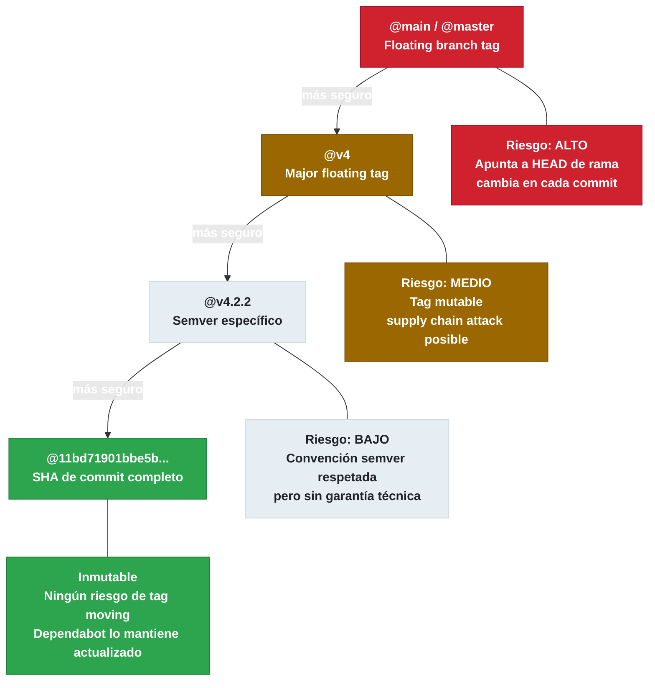

# 5.5.1 Pin de Actions a SHA — Conceptos y Riesgos

← [5.4.2 OIDC — Cloud Providers](gha-oidc-cloud-providers.md) | [Índice](README.md) | [5.5.2 Pin SHA — Dependabot](gha-pin-actions-sha-dependabot.md) →

---

Cuando un workflow referencia una action con un tag como `uses: actions/checkout@v4`, GitHub resuelve ese tag en el momento de la ejecución. Si el propietario del repositorio de la action mueve ese tag a un commit diferente —intencionalmente o por compromiso de su cuenta— el workflow ejecutará código distinto al esperado sin ninguna advertencia. Este tipo de ataque se denomina **supply chain attack via tag moving** y es uno de los vectores de riesgo más relevantes en la certificación GH-200.

> [CONCEPTO] Un **SHA de commit** (40 caracteres hexadecimales) es inmutable: identifica exactamente un árbol de archivos en un momento dado. Un **tag** es una referencia mutable que puede reapuntar a cualquier commit.

## Por qué los Version Tags son un Riesgo de Seguridad

Los tags de Git son punteros nombrados a commits. A diferencia de los commits, los tags pueden moverse: `git tag -f v4 <nuevo-commit>` es un comando válido que desplaza el tag `v4` a otro commit. Si un atacante compromete las credenciales del mantenedor de una action popular, puede mover el tag `v4` a un commit que exfiltra secretos del entorno de ejecución.

Este ataque es especialmente peligroso porque el workflow no cambia visualmente: sigue poniendo `@v4`, pero el código ejecutado es diferente. El log de GitHub Actions tampoco distingue si el tag fue movido.

> [EXAMEN] El examen GH-200 evalúa la comprensión de por qué `@v4` no garantiza inmutabilidad. La respuesta correcta siempre implica que un tag puede reapuntar a un commit diferente.

## SHA de Commit Completo — Inmutabilidad Garantizada

Un SHA de commit completo (40 caracteres) referencia un objeto en el DAG de Git que no puede modificarse sin cambiar el SHA. Usar `uses: actions/checkout@11bd71901bbe5b1630ceea73d27597364c9af683` garantiza que se ejecuta exactamente ese commit, independientemente de lo que ocurra con los tags del repositorio.

La única forma de ejecutar código diferente con un SHA fijo sería modificar el historial de Git (force push), lo cual es observable y auditable en GitHub.

> [ADVERTENCIA] No confundir el SHA de un tag con el SHA de un commit. El comando `git rev-parse v4` puede devolver el SHA del objeto tag, no del commit al que apunta. Usar `git rev-parse v4^{}` para obtener el SHA del commit al que el tag resuelve.

## Diferencia entre SHA de Commit y SHA de Tag

Git tiene dos tipos de tags: **lightweight tags** (puntero directo a un commit) y **annotated tags** (objeto tag separado con su propio SHA que apunta a un commit). Cuando GitHub muestra el SHA de un release, puede mostrar el SHA del objeto tag anotado, no del commit.

Para pinear correctamente se necesita el SHA del **commit**, no del tag anotado. La forma segura de obtenerlo es desde la UI de GitHub navegando a la pestaña Commits del repositorio de la action, o usando `gh api repos/OWNER/REPO/git/ref/tags/TAG` y siguiendo el campo `object.url` si el tipo es `tag`.

## Cómo Obtener el SHA de una Action

Existen tres métodos para obtener el SHA de commit de una versión específica de una action.

El primero es desde la **GitHub UI**: navegar a `github.com/OWNER/REPO`, seleccionar el tag en el desplegable de branches, hacer clic en el enlace del commit más reciente y copiar el SHA de 40 caracteres.

El segundo es usando **gh CLI**: `gh api repos/actions/checkout/git/ref/tags/v4` devuelve el SHA del tag; si el tipo es `tag` (anotado), hay que seguir con `gh api repos/actions/checkout/git/tags/SHA_DEL_TAG` para obtener el SHA del commit en el campo `object.sha`.

El tercero es con **git**: `git ls-remote https://github.com/actions/checkout refs/tags/v4` muestra el SHA del tag; añadir `^{}` resuelve al commit.

## Sintaxis Correcta y Comentario de Documentación

El formato recomendado combina el SHA inmutable con un comentario que indica la versión legible por humanos. Esto soluciona el principal argumento contra el SHA pinning: la ilegibilidad.

```yaml
- uses: actions/checkout@11bd71901bbe5b1630ceea73d27597364c9af683 # v4.2.2
```

El comentario no tiene efecto en la ejecución pero permite a los revisores entender qué versión se está usando y a Dependabot actualizar el SHA automáticamente manteniendo el comentario.

## Niveles de Confianza para Referenciar Actions

Los niveles de confianza de mayor a menor seguridad son los siguientes. Esta jerarquía es material de examen en GH-200.

- **SHA de commit completo** (40 caracteres): máxima seguridad, inmutable.
- **Tag semver específico** (`@v4.2.2`): mejor que major tag, pero sigue siendo mutable.
- **Major tag flotante** (`@v4`): conveniente pero mutable, riesgo de supply chain attack.
- **Floating tag** (`@main`, `@master`): el más peligroso, apunta siempre al último commit de la rama.



*Jerarquía de seguridad: solo el SHA de commit completo garantiza que el código ejecutado no cambia entre ejecuciones.*

> [EXAMEN] En el examen, cuando se pregunta qué método de referencia a actions garantiza que el código ejecutado no cambia entre ejecuciones, la respuesta es siempre el SHA de commit completo.

## Actions de GitHub vs. Actions de Terceros

Las actions del namespace `actions/` (mantenidas por GitHub) y `github/` tienen un nivel de confianza inherente mayor porque están auditadas por el equipo de GitHub. Sin embargo, en entornos críticos o con políticas de seguridad estrictas, también deben pinearse a SHA.

Las actions de terceros (namespace de usuario u organización) tienen el mayor riesgo y deben pinearse siempre. Como alternativa, en algunos casos es preferible ejecutar comandos shell directamente en lugar de usar una action de terceros poco conocida, siempre que el comando equivalente sea simple y auditable.

## Ejemplo central

El siguiente workflow muestra el contraste entre prácticas inseguras y seguras, usando SHA pins con comentarios de documentación para todas las actions referenciadas.

```yaml
name: Secure Workflow with SHA Pins

on:
  push:
    branches: [main]
  pull_request:

permissions:
  contents: read

jobs:
  build:
    runs-on: ubuntu-latest
    steps:
      # INCORRECTO: tag flotante, mutable
      # - uses: actions/checkout@v4

      # CORRECTO: SHA completo con comentario de versión legible
      - name: Checkout code
        uses: actions/checkout@11bd71901bbe5b1630ceea73d27597364c9af683 # v4.2.2

      - name: Setup Node.js
        uses: actions/setup-node@39370e3970a6d050c480ffad4ff0ed4d3fdee5af # v4.1.0
        with:
          node-version: '20'
          cache: 'npm'

      - name: Install dependencies
        run: npm ci

      - name: Run tests
        run: npm test

      - name: Upload coverage
        uses: actions/upload-artifact@6f51ac03b9356f520e9adb1b1b7802705f340c2b # v4.5.0
        with:
          name: coverage-report
          path: coverage/
          retention-days: 7
```

## Tabla de elementos clave

La siguiente tabla resume los niveles de confianza y las características de cada método de referencia a actions, ordenados de mayor a menor seguridad.

| Método de referencia | Ejemplo | Inmutable | Riesgo supply chain | Recomendado |
|---|---|---|---|---|
| SHA commit completo | `@11bd71901bbe5b1630ceea73d27597364c9af683` | Si | Ninguno | Si, siempre |
| Tag semver específico | `@v4.2.2` | No (mutable) | Bajo | Solo con SHA |
| Major tag flotante | `@v4` | No (mutable) | Medio | No en produccion |
| Floating tag de rama | `@main` | No (mutable) | Alto | Nunca |

| Fuente del SHA | Comando / Método | Nota |
|---|---|---|
| GitHub UI | Commits del repo de la action | SHA de 40 chars en la URL del commit |
| gh CLI | `gh api repos/OWNER/REPO/git/ref/tags/TAG` | Seguir `object.url` si tipo es `tag` |
| git ls-remote | `git ls-remote URL refs/tags/TAG^{}` | `^{}` resuelve tag anotado a commit |
| GitHub release | `gh release view TAG --repo OWNER/REPO --json targetCommitish` | Campo `targetCommitish` |

## Buenas y malas prácticas

**Hacer:** pinear todas las actions de terceros a SHA completo — razón: un tag movido ejecuta código arbitrario en el runner con acceso a todos los secretos del job.

**Hacer:** añadir comentario con el tag legible junto al SHA — razón: mantiene la legibilidad para revisores humanos y permite a Dependabot actualizar el SHA de forma automatizada manteniendo el comentario.

**Hacer:** pinear también las actions de `actions/` en entornos críticos o regulados — razón: aunque tienen mayor confianza, la política de mínimo riesgo aplica uniformemente.

**Evitar:** usar `@main` o `@master` para referenciar actions en producción — razón: apunta al último commit de la rama por defecto, que puede cambiar en cualquier momento sin control.

**Evitar:** asumir que un tag semver como `@v4.2.2` es equivalente a un SHA — razón: sigue siendo una referencia mutable en Git aunque los mantenedores raramente muevan tags semver específicos; la política de seguridad debe basarse en garantías, no en convenciones.

**Evitar:** usar actions de terceros con pocas estrellas o mantenimiento dudoso cuando un comando shell simple haría lo mismo — razón: cada action de terceros es una dependencia de supply chain; si se puede sustituir por `run: curl -o ...` con un hash verificado, es preferible.

## Verificación y práctica

**Pregunta 1:** Un desarrollador referencia una action como `uses: third-party/action@v2`. Un atacante compromete la cuenta del mantenedor y ejecuta `git tag -f v2 <commit-malicioso>`. ¿Qué ocurre en la siguiente ejecución del workflow?

*Respuesta:* El workflow ejecuta el commit malicioso sin ningún cambio visible en el archivo de workflow. GitHub Actions resuelve el tag `v2` en el momento de la ejecución, por lo que el nuevo commit al que apunta el tag se ejecuta con acceso completo a los secretos y permisos del job. La única protección efectiva es usar el SHA del commit original.

**Pregunta 2:** ¿Cuál es la diferencia de seguridad entre `@v4` y `@v4.2.2` al referenciar una action?

*Respuesta:* Ambos son tags mutables y ninguno garantiza inmutabilidad. `@v4.2.2` tiene menor probabilidad de ser movido por convención semver, pero la garantía de seguridad es la misma: ninguna. Solo un SHA de commit completo garantiza que el código ejecutado no cambia entre ejecuciones.

**Pregunta 3:** ¿Qué herramienta de GitHub puede automatizar la actualización de SHA pins en workflows cuando sale una nueva versión de una action?

*Respuesta:* Dependabot, configurado con `package-ecosystem: github-actions` en `.github/dependabot.yml`. Dependabot detecta nuevas versiones de actions usadas en workflows, actualiza el SHA al commit correspondiente a la nueva versión y crea un PR manteniendo el comentario del tag legible.

**Ejercicio:** Convierte el siguiente workflow inseguro a uno con SHA pins. Usa los SHAs del ejemplo central como referencia.

```yaml
# INSEGURO — convertir a SHA pins
name: CI
on: [push]
jobs:
  test:
    runs-on: ubuntu-latest
    steps:
      - uses: actions/checkout@v4
      - uses: actions/setup-node@v4
        with:
          node-version: '20'
      - run: npm ci && npm test
```

*Solución:*

```yaml
name: CI
on: [push]

permissions:
  contents: read

jobs:
  test:
    runs-on: ubuntu-latest
    steps:
      - uses: actions/checkout@11bd71901bbe5b1630ceea73d27597364c9af683 # v4.2.2
      - uses: actions/setup-node@39370e3970a6d050c480ffad4ff0ed4d3fdee5af # v4.1.0
        with:
          node-version: '20'
      - run: npm ci && npm test
```

---

← [5.4.2 OIDC — Cloud Providers](gha-oidc-cloud-providers.md) | [Índice](README.md) | [5.5.2 Pin SHA — Dependabot](gha-pin-actions-sha-dependabot.md) →
