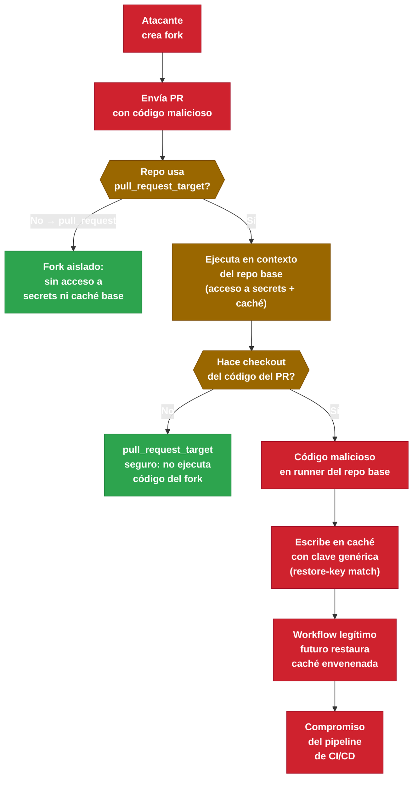

# 5.8.2 Retention Policies, Costes y Seguridad de Caché

← [5.8.1 Cache Strategies](gha-cache-strategies.md) | [Índice](README.md) | [5.9 Testing D5](gha-d5-testing.md) →

---

La gestión de retención y los costes asociados al almacenamiento de artefactos y caché en GitHub Actions son parte del modelo de seguridad y optimización del plan D5. Un equipo que no controla la retención acumula almacenamiento innecesario; uno que no entiende el cache poisoning puede exponer su pipeline a compromisos de integridad.

## Retención de artefactos: configuración y límites

Los artefactos subidos con `actions/upload-artifact` se retienen por defecto **90 días**. Este valor es configurable mediante el parámetro `retention-days` en el step de subida, aceptando valores entre 1 y 400 días. Si se especifica un valor superior al máximo configurado por la organización, el job falla con error.

La política de retención a nivel de organización se configura en Settings > Actions > General y establece el valor máximo que cualquier repositorio de la organización puede usar. Los repositorios individuales no pueden superar ese máximo.

> [CONCEPTO] La retención de artefactos y la retención de logs son independientes. Los logs de workflow también tienen 90 días por defecto, pero se configuran a nivel de organización o repositorio en Settings, no en el YAML del workflow.

Reducir la retención en artefactos temporales (resultados de tests, reportes de cobertura intermedios) libera almacenamiento y reduce costes en planes de pago. Los artefactos de distribución (binarios de release, imágenes firmadas) deben tener retención mayor o gestionarse fuera de GitHub Actions.

```yaml
- name: Subir reporte de cobertura (retención corta)
  uses: actions/upload-artifact@v4
  with:
    name: coverage-report-${{ github.run_id }}
    path: coverage/
    retention-days: 7

- name: Subir binario de release (retención larga)
  uses: actions/upload-artifact@v4
  with:
    name: release-binary
    path: dist/app-linux-amd64
    retention-days: 90
```

## Diferencia entre caché y artefactos

Aunque ambos persisten archivos entre ejecuciones, tienen propósitos distintos y comportamientos de expiración diferentes. Confundirlos lleva a pipelines mal diseñados.

La caché (`actions/cache`) está pensada para acelerar builds almacenando dependencias que cambian poco. Expira automáticamente a los 7 días sin uso y tiene un límite de 10 GB por repositorio. No está pensada para persistir outputs del build.

Los artefactos (`actions/upload-artifact`) están pensados para persistir outputs del build: binarios, reportes, logs. Se pueden descargar manualmente o en jobs posteriores con `actions/download-artifact`. Tienen retención configurable (1-400 días) y cuentan contra el almacenamiento del plan.

> [EXAMEN] Una caché que no se usa en 7 días desaparece automáticamente. Un artefacto con `retention-days: 7` desaparece a los 7 días de haberse creado, independientemente de si se ha descargado o no.

## Compresión de artefactos

`actions/upload-artifact@v4` comprime automáticamente los archivos antes de subirlos (usando zip). Para artefactos muy grandes, comprimir manualmente antes de subir puede mejorar el tiempo de transferencia y reducir el almacenamiento consumido, especialmente si los archivos son comprimibles (logs de texto, JSONs grandes).

## Cache poisoning: el vector de seguridad del scope de caché

El cache poisoning es un ataque en el que un actor malicioso contamina la caché del repositorio con contenido que posteriormente es restaurado por workflows legítimos. Este vector emerge del modelo de seguridad del workflow, no de la configuración individual de la caché.

El escenario típico es el siguiente: un fork del repositorio envía un pull request con un workflow modificado. Si el repositorio permite que los workflows de forks accedan a la caché (lo que ocurre en ciertos contextos con `pull_request_target` mal configurado), el workflow del fork puede ejecutar código arbitrario que escribe en la caché con una clave que posteriormente restaurará el workflow legítimo del repositorio base.



*Cadena de cache poisoning: la combinación `pull_request_target` + checkout del PR + restore-keys genéricos es el vector completo. Cada eslabón es necesario para que el ataque funcione.*

> [ADVERTENCIA] El vector de cache poisoning más peligroso es la combinación de `pull_request_target` con `actions/checkout` del código del PR y `actions/cache` con restore-keys genéricos. Un fork puede enviar un PR que envenene la caché con binarios maliciosos que el workflow de CI del repositorio base restaurará en futuras ejecuciones.

La mitigación principal es el propio scope de la caché: las caché creadas en forks (en el contexto de `pull_request`) son aisladas del repositorio base. Sin embargo, si se usa `pull_request_target` (que ejecuta el workflow del repositorio base con acceso a secrets), el aislamiento se rompe.

## Mitigaciones del cache poisoning

Varias estrategias combinadas reducen el riesgo a un nivel aceptable. No existe una única mitigación suficiente por sí sola.

Incluir `github.ref` o `github.sha` en la clave de caché aísla las entradas por rama o por commit, impidiendo que una rama maliciosa sobreescriba la caché de `main`. Evitar `pull_request_target` con checkout del código del PR es la mitigación más importante. Si se necesita `pull_request_target`, el código del PR nunca debe ejecutarse en el contexto del workflow base.

## Ejemplo central

El siguiente workflow muestra una configuración completa con retención diferenciada de artefactos y claves de caché resistentes a poisoning. El workflow evita `pull_request_target` y usa claves que incluyen el SHA del commit.

```yaml
name: CI seguro con caché y artefactos

on:
  push:
    branches: [main, 'release/**']
  pull_request:
    branches: [main]

jobs:
  build-and-test:
    runs-on: ubuntu-latest
    permissions:
      contents: read

    steps:
      - uses: actions/checkout@v4

      # Clave incluye ref para aislar caché por rama y evitar poisoning cross-branch
      - name: Caché de dependencias npm
        uses: actions/cache@v4
        id: cache-npm
        with:
          path: ~/.npm
          key: npm-${{ runner.os }}-${{ github.ref_name }}-${{ hashFiles('**/package-lock.json') }}
          restore-keys: |
            npm-${{ runner.os }}-${{ github.ref_name }}-
            npm-${{ runner.os }}-

      - uses: actions/setup-node@v4
        with:
          node-version: '20'

      - run: npm ci

      - name: Build
        run: npm run build

      - name: Tests con cobertura
        run: npm test -- --coverage

      # Artefacto temporal: reporte de tests, 7 días
      - name: Subir reporte de tests
        if: always()
        uses: actions/upload-artifact@v4
        with:
          name: test-results-${{ github.run_id }}
          path: |
            test-results/
            coverage/
          retention-days: 7

      # Artefacto de distribución: solo en push a main, 90 días
      - name: Subir binario de distribución
        if: github.ref == 'refs/heads/main' && github.event_name == 'push'
        uses: actions/upload-artifact@v4
        with:
          name: app-dist-${{ github.sha }}
          path: dist/
          retention-days: 90
```

## Tabla de elementos clave

Los parámetros relevantes para retención y las políticas de almacenamiento determinan tanto los costes como la disponibilidad de los datos del pipeline.

| Concepto | Tipo | Valor por defecto | Rango configurable | Descripción |
|---|---|---|---|---|
| `retention-days` (artefacto) | integer | 90 días | 1–400 días | Días de retención del artefacto. No puede superar el máximo de la org. |
| Retención de logs | configuración org/repo | 90 días | 1–400 días | Se configura en Settings, no en el YAML. |
| Límite caché por repo | límite plataforma | 10 GB | No configurable | Entradas más antiguas se eliminan al superar el límite. |
| Expiración de caché sin uso | límite plataforma | 7 días | No configurable | Cualquier entrada sin acceso en 7 días se elimina. |
| GitHub Free: almacenamiento | límite plan | 500 MB caché | Según plan | La caché y los artefactos comparten el límite de almacenamiento del plan. |
| `pull_request_target` + cache | vector de riesgo | — | — | Permite a forks acceder al contexto del repo base, incluyendo caché. |

## Costes de almacenamiento por plan

El almacenamiento de artefactos y caché cuenta contra el límite del plan de GitHub. Los límites son por cuenta (organización o usuario), no por repositorio. Es importante monitorizar el uso para evitar cargos inesperados en planes de pago.

GitHub Free incluye 500 MB de almacenamiento para caché y artefactos combinados. GitHub Team y GitHub Enterprise tienen límites mayores y opciones de almacenamiento adicional de pago. El uso actual es visible en Settings > Billing & Plans > Storage for Actions and Packages.

> [CONCEPTO] La caché y los artefactos comparten el mismo pool de almacenamiento del plan. Una estrategia de caché que genera muchas entradas puede consumir almacenamiento que se necesita para artefactos de distribución.

## Buenas y malas prácticas

**Hacer:**
- Usar `retention-days: 7` para reportes de tests y artefactos temporales — razón: reduce el almacenamiento consumido y evita acumular datos irrelevantes.
- Incluir `github.ref_name` o `github.sha` en las claves de caché — razón: aísla la caché por rama o commit, reduciendo el impacto de cache poisoning.
- Nunca usar `pull_request_target` con checkout del código del PR — razón: combinar acceso al contexto del repo base con código no confiable del PR es el vector de cache poisoning más peligroso.
- Configurar la política de retención máxima a nivel de organización — razón: evita que un repositorio individual acumule 400 días de artefactos sin control.

**Evitar:**
- Usar `retention-days` máximo (400) para todos los artefactos — razón: acumula almacenamiento y costes sin beneficio; solo los artefactos de distribución justifican retenciones largas.
- Ignorar el límite de 10 GB de caché — razón: cuando se alcanza, entradas útiles se eliminan automáticamente, causando cache misses inesperados y builds más lentos.
- Cachear archivos que contienen tokens o secrets — razón: la caché es accesible para cualquier workflow del repositorio que coincida con la clave; los secrets nunca deben estar en archivos cacheados.
- Asumir que el scope de caché aísla automáticamente contra todos los vectores de poisoning — razón: el scope aísla por rama en `pull_request`, pero `pull_request_target` rompe ese aislamiento.

## Verificación y práctica

**P1: Un workflow sube un artefacto con `retention-days: 500`. La política de la organización establece un máximo de 90 días. ¿Qué ocurre?**

a) El artefacto se sube con retención de 500 días, ignorando la política de la organización.
b) El artefacto se sube con retención de 90 días (el máximo de la organización).
c) El job falla con error al intentar subir el artefacto.
d) El artefacto se sube con retención de 90 días y se genera una advertencia en el log.

**Respuesta: c** — Especificar un `retention-days` superior al máximo configurado por la organización causa que el step de `upload-artifact` falle con error. No se trunca silenciosamente al máximo; el job se detiene con error explícito.

---

**P2: ¿Cuál es el principal vector de cache poisoning en GitHub Actions?**

a) Un atacante que obtiene acceso directo al repositorio y modifica la caché desde la UI.
b) Un fork que envía un PR con un workflow que usa `pull_request_target` y ejecuta código del PR con acceso a la caché del repositorio base.
c) Un job de matrix que escribe en la caché de otro job de la misma matrix.
d) Un workflow que usa `restore-keys` con prefijos demasiado genéricos.

**Respuesta: b** — El vector es la combinación de `pull_request_target` (que ejecuta el workflow del repo base con acceso a secrets y caché) con checkout del código del PR (código no confiable). Los restore-keys genéricos (d) aumentan la superficie de restauración pero no son el vector de ataque; son una consideración de diseño.

---

**P3: ¿Cuál es la diferencia clave entre caché y artefactos en GitHub Actions?**

a) La caché se puede usar entre repositorios; los artefactos, no.
b) La caché acelera builds almacenando dependencias reutilizables; los artefactos persisten outputs del build para descarga o uso posterior.
c) Los artefactos expiran en 7 días; la caché se retiene 90 días.
d) La caché solo funciona en runners hosted; los artefactos funcionan en cualquier runner.

**Respuesta: b** — La distinción de propósito es fundamental: caché para acelerar (temporal, automáticamente expirada), artefactos para persistir outputs (configurable, descargable). La opción (c) invierte los tiempos de expiración por defecto: la caché expira en 7 días sin uso, los artefactos se retienen 90 días por defecto.

---

**Ejercicio práctico: Workflow con retención diferenciada y caché resistente a poisoning**

Implementa un workflow para un proyecto Java con Maven que use caché del repositorio local de Maven, suba artefactos de test con retención de 14 días, y suba el JAR de distribución con retención de 60 días solo en push a main.

```yaml
name: Java CI seguro

on:
  push:
    branches: [main]
  pull_request:
    branches: [main]

jobs:
  build:
    runs-on: ubuntu-latest
    permissions:
      contents: read

    steps:
      - uses: actions/checkout@v4

      - name: Configurar Java 21
        uses: actions/setup-java@v4
        with:
          java-version: '21'
          distribution: 'temurin'

      - name: Caché de Maven (aislada por rama)
        uses: actions/cache@v4
        with:
          path: ~/.m2/repository
          key: maven-${{ runner.os }}-${{ github.ref_name }}-${{ hashFiles('**/pom.xml') }}
          restore-keys: |
            maven-${{ runner.os }}-${{ github.ref_name }}-
            maven-${{ runner.os }}-

      - name: Build y tests
        run: mvn -B verify

      - name: Subir resultados de tests
        if: always()
        uses: actions/upload-artifact@v4
        with:
          name: surefire-reports-${{ github.run_id }}
          path: target/surefire-reports/
          retention-days: 14

      - name: Subir JAR de distribución
        if: github.ref == 'refs/heads/main' && github.event_name == 'push'
        uses: actions/upload-artifact@v4
        with:
          name: app-jar-${{ github.sha }}
          path: target/*.jar
          retention-days: 60
```

---

← [5.8.1 Cache Strategies](gha-cache-strategies.md) | [Índice](README.md) | [5.9 Testing D5](gha-d5-testing.md) →

