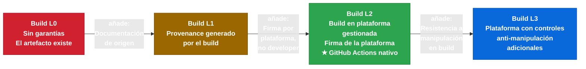
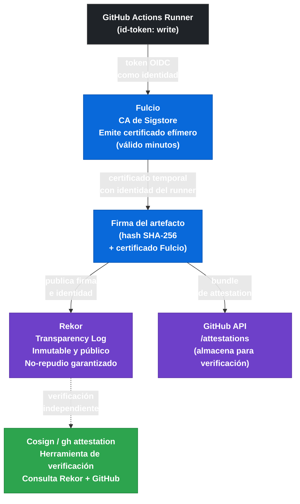

# 5.7.1 SLSA Provenance — Fundamentos y Niveles

← [5.6 Enforcement de Policies](gha-enforcement-policies-seguridad.md) | [Índice](README.md) | [5.7.2 Artifact Attestations — Generación](gha-artifact-attestations-uso.md) →

---

Saber que un artefacto no tiene vulnerabilidades conocidas no es suficiente: también hay que saber **quién lo construyó, dónde, con qué código fuente y en qué entorno**. SLSA (Supply-chain Levels for Software Artifacts) es el framework que formaliza estas garantías. Este documento explica los niveles SLSA, qué captura el provenance y por qué GitHub Actions alcanza Build Level 2 de forma nativa.

> [CONCEPTO] SLSA no es una herramienta ni un servicio: es un **framework de requisitos** que define qué garantías debe ofrecer el proceso de build para que un artefacto sea confiable en la cadena de suministro. Las herramientas como Sigstore, Cosign y las GitHub artifact attestations son implementaciones de esos requisitos.

## Qué es una attestation en software supply chain

Una attestation es un documento firmado criptográficamente que afirma hechos sobre un artefacto: cómo fue construido, por qué proceso, en qué entorno y a partir de qué código fuente. La firma permite a cualquier consumidor del artefacto verificar que la attestation no ha sido modificada y que fue emitida por una entidad de confianza.

En el contexto de GitHub Actions, la attestation de provenance es emitida por el token OIDC del runner — una identidad efímera vinculada al workflow específico — y almacenada en el transparency log de Sigstore (Rekor). Esto significa que la attestation es pública, auditable y no repudiable.

> [CONCEPTO] La diferencia entre **signing** y **provenance** es fundamental: signing verifica que el artefacto no fue modificado tras la firma (integridad); provenance afirma qué proceso generó el artefacto (origen). Un artefacto puede estar firmado por alguien que no lo construyó. El provenance vincula el artefacto al proceso de build específico.

## Framework SLSA: niveles y requisitos

SLSA v1.0 define tres niveles de build (más un nivel 0 implícito para "sin garantías"):

| Nivel | Nombre | Requisito principal | Qué garantiza |
|---|---|---|---|
| Build L0 | No garantías | — | Solo que el artefacto existe |
| Build L1 | Provenance exists | El build genera provenance | El artefacto tiene documentación de origen |
| Build L2 | Hosted build | Build en plataforma gestionada; provenance firmado | El provenance fue generado por la plataforma, no por el desarrollador |
| Build L3 | Hardened build | Plataforma con controles adicionales contra manipulación | El proceso de build es resistente a modificaciones por el desarrollador |

> [EXAMEN] SLSA v1.0 usa los términos **Build L1, L2, L3** (no L0-L3 ni L1-L4 como en versiones anteriores). El examen GH-200 puede referirse a "SLSA Build Level 2" para describir lo que GitHub Actions proporciona con hosted runners. GitHub Actions cumple **Build L2** porque el build ocurre en una plataforma gestionada (GitHub-hosted runners) y el provenance es firmado por la plataforma, no por el workflow del usuario.



*Escalera SLSA: cada nivel añade garantías sobre quién firma el provenance. GitHub Actions con hosted runners cumple L2 de forma nativa.*

La transición de L1 a L2 es la más relevante para seguridad práctica: en L1, el propio developer podría generar un provenance falso porque controla el proceso de firma. En L2, la firma la emite la plataforma de build (GitHub), lo que significa que un atacante necesitaría comprometer la infraestructura de GitHub para falsificar el provenance.

## Información capturada en el provenance SLSA

El provenance captura los metadatos del proceso de build. En el formato SLSA v1.0 (predicate type `https://slsa.dev/provenance/v1`), los campos principales son:

| Campo | Descripción | Ejemplo |
|---|---|---|
| `buildDefinition.buildType` | Tipo de builder utilizado | `https://actions.github.io/buildtypes/workflow/v1` |
| `buildDefinition.externalParameters.workflow.ref` | Ref del workflow ejecutado | `refs/heads/main` |
| `buildDefinition.externalParameters.workflow.repository` | Repositorio donde vive el workflow | `octocat/hello-world` |
| `buildDefinition.externalParameters.workflow.path` | Ruta al fichero de workflow | `.github/workflows/build.yml` |
| `runDetails.builder.id` | Identidad del builder | URL del runner en GitHub |
| `runDetails.metadata.invocationId` | ID único de la ejecución | URL de la GitHub Actions run |

> [ADVERTENCIA] El provenance SLSA **no reemplaza** el vulnerability scanning. El provenance responde a "¿quién construyó esto y cómo?"; el vulnerability scanning responde a "¿contiene esto dependencias con CVEs conocidos?". Son complementarios: un artefacto puede tener provenance SLSA L2 impecable y aun así contener vulnerabilidades críticas.

## Sigstore y el ecosistema de firma transparente

Sigstore es la infraestructura de firma que usa GitHub para las artifact attestations. Sus componentes principales son:

**Fulcio:** Autoridad certificadora (CA) que emite certificados de firma de vida corta (OIDC-based). En lugar de gestionar claves privadas de larga duración, el firmante demuestra su identidad mediante un token OIDC (como el token de GitHub Actions) y recibe un certificado temporal.

**Rekor:** Transparency log inmutable donde se registran todas las firmas. Cualquier firma publicada en Rekor puede ser verificada independientemente y es auditable públicamente. Proporciona no repudio: una vez que una firma está en Rekor, no puede borrarse.

**Cosign:** Herramienta CLI para firmar y verificar imágenes de contenedor y artefactos binarios usando la infraestructura de Sigstore. Es el cliente de referencia del ecosistema.



*Ecosistema Sigstore: el runner usa su token OIDC para obtener un certificado efímero de Fulcio; la firma se publica en Rekor para auditoría permanente.*

> [CONCEPTO] La diferencia entre Sigstore/Cosign y firma GPG tradicional es el modelo de confianza: GPG requiere gestionar y distribuir claves públicas (PKI manual); Sigstore usa identidades OIDC efímeras y un transparency log público, lo que elimina la gestión de claves y proporciona auditoría automática.

## GitHub Actions y SLSA Build Level 2

Los GitHub-hosted runners cumplen SLSA Build Level 2 porque:

1. El build ocurre en una plataforma gestionada por GitHub (no en infraestructura del developer).
2. El provenance es firmado por el token OIDC del runner, emitido por GitHub, no por una clave controlada por el usuario.
3. La firma se publica en Rekor, haciendo el provenance auditable públicamente.

Lo que L2 garantiza al consumidor del artefacto: si la attestation verifica correctamente, el artefacto fue construido por el workflow indicado en el repositorio indicado, ejecutado en un runner de GitHub. Un atacante que comprometiera solo el repositorio del desarrollador (sin comprometer la infraestructura de GitHub) no podría generar una attestation válida para un artefacto diferente.

Lo que L2 **no garantiza**: que el código fuente sea seguro, que las dependencias no tengan vulnerabilidades, ni que el workflow no haya sido manipulado antes de la ejecución (eso requiere L3).

## Ejemplo central

El siguiente workflow genera una attestation de provenance SLSA para un binario compilado. Aunque la generación real usa `actions/attest-build-provenance` (detallada en el siguiente documento), este ejemplo muestra el contexto conceptual: el runner emite su identidad OIDC, la action la usa para obtener un certificado Fulcio, firma el hash del artefacto y publica la firma en Rekor.

```yaml
# .github/workflows/build-with-provenance.yml
name: Build with SLSA Provenance

on:
  push:
    branches: [main]
  workflow_dispatch:

permissions:
  contents: read
  id-token: write      # Necesario para obtener el token OIDC del runner
  attestations: write  # Necesario para publicar la attestation en el repositorio

jobs:
  build:
    name: Build and Attest
    runs-on: ubuntu-latest
    outputs:
      artifact-digest: ${{ steps.hash.outputs.digest }}

    steps:
      - name: Checkout source
        uses: actions/checkout@v4

      - name: Build binary
        run: |
          go build -o dist/myapp ./cmd/myapp
          echo "Build completed for commit $GITHUB_SHA"

      - name: Compute SHA-256 digest
        id: hash
        run: |
          DIGEST=$(sha256sum dist/myapp | awk '{print $1}')
          echo "digest=sha256:${DIGEST}" >> "$GITHUB_OUTPUT"
          echo "Artifact digest: sha256:${DIGEST}"

      - name: Generate SLSA provenance attestation
        uses: actions/attest-build-provenance@v1
        with:
          subject-path: dist/myapp
          # La action usa el token OIDC del runner (id-token: write)
          # para obtener un certificado Fulcio y firmar el hash del artefacto.
          # La firma se publica en Rekor y se almacena en el repositorio.

      - name: Upload artifact
        uses: actions/upload-artifact@v4
        with:
          name: myapp
          path: dist/myapp
```

El output `artifact-digest` puede usarse en jobs posteriores (por ejemplo, un job de deployment) para verificar la attestation con `gh attestation verify` antes de desplegar.

## Tabla de elementos clave

Los conceptos siguientes son los que el examen GH-200 evalúa con mayor frecuencia en el dominio de supply chain security.

| Concepto | Definición | Relevancia SLSA |
|---|---|---|
| Attestation | Documento firmado sobre hechos de un artefacto | Base de SLSA provenance |
| Provenance | Attestation específica sobre el proceso de build | Implementa SLSA |
| SLSA Build L1 | El build genera provenance | Mínimo; no protege contra falsificación |
| SLSA Build L2 | Build en plataforma gestionada; firma de la plataforma | GitHub Actions nativo |
| SLSA Build L3 | Plataforma con controles anti-manipulación adicionales | Requiere configuración extra |
| Fulcio | CA de Sigstore para certificados OIDC efímeros | Emite el certificado de firma |
| Rekor | Transparency log inmutable de Sigstore | Almacena y audita firmas |
| Cosign | CLI de Sigstore para firmar/verificar | Herramienta de verificación |
| id-token: write | Permiso OIDC del job | Necesario para firmar |
| attestations: write | Permiso de GitHub | Necesario para publicar |

## Buenas y malas prácticas

**Hacer:**
- Entender que SLSA L2 garantiza origen del build, no seguridad del código — razón: mezclar los dos conceptos lleva a falsa sensación de seguridad; SLSA y vulnerability scanning son complementarios.
- Verificar la attestation en el paso de deployment, no solo en el de build — razón: el valor de la attestation está en la verificación en el momento de consumo del artefacto.
- Usar GitHub-hosted runners para builds que requieren SLSA L2 — razón: los self-hosted runners no cumplen L2 automáticamente porque no están bajo el control exclusivo de GitHub.
- Incluir el digest del artefacto en los outputs del job de build — razón: permite que jobs posteriores verifiquen la attestation por digest sin necesidad de re-descargar el artefacto.

**Evitar:**
- Asumir que SLSA L2 protege contra código malicioso en el repositorio — razón: SLSA certifica el proceso de build, no el contenido del código; un repositorio comprometido puede producir artefactos con SLSA L2 válido y aun así maliciosos.
- Confundir SLSA con firma GPG del artefacto — razón: GPG firma el artefacto pero no documenta el proceso de build; SLSA provenance vincula el artefacto al workflow y entorno específico.
- Usar self-hosted runners sin configuración adicional esperando SLSA L2 — razón: los self-hosted runners no están bajo el control de la plataforma gestionada, lo que es un requisito de L2.
- Ignorar el transparency log de Rekor — razón: Rekor proporciona auditoría independiente; si no se usa, se pierde la ventaja de no-repudio de Sigstore frente a PKI tradicional.

## Verificación y práctica

**Pregunta 1:** ¿Cuál es la diferencia entre SLSA Build L1 y Build L2?

Respuesta: En L1, el build genera provenance pero la firma puede ser emitida por el propio desarrollador (o cualquier proceso que controle), lo que significa que podría falsificarse. En L2, el provenance es firmado por la plataforma de build gestionada (como GitHub), por lo que un atacante necesitaría comprometer la infraestructura de la plataforma para falsificar el provenance, no solo el repositorio del desarrollador.

**Pregunta 2:** ¿Por qué GitHub Actions con GitHub-hosted runners cumple SLSA Build Level 2 de forma nativa?

Respuesta: Porque el build ocurre en infraestructura gestionada por GitHub (GitHub-hosted runners), el token OIDC es emitido por GitHub (no por el usuario), la firma del provenance usa ese token para obtener un certificado de Fulcio, y la firma se publica en el transparency log público de Rekor (Sigstore). Estos tres elementos satisfacen los requisitos de L2: hosted platform + signed provenance emitido por la plataforma.

**Pregunta 3:** ¿Qué componente de Sigstore garantiza que una firma no puede ser eliminada retroactivamente?

Respuesta: Rekor, el transparency log inmutable. Una vez que una firma se publica en Rekor, no puede borrarse. Esto proporciona no-repudio: el firmante no puede negar haber emitido la firma, y cualquier observador puede auditar el log independientemente.

**Ejercicio:** Diseña un workflow que construya una imagen Docker y genere una attestation de provenance. El workflow debe fallar si no tiene los permisos necesarios. Identifica los dos permisos requeridos y en qué sección del YAML deben declararse.

```yaml
# .github/workflows/docker-provenance.yml
name: Docker Build with Provenance

on:
  push:
    tags: ["v*"]

permissions:
  contents: read
  packages: write    # Para hacer push a GHCR
  id-token: write    # Para el token OIDC (firma del provenance)
  attestations: write # Para publicar la attestation

jobs:
  build-and-attest:
    name: Build Docker Image with SLSA Provenance
    runs-on: ubuntu-latest

    steps:
      - name: Checkout
        uses: actions/checkout@v4

      - name: Log in to GHCR
        uses: docker/login-action@v3
        with:
          registry: ghcr.io
          username: ${{ github.actor }}
          password: ${{ secrets.GITHUB_TOKEN }}

      - name: Build and push Docker image
        id: push
        uses: docker/build-push-action@v5
        with:
          context: .
          push: true
          tags: ghcr.io/${{ github.repository }}:${{ github.ref_name }}

      - name: Generate provenance attestation
        uses: actions/attest-build-provenance@v1
        with:
          subject-name: ghcr.io/${{ github.repository }}
          subject-digest: ${{ steps.push.outputs.digest }}
          push-to-registry: true
```

Los dos permisos obligatorios son `id-token: write` (para el token OIDC que autentica el runner ante Fulcio) y `attestations: write` (para que la action pueda publicar la attestation en el repositorio de GitHub).

---

← [5.6 Enforcement de Policies](gha-enforcement-policies-seguridad.md) | [Índice](README.md) | [5.7.2 Artifact Attestations — Generación](gha-artifact-attestations-uso.md) →
